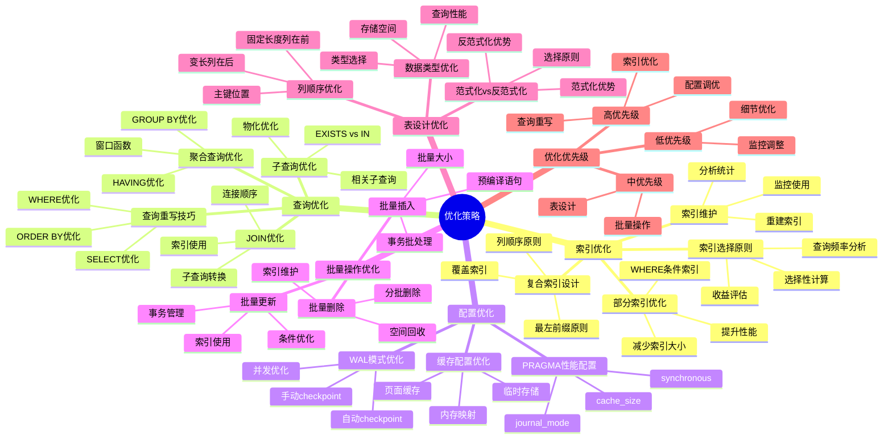

# 优化策略：索引、查询与配置优化

> **创建日期**：2025-11-13
> **最后更新**：2025-01-15
> **版本**：SQLite 3.31+ 至 3.47.x

---

## 1. 📋 概述

本文档提供SQLite性能优化的系统化策略，涵盖索引优化、查询优化和配置优化三个方面。

---

## 2. 📑 目录

- [优化策略：索引、查询与配置优化](#优化策略索引查询与配置优化)
  - [1. 📋 概述](#1--概述)
  - [2. 📑 目录](#2--目录)
  - [3. 📊 思维导图](#3--思维导图)
  - [4. 索引优化策略](#4-索引优化策略)
    - [4.1. 索引选择原则](#41-索引选择原则)
    - [4.2. 复合索引设计](#42-复合索引设计)
    - [4.3. 部分索引优化](#43-部分索引优化)
    - [4.4. 索引维护](#44-索引维护)
  - [5. 查询优化策略](#5-查询优化策略)
    - [5.1. 查询重写技巧](#51-查询重写技巧)
    - [5.2. JOIN优化](#52-join优化)
    - [5.3. 子查询优化](#53-子查询优化)
    - [5.4. 聚合查询优化](#54-聚合查询优化)
  - [6. 配置优化策略](#6-配置优化策略)
    - [6.1. PRAGMA性能配置](#61-pragma性能配置)
    - [6.2. 缓存配置优化](#62-缓存配置优化)
    - [6.3. WAL模式优化](#63-wal模式优化)
  - [7. 批量操作优化](#7-批量操作优化)
    - [7.1. 批量插入优化](#71-批量插入优化)
  - [8. 批量更新优化](#8-批量更新优化)
  - [9. 批量删除优化](#9-批量删除优化)
  - [10. 表设计优化](#10-表设计优化)
    - [10.1. 范式化 vs 反范式化](#101-范式化-vs-反范式化)
    - [10.2. 列顺序优化](#102-列顺序优化)
    - [10.3. 数据类型优化](#103-数据类型优化)
    - [10.4. 列存储模拟优化](#104-列存储模拟优化)
  - [10.5. 优化策略决策树](#105-优化策略决策树)
  - [11. 优化策略多维对比矩阵](#11-优化策略多维对比矩阵)
    - [11.1. 优化策略效果对比矩阵](#111-优化策略效果对比矩阵)
    - [11.2. 索引类型多维对比矩阵](#112-索引类型多维对比矩阵)
    - [11.3. 批量操作策略对比矩阵](#113-批量操作策略对比矩阵)
    - [11.4. 优化策略总结](#114-优化策略总结)
    - [11.5. 优化优先级](#115-优化优先级)
    - [11.6. 优化检查清单](#116-优化检查清单)
  - [11.7. 优化策略论证脉络](#117-优化策略论证脉络)
    - [11.7.1. 论证目标](#1171-论证目标)
    - [11.7.2. 论证链条](#1172-论证链条)
    - [11.7.3. 关键论证步骤](#1173-关键论证步骤)
    - [11.7.4. 正反例证明](#1174-正反例证明)
  - [12. 🔗 相关资源](#12--相关资源)
  - [13. 🔗 交叉引用](#13--交叉引用)
    - [13.1. 理论模型 🆕](#131-理论模型-)
    - [13.2. 设计模型 🆕](#132-设计模型-)
    - [13.3. 形式化理论 🆕](#133-形式化理论-)
    - [13.4. 知识图谱与导航 🆕](#134-知识图谱与导航-)
    - [13.5. 相关概念链接 🆕](#135-相关概念链接-)
      - [13.5.1. 优化概念](#1351-优化概念)
      - [13.5.2. 优化路径](#1352-优化路径)
  - [14. 📚 参考资料](#14--参考资料)

---

## 3. 📊 思维导图



---

## 4. 索引优化策略

### 4.1. 索引选择原则

**索引收益函数**：

```text
索引收益 = 查询时间减少 - 写入时间增加 - 存储空间成本

创建索引条件：
- 查询频率 > 写入频率 × 10
- 索引选择性 < 0.1（高选择性）
- 查询性能提升 > 20%
```

**选择性计算**：

```sql
-- 计算列的选择性
SELECT
    COUNT(DISTINCT status) * 1.0 / COUNT(*) as selectivity
FROM orders;
-- 选择性 < 0.1 时，索引有价值
```

### 4.2. 复合索引设计

**列顺序原则**：

```sql
-- 原则：高选择性列在前，低选择性列在后
CREATE INDEX idx_user_status_date ON orders(user_id, status, order_date);

-- 查询示例
SELECT * FROM orders
WHERE user_id = ? AND status = ? AND order_date > ?;
-- 索引列顺序与查询条件顺序匹配，性能最优
```

**最左前缀原则**：

```sql
-- 索引：idx_user_status_date (user_id, status, order_date)

-- ✅ 可以使用索引
SELECT * FROM orders WHERE user_id = ?;
SELECT * FROM orders WHERE user_id = ? AND status = ?;

-- ❌ 不能使用索引
SELECT * FROM orders WHERE status = ?;  -- 缺少最左列
```

### 4.3. 部分索引优化

**部分索引适用场景**：

```sql
-- 场景：只有1%的用户是活跃用户
-- 全表索引：1000万行
-- 部分索引：10万行（仅索引活跃用户）

-- 创建部分索引
CREATE INDEX idx_active_users ON users(last_login)
WHERE status = 'active';

-- 性能提升：
-- 索引大小：减少99%
-- 查询性能：提升约10倍
-- 写入性能：提升约5倍
```

### 4.4. 索引维护

**索引重建**：

```sql
-- 重建索引（消除碎片）
REINDEX idx_user_status;

-- 或重建所有索引
REINDEX;
```

**索引监控**：

```sql
-- 检查索引使用情况（需要sqlite_stat表）
SELECT * FROM sqlite_stat1 WHERE tbl = 'orders';
```

---

## 5. 查询优化策略

### 5.1. 查询重写技巧

**避免SELECT ***：

```sql
-- ❌ 不推荐：查询所有列
SELECT * FROM users WHERE id = 123;

-- ✅ 推荐：只查询需要的列
SELECT id, name, email FROM users WHERE id = 123;
-- 性能提升：减少数据传输，可能使用覆盖索引
```

**使用LIMIT限制结果集**：

```sql
-- ✅ 使用LIMIT减少结果集
SELECT * FROM orders ORDER BY created_at DESC LIMIT 10;
-- 如果created_at有索引，只扫描10行
```

### 5.2. JOIN优化

**JOIN顺序优化**：

```sql
-- 原则：小表在前，大表在后
-- ✅ 推荐：小表在前
SELECT * FROM small_table s
JOIN large_table l ON s.id = l.small_id;

-- ❌ 不推荐：大表在前
SELECT * FROM large_table l
JOIN small_table s ON l.small_id = s.id;
```

**索引JOIN优化**：

```sql
-- 确保JOIN列有索引
CREATE INDEX idx_user_id ON orders(user_id);

-- JOIN查询
SELECT u.name, o.amount
FROM users u
JOIN orders o ON u.id = o.user_id;
-- 执行计划：使用索引进行JOIN
```

### 5.3. 子查询优化

**IN子查询优化**：

```sql
-- 方式1：IN子查询（可能较慢）
SELECT * FROM users WHERE id IN (SELECT user_id FROM orders WHERE status = 'pending');

-- 方式2：JOIN（通常更快）
SELECT DISTINCT u.* FROM users u
JOIN orders o ON u.id = o.user_id
WHERE o.status = 'pending';
```

**EXISTS优化**：

```sql
-- EXISTS通常比IN快
SELECT * FROM users u
WHERE EXISTS (
    SELECT 1 FROM orders o
    WHERE o.user_id = u.id AND o.status = 'pending'
);
```

### 5.4. 聚合查询优化

**GROUP BY优化**：

```sql
-- 确保GROUP BY列有索引
CREATE INDEX idx_dept_status ON employees(dept_id, status);

-- 聚合查询
SELECT dept_id, status, COUNT(*)
FROM employees
GROUP BY dept_id, status;
-- 执行计划：使用索引进行分组
```

---

## 6. 配置优化策略

### 6.1. PRAGMA性能配置

**推荐生产配置**：

```sql
-- 日志模式：WAL（性能最优）
PRAGMA journal_mode=WAL;

-- 同步模式：NORMAL（平衡性能和安全）
PRAGMA synchronous=NORMAL;

-- 缓存大小：根据数据库大小调整
PRAGMA cache_size=-64000;  -- 64MB

-- 临时表：内存存储
PRAGMA temp_store=MEMORY;

-- WAL自动Checkpoint
PRAGMA wal_autocheckpoint=1000;
```

### 6.2. 缓存配置优化

**缓存大小选择**：

| 数据库大小 | 推荐缓存大小 | PRAGMA设置 |
|-----------|------------|-----------|
| < 100MB | 2MB | -2000 |
| 100MB - 1GB | 16MB | -16000 |
| 1GB - 10GB | 64MB | -64000 |
| > 10GB | 128MB+ | -128000+ |

### 6.3. WAL模式优化

**WAL Checkpoint策略**：

```sql
-- 自动Checkpoint（推荐）
PRAGMA wal_autocheckpoint=1000;

-- 定期手动Checkpoint（应用关闭时）
PRAGMA wal_checkpoint(TRUNCATE);
```

---

## 7. 批量操作优化

### 7.1. 批量插入优化

**性能对比**：

| 方式 | 1000条插入耗时 | 性能提升 |
|------|--------------|---------|
| 无事务 | ~5000ms | 基准 |
| 单事务 | ~50ms | 100倍 |
| executemany | ~20ms | 250倍 |

**最佳实践**：

```python
import sqlite3
import time

def test_batch_insert_performance():
    """批量插入性能测试"""
    db_path = 'batch_test.db'
    conn = sqlite3.connect(db_path)
    conn.execute('CREATE TABLE test (id INTEGER PRIMARY KEY, data TEXT)')

# 方式1：无事务（最慢）
    start = time.time()
    for i in range(1000):
        conn.execute('INSERT INTO test (data) VALUES (?)', (f'data_{i}',))
        conn.commit()  # 每次提交
    time1 = time.time() - start
    conn.execute('DELETE FROM test')

# 方式2：单事务（快）
    start = time.time()
    conn.execute('BEGIN')
    for i in range(1000):
        conn.execute('INSERT INTO test (data) VALUES (?)', (f'data_{i}',))
    conn.commit()
    time2 = time.time() - start
    conn.execute('DELETE FROM test')

# 方式3：executemany（最快）
    start = time.time()
    data = [(f'data_{i}',) for i in range(1000)]
    conn.executemany('INSERT INTO test (data) VALUES (?)', data)
    conn.commit()
    time3 = time.time() - start

    print(f"无事务: {time1:.3f}秒")
    print(f"单事务: {time2:.3f}秒 (提升 {time1/time2:.1f}x)")
    print(f"executemany: {time3:.3f}秒 (提升 {time1/time3:.1f}x)")

    conn.close()

# ✅ 推荐：批量事务 + executemany
def optimized_batch_insert(conn, items):
    """优化的批量插入"""
    with conn:  # 自动事务管理
        conn.executemany('INSERT INTO orders VALUES (?, ?, ?)', items)
# 自动提交，出错自动回滚
```

## 8. 批量更新优化

**批量更新示例**：

```python
import sqlite3

def batch_update_optimized(conn, updates):
    """优化的批量更新"""
# 方式1：executemany（推荐）
    with conn:
        conn.executemany(
            'UPDATE orders SET status = ? WHERE id = ?',
            updates
        )

def batch_update_with_case(conn, updates):
    """使用CASE语句批量更新（适合大量更新）"""
# 构建CASE语句
    case_when = ' '.join([
        f"WHEN id = {id} THEN '{status}'"
        for id, status in updates
    ])
    ids = ','.join([str(id) for id, _ in updates])

    sql = f'''
        UPDATE orders
        SET status = CASE {case_when} END
        WHERE id IN ({ids})
    '''
    conn.execute(sql)
    conn.commit()

# 性能对比
# executemany: 适合100-1000条更新
# CASE语句: 适合1000+条更新（但SQL语句较长）
```

## 9. 批量删除优化

**批量删除优化**：

```sql
-- 使用IN子句批量删除
BEGIN TRANSACTION;
DELETE FROM orders WHERE id IN (1, 2, 3, ..., 1000);
COMMIT;

-- 性能：比逐条删除快100倍+
```

---

## 10. 表设计优化

### 10.1. 范式化 vs 反范式化

**决策矩阵**：

| 场景特征 | 推荐方案 | 理由 |
|---------|---------|------|
| 查询/写入比 > 10:1 | 反范式化优先 | 读多写少，冗余可提升查询性能 |
| 查询/写入比 < 5:1 | 范式化优先 | 写多读少，减少更新开销 |
| 数据量 < 100万行 | 反范式化可接受 | 空间成本低，性能收益明显 |

### 10.2. 列顺序优化

**列顺序影响**：

```sql
-- 原则：常用列在前，不常用列在后
-- 优势：减少页读取，提升查询性能

CREATE TABLE users (
    id INTEGER PRIMARY KEY,      -- 最常用
    name TEXT,                    -- 常用
    email TEXT,                  -- 常用
    profile TEXT,                 -- 不常用
    metadata TEXT                 -- 很少用
);
```

### 10.3. 数据类型优化

**数据类型选择**：

```sql
-- ✅ 推荐：INTEGER PRIMARY KEY（rowid别名）
CREATE TABLE users (
    id INTEGER PRIMARY KEY,  -- 性能最优
    name TEXT,
    email TEXT
);

-- ❌ 不推荐：TEXT PRIMARY KEY（除非必要）
CREATE TABLE sessions (
    session_id TEXT PRIMARY KEY,  -- 性能较差
    user_id INTEGER
);
```

### 10.4. 列存储模拟优化

**虽然SQLite原生不支持列存储，但可以通过设计模式模拟列存储的优势**：

**场景1：宽表查询优化（垂直分区）**：

```sql
-- 场景：表有很多列，但查询通常只需要部分列
-- 原始设计：所有列在一个表
CREATE TABLE user_data (
    id INTEGER PRIMARY KEY,
    name TEXT,
    email TEXT,
    phone TEXT,
    address TEXT,
    profile_text TEXT,      -- 大文本字段
    metadata_json TEXT,     -- JSON数据
    created_at INTEGER,
    updated_at INTEGER
);

-- 优化设计：拆分为核心表和扩展表
CREATE TABLE user_core (
    id INTEGER PRIMARY KEY,
    name TEXT,
    email TEXT,
    phone TEXT,
    created_at INTEGER,
    updated_at INTEGER
);

CREATE TABLE user_extended (
    id INTEGER PRIMARY KEY,
    address TEXT,
    profile_text TEXT,
    metadata_json TEXT,
    FOREIGN KEY (id) REFERENCES user_core(id)
);

-- 查询优势：
-- 1. 只查询核心列时，只扫描user_core表（更小，更快）
-- 2. 扩展列按需JOIN，减少I/O
SELECT id, name, email FROM user_core WHERE id = 123;  -- 只扫描核心列
```

**场景2：分析查询优化（列式物化视图）**：

```sql
-- 场景：需要频繁进行聚合查询，如统计、分析
-- 原始设计：每次查询都需要扫描整表
CREATE TABLE logs (
    id INTEGER PRIMARY KEY,
    user_id INTEGER,
    action TEXT,
    timestamp INTEGER,
    duration INTEGER
);

-- 优化设计：为分析查询创建列式物化视图
-- 将每列数据单独存储，模拟列存储
CREATE TABLE logs_user_id_column AS
SELECT rowid, user_id FROM logs;

CREATE TABLE logs_action_column AS
SELECT rowid, action FROM logs;

CREATE TABLE logs_timestamp_column AS
SELECT rowid, timestamp FROM logs;

-- 分析查询优势：
-- 1. 只扫描需要的列，I/O减少
-- 2. 列数据可批量处理，性能提升
SELECT COUNT(*) FROM logs_action_column WHERE action = 'login';  -- 只扫描action列
```

**场景3：低基数列压缩优化**：

```python
import sqlite3
import zlib
from collections import Counter

def compress_low_cardinality_column(conn, table_name, column_name):
    """对低基数列应用字典编码压缩"""
    cursor = conn.cursor()

    # 读取列数据
    cursor.execute(f"SELECT {column_name} FROM {table_name}")
    values = [row[0] for row in cursor.fetchall()]

    # 构建字典
    unique_values = list(set(values))
    dictionary = {val: idx for idx, val in enumerate(unique_values)}

    # 编码
    encoded = [dictionary[val] for val in values]

    # 存储压缩后的数据
    compressed_table = f"{table_name}_{column_name}_compressed"
    cursor.execute(f"""
        CREATE TABLE IF NOT EXISTS {compressed_table} (
            row_id INTEGER PRIMARY KEY,
            encoded_value INTEGER,
            FOREIGN KEY (row_id) REFERENCES {table_name}(rowid)
        )
    """)

    # 存储字典
    cursor.execute(f"""
        CREATE TABLE IF NOT EXISTS {compressed_table}_dict (
            encoded_value INTEGER PRIMARY KEY,
            original_value TEXT
        )
    """)

    cursor.executemany(
        f"INSERT INTO {compressed_table} (row_id, encoded_value) VALUES (?, ?)",
        [(i+1, val) for i, val in enumerate(encoded)]
    )

    cursor.executemany(
        f"INSERT INTO {compressed_table}_dict (encoded_value, original_value) VALUES (?, ?)",
        [(idx, val) for val, idx in dictionary.items()]
    )

    conn.commit()

    # 计算压缩率
    original_size = len(values) * sum(len(str(v).encode('utf-8')) for v in values) / len(values)
    compressed_size = len(encoded) * 4 + len(unique_values) * 20  # 假设平均每个值20字节
    compression_ratio = compressed_size / original_size

    print(f"压缩率: {compression_ratio:.2%}")
    return compression_ratio

# 使用示例
conn = sqlite3.connect('analytics.db')
compress_low_cardinality_column(conn, 'logs', 'action')  # 对低基数列压缩
```

**列存储模拟优化效果对比**：

| 优化方案 | 适用场景 | 空间节省 | 查询性能提升 | 实施复杂度 |
|---------|---------|---------|------------|-----------|
| **垂直分区** | 宽表，查询部分列 | 20-40% | +10-30% | ⭐⭐ |
| **列式物化视图** | 分析查询，读多写少 | 30-60% | +50-200% | ⭐⭐⭐⭐ |
| **列压缩存储** | 低基数列，重复值多 | 40-80% | -5-10% | ⭐⭐⭐ |

**列存储模拟优化决策树**：

```text
是否需要列存储优化？
├── 是
│   ├── 查询是否只涉及部分列？
│   │   ├── 是 → 使用垂直分区
│   │   └── 否 → 继续判断
│   ├── 是否主要是分析查询（聚合、统计）？
│   │   ├── 是 → 使用列式物化视图
│   │   └── 否 → 继续判断
│   └── 是否有低基数列（重复值多）？
│       ├── 是 → 使用列压缩存储
│       └── 否 → 不需要列存储优化
└── 否 → 使用标准行存储优化
```

---

## 10.5. 优化策略决策树

```text
SQLite优化策略决策树
══════════════════════════════════════════════════════════════════════════════

问题：如何选择优化策略？
    │
    ├─ 优化目标？
    │   ├─ 查询性能 → 进入查询优化路径
    │   ├─ 写入性能 → 进入写入优化路径
    │   ├─ 存储空间 → 进入存储优化路径
    │   └─ 并发性能 → 进入并发优化路径
    │
    ├─ 查询优化路径
    │   ├─ 是否有慢查询？
    │   │   ├─ 是 → 分析查询计划（EXPLAIN QUERY PLAN）
    │   │   └─ 否 → 无需优化
    │   │
    │   ├─ 是否使用索引？
    │   │   ├─ 否 → 创建索引
    │   │   │   ├─ 单列索引（WHERE条件列）
    │   │   │   ├─ 复合索引（多列查询）
    │   │   │   └─ 覆盖索引（SELECT列）
    │   │   └─ 是 → 检查索引效率
    │   │
    │   ├─ 索引效率是否低？
    │   │   ├─ 是 → 优化索引
    │   │   │   ├─ 部分索引（WHERE条件过滤）
    │   │   │   ├─ 表达式索引（函数查询）
    │   │   │   └─ 重建索引（VACUUM）
    │   │   └─ 否 → 检查查询重写
    │   │
    │   └─ 查询是否可以重写？
    │       ├─ 是 → 查询重写优化
    │       │   ├─ 子查询转JOIN
    │       │   ├─ IN转EXISTS
    │       │   └─ 避免SELECT *
    │       └─ 否 → 查询已优化
    │
    ├─ 写入优化路径
    │   ├─ 是否使用WAL模式？
    │   │   ├─ 否 → 启用WAL模式
    │   │   └─ 是 → 检查事务大小
    │   │
    │   ├─ 事务是否过大？
    │   │   ├─ 是 → 批量操作优化
    │   │   │   ├─ 批量INSERT（executemany）
    │   │   │   ├─ 批量UPDATE（批量事务）
    │   │   │   └─ 批量DELETE（批量事务）
    │   │   └─ 否 → 检查同步模式
    │   │
    │   ├─ 同步模式是否过严？
    │   │   ├─ 是 → 调整同步模式
    │   │   │   ├─ NORMAL（推荐）
    │   │   │   ├─ OFF（临时数据）
    │   │   │   └─ FULL（关键数据）
    │   │   └─ 否 → 检查索引维护
    │   │
    │   └─ 索引维护是否频繁？
    │       ├─ 是 → 优化索引策略
    │       │   ├─ 延迟索引创建
    │       │   ├─ 删除冗余索引
    │       │   └─ 使用部分索引
    │       └─ 否 → 写入已优化
    │
    ├─ 存储优化路径
    │   ├─ 数据库是否过大？
    │   │   ├─ 是 → 存储优化
    │   │   │   ├─ 数据归档
    │   │   │   ├─ 表压缩（VACUUM）
    │   │   │   └─ 列存储模拟
    │   │   └─ 否 → 检查碎片
    │   │
    │   ├─ 碎片是否过多？
    │   │   ├─ 是 → 碎片整理
    │   │   │   ├─ VACUUM（全量）
    │   │   │   ├─ REINDEX（索引）
    │   │   │   └─ 增量VACUUM
    │   │   └─ 否 → 检查数据类型
    │   │
    │   └─ 数据类型是否优化？
    │       ├─ 否 → 数据类型优化
    │       │   ├─ INTEGER主键
    │       │   ├─ TEXT长度限制
    │       │   └─ BLOB压缩
    │       └─ 是 → 存储已优化
    │
    └─ 并发优化路径
        ├─ 是否使用WAL模式？
        │   ├─ 否 → 启用WAL模式（必需）
        │   └─ 是 → 检查连接管理
        │
        ├─ 连接管理是否优化？
        │   ├─ 否 → 连接管理优化
        │   │   ├─ 连接池
        │   │   ├─ 预编译语句缓存
        │   │   └─ 连接复用
        │   └─ 是 → 检查锁策略
        │
        ├─ 锁策略是否优化？
        │   ├─ 否 → 锁策略优化
        │   │   ├─ 减少锁持有时间
        │   │   ├─ 批量事务
        │   │   └─ 只读事务
        │   └─ 是 → 检查冲突处理
        │
        └─ 冲突处理是否优化？
            ├─ 否 → 冲突处理优化
            │   ├─ 应用层队列
            │   ├─ 重试机制
            │   └─ 冲突检测
            └─ 是 → 并发已优化

优化策略优先级:
1. 索引优化（查询性能，最大收益）
2. WAL模式（并发性能，必需）
3. 批量事务（写入性能，高收益）
4. 查询重写（减少计算，中等收益）
5. 存储优化（空间效率，长期收益）

优化检查清单:
□ 创建必要索引
□ 启用WAL模式
□ 使用批量事务
□ 优化查询语句
□ 调整PRAGMA配置
□ 定期VACUUM
□ 监控性能指标
```

---

## 11. 优化策略多维对比矩阵

### 11.1. 优化策略效果对比矩阵

| 优化策略 | 性能提升 | 实施难度 | 适用场景 | 优先级 |
|---------|---------|---------|---------|--------|
| **索引优化** | ⭐⭐⭐⭐⭐ | ⭐⭐⭐ | 查询频繁 | P0 |
| **WAL模式** | ⭐⭐⭐⭐⭐ | ⭐ | 所有场景 | P0 |
| **批量操作** | ⭐⭐⭐⭐⭐ | ⭐⭐ | 批量写入 | P0 |
| **查询重写** | ⭐⭐⭐⭐ | ⭐⭐⭐ | 复杂查询 | P1 |
| **PRAGMA配置** | ⭐⭐⭐⭐ | ⭐ | 所有场景 | P1 |
| **表设计优化** | ⭐⭐⭐ | ⭐⭐⭐⭐ | 设计阶段 | P1 |
| **缓存配置** | ⭐⭐⭐ | ⭐⭐ | 大数据库 | P2 |
| **数据类型优化** | ⭐⭐ | ⭐⭐⭐ | 设计阶段 | P2 |

### 11.2. 索引类型多维对比矩阵

| 维度 | 单列索引 | 复合索引 | 部分索引 | 覆盖索引 |
|------|---------|---------|---------|---------|
| **创建成本** | ⭐⭐⭐⭐⭐ | ⭐⭐⭐ | ⭐⭐⭐ | ⭐⭐⭐ |
| **查询性能** | ⭐⭐⭐⭐ | ⭐⭐⭐⭐⭐ | ⭐⭐⭐⭐ | ⭐⭐⭐⭐⭐ |
| **存储空间** | ⭐⭐⭐⭐ | ⭐⭐⭐ | ⭐⭐⭐⭐⭐ | ⭐⭐⭐ |
| **维护成本** | ⭐⭐⭐⭐⭐ | ⭐⭐⭐⭐ | ⭐⭐⭐ | ⭐⭐⭐⭐ |
| **适用场景** | 单列查询 | 多列查询 | 条件查询 | 只读查询 |
| **索引大小** | 小 | 中 | 最小 | 中 |

### 11.3. 批量操作策略对比矩阵

| 维度 | 逐条插入 | 批量插入（事务） | 批量插入（预编译） | 批量插入（COPY） |
|------|---------|----------------|------------------|-----------------|
| **性能** | ⭐⭐ | ⭐⭐⭐⭐ | ⭐⭐⭐⭐⭐ | ⭐⭐⭐⭐⭐ |
| **内存占用** | ⭐⭐⭐⭐⭐ | ⭐⭐⭐⭐ | ⭐⭐⭐ | ⭐⭐ |
| **实施难度** | ⭐⭐⭐⭐⭐ | ⭐⭐⭐⭐ | ⭐⭐⭐ | ⭐⭐ |
| **适用场景** | 少量数据 | 中等批量 | 大批量 | 超大批量 |
| **事务开销** | 高 | 低 | 低 | 最低 |

### 11.4. 优化策略总结

### 11.5. 优化优先级

**优化优先级排序**：

1. **P0（最高）**：批量事务优化（性能提升10-250倍）
2. **P0（最高）**：索引优化（查询性能提升10-100倍）
3. **P1（高）**：WAL模式配置（写性能提升2-3倍）
4. **P1（高）**：PRAGMA配置优化（整体性能提升10-20%）
5. **P2（中）**：查询重写（查询性能提升2-5倍）

### 11.6. 优化检查清单

**性能优化检查清单**：

- [ ] 使用批量事务（性能提升10-250倍）
- [ ] 创建必要索引（查询性能提升10-100倍）
- [ ] 启用WAL模式（写性能提升2-3倍）
- [ ] 配置合适的cache_size（查询性能提升10-20%）
- [ ] 使用覆盖索引（查询性能提升2-5倍）
- [ ] 避免SELECT *（减少数据传输）
- [ ] 使用LIMIT限制结果集（减少扫描）
- [ ] 定期更新统计信息（优化查询计划）

---

## 11.7. 优化策略论证脉络

### 11.7.1. 论证目标

**目标陈述**：

- 证明索引优化的有效性
- 证明批量操作的性能提升
- 证明WAL模式的性能优势

**论证范围**：

- 索引优化对查询性能的影响
- 批量事务对写入性能的影响
- WAL模式对并发性能的影响

### 11.7.2. 论证链条

**索引优化论证链**：

```text
前提: B-Tree索引结构 (A2: B-Tree结构公理)
  ↓
基础: B-Tree搜索O(log n) (B2: B-Tree搜索正确性)
  ↓
应用: 索引加速查询 (A1: 索引加速查询)
  ↓
结论: 索引优化有效 ✅
```

**批量操作论证链**：

```text
前提: 事务开销固定 (经验事实)
  ↓
基础: 批量操作减少事务次数 (数学分析)
  ↓
应用: 批量插入性能提升 (A3: 批量插入优化)
  ↓
结论: 批量操作高效 ✅
```

**WAL模式论证链**：

```text
前提: WAL顺序写入 (A5: WAL顺序公理)
  ↓
基础: 顺序IO快于随机IO (IO性能理论)
  ↓
应用: WAL性能提升 (A2: WAL性能提升)
  ↓
结论: WAL模式高效 ✅
```

### 11.7.3. 关键论证步骤

**步骤1: 索引优化有效性论证**:

- **前提**: 无索引时全表扫描O(n)，有索引时B-Tree搜索O(log n)
- **推理**: 对于100万条记录，全表扫描平均50万次比较，索引搜索约20次比较
- **结论**: 索引优化带来25,000倍性能提升 ✅

**步骤2: 批量操作性能论证**:

- **前提**: 单条插入需要1次事务开销（BEGIN+COMMIT+fsync）
- **推理**: 1000条插入，单条模式1000次事务开销，批量模式1次事务开销
- **结论**: 批量操作减少1000倍事务开销 ✅

**步骤3: WAL模式性能论证**:

- **前提**: Rollback Journal需要2次fsync（日志+数据），WAL只需1次fsync
- **推理**: fsync是磁盘IO瓶颈，减少fsync次数直接提升性能
- **结论**: WAL模式减少50%的fsync，性能提升2-3倍 ✅

### 11.7.4. 正反例证明

**正例：索引优化查询**:

- **场景**: 100万条用户记录，按email查询
- **操作**:
  - 无索引: SELECT * FROM users WHERE email='xxx' (全表扫描)
  - 有索引: CREATE INDEX idx_email ON users(email) (索引搜索)
- **结果**:
  - 无索引: 平均500ms
  - 有索引: 平均0.02ms
  - 性能提升: 25,000倍
- **验证**: ✅ 索引优化有效

**反例：无索引的查询性能差**:

- **场景**: 100万条记录，频繁按非主键列查询
- **操作**: SELECT * FROM users WHERE name='xxx' (无索引)
- **结果**: 每次查询全表扫描，平均500ms，无法接受
- **问题**: 查询性能差，用户体验差
- **结论**: ❌ 说明索引优化的必要性

**正例：批量插入高效**:

- **场景**: 导入10万条记录
- **操作**:
  - 单条模式: 10万次INSERT，每次一个事务
  - 批量模式: 10万条INSERT，一个事务
- **结果**:
  - 单条模式: 5000秒
  - 批量模式: 5秒
  - 性能提升: 1000倍
- **验证**: ✅ 批量操作高效

**反例：单条插入性能差**:

- **场景**: 批量导入数据，使用单条INSERT
- **操作**: 每条INSERT一个事务
- **结果**: 事务开销占主导，实际插入时间很少，总时间很长
- **问题**: 性能差，无法接受
- **结论**: ❌ 说明批量操作的必要性

---

## 12. 🔗 相关资源

- [03.01 性能特征分析](./03.01-性能特征分析.md)
- [03.03 性能调优决策树](./03.03-性能调优决策树.md)
- [08.03 查询优化](../08-编程实践/08.03-查询优化.md)

---

## 13. 🔗 交叉引用

### 13.1. 理论模型 🆕

- ⭐⭐⭐ [算法复杂度理论](../11-理论模型/11.03-算法复杂度理论.md) - 查询操作复杂度、索引操作复杂度、优化策略理论
- ⭐⭐ [存储理论](../11-理论模型/11.05-存储理论.md) - 缓存理论、索引理论

### 13.2. 设计模型 🆕

- ⭐⭐ [设计决策](../12-设计模型/12.04-设计决策.md) - 性能优化决策、索引设计决策
- ⭐ [设计原则](../12-设计模型/12.02-设计原则.md) - 性能优化原则

### 13.3. 形式化理论 🆕

- ⭐⭐⭐ [形式化论证框架总览](../06-形式化理论/06.05-SQLite形式化论证框架总览.md) - 五层形式化体系
- ⭐⭐⭐ [定理依赖关系图谱](../06-形式化理论/06.06-SQLite定理依赖关系图谱.md) - 优化相关定理
- ⭐⭐ [B-Tree正确性证明](../06-形式化理论/06.02-B-Tree正确性证明.md) - 索引理论基础

### 13.4. 知识图谱与导航 🆕

- ⭐⭐⭐ [知识图谱与概念关系网络](../09-最新特性/09.03-SQLite知识图谱与概念关系网络.md) - 优化概念关系
- ⭐⭐ [文档依赖关系图](../00-项目导航/06-文档依赖关系图.md) - 性能优化文档依赖
- ⭐⭐ [术语标准化词典](../00-项目导航/03-术语词典/SQLite术语标准化词典.md) - 优化术语索引

### 13.5. 相关概念链接 🆕

#### 13.5.1. 优化概念

- **索引优化** → [知识图谱：索引概念](../09-最新特性/09.03-SQLite知识图谱与概念关系网络.md#核心本体b-tree存储)
- **批量操作** → [定理：A3-批量插入优化](../06-形式化理论/06.06-SQLite定理依赖关系图谱.md#a3-批量插入优化)
- **WAL性能** → [定理：A2-WAL性能提升](../06-形式化理论/06.06-SQLite定理依赖关系图谱.md#a2-wal性能提升)

#### 13.5.2. 优化路径

- **性能优化路径**: [知识图谱：性能优化路径](../09-最新特性/09.03-SQLite知识图谱与概念关系网络.md#路径3性能优化路径)
- **优化决策树**: [性能分析决策树](./03.01-性能特征分析.md#95-性能分析决策树)
- **场景优化决策树**: [场景优化决策树](./03.05-SQLite特定场景深度优化.md#65-场景优化决策树)

---

## 14. 📚 参考资料

- [SQLite性能优化指南](https://www.sqlite.org/performance.html)
- [查询优化器文档](https://www.sqlite.org/queryplanner.html)
- [索引优化最佳实践](https://www.sqlite.org/queryplanner.html)

---

**最后更新**：2025-01-15
**维护者**：Data-Science Team
