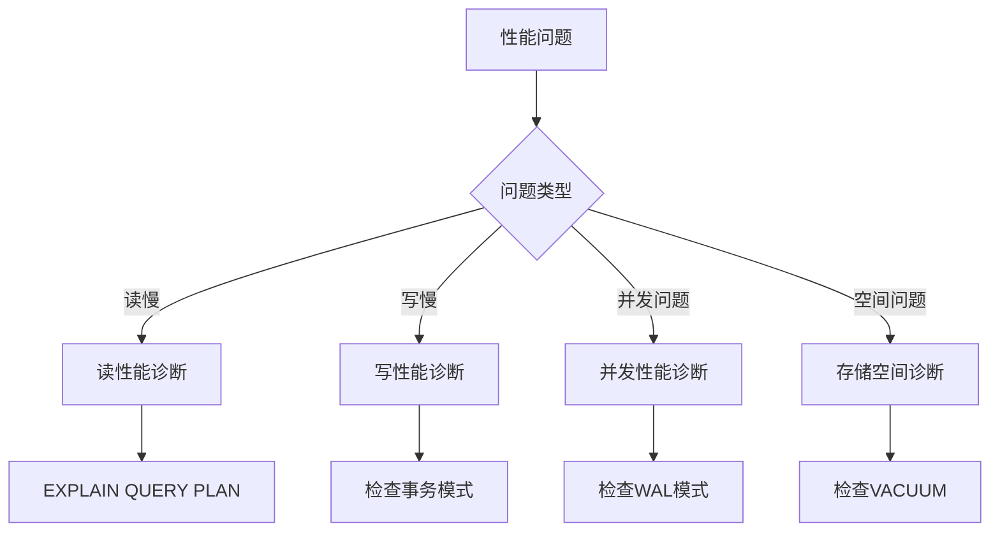

# 性能调优决策树：系统化优化流程

> **创建日期**：2025-11-13
> **最后更新**：2025-01-15
> **版本**：SQLite 3.31+ 至 3.47.x

---

## 📋 概述

本文档提供系统化的性能调优决策树，帮助开发者快速定位性能问题并选择最优优化方案。

---

## 📑 目录

- [性能调优决策树：系统化优化流程](#性能调优决策树系统化优化流程)
  - [📋 概述](#-概述)
  - [📑 目录](#-目录)
  - [一、性能问题诊断流程](#一性能问题诊断流程)
    - [1.1 问题分类](#11-问题分类)
    - [1.2 诊断步骤](#12-诊断步骤)
    - [1.3 性能指标收集](#13-性能指标收集)
  - [二、读性能优化决策树](#二读性能优化决策树)
    - [2.1 全表扫描问题](#21-全表扫描问题)
    - [2.2 索引使用问题](#22-索引使用问题)
    - [2.3 查询计划问题](#23-查询计划问题)
  - [三、写性能优化决策树](#三写性能优化决策树)
    - [3.1 写入速度慢](#31-写入速度慢)
    - [3.2 事务冲突](#32-事务冲突)
    - [3.3 同步模式问题](#33-同步模式问题)
  - [四、并发性能优化决策树](#四并发性能优化决策树)
    - [4.1 读并发问题](#41-读并发问题)
    - [4.2 写并发问题](#42-写并发问题)
    - [4.3 锁竞争问题](#43-锁竞争问题)
  - [五、存储空间优化决策树](#五存储空间优化决策树)
    - [5.1 数据库文件过大](#51-数据库文件过大)
    - [5.2 索引占用空间大](#52-索引占用空间大)
    - [5.3 WAL文件膨胀](#53-wal文件膨胀)
  - [六、性能调优多维对比矩阵](#六性能调优多维对比矩阵)
    - [6.1 性能问题类型对比矩阵](#61-性能问题类型对比矩阵)
    - [6.2 优化策略对比矩阵](#62-优化策略对比矩阵)
    - [6.3 优化优先级矩阵](#63-优化优先级矩阵)
    - [6.2 优化实施步骤](#62-优化实施步骤)
  - [🔗 相关资源](#-相关资源)
  - [🔗 交叉引用](#-交叉引用)
    - [理论模型 🆕](#理论模型-)
    - [设计模型 🆕](#设计模型-)
  - [📚 参考资料](#-参考资料)

---

## 一、性能问题诊断流程

### 1.1 问题分类

**性能问题分类**：

| 问题类型 | 症状 | 影响 |
|---------|------|------|
| **读性能问题** | 查询慢、全表扫描 | 用户体验差 |
| **写性能问题** | 插入/更新慢 | 吞吐量低 |
| **并发性能问题** | 锁等待、冲突 | 系统阻塞 |
| **存储空间问题** | 文件过大、碎片多 | 资源浪费 |

### 1.2 诊断步骤

**诊断流程**：



### 1.3 性能指标收集

**关键性能指标**：

```sql
-- 1. 查询执行时间
.timer ON
SELECT * FROM users WHERE id = 123;

-- 2. 执行计划分析
EXPLAIN QUERY PLAN
SELECT * FROM users WHERE id = 123;

-- 3. 数据库大小
SELECT page_count * page_size as size FROM pragma_page_count(), pragma_page_size();

-- 4. 索引使用情况
SELECT * FROM sqlite_stat1 WHERE tbl = 'users';
```

**性能诊断代码示例**：

```python
import sqlite3
import time
import json

class PerformanceDiagnostics:
    """SQLite性能诊断工具"""

    def __init__(self, db_path):
        self.db_path = db_path
        self.conn = sqlite3.connect(db_path)

    def analyze_query_plan(self, sql, params=None):
        """分析查询计划"""
        cursor = self.conn.execute('EXPLAIN QUERY PLAN ' + sql, params or ())
        plan = cursor.fetchall()

        print("查询计划：")
        for row in plan:
            print(f"  {row}")

        # 检查是否使用索引
        plan_str = str(plan).lower()
        if 'scan table' in plan_str and 'using index' not in plan_str:
            print("⚠️  警告：可能未使用索引（全表扫描）")
        elif 'using index' in plan_str:
            print("✅ 使用索引")

        return plan

    def measure_query_time(self, sql, params=None, iterations=100):
        """测量查询执行时间"""
        # 预热
        for _ in range(10):
            self.conn.execute(sql, params or ()).fetchall()

        # 测量
        start = time.time()
        for _ in range(iterations):
            self.conn.execute(sql, params or ()).fetchall()
        elapsed = time.time() - start

        avg_time = (elapsed / iterations) * 1000  # 转换为毫秒
        print(f"平均执行时间: {avg_time:.3f}ms ({iterations}次迭代)")
        return avg_time

    def get_database_stats(self):
        """获取数据库统计信息"""
        stats = {}

        # 页数和大小
        cursor = self.conn.execute('PRAGMA page_count')
        stats['page_count'] = cursor.fetchone()[0]

        cursor = self.conn.execute('PRAGMA page_size')
        stats['page_size'] = cursor.fetchone()[0]

        stats['total_size'] = stats['page_count'] * stats['page_size']

        # 空闲页数
        cursor = self.conn.execute('PRAGMA freelist_count')
        stats['freelist_count'] = cursor.fetchone()[0]

        # 碎片率
        if stats['page_count'] > 0:
            stats['fragmentation'] = (stats['freelist_count'] / stats['page_count']) * 100
        else:
            stats['fragmentation'] = 0

        return stats

    def diagnose_performance_issue(self, sql, params=None):
        """综合性能诊断"""
        print("=" * 50)
        print("性能诊断报告")
        print("=" * 50)

        # 1. 查询计划分析
        print("\n1. 查询计划分析：")
        self.analyze_query_plan(sql, params)

        # 2. 执行时间测量
        print("\n2. 执行时间测量：")
        avg_time = self.measure_query_time(sql, params)

        # 3. 数据库统计
        print("\n3. 数据库统计：")
        stats = self.get_database_stats()
        print(f"  总大小: {stats['total_size'] / 1024 / 1024:.2f} MB")
        print(f"  页数: {stats['page_count']}")
        print(f"  碎片率: {stats['fragmentation']:.2f}%")

        # 4. 优化建议
        print("\n4. 优化建议：")
        if avg_time > 100:
            print("  ⚠️  查询较慢，建议：")
            print("     - 检查是否使用索引")
            print("     - 考虑添加覆盖索引")
            print("     - 优化查询语句")

        if stats['fragmentation'] > 20:
            print("  ⚠️  碎片率较高，建议执行VACUUM")

        return {
            'query_plan': self.analyze_query_plan(sql, params),
            'avg_time': avg_time,
            'stats': stats
        }

# 使用示例
# diag = PerformanceDiagnostics('example.db')
# diag.diagnose_performance_issue('SELECT * FROM users WHERE id = ?', (123,))
```

---

## 二、读性能优化决策树

### 2.1 全表扫描问题

**诊断**：

```sql
EXPLAIN QUERY PLAN
SELECT * FROM users WHERE email = 'alice@example.com';
-- 输出：SCAN TABLE users（全表扫描）
```

**优化决策树**：

```text
全表扫描问题
├─ WHERE条件列是否有索引？
│  ├─ 否 → 创建索引
│  └─ 是 → 检查索引是否被使用
│     ├─ 未使用 → 检查查询条件
│     └─ 已使用 → 检查索引选择性
│        ├─ 选择性低 → 考虑部分索引
│        └─ 选择性高 → 检查统计信息
```

**解决方案**：

```sql
-- 步骤1：创建索引
CREATE INDEX idx_email ON users(email);

-- 步骤2：验证索引使用
EXPLAIN QUERY PLAN
SELECT * FROM users WHERE email = 'alice@example.com';
-- 输出：SEARCH users USING INDEX idx_email (email=?)
```

### 2.2 索引使用问题

**问题场景**：

```sql
-- 索引存在但未使用
CREATE INDEX idx_name ON users(name);
EXPLAIN QUERY PLAN
SELECT * FROM users WHERE LOWER(name) = 'alice';
-- 输出：SCAN TABLE users（未使用索引）
```

**优化方案**：

```sql
-- 方案1：创建表达式索引
CREATE INDEX idx_name_lower ON users(LOWER(name));

-- 方案2：重写查询（避免函数）
SELECT * FROM users WHERE name = 'Alice';
```

### 2.3 查询计划问题

**问题场景**：统计信息过期导致查询计划退化

**解决方案**：

```sql
-- 更新统计信息
PRAGMA optimize;

-- 或分析特定表
ANALYZE users;
```

---

## 三、写性能优化决策树

### 3.1 写入速度慢

**诊断流程**：

```text
写入速度慢
├─ 是否使用批量事务？
│  ├─ 否 → 使用批量事务（性能提升10-250倍）
│  └─ 是 → 检查同步模式
│     ├─ synchronous=FULL → 改为NORMAL（性能提升2-3倍）
│     └─ synchronous=NORMAL → 检查日志模式
│        ├─ journal_mode=DELETE → 改为WAL（性能提升2-3倍）
│        └─ journal_mode=WAL → 检查索引数量
│           ├─ 索引过多 → 减少不必要索引
│           └─ 索引合理 → 检查磁盘I/O
```

**优化方案**：

```sql
-- 步骤1：启用WAL模式
PRAGMA journal_mode=WAL;

-- 步骤2：设置NORMAL同步
PRAGMA synchronous=NORMAL;

-- 步骤3：使用批量事务
BEGIN;
-- 批量插入
COMMIT;
```

### 3.2 事务冲突

**问题场景**：多连接写冲突

**解决方案**：

```sql
-- 方案1：使用WAL模式（支持一写多读）
PRAGMA journal_mode=WAL;

-- 方案2：使用IMMEDIATE事务
BEGIN IMMEDIATE TRANSACTION;

-- 方案3：设置超时
PRAGMA busy_timeout=5000;
```

### 3.3 同步模式问题

**性能对比**：

| 同步模式 | 写入性能 | 安全性 | 推荐场景 |
|---------|---------|--------|---------|
| FULL | 基准 | 最高 | 金融系统 |
| NORMAL | 2-3倍 | 高 | 大多数场景（推荐） |
| OFF | 5-10倍 | 低 | 临时/测试 |

---

## 四、并发性能优化决策树

### 4.1 读并发问题

**诊断**：多个读操作被阻塞

**优化决策**：

```text
读并发问题
├─ 当前日志模式？
│  ├─ DELETE → 改为WAL（支持一写多读）
│  └─ WAL → 检查Checkpoint
│     ├─ Checkpoint频繁 → 调整wal_autocheckpoint
│     └─ Checkpoint正常 → 检查缓存大小
│        ├─ cache_size过小 → 增加缓存
│        └─ cache_size合理 → 检查查询模式
```

### 4.2 写并发问题

**问题场景**：SQLite仅支持一写多读

**解决方案**：

```sql
-- 方案1：使用WAL模式（一写多读）
PRAGMA journal_mode=WAL;

-- 方案2：应用层序列化写操作
-- 使用锁或队列序列化写操作

-- 方案3：考虑使用其他数据库
-- 如果需要多写并发，考虑PostgreSQL/MySQL
```

### 4.3 锁竞争问题

**诊断**：频繁出现SQLITE_BUSY错误

**解决方案**：

```c
// 设置超时
sqlite3_busy_timeout(db, 5000);  // 5秒超时

// 或使用忙处理回调
sqlite3_busy_handler(db, busy_callback, NULL);
```

---

## 五、存储空间优化决策树

### 5.1 数据库文件过大

**诊断流程**：

```text
数据库文件过大
├─ 是否有碎片？
│  ├─ 是 → 执行VACUUM
│  └─ 否 → 检查WAL文件
│     ├─ WAL文件过大 → 执行Checkpoint
│     └─ WAL文件正常 → 检查数据量
│        ├─ 数据量大 → 考虑归档
│        └─ 数据量正常 → 检查索引
```

**优化方案**：

```sql
-- 步骤1：检查碎片
PRAGMA integrity_check;

-- 步骤2：执行VACUUM（消除碎片）
VACUUM;

-- 步骤3：检查WAL文件
PRAGMA wal_checkpoint(FULL);
```

### 5.2 索引占用空间大

**诊断**：

```sql
-- 检查索引大小
SELECT
    name,
    (SELECT page_count * page_size FROM pragma_page_count(), pragma_page_size())
FROM sqlite_master
WHERE type = 'index';
```

**优化方案**：

```sql
-- 方案1：删除未使用的索引
DROP INDEX idx_unused;

-- 方案2：使用部分索引
CREATE INDEX idx_partial ON users(last_login)
WHERE status = 'active';
```

### 5.3 WAL文件膨胀

**问题场景**：WAL文件持续增长

**解决方案**：

```sql
-- 方案1：自动Checkpoint
PRAGMA wal_autocheckpoint=1000;

-- 方案2：定期手动Checkpoint
PRAGMA wal_checkpoint(TRUNCATE);

-- 方案3：应用关闭时Checkpoint
-- 在应用关闭时执行PRAGMA wal_checkpoint(FULL)
```

---

## 六、性能调优多维对比矩阵

### 6.1 性能问题类型对比矩阵

| 维度 | 读性能问题 | 写性能问题 | 并发性能问题 | 存储空间问题 |
|------|-----------|-----------|-------------|-------------|
| **症状** | 查询慢、全表扫描 | 插入/更新慢 | 锁等待、冲突 | 文件过大、碎片多 |
| **影响** | 用户体验差 | 吞吐量低 | 系统阻塞 | 资源浪费 |
| **诊断工具** | EXPLAIN QUERY PLAN | 事务分析 | WAL检查 | VACUUM分析 |
| **优化难度** | ⭐⭐⭐ | ⭐⭐⭐⭐ | ⭐⭐⭐⭐ | ⭐⭐⭐ |
| **优化效果** | ⭐⭐⭐⭐⭐ | ⭐⭐⭐⭐ | ⭐⭐⭐⭐ | ⭐⭐⭐⭐ |

### 6.2 优化策略对比矩阵

| 维度 | 索引优化 | 查询优化 | 事务优化 | WAL优化 | 配置优化 |
|------|---------|---------|---------|---------|---------|
| **性能提升** | ⭐⭐⭐⭐⭐ | ⭐⭐⭐⭐ | ⭐⭐⭐⭐⭐ | ⭐⭐⭐⭐ | ⭐⭐⭐ |
| **实施难度** | ⭐⭐⭐ | ⭐⭐⭐⭐ | ⭐⭐⭐ | ⭐⭐⭐⭐ | ⭐⭐⭐⭐⭐ |
| **适用场景** | 所有查询 | 复杂查询 | 批量操作 | 并发场景 | 所有场景 |
| **推荐度** | ⭐⭐⭐⭐⭐推荐 | ⭐⭐⭐⭐推荐 | ⭐⭐⭐⭐⭐推荐 | ⭐⭐⭐⭐⭐推荐 | ⭐⭐⭐⭐推荐 |

### 6.3 优化优先级矩阵

**优化优先级**：

| 优化项 | 性能提升 | 实施难度 | 优先级 |
|--------|---------|---------|--------|
| 批量事务 | 10-250倍 | 低 | P0 |
| 索引优化 | 10-100倍 | 中 | P0 |
| WAL模式 | 2-3倍 | 低 | P0 |
| PRAGMA配置 | 10-20% | 低 | P1 |
| 查询重写 | 2-5倍 | 中 | P1 |
| 表设计优化 | 10-50% | 高 | P2 |

### 6.2 优化实施步骤

**系统化优化流程**：

1. **性能诊断**（1-2天）
   - 收集性能指标
   - 识别性能瓶颈
   - 分析执行计划

2. **快速优化**（1天）
   - 启用WAL模式
   - 配置PRAGMA参数
   - 使用批量事务

3. **索引优化**（2-3天）
   - 分析查询模式
   - 创建必要索引
   - 优化索引设计

4. **查询优化**（3-5天）
   - 重写慢查询
   - 优化JOIN操作
   - 使用覆盖索引

5. **表设计优化**（5-7天）
   - 评估范式化/反范式化
   - 优化列顺序
   - 调整数据类型

6. **持续监控**（持续）
   - 定期性能测试
   - 监控查询计划
   - 更新统计信息

---

## 🔗 相关资源

- [03.01 性能特征分析](./03.01-性能特征分析.md)
- [03.02 优化策略](./03.02-优化策略.md)
- [08.03 查询优化](../08-编程实践/08.03-查询优化.md)

---

## 🔗 交叉引用

### 理论模型 🆕

- ⭐⭐⭐ [算法复杂度理论](../11-理论模型/11.03-算法复杂度理论.md) - 性能诊断理论、查询复杂度分析
- ⭐ [系统理论模型](../11-理论模型/11.01-系统理论模型.md) - 系统性能分析

### 设计模型 🆕

- ⭐⭐⭐ [设计决策](../12-设计模型/12.04-设计决策.md) - 性能调优决策、诊断决策
- ⭐ [设计模式](../12-设计模型/12.03-设计模式.md) - 性能诊断模式

---

## 📚 参考资料

- [SQLite性能优化指南](https://www.sqlite.org/performance.html)
- [查询优化器文档](https://www.sqlite.org/queryplanner.html)
- [WAL模式性能](https://www.sqlite.org/wal.html)

---

**最后更新**：2025-01-15
**维护者**：Data-Science Team
