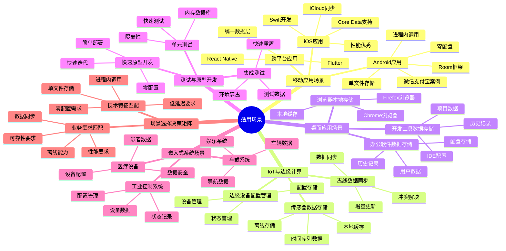

# 适用场景分析：移动应用、IoT与边缘计算

> **创建日期**：2025-11-13
> **最后更新**：2025-01-15
> **版本**：SQLite 3.31+ 至 3.47.x

---

## 📋 概述

SQLite的嵌入式架构和零配置特性使其在特定场景下具有显著优势。
本文档深入分析SQLite的适用场景及其技术原因。

---

## 📑 目录

- [适用场景分析：移动应用、IoT与边缘计算](#适用场景分析移动应用iot与边缘计算)
  - [📋 概述](#-概述)
  - [📑 目录](#-目录)
  - [📊 思维导图](#-思维导图)
  - [一、移动应用场景](#一移动应用场景)
    - [1.1 Android应用](#11-android应用)
    - [1.2 iOS应用](#12-ios应用)
    - [1.3 跨平台应用](#13-跨平台应用)
  - [二、IoT与边缘计算场景](#二iot与边缘计算场景)
    - [2.1 传感器数据存储](#21-传感器数据存储)
    - [2.2 边缘设备配置管理](#22-边缘设备配置管理)
    - [2.3 离线数据同步](#23-离线数据同步)
  - [三、桌面应用场景](#三桌面应用场景)
    - [3.1 浏览器本地存储](#31-浏览器本地存储)
    - [3.2 办公软件数据存储](#32-办公软件数据存储)
    - [3.3 开发工具数据存储](#33-开发工具数据存储)
  - [四、测试与原型开发场景](#四测试与原型开发场景)
    - [4.1 单元测试](#41-单元测试)
    - [4.2 集成测试](#42-集成测试)
    - [4.3 快速原型开发](#43-快速原型开发)
  - [五、嵌入式系统场景](#五嵌入式系统场景)
    - [5.1 车载系统](#51-车载系统)
    - [5.2 工业控制系统](#52-工业控制系统)
    - [5.3 医疗设备](#53-医疗设备)
  - [六、应用场景多维对比矩阵](#六应用场景多维对比矩阵)
    - [6.1 应用场景技术特征对比矩阵](#61-应用场景技术特征对比矩阵)
    - [6.2 场景选择决策矩阵](#62-场景选择决策矩阵)
    - [6.2.1 技术特征匹配](#621-技术特征匹配)
    - [6.2 业务需求匹配](#62-业务需求匹配)
  - [🔗 相关资源](#-相关资源)
  - [📚 参考资料](#-参考资料)

---

## 📊 思维导图



---

## 一、移动应用场景

### 1.1 Android应用

**技术优势**：

- **零配置**：无需安装数据库服务器
- **单文件存储**：便于备份和迁移
- **进程内调用**：极低延迟
- **WAL模式**：支持一写多读

**典型应用**：

```kotlin
// Android Room框架（基于SQLite）
@Database(entities = [User::class], version = 1)
abstract class AppDatabase : RoomDatabase() {
    abstract fun userDao(): UserDao
}

// 配置
val db = Room.databaseBuilder(
    context,
    AppDatabase::class.java,
    "app.db"
)
.setJournalMode(JournalMode.WRITE_AHEAD_LOGGING)  // WAL模式
.build()
```

**应用案例**：

- 微信：聊天记录本地存储
- 支付宝：交易记录本地缓存
- 抖音：视频元数据存储

### 1.2 iOS应用

**技术优势**：

- **Core Data支持**：iOS原生ORM框架
- **iCloud同步**：单文件便于同步
- **性能优秀**：进程内调用延迟低

**典型应用**：

```swift
// Core Data（基于SQLite）
let container = NSPersistentContainer(name: "DataModel")
container.loadPersistentStores { description, error in
    if let error = error {
        fatalError("Core Data failed to load: \(error)")
    }
}
```

**应用案例**：

- Safari：书签和历史记录
- Mail：邮件元数据
- Notes：笔记存储

### 1.3 跨平台应用

**技术优势**：

- **统一API**：所有平台使用相同API
- **单文件部署**：便于跨平台迁移
- **Flutter/React Native支持**：主流框架支持

**典型应用**：

```dart
// Flutter sqflite
import 'package:sqflite/sqflite.dart';

final database = await openDatabase(
  'app.db',
  version: 1,
  onCreate: (db, version) {
    return db.execute(
      'CREATE TABLE users(id INTEGER PRIMARY KEY, name TEXT)',
    );
  },
);
```

---

## 二、IoT与边缘计算场景

### 2.1 传感器数据存储

**技术优势**：

- **轻量级**：资源占用小
- **单文件存储**：便于数据导出
- **时间序列优化**：适合传感器数据

**典型应用**：

```sql
-- 传感器数据表设计
CREATE TABLE sensor_readings (
    id INTEGER PRIMARY KEY,
    device_id TEXT NOT NULL,
    sensor_type TEXT NOT NULL,
    value REAL NOT NULL,
    timestamp INTEGER NOT NULL,
    INDEX idx_device_time (device_id, timestamp)
);

-- 查询最近1小时数据
SELECT * FROM sensor_readings
WHERE device_id = ? AND timestamp > ?;
```

**应用案例**：

- 智能家居：温湿度传感器数据
- 工业监控：设备状态数据
- 农业IoT：土壤传感器数据

### 2.2 边缘设备配置管理

**技术优势**：

- **零配置**：无需数据库服务器
- **JSON支持**：存储半结构化配置
- **快速启动**：无需网络连接

**典型应用**：

```sql
-- 设备配置表
CREATE TABLE device_configs (
    device_id TEXT PRIMARY KEY,
    config TEXT NOT NULL,  -- JSON字符串
    last_update INTEGER
);

-- 查询配置
SELECT json_extract(config, '$.network.ip') as ip
FROM device_configs
WHERE device_id = ?;
```

### 2.3 离线数据同步

**技术优势**：

- **单文件存储**：便于同步
- **事务支持**：保证数据一致性
- **轻量级**：适合低带宽环境

**典型应用**：

```python
# 离线数据收集
def collect_offline_data():
    conn = sqlite3.connect('offline.db')
    # 收集数据...
    conn.close()

# 同步到服务器
def sync_to_server():
    conn = sqlite3.connect('offline.db')
    data = conn.execute('SELECT * FROM collected_data').fetchall()
    # 上传到服务器...
    conn.execute('DELETE FROM collected_data')  # 清理已同步数据
    conn.commit()
```

---

## 三、桌面应用场景

### 3.1 浏览器本地存储

**技术优势**：

- **进程内调用**：极低延迟
- **单文件存储**：便于管理
- **WAL模式**：支持并发读

**应用案例**：

**Chrome浏览器**：

- 书签存储
- 历史记录
- 扩展数据
- 缓存元数据

**Firefox浏览器**：

- Places数据库（书签、历史）
- Form History（表单历史）
- Cookies存储

### 3.2 办公软件数据存储

**典型应用**：

- **Skype**：聊天记录和联系人
- **Adobe Lightroom**：照片元数据
- **Dropbox**：本地索引和缓存

### 3.3 开发工具数据存储

**典型应用**：

- **Git**：`.git/index`使用类似SQLite的格式
- **Docker Desktop**：容器元数据
- **VS Code**：扩展数据和工作区设置

---

## 四、测试与原型开发场景

### 4.1 单元测试

**技术优势**：

- **内存数据库**：`:memory:`模式，测试隔离
- **零配置**：无需测试环境搭建
- **快速执行**：测试速度快

**典型应用**：

```python
import pytest
import sqlite3

@pytest.fixture
def test_db():
    # 每个测试用例独立的内存数据库
    conn = sqlite3.connect(':memory:')
    conn.execute('CREATE TABLE users (id INTEGER PRIMARY KEY, name TEXT)')
    yield conn
    conn.close()

def test_user_creation(test_db):
    test_db.execute("INSERT INTO users (name) VALUES ('Alice')")
    result = test_db.execute("SELECT * FROM users").fetchone()
    assert result[1] == 'Alice'
```

### 4.2 集成测试

**技术优势**：

- **单文件数据库**：便于测试数据管理
- **事务支持**：测试数据隔离
- **快速重置**：删除文件即可重置

### 4.3 快速原型开发

**技术优势**：

- **零配置**：快速启动项目
- **SQL标准**：易于迁移到其他数据库
- **单文件部署**：便于演示

---

## 五、嵌入式系统场景

### 5.1 车载系统

**技术优势**：

- **资源占用小**：适合嵌入式环境
- **可靠性高**：ACID保证
- **单文件存储**：便于维护

**应用案例**：

- 车辆诊断数据（DTC码）
- 导航历史记录
- 多媒体元数据

### 5.2 工业控制系统

**技术优势**：

- **实时性**：进程内调用延迟低
- **可靠性**：ACID保证数据一致性
- **轻量级**：适合资源受限环境

**应用案例**：

- PLC数据记录
- 设备状态存储
- 生产数据缓存

### 5.3 医疗设备

**技术优势**：

- **可靠性**：ACID保证
- **数据完整性**：外键约束
- **单文件存储**：便于数据导出

**应用案例**：

- 患者数据记录
- 设备日志存储
- 配置参数管理

---

## 六、应用场景多维对比矩阵

### 6.1 应用场景技术特征对比矩阵

| 维度 | 移动应用 | IoT边缘计算 | 桌面应用 | 测试原型 | 嵌入式系统 |
|------|---------|------------|---------|---------|-----------|
| **数据量** | 小-中等 | 小-中等 | 小-大 | 小 | 小-中等 |
| **并发度** | 低-中等 | 低 | 低-中等 | 低 | 低 |
| **网络依赖** | 可选 | 可选 | 可选 | 无 | 可选 |
| **部署复杂度** | ⭐⭐⭐⭐⭐ | ⭐⭐⭐⭐⭐ | ⭐⭐⭐⭐⭐ | ⭐⭐⭐⭐⭐ | ⭐⭐⭐⭐⭐ |
| **配置需求** | ⭐⭐⭐⭐⭐ | ⭐⭐⭐⭐⭐ | ⭐⭐⭐⭐⭐ | ⭐⭐⭐⭐⭐ | ⭐⭐⭐⭐⭐ |
| **性能要求** | ⭐⭐⭐⭐ | ⭐⭐⭐ | ⭐⭐⭐ | ⭐⭐⭐ | ⭐⭐⭐ |
| **可靠性要求** | ⭐⭐⭐⭐ | ⭐⭐⭐⭐ | ⭐⭐⭐ | ⭐⭐ | ⭐⭐⭐⭐⭐ |
| **存储空间** | 有限 | 有限 | 充足 | 充足 | 有限 |
| **典型用例** | 微信、支付宝 | 传感器数据 | Chrome浏览器 | 单元测试 | 车载系统 |

### 6.2 场景选择决策矩阵

### 6.2.1 技术特征匹配

**适用场景特征**：

| 特征 | SQLite优势 | 适用度 |
|------|-----------|--------|
| **单机应用** | 进程内调用，零IPC | ⭐⭐⭐⭐⭐ |
| **读多写少** | WAL模式支持一写多读 | ⭐⭐⭐⭐⭐ |
| **数据量中等** | 单文件存储，< 100GB | ⭐⭐⭐⭐ |
| **零配置需求** | 无需数据库服务器 | ⭐⭐⭐⭐⭐ |
| **离线优先** | 单文件，无需网络 | ⭐⭐⭐⭐⭐ |
| **快速部署** | 单文件，易于分发 | ⭐⭐⭐⭐⭐ |

### 6.2 业务需求匹配

**适用业务场景**：

| 业务场景 | SQLite优势 | 推荐度 |
|---------|-----------|--------|
| **移动应用本地存储** | 零配置，单文件 | ⭐⭐⭐⭐⭐ |
| **IoT数据收集** | 轻量级，单文件 | ⭐⭐⭐⭐⭐ |
| **桌面应用数据存储** | 进程内，低延迟 | ⭐⭐⭐⭐⭐ |
| **测试环境** | 内存数据库，快速 | ⭐⭐⭐⭐⭐ |
| **原型开发** | 零配置，快速启动 | ⭐⭐⭐⭐⭐ |
| **边缘计算** | 轻量级，离线支持 | ⭐⭐⭐⭐⭐ |

---

## 🔗 相关资源

- [04.02 不适用场景论证](./04.02-不适用场景论证.md)
- [04.03 顶级应用案例](./04.03-顶级应用案例.md)
- [05.02 选型决策框架](../05-对比选型/05.02-选型决策框架.md)

---

## 🔗 交叉引用

### 理论模型 🆕

- ⭐⭐ [系统理论模型](../11-理论模型/11.01-系统理论模型.md) - 嵌入式架构理论、系统组合理论
- ⭐ [算法复杂度理论](../11-理论模型/11.03-算法复杂度理论.md) - 适用场景的复杂度分析

### 设计模型 🆕

- ⭐⭐⭐ [设计决策](../12-设计模型/12.04-设计决策.md) - 嵌入式架构决策、单文件数据库决策
- ⭐⭐ [架构设计模型](../12-设计模型/12.01-架构设计模型.md) - 设计哲学、架构设计

---

## 📚 参考资料

- [SQLite官方文档](https://www.sqlite.org/docs.html)
- [SQLite应用案例](https://www.sqlite.org/famous.html)
- [移动应用最佳实践](https://www.sqlite.org/mobile.html)

---

**最后更新**：2025-01-15
**维护者**：Data-Science Team
