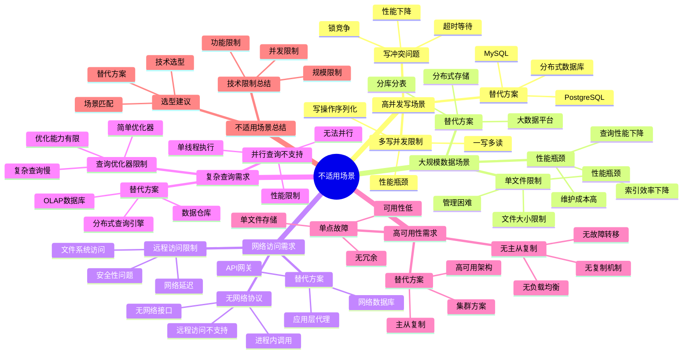

# 不适用场景论证：高并发写与分布式需求

> **创建日期**：2025-11-13
> **最后更新**：2025-01-15
> **版本**：SQLite 3.31+ 至 3.47.x

---

## 📋 概述

SQLite并非适用于所有场景。
本文档深入论证SQLite的不适用场景，帮助开发者做出正确的技术选型决策。

---

## 📑 目录

- [不适用场景论证：高并发写与分布式需求](#不适用场景论证高并发写与分布式需求)
  - [📋 概述](#-概述)
  - [📑 目录](#-目录)
  - [📊 思维导图](#-思维导图)
  - [4. 高并发写场景](#4-高并发写场景)
    - [4.1. 多写并发限制](#41-多写并发限制)
    - [4.2. 写冲突问题](#42-写冲突问题)
  - [5. 替代方案](#5-替代方案)
  - [6. 大规模数据场景](#6-大规模数据场景)
    - [6.1. 单文件限制](#61-单文件限制)
    - [6.2. 性能瓶颈](#62-性能瓶颈)
    - [6.3. 替代方案](#63-替代方案)
  - [7. 网络访问需求](#7-网络访问需求)
    - [7.1. 无网络协议](#71-无网络协议)
    - [7.2. 远程访问限制](#72-远程访问限制)
    - [7.3. 替代方案](#73-替代方案)
  - [8. 复杂查询需求](#8-复杂查询需求)
    - [8.1. 查询优化器限制](#81-查询优化器限制)
    - [8.2. 并行查询不支持](#82-并行查询不支持)
    - [8.3. 替代方案](#83-替代方案)
  - [9. 高可用性需求](#9-高可用性需求)
    - [9.1. 单点故障](#91-单点故障)
    - [9.2. 无主从复制](#92-无主从复制)
    - [9.3. 替代方案](#93-替代方案)
  - [10. 不适用场景多维对比矩阵](#10-不适用场景多维对比矩阵)
    - [10.1. 不适用场景对比矩阵](#101-不适用场景对比矩阵)
    - [10.2. 替代方案对比矩阵](#102-替代方案对比矩阵)
    - [10.3. 不适用场景总结](#103-不适用场景总结)
    - [10.4. 技术限制总结](#104-技术限制总结)
    - [10.5. 选型建议](#105-选型建议)
  - [11. 🔗 相关资源](#11--相关资源)
  - [12. 🔗 交叉引用](#12--交叉引用)
    - [12.1. 理论模型 🆕](#121-理论模型-)
    - [12.2. 设计模型 🆕](#122-设计模型-)
    - [12.3. 应用场景文档 🆕](#123-应用场景文档-)
    - [12.4. 对比选型文档 🆕](#124-对比选型文档-)
    - [12.5. 知识图谱与导航 🆕](#125-知识图谱与导航-)
    - [12.6. 相关概念链接 🆕](#126-相关概念链接-)
      - [12.6.1. 不适用场景概念](#1261-不适用场景概念)
  - [13. 📚 参考资料](#13--参考资料)

---

## 📊 思维导图



---

## 4. 高并发写场景

### 4.1. 多写并发限制

**技术限制**：

SQLite在WAL模式下仅支持**一写多读**，不支持多写并发。

**性能影响**：

```text
场景：10个连接同时写入
- PostgreSQL/MySQL：支持多写并发，吞吐量线性增长
- SQLite：写操作序列化，吞吐量不增长
```

**形式化描述**：

```text
SQLite写并发模型：
∀w₁, w₂ ∈ Writes, w₁ || w₂ → w₁; w₂ 或 w₂; w₁
（任意两个写操作必须串行执行）
```

### 4.2. 写冲突问题

**问题场景**：

```python
# 场景：多用户同时下单
# 连接1
conn1.execute('BEGIN')
conn1.execute('UPDATE inventory SET quantity = quantity - 1 WHERE product_id = 1')
# 此时连接2也尝试更新同一商品
conn2.execute('BEGIN')
conn2.execute('UPDATE inventory SET quantity = quantity - 1 WHERE product_id = 1')
# 结果：连接2会等待或超时
```

**性能影响**：

| 并发写数 | SQLite吞吐量 | PostgreSQL吞吐量 | 性能差距 |
|---------|------------|-----------------|---------|
| 1 | 基准 | 基准 | 1:1 |
| 5 | 基准 | 5倍 | 1:5 |
| 10 | 基准 | 10倍 | 1:10 |

## 5. 替代方案

**推荐方案**：

- **PostgreSQL**：支持多写并发，适合高并发写场景
- **MySQL**：支持多写并发，适合Web应用
- **MongoDB**：支持分布式写入，适合大规模并发

---

## 6. 大规模数据场景

### 6.1. 单文件限制

**技术限制**：

SQLite使用单文件存储，虽然理论上支持281TB，但实际使用中：

- **性能瓶颈**：文件过大导致查询性能下降
- **备份困难**：大文件备份和恢复耗时
- **迁移困难**：大文件迁移不便

**实际限制**：

| 数据量 | SQLite性能 | 推荐度 |
|--------|-----------|--------|
| < 10GB | 优秀 | ⭐⭐⭐⭐⭐ |
| 10GB - 100GB | 良好 | ⭐⭐⭐⭐ |
| 100GB - 1TB | 可接受 | ⭐⭐⭐ |
| > 1TB | 不推荐 | ⭐⭐ |

### 6.2. 性能瓶颈

**问题场景**：

```sql
-- 场景：1TB数据库，查询性能下降
SELECT * FROM large_table WHERE id = 123456789;
-- 即使有索引，大文件I/O也会影响性能
```

**性能对比**：

| 数据库大小 | 查询延迟 | 说明 |
|-----------|---------|------|
| 1GB | ~0.1ms | 优秀 |
| 10GB | ~1ms | 良好 |
| 100GB | ~10ms | 可接受 |
| 1TB | ~100ms+ | 不推荐 |

### 6.3. 替代方案

**推荐方案**：

- **PostgreSQL**：支持分区表，适合大规模数据
- **MySQL**：支持分区表，适合大规模数据
- **分布式数据库**：Cassandra、MongoDB等

---

## 7. 网络访问需求

### 7.1. 无网络协议

**技术限制**：

SQLite是进程内数据库，**没有网络协议**，无法通过网络直接访问。

**问题场景**：

```text
需求：多个应用服务器需要共享数据库
- SQLite：无法实现（单文件，无法网络访问）
- PostgreSQL/MySQL：支持网络协议，多服务器可访问
```

### 7.2. 远程访问限制

**解决方案（不推荐）**：

虽然可以通过网络文件系统（NFS）共享SQLite文件，但存在严重问题：

1. **锁竞争**：网络文件系统锁性能差
2. **数据损坏风险**：网络故障可能导致数据损坏
3. **性能问题**：网络I/O延迟高

**官方警告**：

> SQLite官方明确警告：不要在网络文件系统上使用SQLite

### 7.3. 替代方案

**推荐方案**：

- **PostgreSQL**：原生网络协议支持
- **MySQL**：原生网络协议支持
- **SQLite + 应用层API**：通过应用服务器提供API访问

---

## 8. 复杂查询需求

### 8.1. 查询优化器限制

**技术限制**：

SQLite的查询优化器相对简单，不支持：

- 复杂查询并行化
- 高级优化技术（如物化视图）
- 复杂统计信息

**问题场景**：

```sql
-- 复杂查询：多表JOIN + 聚合
SELECT
    u.name,
    COUNT(o.id) as order_count,
    SUM(o.amount) as total_amount
FROM users u
JOIN orders o ON u.id = o.user_id
JOIN order_items oi ON o.id = oi.order_id
WHERE o.created_at > '2024-01-01'
GROUP BY u.id, u.name
HAVING COUNT(o.id) > 10
ORDER BY total_amount DESC
LIMIT 100;

-- SQLite：可能性能较差
-- PostgreSQL：优化器更强大，性能更好
```

### 8.2. 并行查询不支持

**技术限制**：

SQLite不支持查询并行化，复杂查询只能单线程执行。

**性能影响**：

| 查询复杂度 | SQLite性能 | PostgreSQL性能 | 性能差距 |
|-----------|-----------|---------------|---------|
| 简单查询 | 优秀 | 良好 | SQLite更快 |
| 中等查询 | 良好 | 优秀 | PostgreSQL更快 |
| 复杂查询 | 可接受 | 优秀 | PostgreSQL快2-5倍 |

### 8.3. 替代方案

**推荐方案**：

- **PostgreSQL**：强大的查询优化器，支持并行查询
- **MySQL**：支持并行查询（8.0+）
- **分析型数据库**：ClickHouse、DuckDB等

---

## 9. 高可用性需求

### 9.1. 单点故障

**技术限制**：

SQLite是单文件数据库，存在单点故障风险：

- **文件损坏**：数据库文件损坏可能导致数据丢失
- **磁盘故障**：磁盘故障导致数据丢失
- **无冗余**：无法提供数据冗余

**问题场景**：

```text
场景：关键业务系统需要高可用性
- SQLite：单文件，无冗余，风险高
- PostgreSQL：支持主从复制，高可用
- MySQL：支持主从复制，高可用
```

### 9.2. 无主从复制

**技术限制**：

SQLite**不支持主从复制**，无法提供：

- 读写分离
- 数据冗余
- 故障自动切换

**替代方案**：

虽然可以通过应用层实现复制（如Litestream），但：

1. **复杂度高**：需要额外的复制逻辑
2. **性能开销**：应用层复制有性能开销
3. **一致性保证**：不如数据库原生复制可靠

### 9.3. 替代方案

**推荐方案**：

- **PostgreSQL**：支持流复制、逻辑复制
- **MySQL**：支持主从复制、组复制
- **分布式数据库**：MongoDB、Cassandra等

---

## 10. 不适用场景多维对比矩阵

### 10.1. 不适用场景对比矩阵

| 维度 | SQLite | PostgreSQL | MySQL | MongoDB |
|------|--------|-----------|-------|---------|
| **高并发写** | ❌ 不适用 | ✅ 适用 | ✅ 适用 | ✅ 适用 |
| **大规模数据** | ❌ 不适用 | ✅ 适用 | ✅ 适用 | ✅ 适用 |
| **网络访问** | ❌ 不适用 | ✅ 适用 | ✅ 适用 | ✅ 适用 |
| **复杂查询** | ⚠️ 有限 | ✅ 适用 | ✅ 适用 | ⚠️ 有限 |
| **高可用性** | ❌ 不适用 | ✅ 适用 | ✅ 适用 | ✅ 适用 |
| **分布式** | ❌ 不适用 | ✅ 适用 | ✅ 适用 | ✅ 适用 |

### 10.2. 替代方案对比矩阵

| 场景 | SQLite限制 | PostgreSQL | MySQL | MongoDB | 推荐选择 |
|------|-----------|-----------|-------|---------|---------|
| **高并发写** | 一写多读 | ⭐⭐⭐⭐⭐ | ⭐⭐⭐⭐⭐ | ⭐⭐⭐⭐ | PostgreSQL/MySQL |
| **大规模数据** | 单文件限制 | ⭐⭐⭐⭐⭐ | ⭐⭐⭐⭐⭐ | ⭐⭐⭐⭐⭐ | PostgreSQL/MySQL |
| **网络访问** | 无网络协议 | ⭐⭐⭐⭐⭐ | ⭐⭐⭐⭐⭐ | ⭐⭐⭐⭐⭐ | PostgreSQL/MySQL |
| **复杂查询** | 优化器简单 | ⭐⭐⭐⭐⭐ | ⭐⭐⭐⭐ | ⭐⭐⭐ | PostgreSQL |
| **高可用性** | 单点故障 | ⭐⭐⭐⭐⭐ | ⭐⭐⭐⭐⭐ | ⭐⭐⭐⭐⭐ | PostgreSQL/MySQL |
| **分布式** | 不支持 | ⭐⭐⭐⭐⭐ | ⭐⭐⭐⭐ | ⭐⭐⭐⭐⭐ | MongoDB/PostgreSQL |

### 10.3. 不适用场景总结

### 10.4. 技术限制总结

**SQLite不适用场景**：

| 场景 | 技术限制 | 推荐替代 |
|------|---------|---------|
| **高并发写** | 仅支持一写多读 | PostgreSQL、MySQL |
| **大规模数据** | 单文件性能瓶颈 | PostgreSQL、MySQL |
| **网络访问** | 无网络协议 | PostgreSQL、MySQL |
| **复杂查询** | 优化器简单 | PostgreSQL、ClickHouse |
| **OLAP分析查询** | 行存储劣势 | PostgreSQL+cstore_fdw、ClickHouse、DuckDB（或SQLite列存储模拟） 🆕 |
| **高可用性** | 单点故障 | PostgreSQL、MySQL |
| **分布式需求** | 单机架构 | MongoDB、Cassandra |

### 10.5. 选型建议

**决策流程**：

```text
需要数据库？
├─ 是否需要网络访问？
│  ├─ 是 → PostgreSQL/MySQL
│  └─ 否 → 继续
├─ 是否需要高并发写？
│  ├─ 是 → PostgreSQL/MySQL
│  └─ 否 → 继续
├─ 数据量是否 > 100GB？
│  ├─ 是 → PostgreSQL/MySQL
│  └─ 否 → 继续
└─ SQLite ✅（适合）
```

**选型原则**：

1. **单机应用** → SQLite ✅
2. **网络访问** → PostgreSQL/MySQL
3. **高并发写** → PostgreSQL/MySQL
4. **大规模数据** → PostgreSQL/MySQL
5. **高可用性** → PostgreSQL/MySQL

---

## 11. 🔗 相关资源

- [04.01 适用场景分析](./04.01-适用场景分析.md)
- [04.03 顶级应用案例](./04.03-顶级应用案例.md)
- [05.02 选型决策框架](../05-对比选型/05.02-选型决策框架.md)
- [03.02 优化策略](../03-性能优化/03.02-优化策略.md) - 列存储模拟优化 🆕
- [01.03 存储引擎](../01-核心架构/01.03-存储引擎.md) - 列存储架构分析 🆕

---

## 12. 🔗 交叉引用

### 12.1. 理论模型 🆕

- ⭐⭐ [系统理论模型](../11-理论模型/11.01-系统理论模型.md) - 系统架构限制理论
- ⭐ [算法复杂度理论](../11-理论模型/11.03-算法复杂度理论.md) - 性能限制分析

### 12.2. 设计模型 🆕

- ⭐⭐⭐ [设计决策](../12-设计模型/12.04-设计决策.md) - 技术选型决策、架构限制决策
- ⭐⭐ [架构设计模型](../12-设计模型/12.01-架构设计模型.md) - 架构限制分析（含交叉引用）

### 12.3. 应用场景文档 🆕

- ⭐⭐⭐ [适用场景分析](./04.01-适用场景分析.md) - 适用场景分析（含交叉引用）
- ⭐⭐ [顶级应用案例](./04.03-顶级应用案例.md) - 应用案例（含交叉引用）

### 12.4. 对比选型文档 🆕

- ⭐⭐⭐ [选型决策框架](../05-对比选型/05.02-选型决策框架.md) - 选型决策框架（含交叉引用）
- ⭐⭐ [技术决策树完整集](../05-对比选型/05.03-SQLite技术决策树完整集.md) - 技术决策树（含交叉引用）

### 12.5. 知识图谱与导航 🆕

- ⭐⭐⭐ [知识图谱与概念关系网络](../09-最新特性/09.03-SQLite知识图谱与概念关系网络.md) - 不适用场景概念关系（400+概念）
- ⭐⭐ [文档依赖关系图](../00-项目导航/06-文档依赖关系图.md) - 不适用场景文档依赖
- ⭐⭐ [术语标准化词典](../00-项目导航/03-术语词典/SQLite术语标准化词典.md) - 不适用场景术语索引

### 12.6. 相关概念链接 🆕

#### 12.6.1. 不适用场景概念

- **不适用场景** → [知识图谱：应用场景本体](../09-最新特性/09.03-SQLite知识图谱与概念关系网络.md#应用场景本体)
- **场景选型** → [选型决策框架](../05-对比选型/05.02-选型决策框架.md)
- **技术边界** → [技术决策树完整集](../05-对比选型/05.03-SQLite技术决策树完整集.md)

---

## 13. 📚 参考资料

- [SQLite适用场景](https://www.sqlite.org/whentouse.html)
- [SQLite不适用场景](https://www.sqlite.org/whentouse.html)
- [数据库选型指南](https://www.sqlite.org/whentouse.html)

---

**最后更新**：2025-01-15
**维护者**：Data-Science Team
