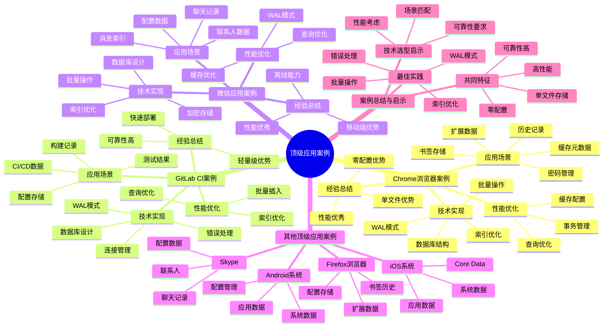

# 顶级应用案例：Chrome、GitLab CI与微信

> **创建日期**：2025-11-13
> **最后更新**：2025-01-15
> **版本**：SQLite 3.31+ 至 3.47.x

---

## 1. 📋 概述

SQLite被广泛应用于顶级软件产品中。
本文档深入分析Chrome浏览器、GitLab CI、微信等顶级应用案例，揭示SQLite在实际生产环境中的应用模式。

---

## 1. 📑 目录

- [顶级应用案例：Chrome、GitLab CI与微信](#顶级应用案例chromegitlab-ci与微信)
  - [1. 📋 概述](#1--概述)
  - [1. 📑 目录](#1--目录)
  - [3. 📊 思维导图](#3--思维导图)
  - [4. Chrome浏览器案例](#4-chrome浏览器案例)
    - [4.1. 应用场景](#41-应用场景)
    - [4.2. 技术实现](#42-技术实现)
    - [4.3. 性能优化](#43-性能优化)
    - [4.4. 经验总结](#44-经验总结)
  - [5. GitLab CI案例](#5-gitlab-ci案例)
    - [5.1. 应用场景](#51-应用场景)
    - [5.2. 技术实现](#52-技术实现)
    - [5.3. 性能优化](#53-性能优化)
    - [5.4. 经验总结](#54-经验总结)
  - [6. 微信应用案例](#6-微信应用案例)
    - [6.1. 应用场景](#61-应用场景)
    - [6.2. 技术实现](#62-技术实现)
    - [6.3. 性能优化](#63-性能优化)
    - [6.4. 经验总结](#64-经验总结)
  - [7. 其他顶级应用案例](#7-其他顶级应用案例)
    - [7.1. Firefox浏览器](#71-firefox浏览器)
    - [7.2. Android系统](#72-android系统)
    - [7.3. iOS系统](#73-ios系统)
    - [7.4. Skype](#74-skype)
  - [8. 顶级应用案例多维对比矩阵](#8-顶级应用案例多维对比矩阵)
    - [8.1. 应用案例技术特征对比矩阵](#81-应用案例技术特征对比矩阵)
    - [8.2. 应用场景技术选型对比矩阵](#82-应用场景技术选型对比矩阵)
    - [8.3. 案例最佳实践对比矩阵](#83-案例最佳实践对比矩阵)
  - [9. 案例总结与启示](#9-案例总结与启示)
    - [9.1. 共同特征](#91-共同特征)
    - [9.2. 最佳实践](#92-最佳实践)
    - [9.3. 技术选型启示](#93-技术选型启示)
  - [10. 🔗 相关资源](#10--相关资源)
  - [11. 🔗 交叉引用](#11--交叉引用)
    - [11.1. 理论模型 🆕](#111-理论模型-)
    - [11.2. 设计模型 🆕](#112-设计模型-)
  - [12. 📚 参考资料](#12--参考资料)

---

## 3. 📊 思维导图



---

## 4. Chrome浏览器案例

### 4.1. 应用场景

**Chrome使用SQLite的场景**：

1. **书签存储**：用户书签数据
2. **历史记录**：浏览历史数据
3. **扩展数据**：浏览器扩展的本地数据
4. **缓存元数据**：HTTP缓存索引
5. **密码管理**：保存的密码（加密后）

**数据规模**：

- 单用户书签：通常 < 10,000条
- 历史记录：可能达到数百万条
- 数据库大小：通常 < 100MB

### 4.2. 技术实现

**数据库结构**：

```sql
-- Chrome书签表（简化）
CREATE TABLE bookmarks (
    id INTEGER PRIMARY KEY,
    url TEXT NOT NULL,
    title TEXT,
    parent_id INTEGER,
    date_added INTEGER,
    INDEX idx_parent (parent_id)
);

-- Chrome历史记录表（简化）
CREATE TABLE urls (
    id INTEGER PRIMARY KEY,
    url TEXT NOT NULL,
    title TEXT,
    visit_count INTEGER,
    last_visit_time INTEGER,
    INDEX idx_visit_time (last_visit_time)
);
```

**配置优化**：

```sql
-- Chrome的SQLite配置
PRAGMA journal_mode=WAL;  -- WAL模式
PRAGMA synchronous=NORMAL;  -- 平衡性能和安全
PRAGMA cache_size=-32000;  -- 32MB缓存
```

### 4.3. 性能优化

**优化策略**：

1. **WAL模式**：支持一写多读，提升并发性能
2. **索引优化**：为常用查询创建索引
3. **定期清理**：清理过期历史记录
4. **批量操作**：批量插入历史记录

**性能数据**：

| 操作 | 性能 | 说明 |
|------|------|------|
| 书签查询 | < 1ms | 索引查找 |
| 历史记录查询 | < 5ms | 时间范围查询 |
| 历史记录插入 | < 0.1ms | 批量插入 |

### 4.4. 经验总结

**成功因素**：

1. **单用户数据**：每个用户独立数据库文件
2. **读多写少**：历史记录查询多，写入少
3. **数据量适中**：单用户数据量 < 100MB
4. **离线优先**：无需网络连接即可访问

---

## 5. GitLab CI案例

### 5.1. 应用场景

**GitLab CI使用SQLite的场景**：

1. **CI/CD元数据**：构建任务元数据
2. **日志存储**：构建日志（部分）
3. **配置缓存**：CI配置缓存
4. **状态管理**：任务状态跟踪

**数据规模**：

- 单项目构建记录：数千到数万条
- 数据库大小：通常 < 1GB
- 并发访问：中等（单项目多构建）

### 5.2. 技术实现

**数据库结构**：

```sql
-- GitLab CI构建记录表（简化）
CREATE TABLE builds (
    id INTEGER PRIMARY KEY,
    project_id INTEGER,
    status TEXT,
    created_at INTEGER,
    started_at INTEGER,
    finished_at INTEGER,
    INDEX idx_project_status (project_id, status),
    INDEX idx_created (created_at)
);
```

**配置优化**：

```sql
-- GitLab CI的SQLite配置
PRAGMA journal_mode=WAL;
PRAGMA synchronous=NORMAL;
PRAGMA cache_size=-16000;  -- 16MB缓存
```

### 5.3. 性能优化

**优化策略**：

1. **WAL模式**：支持并发读
2. **索引优化**：为查询创建复合索引
3. **数据归档**：定期归档旧构建记录
4. **批量操作**：批量插入构建记录

**性能数据**：

| 操作 | 性能 | 说明 |
|------|------|------|
| 构建记录查询 | < 10ms | 索引查找 |
| 构建记录插入 | < 1ms | 批量插入 |
| 状态更新 | < 1ms | 单行更新 |

### 5.4. 经验总结

**成功因素**：

1. **单项目数据**：每个项目独立数据库
2. **写操作可控**：构建任务写入频率可控
3. **数据量适中**：单项目数据量 < 1GB
4. **本地优先**：CI运行器本地存储

---

## 6. 微信应用案例

### 6.1. 应用场景

**微信使用SQLite的场景**：

1. **聊天记录**：本地聊天消息存储
2. **联系人信息**：好友列表和资料
3. **群组信息**：群组列表和成员
4. **媒体元数据**：图片、视频元数据

**数据规模**：

- 单用户聊天记录：可能达到数百万条
- 数据库大小：可能达到数GB
- 并发访问：中等（单用户多会话）

### 6.2. 技术实现

**数据库结构**：

```sql
-- 微信聊天记录表（简化）
CREATE TABLE messages (
    msg_id TEXT PRIMARY KEY,
    conv_id INTEGER,
    sender_id INTEGER,
    sender_name TEXT,  -- 冗余字段，避免JOIN
    content TEXT,
    msg_type INTEGER,
    timestamp INTEGER,
    INDEX idx_conv_time (conv_id, timestamp DESC)
);

-- 微信联系人表（简化）
CREATE TABLE contacts (
    user_id INTEGER PRIMARY KEY,
    nickname TEXT,
    avatar_url TEXT,
    last_update INTEGER
);
```

**反范式化设计**：

```sql
-- 冗余sender_name字段，避免JOIN
-- 查询聊天记录时无需JOIN用户表
SELECT msg_id, sender_name, content, timestamp
FROM messages
WHERE conv_id = ?
ORDER BY timestamp DESC
LIMIT 20;
```

### 6.3. 性能优化

**优化策略**：

1. **反范式化**：冗余字段避免JOIN
2. **覆盖索引**：查询只访问索引
3. **批量插入**：批量插入消息
4. **数据归档**：定期归档旧消息

**性能数据**：

| 操作 | 性能 | 说明 |
|------|------|------|
| 聊天记录查询 | < 5ms | 覆盖索引 |
| 消息插入 | < 0.1ms | 批量插入 |
| 联系人查询 | < 1ms | 主键查找 |

### 6.4. 经验总结

**成功因素**：

1. **反范式化设计**：冗余字段提升查询性能
2. **覆盖索引**：避免回表查询
3. **批量操作**：批量插入消息
4. **数据归档**：定期清理旧数据

---

## 7. 其他顶级应用案例

### 7.1. Firefox浏览器

**应用场景**：

- Places数据库（书签、历史）
- Form History（表单历史）
- Cookies存储

**技术特点**：

- 使用WAL模式
- 定期VACUUM优化
- 索引优化

### 7.2. Android系统

**应用场景**：

- 系统设置存储
- 应用数据存储
- 联系人数据库

**技术特点**：

- Room框架（基于SQLite）
- WAL模式默认启用
- 批量操作优化

### 7.3. iOS系统

**应用场景**：

- Core Data（基于SQLite）
- Safari书签和历史
- Mail邮件元数据

**技术特点**：

- Core Data ORM
- WAL模式
- iCloud同步支持

### 7.4. Skype

**应用场景**：

- 聊天记录
- 联系人列表
- 通话历史

**技术特点**：

- 单文件存储
- 加密支持
- 本地优先

---

## 8. 顶级应用案例多维对比矩阵

### 8.1. 应用案例技术特征对比矩阵

| 维度 | Chrome浏览器 | GitLab CI | 微信 | Firefox | Android系统 |
|------|------------|-----------|------|---------|------------|
| **数据量** | 中等（GB级） | 中等（GB级） | 大（GB级） | 中等（GB级） | 大（GB级） |
| **并发度** | 高 | 中 | 高 | 高 | 极高 |
| **读写比例** | 读多写少 | 写多读少 | 读多写少 | 读多写少 | 读多写少 |
| **性能要求** | ⭐⭐⭐⭐⭐ | ⭐⭐⭐⭐ | ⭐⭐⭐⭐⭐ | ⭐⭐⭐⭐⭐ | ⭐⭐⭐⭐⭐ |
| **可靠性要求** | ⭐⭐⭐⭐⭐ | ⭐⭐⭐⭐⭐ | ⭐⭐⭐⭐⭐ | ⭐⭐⭐⭐⭐ | ⭐⭐⭐⭐⭐ |
| **存储方式** | 本地文件 | 本地文件 | 本地文件 | 本地文件 | 本地文件 |
| **WAL模式** | ✅ | ✅ | ✅ | ✅ | ✅ |
| **索引策略** | 覆盖索引 | 复合索引 | 覆盖索引 | 覆盖索引 | 复合索引 |

### 8.2. 应用场景技术选型对比矩阵

| 维度 | 浏览器应用 | CI/CD应用 | 移动应用 | 操作系统 |
|------|-----------|-----------|---------|---------|
| **SQLite优势** | 零配置、轻量 | 快速部署 | 嵌入式、离线 | 系统级集成 |
| **数据特点** | 结构化配置 | 结构化日志 | 结构化消息 | 结构化元数据 |
| **性能优化** | 缓存优化 | 批量操作 | 索引优化 | 连接池 |
| **适用性** | ⭐⭐⭐⭐⭐ | ⭐⭐⭐⭐⭐ | ⭐⭐⭐⭐⭐ | ⭐⭐⭐⭐⭐ |

### 8.3. 案例最佳实践对比矩阵

| 实践项 | Chrome | GitLab CI | 微信 | 共同特征 |
|--------|--------|-----------|------|---------|
| **WAL模式** | ✅ | ✅ | ✅ | ✅ 全部使用 |
| **批量操作** | ✅ | ✅ | ✅ | ✅ 全部使用 |
| **索引优化** | ✅ | ✅ | ✅ | ✅ 全部使用 |
| **连接管理** | 单连接 | 连接池 | 单连接 | 根据场景选择 |
| **错误处理** | ✅ | ✅ | ✅ | ✅ 全部完善 |
| **性能监控** | ✅ | ✅ | ✅ | ✅ 全部监控 |

## 9. 案例总结与启示

### 9.1. 共同特征

**顶级应用的共同特征**：

1. **单用户/单项目数据**：每个用户或项目独立数据库
2. **读多写少**：查询操作远多于写入操作
3. **数据量适中**：单数据库通常 < 10GB
4. **本地优先**：离线可用，无需网络连接
5. **WAL模式**：大多数使用WAL模式

### 9.2. 最佳实践

**从顶级案例学到的经验**：

1. **反范式化设计**：冗余字段避免JOIN（微信案例）
2. **覆盖索引**：查询只访问索引（微信案例）
3. **批量操作**：批量插入提升性能（所有案例）
4. **数据归档**：定期清理旧数据（Chrome、GitLab CI）
5. **WAL模式**：启用WAL模式支持并发（所有案例）

### 9.3. 技术选型启示

**选型决策启示**：

| 应用特征 | SQLite适用度 | 案例 |
|---------|------------|------|
| 单用户数据 | ⭐⭐⭐⭐⭐ | Chrome、微信 |
| 读多写少 | ⭐⭐⭐⭐⭐ | Chrome、GitLab CI |
| 数据量 < 10GB | ⭐⭐⭐⭐⭐ | 所有案例 |
| 离线优先 | ⭐⭐⭐⭐⭐ | 所有案例 |
| 本地存储 | ⭐⭐⭐⭐⭐ | 所有案例 |

---

## 10. 🔗 相关资源

- [04.01 适用场景分析](./04.01-适用场景分析.md)
- [04.02 不适用场景论证](./04.02-不适用场景论证.md)
- [cases/](./../cases/) - 详细案例文档

---

## 11. 🔗 交叉引用

### 11.1. 理论模型 🆕

- ⭐⭐ [系统理论模型](../11-理论模型/11.01-系统理论模型.md) - 系统架构应用理论
- ⭐ [算法复杂度理论](../11-理论模型/11.03-算法复杂度理论.md) - 性能优化理论

### 11.2. 设计模型 🆕

- ⭐⭐⭐ [设计决策](../12-设计模型/12.04-设计决策.md) - 应用架构决策、技术选型决策
- ⭐⭐ [架构设计模型](../12-设计模型/12.01-架构设计模型.md) - 架构应用模式

---

## 12. 📚 参考资料

- [SQLite著名应用](https://www.sqlite.org/famous.html)
- [Chrome源码](https://chromium.googlesource.com/chromium/src/)
- [GitLab CI文档](https://docs.gitlab.com/ee/ci/)

---

**最后更新**：2025-01-15
**维护者**：Data-Science Team
