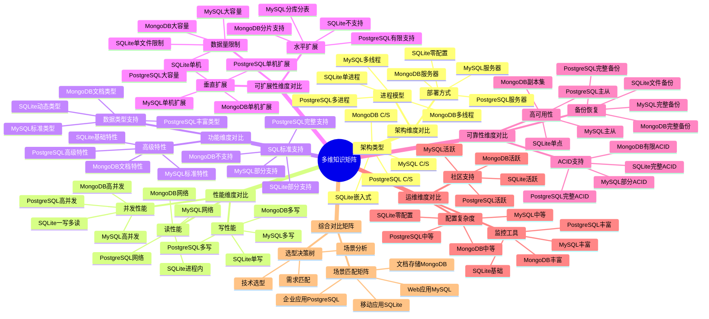

# 多维知识矩阵：SQLite vs PostgreSQL vs MySQL vs MongoDB

> **创建日期**：2025-11-13
> **最后更新**：2025-01-15
> **版本**：SQLite 3.31+ 至 3.47.x

---

## 📋 概述

本文档通过多维知识矩阵对比SQLite与主流数据库（PostgreSQL、MySQL、MongoDB），帮助开发者做出正确的技术选型决策。

---

## 📑 目录

- [多维知识矩阵：SQLite vs PostgreSQL vs MySQL vs MongoDB](#多维知识矩阵sqlite-vs-postgresql-vs-mysql-vs-mongodb)
  - [📋 概述](#-概述)
  - [📑 目录](#-目录)
  - [📊 思维导图](#-思维导图)
  - [4. 架构维度对比](#4-架构维度对比)
    - [4.1. 架构类型](#41-架构类型)
    - [4.2. 部署方式](#42-部署方式)
    - [4.3. 进程模型](#43-进程模型)
  - [5. 性能维度对比](#5-性能维度对比)
    - [5.1. 读性能](#51-读性能)
    - [5.2. 写性能](#52-写性能)
    - [5.3. 并发性能](#53-并发性能)
  - [6. 功能维度对比](#6-功能维度对比)
    - [6.1. SQL标准支持](#61-sql标准支持)
    - [6.2. 数据类型支持](#62-数据类型支持)
    - [6.3. 高级特性](#63-高级特性)
  - [7. 可扩展性维度对比](#7-可扩展性维度对比)
    - [7.1. 水平扩展](#71-水平扩展)
    - [7.2. 垂直扩展](#72-垂直扩展)
    - [7.3. 数据量限制](#73-数据量限制)
  - [8. 可靠性维度对比](#8-可靠性维度对比)
    - [8.1. ACID支持](#81-acid支持)
    - [8.2. 备份恢复](#82-备份恢复)
    - [8.3. 高可用性](#83-高可用性)
  - [9. 运维维度对比](#9-运维维度对比)
    - [9.1. 配置复杂度](#91-配置复杂度)
    - [9.2. 监控工具](#92-监控工具)
    - [9.3. 社区支持](#93-社区支持)
  - [10. 综合对比矩阵](#10-综合对比矩阵)
    - [10.1. 场景匹配矩阵](#101-场景匹配矩阵)
    - [10.2. 选型决策树](#102-选型决策树)
  - [11. 🔗 相关资源](#11--相关资源)
  - [12. 🔗 交叉引用](#12--交叉引用)
    - [12.1. 理论模型 🆕](#121-理论模型-)
    - [12.2. 设计模型 🆕](#122-设计模型-)
    - [12.3. 对比选型文档 🆕](#123-对比选型文档-)
    - [12.4. 应用场景文档 🆕](#124-应用场景文档-)
    - [12.5. 知识图谱与导航 🆕](#125-知识图谱与导航-)
    - [12.6. 相关概念链接 🆕](#126-相关概念链接-)
      - [12.6.1. 对比选型概念](#1261-对比选型概念)
  - [13. 📚 参考资料](#13--参考资料)

---

## 📊 思维导图



---

## 4. 架构维度对比

### 4.1. 架构类型

| 数据库 | 架构类型 | 说明 |
|--------|---------|------|
| **SQLite** | 嵌入式 | 进程内数据库，无服务器 |
| **PostgreSQL** | C/S架构 | 客户端-服务器模式 |
| **MySQL** | C/S架构 | 客户端-服务器模式 |
| **MongoDB** | C/S架构 | 客户端-服务器模式，支持分片 |

### 4.2. 部署方式

| 数据库 | 部署方式 | 复杂度 |
|--------|---------|--------|
| **SQLite** | 单文件，零配置 | ⭐⭐⭐⭐⭐（最简单） |
| **PostgreSQL** | 需要安装服务器 | ⭐⭐⭐（中等） |
| **MySQL** | 需要安装服务器 | ⭐⭐⭐（中等） |
| **MongoDB** | 需要安装服务器 | ⭐⭐⭐（中等） |

### 4.3. 进程模型

| 数据库 | 进程模型 | 说明 |
|--------|---------|------|
| **SQLite** | 单进程 | 应用进程内调用 |
| **PostgreSQL** | 多进程 | 主进程 + 工作进程 |
| **MySQL** | 多线程 | 单进程多线程 |
| **MongoDB** | 多线程 | 单进程多线程 |

---

## 5. 性能维度对比

### 5.1. 读性能

| 数据库 | 简单查询 | 复杂查询 | 说明 |
|--------|---------|---------|------|
| **SQLite** | ⭐⭐⭐⭐⭐ | ⭐⭐⭐ | 进程内调用，零IPC开销 |
| **PostgreSQL** | ⭐⭐⭐⭐ | ⭐⭐⭐⭐⭐ | 强大的查询优化器 |
| **MySQL** | ⭐⭐⭐⭐ | ⭐⭐⭐⭐ | 良好的查询优化 |
| **MongoDB** | ⭐⭐⭐⭐ | ⭐⭐⭐ | 文档查询性能好 |

**性能数据**（1000次简单查询）：

| 数据库 | 耗时 | 说明 |
|--------|------|------|
| SQLite | ~20ms | 进程内调用 |
| PostgreSQL | ~2000ms | 网络往返开销 |
| MySQL | ~2000ms | 网络往返开销 |
| MongoDB | ~2000ms | 网络往返开销 |

### 5.2. 写性能

| 数据库 | 单写性能 | 多写并发 | 说明 |
|--------|---------|---------|------|
| **SQLite** | ⭐⭐⭐⭐⭐ | ⭐⭐ | 单写性能优秀，不支持多写 |
| **PostgreSQL** | ⭐⭐⭐⭐ | ⭐⭐⭐⭐⭐ | 支持多写并发 |
| **MySQL** | ⭐⭐⭐⭐ | ⭐⭐⭐⭐⭐ | 支持多写并发 |
| **MongoDB** | ⭐⭐⭐⭐ | ⭐⭐⭐⭐⭐ | 支持多写并发 |

**性能数据**（插入10000条记录）：

| 数据库 | 耗时 | 说明 |
|--------|------|------|
| SQLite（批量事务） | ~50ms | 进程内调用 |
| PostgreSQL | ~500ms | 网络开销 |
| MySQL | ~500ms | 网络开销 |
| MongoDB | ~600ms | 网络开销 |

### 5.3. 并发性能

| 数据库 | 读并发 | 写并发 | 说明 |
|--------|--------|--------|------|
| **SQLite** | ⭐⭐⭐⭐⭐ | ⭐⭐ | WAL模式支持一写多读 |
| **PostgreSQL** | ⭐⭐⭐⭐⭐ | ⭐⭐⭐⭐⭐ | MVCC支持高并发 |
| **MySQL** | ⭐⭐⭐⭐ | ⭐⭐⭐⭐⭐ | InnoDB支持高并发 |
| **MongoDB** | ⭐⭐⭐⭐⭐ | ⭐⭐⭐⭐⭐ | 支持高并发读写 |

---

## 6. 功能维度对比

### 6.1. SQL标准支持

| 数据库 | SQL-92 | SQL:2016 | SQL:2023 | 说明 |
|--------|--------|----------|----------|------|
| **SQLite** | ⭐⭐⭐⭐ | ⭐⭐⭐ | ⭐⭐ | 核心子集，部分支持 |
| **PostgreSQL** | ⭐⭐⭐⭐⭐ | ⭐⭐⭐⭐⭐ | ⭐⭐⭐⭐ | 最接近标准 |
| **MySQL** | ⭐⭐⭐⭐ | ⭐⭐⭐⭐ | ⭐⭐⭐ | 良好支持 |
| **MongoDB** | N/A | N/A | N/A | 非SQL数据库 |

### 6.2. 数据类型支持

| 数据库 | 基础类型 | JSON | 数组 | 说明 |
|--------|---------|------|------|------|
| **SQLite** | ⭐⭐⭐⭐ | ⭐⭐⭐⭐ | ⭐⭐ | 动态类型，JSON扩展 |
| **PostgreSQL** | ⭐⭐⭐⭐⭐ | ⭐⭐⭐⭐⭐ | ⭐⭐⭐⭐⭐ | 丰富的类型系统 |
| **MySQL** | ⭐⭐⭐⭐ | ⭐⭐⭐⭐ | ⭐⭐⭐ | JSON支持（5.7+） |
| **MongoDB** | N/A | ⭐⭐⭐⭐⭐ | ⭐⭐⭐⭐⭐ | 文档数据库 |

### 6.3. 高级特性

| 特性 | SQLite | PostgreSQL | MySQL | MongoDB |
|------|--------|-----------|--------|---------|
| **窗口函数** | ⭐⭐⭐ | ⭐⭐⭐⭐⭐ | ⭐⭐⭐⭐ | N/A |
| **CTE** | ⭐⭐⭐⭐ | ⭐⭐⭐⭐⭐ | ⭐⭐⭐⭐ | N/A |
| **全文搜索** | ⭐⭐⭐⭐（FTS5） | ⭐⭐⭐⭐⭐ | ⭐⭐⭐⭐ | ⭐⭐⭐⭐⭐ |
| **JSON支持** | ⭐⭐⭐⭐ | ⭐⭐⭐⭐⭐ | ⭐⭐⭐⭐ | ⭐⭐⭐⭐⭐ |
| **触发器** | ⭐⭐⭐⭐ | ⭐⭐⭐⭐⭐ | ⭐⭐⭐⭐ | ⭐⭐⭐ |
| **存储过程** | ⭐⭐ | ⭐⭐⭐⭐⭐ | ⭐⭐⭐⭐⭐ | N/A |

---

## 7. 可扩展性维度对比

### 7.1. 水平扩展

| 数据库 | 水平扩展 | 分片支持 | 说明 |
|--------|---------|---------|------|
| **SQLite** | ❌ | ❌ | 单机架构，不支持 |
| **PostgreSQL** | ⭐⭐⭐ | ⭐⭐⭐ | 支持逻辑复制，分片需应用层 |
| **MySQL** | ⭐⭐⭐⭐ | ⭐⭐⭐⭐ | 支持主从复制，分片方案成熟 |
| **MongoDB** | ⭐⭐⭐⭐⭐ | ⭐⭐⭐⭐⭐ | 原生支持分片 |

### 7.2. 垂直扩展

| 数据库 | 单机性能 | 资源利用 | 说明 |
|--------|---------|---------|------|
| **SQLite** | ⭐⭐⭐⭐ | ⭐⭐⭐⭐⭐ | 资源占用小 |
| **PostgreSQL** | ⭐⭐⭐⭐⭐ | ⭐⭐⭐⭐ | 支持并行查询 |
| **MySQL** | ⭐⭐⭐⭐ | ⭐⭐⭐⭐ | 良好的资源利用 |
| **MongoDB** | ⭐⭐⭐⭐ | ⭐⭐⭐⭐ | 良好的资源利用 |

### 7.3. 数据量限制

| 数据库 | 单表限制 | 数据库限制 | 说明 |
|--------|---------|-----------|------|
| **SQLite** | 281TB（理论） | 281TB（理论） | 实际推荐 < 100GB |
| **PostgreSQL** | 32TB | 无限制 | 支持分区表 |
| **MySQL** | 64TB | 无限制 | 支持分区表 |
| **MongoDB** | 无限制 | 无限制 | 支持分片 |

---

## 8. 可靠性维度对比

### 8.1. ACID支持

| 数据库 | ACID支持 | 隔离级别 | 说明 |
|--------|---------|---------|------|
| **SQLite** | ⭐⭐⭐⭐⭐ | SERIALIZABLE | 完全支持ACID |
| **PostgreSQL** | ⭐⭐⭐⭐⭐ | 4个级别 | 完全支持ACID |
| **MySQL** | ⭐⭐⭐⭐⭐ | 4个级别 | InnoDB支持ACID |
| **MongoDB** | ⭐⭐⭐ | 快照隔离 | 部分支持（单文档） |

### 8.2. 备份恢复

| 数据库 | 备份方式 | 恢复速度 | 说明 |
|--------|---------|---------|------|
| **SQLite** | ⭐⭐⭐⭐ | ⭐⭐⭐⭐⭐ | 单文件备份，快速 |
| **PostgreSQL** | ⭐⭐⭐⭐⭐ | ⭐⭐⭐⭐ | pg_dump，逻辑备份 |
| **MySQL** | ⭐⭐⭐⭐⭐ | ⭐⭐⭐⭐ | mysqldump，逻辑备份 |
| **MongoDB** | ⭐⭐⭐⭐ | ⭐⭐⭐⭐ | mongodump，逻辑备份 |

### 8.3. 高可用性

| 数据库 | 主从复制 | 故障切换 | 说明 |
|--------|---------|---------|------|
| **SQLite** | ❌ | ❌ | 单机架构，无高可用 |
| **PostgreSQL** | ⭐⭐⭐⭐⭐ | ⭐⭐⭐⭐ | 流复制，逻辑复制 |
| **MySQL** | ⭐⭐⭐⭐⭐ | ⭐⭐⭐⭐ | 主从复制，组复制 |
| **MongoDB** | ⭐⭐⭐⭐⭐ | ⭐⭐⭐⭐⭐ | 副本集，自动故障切换 |

---

## 9. 运维维度对比

### 9.1. 配置复杂度

| 数据库 | 配置复杂度 | 默认配置 | 说明 |
|--------|-----------|---------|------|
| **SQLite** | ⭐⭐⭐⭐⭐ | 零配置 | 开箱即用 |
| **PostgreSQL** | ⭐⭐⭐ | 需要调优 | 参数较多 |
| **MySQL** | ⭐⭐⭐ | 需要调优 | 参数较多 |
| **MongoDB** | ⭐⭐⭐ | 需要调优 | 参数较多 |

### 9.2. 监控工具

| 数据库 | 监控工具 | 生态 | 说明 |
|--------|---------|------|------|
| **SQLite** | ⭐⭐ | ⭐⭐ | 工具较少 |
| **PostgreSQL** | ⭐⭐⭐⭐⭐ | ⭐⭐⭐⭐⭐ | pgAdmin，Prometheus等 |
| **MySQL** | ⭐⭐⭐⭐⭐ | ⭐⭐⭐⭐⭐ | MySQL Workbench，Prometheus等 |
| **MongoDB** | ⭐⭐⭐⭐⭐ | ⭐⭐⭐⭐⭐ | MongoDB Compass，Atlas等 |

### 9.3. 社区支持

| 数据库 | 社区活跃度 | 文档质量 | 说明 |
|--------|-----------|---------|------|
| **SQLite** | ⭐⭐⭐⭐ | ⭐⭐⭐⭐⭐ | 文档优秀，社区活跃 |
| **PostgreSQL** | ⭐⭐⭐⭐⭐ | ⭐⭐⭐⭐⭐ | 社区非常活跃 |
| **MySQL** | ⭐⭐⭐⭐⭐ | ⭐⭐⭐⭐⭐ | Oracle支持，社区活跃 |
| **MongoDB** | ⭐⭐⭐⭐⭐ | ⭐⭐⭐⭐⭐ | MongoDB公司支持 |

---

## 10. 综合对比矩阵

### 10.1. 场景匹配矩阵

| 场景 | SQLite | PostgreSQL | MySQL | MongoDB |
|------|--------|-----------|-------|---------|
| **移动应用** | ⭐⭐⭐⭐⭐ | ⭐⭐ | ⭐⭐ | ⭐⭐ |
| **IoT设备** | ⭐⭐⭐⭐⭐ | ⭐⭐ | ⭐⭐ | ⭐⭐ |
| **桌面应用** | ⭐⭐⭐⭐⭐ | ⭐⭐ | ⭐⭐ | ⭐⭐ |
| **Web应用（小规模）** | ⭐⭐⭐⭐ | ⭐⭐⭐⭐⭐ | ⭐⭐⭐⭐⭐ | ⭐⭐⭐⭐ |
| **Web应用（大规模）** | ⭐⭐ | ⭐⭐⭐⭐⭐ | ⭐⭐⭐⭐⭐ | ⭐⭐⭐⭐⭐ |
| **数据分析** | ⭐⭐ | ⭐⭐⭐⭐⭐ | ⭐⭐⭐⭐ | ⭐⭐⭐⭐ |
| **高并发写** | ⭐⭐ | ⭐⭐⭐⭐⭐ | ⭐⭐⭐⭐⭐ | ⭐⭐⭐⭐⭐ |
| **高可用性** | ⭐⭐ | ⭐⭐⭐⭐⭐ | ⭐⭐⭐⭐⭐ | ⭐⭐⭐⭐⭐ |
| **快速原型** | ⭐⭐⭐⭐⭐ | ⭐⭐⭐ | ⭐⭐⭐ | ⭐⭐⭐ |

### 10.2. 选型决策树

**决策流程**：

```text
需要数据库？
├─ 是否需要网络访问？
│  ├─ 是 → 继续
│  └─ 否 → SQLite ✅
├─ 是否需要高并发写？
│  ├─ 是 → PostgreSQL/MySQL/MongoDB
│  └─ 否 → 继续
├─ 数据量是否 > 100GB？
│  ├─ 是 → PostgreSQL/MySQL/MongoDB
│  └─ 否 → 继续
├─ 是否需要高可用性？
│  ├─ 是 → PostgreSQL/MySQL/MongoDB
│  └─ 否 → SQLite ✅
└─ SQLite ✅（适合）
```

**选型建议**：

| 场景特征 | 推荐数据库 | 理由 |
|---------|-----------|------|
| 单机应用，零配置 | SQLite | 零配置，单文件 |
| 移动应用，离线优先 | SQLite | 单文件，易于同步 |
| Web应用，高并发 | PostgreSQL/MySQL | 支持多写并发 |
| 大规模数据 | PostgreSQL/MySQL | 支持分区，水平扩展 |
| 文档存储 | MongoDB | 原生文档支持 |
| 复杂查询 | PostgreSQL | 强大的查询优化器 |

---

## 11. 🔗 相关资源

- [05.02 选型决策框架](./05.02-选型决策框架.md)
- [04.01 适用场景分析](../04-应用场景/04.01-适用场景分析.md)
- [04.02 不适用场景论证](../04-应用场景/04.02-不适用场景论证.md)

---

## 12. 🔗 交叉引用

### 12.1. 理论模型 🆕

- ⭐⭐ [系统理论模型](../11-理论模型/11.01-系统理论模型.md) - 系统架构对比、系统组合理论
- ⭐ [算法复杂度理论](../11-理论模型/11.03-算法复杂度理论.md) - 性能对比分析

### 12.2. 设计模型 🆕

- ⭐⭐⭐ [设计决策](../12-设计模型/12.04-设计决策.md) - 数据库选型决策、架构设计决策
- ⭐⭐ [架构设计模型](../12-设计模型/12.01-架构设计模型.md) - 架构对比分析（含交叉引用）

### 12.3. 对比选型文档 🆕

- ⭐⭐⭐ [选型决策框架](./05.02-选型决策框架.md) - 选型决策框架
- ⭐⭐ [技术决策树完整集](./05.03-SQLite技术决策树完整集.md) - 技术决策树

### 12.4. 应用场景文档 🆕

- ⭐⭐⭐ [适用场景分析](../04-应用场景/04.01-适用场景分析.md) - 适用场景分析（含交叉引用）
- ⭐⭐ [不适用场景论证](../04-应用场景/04.02-不适用场景论证.md) - 不适用场景论证

### 12.5. 知识图谱与导航 🆕

- ⭐⭐⭐ [知识图谱与概念关系网络](../09-最新特性/09.03-SQLite知识图谱与概念关系网络.md) - 数据库对比概念关系（400+概念）
- ⭐⭐ [文档依赖关系图](../00-项目导航/06-文档依赖关系图.md) - 对比选型文档依赖
- ⭐⭐ [术语标准化词典](../00-项目导航/03-术语词典/SQLite术语标准化词典.md) - 对比选型术语索引

### 12.6. 相关概念链接 🆕

#### 12.6.1. 对比选型概念

- **数据库对比** → [知识图谱：数据库对比概念](../09-最新特性/09.03-SQLite知识图谱与概念关系网络.md#应用场景本体)
- **选型决策** → [选型决策框架](./05.02-选型决策框架.md)
- **多维矩阵** → [多维知识矩阵](./05.01-多维知识矩阵.md)

---

## 13. 📚 参考资料

- [SQLite适用场景](https://www.sqlite.org/whentouse.html)
- [PostgreSQL官方文档](https://www.postgresql.org/docs/)
- [MySQL官方文档](https://dev.mysql.com/doc/)
- [MongoDB官方文档](https://www.mongodb.com/docs/)

---

**最后更新**：2025-01-15
**维护者**：Data-Science Team
