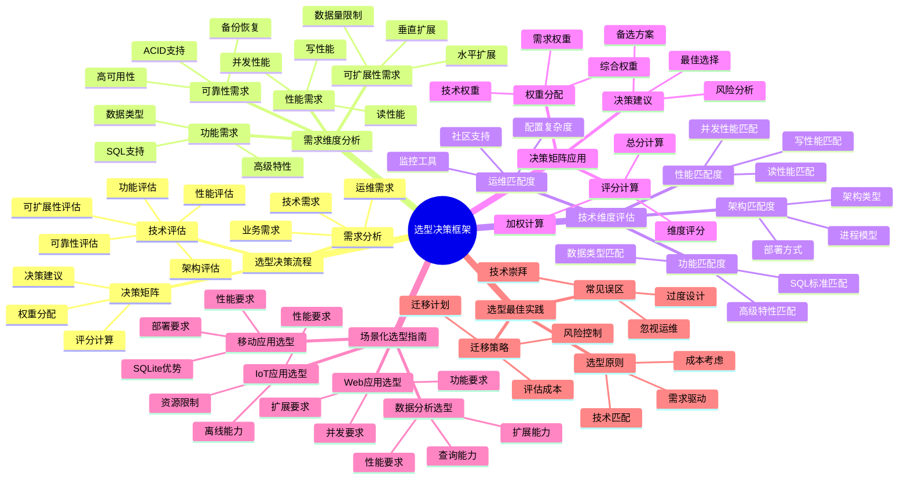

# 选型决策框架：系统化技术选型方法

> **创建日期**：2025-11-13
> **最后更新**：2025-01-15
> **版本**：SQLite 3.31+ 至 3.47.x

---

## 1. 📋 概述

本文档提供系统化的数据库选型决策框架，帮助开发者在SQLite、PostgreSQL、MySQL、MongoDB等数据库之间做出正确的技术选型。

---

## 2. 📑 目录

- [选型决策框架：系统化技术选型方法](#选型决策框架系统化技术选型方法)
  - [1. 📋 概述](#1--概述)
  - [2. 📑 目录](#2--目录)
  - [3. 📊 思维导图](#3--思维导图)
  - [4. 选型决策流程](#4-选型决策流程)
    - [4.1. 需求分析](#41-需求分析)
    - [4.2. 技术评估](#42-技术评估)
    - [4.3. 决策矩阵](#43-决策矩阵)
  - [5. 需求维度分析](#5-需求维度分析)
    - [5.1. 功能需求](#51-功能需求)
    - [5.2. 性能需求](#52-性能需求)
    - [5.3. 可扩展性需求](#53-可扩展性需求)
    - [5.4. 可靠性需求](#54-可靠性需求)
  - [6. 技术维度评估](#6-技术维度评估)
    - [6.1. 架构匹配度](#61-架构匹配度)
    - [6.2. 性能匹配度](#62-性能匹配度)
    - [6.3. 功能匹配度](#63-功能匹配度)
    - [6.4. 运维匹配度](#64-运维匹配度)
  - [7. 决策矩阵应用](#7-决策矩阵应用)
    - [7.1. 权重分配](#71-权重分配)
    - [7.2. 评分计算](#72-评分计算)
    - [7.3. 决策建议](#73-决策建议)
  - [8. 场景化选型指南](#8-场景化选型指南)
    - [8.1. 移动应用选型](#81-移动应用选型)
    - [8.2. Web应用选型](#82-web应用选型)
    - [8.3. IoT应用选型](#83-iot应用选型)
    - [8.4. 数据分析选型](#84-数据分析选型)
  - [9. 选型决策多维对比矩阵](#9-选型决策多维对比矩阵)
    - [9.1. 数据库选型决策矩阵](#91-数据库选型决策矩阵)
    - [9.2. 应用场景选型矩阵](#92-应用场景选型矩阵)
    - [9.3. 选型决策因素权重矩阵](#93-选型决策因素权重矩阵)
  - [10. 选型最佳实践](#10-选型最佳实践)
    - [10.1. 选型原则](#101-选型原则)
    - [10.2. 常见误区](#102-常见误区)
    - [10.3. 迁移策略](#103-迁移策略)
  - [11. 🔗 相关资源](#11--相关资源)
  - [12. 🔗 交叉引用](#12--交叉引用)
    - [12.1. 理论模型 🆕](#121-理论模型-)
    - [12.2. 设计模型 🆕](#122-设计模型-)
  - [13. 📚 参考资料](#13--参考资料)

---

## 3. 📊 思维导图



---

## 4. 选型决策流程

### 4.1. 需求分析

**需求分析步骤**：

1. **业务需求分析**
   - 应用类型（移动、Web、IoT等）
   - 用户规模（单用户、多用户、大规模）
   - 数据特征（结构化、半结构化、非结构化）

2. **技术需求分析**
   - 性能要求（读性能、写性能、并发性能）
   - 可扩展性要求（水平扩展、垂直扩展）
   - 可靠性要求（ACID、高可用性、备份恢复）

3. **运维需求分析**
   - 部署复杂度
   - 监控需求
   - 维护成本

### 4.2. 技术评估

**技术评估维度**：

| 维度 | 评估内容 | 权重 |
|------|---------|------|
| **架构** | 架构类型、部署方式 | 20% |
| **性能** | 读性能、写性能、并发性能 | 30% |
| **功能** | SQL支持、数据类型、高级特性 | 20% |
| **可扩展性** | 水平扩展、垂直扩展 | 15% |
| **可靠性** | ACID、高可用性 | 15% |

### 4.3. 决策矩阵

**决策矩阵模板**：

| 评估维度 | 权重 | SQLite | PostgreSQL | MySQL | MongoDB |
|---------|------|--------|-----------|-------|---------|
| 架构匹配度 | 20% | 评分 | 评分 | 评分 | 评分 |
| 性能匹配度 | 30% | 评分 | 评分 | 评分 | 评分 |
| 功能匹配度 | 20% | 评分 | 评分 | 评分 | 评分 |
| 可扩展性 | 15% | 评分 | 评分 | 评分 | 评分 |
| 可靠性 | 15% | 评分 | 评分 | 评分 | 评分 |
| **总分** | 100% | **总分** | **总分** | **总分** | **总分** |

---

## 5. 需求维度分析

### 5.1. 功能需求

**功能需求清单**：

- [ ] SQL标准支持（SQL-92、SQL:2016、SQL:2023）
- [ ] 数据类型支持（基础类型、JSON、数组）
- [ ] 高级特性（窗口函数、CTE、全文搜索）
- [ ] 触发器支持
- [ ] 存储过程支持
- [ ] 外键约束支持

**需求匹配度**：

| 数据库 | 功能匹配度 | 说明 |
|--------|-----------|------|
| SQLite | ⭐⭐⭐⭐ | 核心功能完整，部分高级特性 |
| PostgreSQL | ⭐⭐⭐⭐⭐ | 功能最全面 |
| MySQL | ⭐⭐⭐⭐ | 功能完整 |
| MongoDB | ⭐⭐⭐ | 非SQL数据库 |

### 5.2. 性能需求

**性能需求清单**：

- [ ] 读性能要求（QPS、延迟）
- [ ] 写性能要求（TPS、延迟）
- [ ] 并发性能要求（并发连接数、并发写）
- [ ] 查询复杂度（简单查询、复杂查询）

**需求匹配度**：

| 场景 | SQLite | PostgreSQL | MySQL | MongoDB |
|------|--------|-----------|-------|---------|
| 简单查询（高QPS） | ⭐⭐⭐⭐⭐ | ⭐⭐⭐⭐ | ⭐⭐⭐⭐ | ⭐⭐⭐⭐ |
| 复杂查询 | ⭐⭐⭐ | ⭐⭐⭐⭐⭐ | ⭐⭐⭐⭐ | ⭐⭐⭐ |
| 高并发写 | ⭐⭐ | ⭐⭐⭐⭐⭐ | ⭐⭐⭐⭐⭐ | ⭐⭐⭐⭐⭐ |

### 5.3. 可扩展性需求

**可扩展性需求清单**：

- [ ] 数据量规模（GB、TB、PB）
- [ ] 水平扩展需求（分片、分布式）
- [ ] 垂直扩展需求（单机性能）
- [ ] 增长预期（短期、长期）

**需求匹配度**：

| 数据量 | SQLite | PostgreSQL | MySQL | MongoDB |
|--------|--------|-----------|-------|---------|
| < 10GB | ⭐⭐⭐⭐⭐ | ⭐⭐⭐⭐⭐ | ⭐⭐⭐⭐⭐ | ⭐⭐⭐⭐⭐ |
| 10GB - 100GB | ⭐⭐⭐⭐ | ⭐⭐⭐⭐⭐ | ⭐⭐⭐⭐⭐ | ⭐⭐⭐⭐⭐ |
| 100GB - 1TB | ⭐⭐⭐ | ⭐⭐⭐⭐⭐ | ⭐⭐⭐⭐⭐ | ⭐⭐⭐⭐⭐ |
| > 1TB | ⭐⭐ | ⭐⭐⭐⭐⭐ | ⭐⭐⭐⭐⭐ | ⭐⭐⭐⭐⭐ |

### 5.4. 可靠性需求

**可靠性需求清单**：

- [ ] ACID要求（强一致性、最终一致性）
- [ ] 高可用性要求（99.9%、99.99%、99.999%）
- [ ] 备份恢复要求（RTO、RPO）
- [ ] 数据安全要求（加密、审计）

**需求匹配度**：

| 可靠性要求 | SQLite | PostgreSQL | MySQL | MongoDB |
|-----------|--------|-----------|-------|---------|
| ACID支持 | ⭐⭐⭐⭐⭐ | ⭐⭐⭐⭐⭐ | ⭐⭐⭐⭐⭐ | ⭐⭐⭐ |
| 高可用性 | ⭐⭐ | ⭐⭐⭐⭐⭐ | ⭐⭐⭐⭐⭐ | ⭐⭐⭐⭐⭐ |
| 备份恢复 | ⭐⭐⭐⭐ | ⭐⭐⭐⭐⭐ | ⭐⭐⭐⭐⭐ | ⭐⭐⭐⭐⭐ |

---

## 6. 技术维度评估

### 6.1. 架构匹配度

**架构匹配度评估**：

| 应用架构 | SQLite | PostgreSQL | MySQL | MongoDB |
|---------|--------|-----------|-------|---------|
| 单机应用 | ⭐⭐⭐⭐⭐ | ⭐⭐ | ⭐⭐ | ⭐⭐ |
| 客户端-服务器 | ⭐⭐ | ⭐⭐⭐⭐⭐ | ⭐⭐⭐⭐⭐ | ⭐⭐⭐⭐⭐ |
| 微服务架构 | ⭐⭐ | ⭐⭐⭐⭐⭐ | ⭐⭐⭐⭐⭐ | ⭐⭐⭐⭐⭐ |
| 分布式架构 | ⭐ | ⭐⭐⭐⭐ | ⭐⭐⭐⭐ | ⭐⭐⭐⭐⭐ |

### 6.2. 性能匹配度

**性能匹配度评估**：

| 性能场景 | SQLite | PostgreSQL | MySQL | MongoDB |
|---------|--------|-----------|-------|---------|
| 读密集型 | ⭐⭐⭐⭐⭐ | ⭐⭐⭐⭐ | ⭐⭐⭐⭐ | ⭐⭐⭐⭐ |
| 写密集型 | ⭐⭐ | ⭐⭐⭐⭐⭐ | ⭐⭐⭐⭐⭐ | ⭐⭐⭐⭐⭐ |
| 混合负载 | ⭐⭐⭐ | ⭐⭐⭐⭐⭐ | ⭐⭐⭐⭐⭐ | ⭐⭐⭐⭐⭐ |

### 6.3. 功能匹配度

**功能匹配度评估**：

| 功能需求 | SQLite | PostgreSQL | MySQL | MongoDB |
|---------|--------|-----------|-------|---------|
| SQL标准 | ⭐⭐⭐⭐ | ⭐⭐⭐⭐⭐ | ⭐⭐⭐⭐ | N/A |
| JSON支持 | ⭐⭐⭐⭐ | ⭐⭐⭐⭐⭐ | ⭐⭐⭐⭐ | ⭐⭐⭐⭐⭐ |
| 全文搜索 | ⭐⭐⭐⭐ | ⭐⭐⭐⭐⭐ | ⭐⭐⭐⭐ | ⭐⭐⭐⭐⭐ |
| 复杂查询 | ⭐⭐⭐ | ⭐⭐⭐⭐⭐ | ⭐⭐⭐⭐ | ⭐⭐⭐ |

### 6.4. 运维匹配度

**运维匹配度评估**：

| 运维需求 | SQLite | PostgreSQL | MySQL | MongoDB |
|---------|--------|-----------|-------|---------|
| 零配置 | ⭐⭐⭐⭐⭐ | ⭐⭐ | ⭐⭐ | ⭐⭐ |
| 监控工具 | ⭐⭐ | ⭐⭐⭐⭐⭐ | ⭐⭐⭐⭐⭐ | ⭐⭐⭐⭐⭐ |
| 社区支持 | ⭐⭐⭐⭐ | ⭐⭐⭐⭐⭐ | ⭐⭐⭐⭐⭐ | ⭐⭐⭐⭐⭐ |

---

## 7. 决策矩阵应用

### 7.1. 权重分配

**权重分配原则**：

1. **性能需求优先**：如果性能是关键，权重30%
2. **功能需求次之**：如果功能是关键，权重20%
3. **架构匹配**：如果架构是关键，权重20%
4. **可扩展性**：如果扩展是关键，权重15%
5. **可靠性**：如果可靠性是关键，权重15%

**示例权重分配**（移动应用）：

| 维度 | 权重 | 理由 |
|------|------|------|
| 架构匹配度 | 30% | 单机应用，架构匹配最重要 |
| 性能匹配度 | 25% | 读性能重要，写性能次要 |
| 功能匹配度 | 20% | 基础功能即可 |
| 可扩展性 | 10% | 单用户数据，扩展需求低 |
| 可靠性 | 15% | ACID重要，高可用次要 |

### 7.2. 评分计算

**评分标准**（1-5分）：

- 5分：完全匹配，最优选择
- 4分：良好匹配，推荐选择
- 3分：基本匹配，可接受
- 2分：部分匹配，不推荐
- 1分：不匹配，不适合

**示例评分**（移动应用场景）：

| 维度 | 权重 | SQLite | PostgreSQL | MySQL | MongoDB |
|------|------|--------|-----------|-------|---------|
| 架构匹配度 | 30% | 5×30%=1.5 | 2×30%=0.6 | 2×30%=0.6 | 2×30%=0.6 |
| 性能匹配度 | 25% | 5×25%=1.25 | 4×25%=1.0 | 4×25%=1.0 | 4×25%=1.0 |
| 功能匹配度 | 20% | 4×20%=0.8 | 5×20%=1.0 | 4×20%=0.8 | 3×20%=0.6 |
| 可扩展性 | 10% | 4×10%=0.4 | 5×10%=0.5 | 5×10%=0.5 | 5×10%=0.5 |
| 可靠性 | 15% | 4×15%=0.6 | 5×15%=0.75 | 5×15%=0.75 | 4×15%=0.6 |
| **总分** | 100% | **4.55** | **3.85** | **3.65** | **3.3** |

**决策**：SQLite得分最高（4.55），推荐选择SQLite。

### 7.3. 决策建议

**决策建议流程**：

1. **计算总分**：根据权重和评分计算总分
2. **排序比较**：按总分排序，选择最高分
3. **风险评估**：评估选择的风险和限制
4. **最终决策**：综合考虑后做出最终决策

---

## 8. 场景化选型指南

### 8.1. 移动应用选型

**需求特征**：

- 单用户数据
- 离线优先
- 零配置
- 读多写少

**选型建议**：

| 数据库 | 得分 | 推荐度 |
|--------|------|--------|
| SQLite | 4.5+ | ⭐⭐⭐⭐⭐（强烈推荐） |
| PostgreSQL | 3.5 | ⭐⭐（不推荐） |
| MySQL | 3.5 | ⭐⭐（不推荐） |
| MongoDB | 3.0 | ⭐（不推荐） |

### 8.2. Web应用选型

**需求特征**：

- 多用户
- 网络访问
- 高并发
- 可扩展

**选型建议**：

| 数据库 | 得分 | 推荐度 |
|--------|------|--------|
| SQLite | 2.5 | ⭐（不推荐） |
| PostgreSQL | 4.5+ | ⭐⭐⭐⭐⭐（强烈推荐） |
| MySQL | 4.5+ | ⭐⭐⭐⭐⭐（强烈推荐） |
| MongoDB | 4.0 | ⭐⭐⭐⭐（推荐） |

### 8.3. IoT应用选型

**需求特征**：

- 资源受限
- 离线优先
- 单设备数据
- 轻量级

**选型建议**：

| 数据库 | 得分 | 推荐度 |
|--------|------|--------|
| SQLite | 4.5+ | ⭐⭐⭐⭐⭐（强烈推荐） |
| PostgreSQL | 2.0 | ⭐（不推荐） |
| MySQL | 2.0 | ⭐（不推荐） |
| MongoDB | 2.5 | ⭐（不推荐） |

### 8.4. 数据分析选型

**需求特征**：

- 复杂查询
- 大规模数据
- 并行查询
- 分析功能

**选型建议**：

| 数据库 | 得分 | 推荐度 |
|--------|------|--------|
| SQLite | 2.5 | ⭐（不推荐） |
| PostgreSQL | 4.5+ | ⭐⭐⭐⭐⭐（强烈推荐） |
| MySQL | 4.0 | ⭐⭐⭐⭐（推荐） |
| MongoDB | 3.5 | ⭐⭐⭐（可接受） |

---

## 9. 选型决策多维对比矩阵

### 9.1. 数据库选型决策矩阵

| 维度 | SQLite | PostgreSQL | MySQL | MongoDB |
|------|--------|-----------|-------|---------|
| **架构类型** | 嵌入式 | C/S | C/S | C/S |
| **部署复杂度** | ⭐⭐⭐⭐⭐ | ⭐⭐⭐ | ⭐⭐⭐ | ⭐⭐⭐ |
| **性能（读）** | ⭐⭐⭐⭐⭐ | ⭐⭐⭐⭐ | ⭐⭐⭐⭐ | ⭐⭐⭐ |
| **性能（写）** | ⭐⭐⭐ | ⭐⭐⭐⭐⭐ | ⭐⭐⭐⭐⭐ | ⭐⭐⭐⭐ |
| **并发支持** | ⭐⭐⭐ | ⭐⭐⭐⭐⭐ | ⭐⭐⭐⭐⭐ | ⭐⭐⭐⭐⭐ |
| **数据量支持** | ⭐⭐⭐ | ⭐⭐⭐⭐⭐ | ⭐⭐⭐⭐⭐ | ⭐⭐⭐⭐⭐ |
| **SQL标准** | ⭐⭐⭐⭐ | ⭐⭐⭐⭐⭐ | ⭐⭐⭐⭐ | N/A |
| **适用场景** | 嵌入式/单机 | 企业应用 | Web应用 | 文档存储 |
| **推荐度** | 嵌入式场景 | ⭐⭐⭐⭐⭐推荐 | ⭐⭐⭐⭐推荐 | 文档场景 |

### 9.2. 应用场景选型矩阵

| 维度 | 移动应用 | Web应用 | IoT应用 | 数据分析 |
|------|---------|---------|---------|---------|
| **SQLite** | ⭐⭐⭐⭐⭐推荐 | ⭐⭐⭐ | ⭐⭐⭐⭐⭐推荐 | ⭐⭐⭐ |
| **PostgreSQL** | ⭐⭐ | ⭐⭐⭐⭐⭐推荐 | ⭐⭐⭐ | ⭐⭐⭐⭐⭐推荐 |
| **MySQL** | ⭐⭐ | ⭐⭐⭐⭐推荐 | ⭐⭐⭐ | ⭐⭐⭐⭐ |
| **MongoDB** | ⭐⭐ | ⭐⭐⭐ | ⭐⭐⭐ | ⭐⭐⭐⭐ |
| **选型理由** | 零配置、轻量 | 高并发、网络访问 | 嵌入式、低功耗 | 复杂查询、分析 |

### 9.3. 选型决策因素权重矩阵

| 决策因素 | 移动应用 | Web应用 | IoT应用 | 数据分析 |
|---------|---------|---------|---------|---------|
| **性能** | 30% | 25% | 35% | 20% |
| **可扩展性** | 10% | 30% | 15% | 25% |
| **易用性** | 35% | 15% | 30% | 10% |
| **可靠性** | 15% | 20% | 15% | 25% |
| **成本** | 10% | 10% | 10% | 20% |

## 10. 选型最佳实践

### 10.1. 选型原则

1. **需求驱动**：根据实际需求选择，不要过度设计
2. **简单优先**：能简单解决就不要复杂
3. **性能平衡**：平衡性能、功能、复杂度
4. **可扩展性**：考虑未来增长需求
5. **团队能力**：考虑团队技术栈和经验

### 10.2. 常见误区

**误区1**：过度追求性能

- **问题**：选择复杂数据库，增加运维成本
- **解决**：根据实际需求选择，简单场景用SQLite

**误区2**：忽略架构匹配

- **问题**：单机应用选择C/S架构数据库
- **解决**：根据应用架构选择匹配的数据库

**误区3**：不考虑迁移成本

- **问题**：选择后难以迁移
- **解决**：考虑未来迁移可能性，选择标准SQL数据库

### 10.3. 迁移策略

**从SQLite迁移到PostgreSQL/MySQL**：

1. **数据导出**：使用`.dump`导出SQL
2. **模式转换**：调整SQL语法差异
3. **数据导入**：导入到目标数据库
4. **应用适配**：调整应用代码

**迁移工具**：

```bash
# SQLite导出
sqlite3 app.db .dump > app.sql

# PostgreSQL导入（需要调整语法）
psql -d app_db -f app.sql
```

---

## 11. 🔗 相关资源

- [05.01 多维知识矩阵](./05.01-多维知识矩阵.md)
- [04.01 适用场景分析](../04-应用场景/04.01-适用场景分析.md)
- [04.02 不适用场景论证](../04-应用场景/04.02-不适用场景论证.md)

---

## 12. 🔗 交叉引用

### 12.1. 理论模型 🆕

- ⭐⭐ [系统理论模型](../11-理论模型/11.01-系统理论模型.md) - 系统选型理论
- ⭐ [算法复杂度理论](../11-理论模型/11.03-算法复杂度理论.md) - 性能选型分析

### 12.2. 设计模型 🆕

- ⭐⭐⭐ [设计决策](../12-设计模型/12.04-设计决策.md) - 选型决策框架、架构选型决策
- ⭐⭐ [架构设计模型](../12-设计模型/12.01-架构设计模型.md) - 架构选型分析（含交叉引用）

### 12.3. 对比选型文档 🆕

- ⭐⭐⭐ [多维知识矩阵](./05.01-多维知识矩阵.md) - 数据库对比分析（含交叉引用）
- ⭐⭐ [技术决策树完整集](./05.03-SQLite技术决策树完整集.md) - 技术决策树

### 12.4. 应用场景文档 🆕

- ⭐⭐⭐ [适用场景分析](../04-应用场景/04.01-适用场景分析.md) - 适用场景分析（含交叉引用）
- ⭐⭐ [不适用场景论证](../04-应用场景/04.02-不适用场景论证.md) - 不适用场景论证

### 12.5. 知识图谱与导航 🆕

- ⭐⭐⭐ [知识图谱与概念关系网络](../09-最新特性/09.03-SQLite知识图谱与概念关系网络.md) - 选型决策概念关系（400+概念）
- ⭐⭐ [文档依赖关系图](../00-项目导航/06-文档依赖关系图.md) - 选型决策文档依赖
- ⭐⭐ [术语标准化词典](../00-项目导航/03-术语词典/SQLite术语标准化词典.md) - 选型决策术语索引

### 12.6. 相关概念链接 🆕

#### 12.6.1. 选型决策概念

- **选型决策框架** → [选型决策框架](./05.02-选型决策框架.md)
- **技术决策树** → [技术决策树完整集](./05.03-SQLite技术决策树完整集.md)
- **数据库对比** → [知识图谱：数据库对比概念](../09-最新特性/09.03-SQLite知识图谱与概念关系网络.md#应用场景本体)

---

## 13. 📚 参考资料

- [SQLite适用场景](https://www.sqlite.org/whentouse.html)
- [数据库选型指南](https://www.sqlite.org/whentouse.html)
- [技术选型最佳实践](https://www.sqlite.org/whentouse.html)

---

**最后更新**：2025-01-15
**维护者**：Data-Science Team
