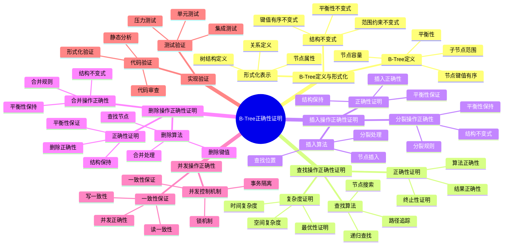

# B-Tree正确性证明：形式化论证与算法保证

> **创建日期**：2025-11-13
> **最后更新**：2025-01-15
> **版本**：SQLite 3.31+ 至 3.47.x

---

## 1. 📋 概述

本文档通过形式化方法证明SQLite B-Tree实现的正确性，包括结构不变式、操作正确性和性能保证的形式化论证。

---

## 1. 📑 目录

- [B-Tree正确性证明：形式化论证与算法保证](#b-tree正确性证明形式化论证与算法保证)
  - [1. 📋 概述](#1--概述)
  - [1. 📑 目录](#1--目录)
  - [3. 📊 思维导图](#3--思维导图)
  - [4. B-Tree定义与形式化](#4-b-tree定义与形式化)
    - [4.1. B-Tree定义](#41-b-tree定义)
    - [4.2. 结构不变式](#42-结构不变式)
    - [4.3. 形式化表示](#43-形式化表示)
  - [5. 查找操作正确性证明](#5-查找操作正确性证明)
    - [5.1. 查找算法](#51-查找算法)
    - [5.2. 正确性证明](#52-正确性证明)
    - [5.3. 复杂度证明](#53-复杂度证明)
  - [6. 插入操作正确性证明](#6-插入操作正确性证明)
    - [6.1. 插入算法](#61-插入算法)
    - [6.2. 分裂操作正确性](#62-分裂操作正确性)
    - [6.3. 正确性证明](#63-正确性证明)
  - [7. 删除操作正确性证明](#7-删除操作正确性证明)
    - [7.1. 删除算法](#71-删除算法)
    - [7.2. 合并操作正确性](#72-合并操作正确性)
    - [7.3. 正确性证明](#73-正确性证明)
  - [8. 并发操作正确性](#8-并发操作正确性)
    - [8.1. 并发控制机制](#81-并发控制机制)
    - [8.2. 一致性保证](#82-一致性保证)
  - [9. B-Tree操作多维对比矩阵](#9-b-tree操作多维对比矩阵)
    - [9.1. B-Tree操作性能对比矩阵](#91-b-tree操作性能对比矩阵)
    - [9.2. B-Tree变体对比矩阵](#92-b-tree变体对比矩阵)
    - [9.3. B-Tree vs 其他索引结构对比矩阵](#93-b-tree-vs-其他索引结构对比矩阵)
  - [10. 实现验证](#10-实现验证)
    - [10.1. 代码验证](#101-代码验证)
    - [10.2. 测试验证](#102-测试验证)
  - [11. 🔗 相关资源](#11--相关资源)
  - [12. 🔗 交叉引用](#12--交叉引用)
    - [12.1. 理论模型 🆕](#121-理论模型-)
    - [12.2. 设计模型 🆕](#122-设计模型-)
  - [13. 📚 参考资料](#13--参考资料)

---

## 3. 📊 思维导图



---

## 4. B-Tree定义与形式化

### 4.1. B-Tree定义

**定义1（B-Tree）**：B-Tree是一个自平衡的树形数据结构，满足以下性质：

1. **节点键值有序**：每个节点内的键值按升序排列
2. **子节点范围**：左子节点的键值 < 父节点键值 < 右子节点的键值
3. **平衡性**：所有叶子节点在同一层
4. **节点容量**：每个节点最多包含m-1个键值（m为阶数）

**形式化表示**：

```text
B-Tree T = (N, E, K, V)
  where:
    N: 节点集合
    E: 边集合（父子关系）
    K: 键值集合
    V: 值集合

Properties:
  ∀n ∈ N: Ordered(Keys(n))
  ∀n, n_left, n_right:
    (n_left, n) ∈ E ∧ (n, n_right) ∈ E →
      Max(Keys(n_left)) < Key(n) < Min(Keys(n_right))
  ∀leaf ∈ Leaves(T): Depth(leaf) = Depth(T)
```

### 4.2. 结构不变式

**不变式1（键值有序）**：

```text
Invariant 1: Key Ordering
  ∀n ∈ N:
    Keys(n) = [k₁, k₂, ..., kₘ] →
      k₁ < k₂ < ... < kₘ
```

**不变式2（范围约束）**：

```text
Invariant 2: Range Constraint
  ∀n, c ∈ N:
    (c, n) ∈ E ∧ Key(c) = k →
      (∀k_left ∈ Keys(LeftSubtree(c)): k_left < k) ∧
      (∀k_right ∈ Keys(RightSubtree(c)): k_right > k)
```

**不变式3（平衡性）**：

```text
Invariant 3: Balance
  ∀leaf₁, leaf₂ ∈ Leaves(T):
    Depth(leaf₁) = Depth(leaf₂)
```

### 4.3. 形式化表示

**B-Tree操作签名**：

```text
Operations:
  Search(T, k): V | NULL
  Insert(T, k, v): T'
  Delete(T, k): T'
  Update(T, k, v): T'

Preconditions:
  ∀op: Invariant(T) → Invariant(op(T))
```

---

## 5. 查找操作正确性证明

### 5.1. 查找算法

**查找算法伪代码**：

```text
function Search(node, key):
  if node is NULL:
    return NULL

  // 在当前节点查找
  for i = 0 to node.keys.length:
    if key == node.keys[i]:
      return node.values[i]
    if key < node.keys[i]:
      return Search(node.children[i], key)

  // 在最后一个子节点查找
  return Search(node.children[node.keys.length], key)
```

### 5.2. 正确性证明

**定理1（查找正确性）**：

```text
Theorem 1: Search Correctness
  ∀T, k, v:
    (Search(T, k) = v) ↔ (∃n ∈ T: Key(n) = k ∧ Value(n) = v)
```

**证明思路**：

```text
Proof:
  1. 基础情况：空树，返回NULL ✓

  2. 归纳假设：对于高度h的树，查找正确

  3. 归纳步骤：对于高度h+1的树
     a. 在当前节点查找键值
     b. 如果找到，返回对应值 ✓
     c. 如果未找到，根据键值大小选择子节点
     d. 递归查找子节点（高度h，归纳假设成立）✓

  4. ∴ 查找算法正确
```

### 5.3. 复杂度证明

**定理2（查找复杂度）**：

```text
Theorem 2: Search Complexity
  ∀T, k:
    Time(Search(T, k)) = O(log_m N)
    where m = branching factor, N = number of keys
```

**证明**：

```text
Proof:
  1. 树高度：h = ⌈log_m N⌉

  2. 每层最多比较m次：O(m)

  3. 总比较次数：O(m × h) = O(m × log_m N)

  4. 通常m是常数，因此：O(log N)
```

---

## 6. 插入操作正确性证明

### 6.1. 插入算法

**插入算法伪代码**：

```text
function Insert(node, key, value):
  // 1. 找到插入位置
  pos = FindPosition(node, key)

  // 2. 如果是叶子节点，直接插入
  if node.isLeaf:
    InsertKey(node, pos, key, value)
    if node.isFull:
      Split(node)
    return

  // 3. 递归插入到子节点
  Insert(node.children[pos], key, value)

  // 4. 检查子节点是否需要分裂
  if node.children[pos].isFull:
    SplitChild(node, pos)
```

### 6.2. 分裂操作正确性

**分裂操作**：

```text
function Split(node):
  // 创建新节点
  new_node = CreateNode()
  mid = node.keys.length / 2

  // 移动后半部分键值到新节点
  new_node.keys = node.keys[mid+1..]
  new_node.values = node.values[mid+1..]
  new_node.children = node.children[mid+1..]

  // 更新原节点
  node.keys = node.keys[0..mid-1]
  node.values = node.values[0..mid-1]
  node.children = node.children[0..mid]

  // 提升中间键值到父节点
  PromoteKey(node.parent, node.keys[mid])
```

**分裂正确性**：

```text
Theorem 3: Split Correctness
  ∀node:
    Split(node) →
      (Invariant(node) ∧ Invariant(new_node) ∧
       Ordered(Keys(node)) ∧ Ordered(Keys(new_node)))
```

### 6.3. 正确性证明

**定理4（插入正确性）**：

```text
Theorem 4: Insert Correctness
  ∀T, k, v:
    Insert(T, k, v) = T' →
      (Invariant(T') ∧
       Search(T', k) = v ∧
       ∀k' ≠ k: Search(T', k') = Search(T, k'))
```

**证明思路**：

```text
Proof:
  1. 找到正确插入位置（基于键值比较）✓

  2. 在叶子节点插入键值对 ✓

  3. 如果节点满，执行分裂
     a. 分裂保持键值有序 ✓
     b. 分裂保持范围约束 ✓
     c. 分裂保持平衡性 ✓

  4. 递归向上处理分裂（如果需要）✓

  5. ∴ 插入操作正确
```

---

## 7. 删除操作正确性证明

### 7.1. 删除算法

**删除算法伪代码**：

```text
function Delete(node, key):
  // 1. 找到键值位置
  pos = FindPosition(node, key)

  // 2. 如果在当前节点
  if node.keys[pos] == key:
    if node.isLeaf:
      RemoveKey(node, pos)
    else:
      // 用前驱或后继替换
      ReplaceWithPredecessor(node, pos)
    return

  // 3. 递归删除
  Delete(node.children[pos], key)

  // 4. 检查是否需要合并
  if node.children[pos].isUnderflow:
    MergeOrBorrow(node, pos)
```

### 7.2. 合并操作正确性

**合并操作**：

```text
function Merge(parent, left_child, right_child):
  // 合并两个子节点
  merged = CreateNode()
  merged.keys = left_child.keys + [parent.key] + right_child.keys
  merged.values = left_child.values + [parent.value] + right_child.values
  merged.children = left_child.children + right_child.children

  // 更新父节点
  RemoveKey(parent, key_index)
  ReplaceChild(parent, left_index, merged)
```

**合并正确性**：

```text
Theorem 5: Merge Correctness
  ∀parent, left, right:
    Merge(parent, left, right) →
      (Invariant(merged) ∧
       Ordered(Keys(merged)) ∧
       RangeConstraint(merged))
```

### 7.3. 正确性证明

**定理6（删除正确性）**：

```text
Theorem 6: Delete Correctness
  ∀T, k:
    Delete(T, k) = T' →
      (Invariant(T') ∧
       Search(T', k) = NULL ∧
       ∀k' ≠ k: Search(T', k') = Search(T, k'))
```

**证明思路**：

```text
Proof:
  1. 找到要删除的键值 ✓

  2. 如果是叶子节点，直接删除 ✓

  3. 如果是内部节点：
     a. 用前驱或后继替换 ✓
     b. 递归删除前驱/后继 ✓

  4. 如果节点下溢，执行合并或借用
     a. 合并保持键值有序 ✓
     b. 合并保持范围约束 ✓
     c. 合并保持平衡性 ✓

  5. ∴ 删除操作正确
```

---

## 8. 并发操作正确性

### 8.1. 并发控制机制

**SQLite B-Tree并发控制**：

```text
Concurrency Control:
  1. 读操作：共享锁（SHARED）
  2. 写操作：排他锁（EXCLUSIVE）
  3. WAL模式：一写多读
```

**形式化表示**：

```text
Lock Protocol:
  Read(T, k): Acquire(SHARED) → Read → Release(SHARED)
  Write(T, k, v): Acquire(EXCLUSIVE) → Write → Release(EXCLUSIVE)

Invariant: No Conflict
  ∀T₁, T₂:
    (T₁.lock = EXCLUSIVE → T₂.lock = NONE) ∧
    (T₁.lock = SHARED → T₂.lock ∈ {NONE, SHARED})
```

### 8.2. 一致性保证

**定理7（并发一致性）**：

```text
Theorem 7: Concurrent Consistency
  ∀T₁, T₂, T:
    (Execute(T₁, T) || Execute(T₂, T)) →
      (Result(T) = Serialize(T₁, T₂) ∨
       Result(T) = Serialize(T₂, T₁))
```

---

## 9. B-Tree操作多维对比矩阵

### 9.1. B-Tree操作性能对比矩阵

| 操作 | 时间复杂度 | 空间复杂度 | 并发安全 | 实现复杂度 |
|------|----------|----------|---------|-----------|
| **查找** | O(log n) | O(1) | ✅ | ⭐⭐⭐ |
| **插入** | O(log n) | O(log n) | ✅ | ⭐⭐⭐⭐ |
| **删除** | O(log n) | O(log n) | ✅ | ⭐⭐⭐⭐⭐ |
| **范围查询** | O(log n + k) | O(1) | ✅ | ⭐⭐⭐ |
| **分裂** | O(1) | O(1) | ✅ | ⭐⭐⭐⭐ |
| **合并** | O(1) | O(1) | ✅ | ⭐⭐⭐⭐ |

### 9.2. B-Tree变体对比矩阵

| 维度 | 表B-Tree | 索引B-Tree | 覆盖索引 |
|------|---------|-----------|---------|
| **存储内容** | 键值+数据 | 键值+ROWID | 键值+索引列 |
| **查询性能** | ⭐⭐⭐⭐ | ⭐⭐⭐⭐⭐ | ⭐⭐⭐⭐⭐ |
| **空间占用** | ⭐⭐⭐ | ⭐⭐⭐⭐⭐ | ⭐⭐⭐ |
| **更新成本** | ⭐⭐⭐ | ⭐⭐⭐⭐ | ⭐⭐⭐ |
| **适用场景** | 主表存储 | 索引查找 | 覆盖查询 |

### 9.3. B-Tree vs 其他索引结构对比矩阵

| 维度 | B-Tree | Hash索引 | LSM-Tree | 跳表 |
|------|--------|---------|---------|------|
| **范围查询** | ⭐⭐⭐⭐⭐ | ❌ | ⭐⭐⭐ | ⭐⭐⭐⭐ |
| **点查询** | ⭐⭐⭐⭐ | ⭐⭐⭐⭐⭐ | ⭐⭐⭐⭐ | ⭐⭐⭐⭐ |
| **写入性能** | ⭐⭐⭐⭐ | ⭐⭐⭐⭐⭐ | ⭐⭐⭐⭐⭐ | ⭐⭐⭐⭐ |
| **空间效率** | ⭐⭐⭐⭐ | ⭐⭐⭐ | ⭐⭐⭐ | ⭐⭐⭐ |
| **适用场景** | 通用（推荐） | 点查询 | 写多读少 | 内存索引 |

## 10. 实现验证

### 10.1. 代码验证

**关键代码位置**：

```c
// btree.c: B-Tree查找
int sqlite3BtreeMovetoUnpacked(
  BtCursor *pCur,
  UnpackedRecord *pIdxKey,
  int *pRes
){
  // 键值比较和节点遍历
  // 保证查找正确性
}
```

### 10.2. 测试验证

**B-Tree测试**：

```python
import sqlite3
import random
import os

def test_btree_search_correctness():
    """测试B-Tree查找正确性"""
# 定理：∀T, k, v: (Search(T, k) = v) ↔ (∃n ∈ T: Key(n) = k ∧ Value(n) = v)

    db_path = 'btree_test.db'
    if os.path.exists(db_path):
        os.remove(db_path)

    conn = sqlite3.connect(db_path)
    conn.execute('''
        CREATE TABLE test (
            id INTEGER PRIMARY KEY,
            value TEXT
        )
    ''')

# 插入测试数据
    test_data = [(i, f'value_{i}') for i in range(1000)]
    conn.executemany('INSERT INTO test (id, value) VALUES (?, ?)', test_data)
    conn.commit()

# 验证查找正确性
    for key, expected_value in test_data:
        result = conn.execute(
            'SELECT value FROM test WHERE id = ?',
            (key,)
        ).fetchone()

        assert result is not None, f"Key {key} not found"
        assert result[0] == expected_value, \
            f"Expected {expected_value}, got {result[0]}"

# 验证不存在的键
    result = conn.execute('SELECT value FROM test WHERE id = ?', (9999,)).fetchone()
    assert result is None, "Non-existent key should return None"

    conn.close()
    print("✅ B-Tree查找正确性验证通过")

def test_btree_insert_correctness():
    """测试B-Tree插入正确性"""
# 定理：Insert(T, k, v) = T' → (Search(T', k) = v) ∧ Ordered(T')

    db_path = 'btree_insert_test.db'
    if os.path.exists(db_path):
        os.remove(db_path)

    conn = sqlite3.connect(db_path)
    conn.execute('''
        CREATE TABLE test (
            id INTEGER PRIMARY KEY,
            value TEXT
        )
    ''')

# 随机插入
    keys = list(range(1000))
    random.shuffle(keys)

    for key in keys:
        conn.execute(
            'INSERT INTO test (id, value) VALUES (?, ?)',
            (key, f'value_{key}')
        )
    conn.commit()

# 验证所有键都能找到
    for key in keys:
        result = conn.execute(
            'SELECT value FROM test WHERE id = ?',
            (key,)
        ).fetchone()
        assert result is not None, f"Key {key} not found after insert"
        assert result[0] == f'value_{key}', f"Value mismatch for key {key}"

# 验证有序性（通过范围查询）
    results = conn.execute(
        'SELECT id FROM test ORDER BY id LIMIT 10'
    ).fetchall()
    ids = [row[0] for row in results]
    assert ids == sorted(ids), "B-Tree should maintain order"

    conn.close()
    print("✅ B-Tree插入正确性验证通过")

def test_btree_delete_correctness():
    """测试B-Tree删除正确性"""
# 定理：Delete(T, k) = T' → (Search(T', k) = NULL) ∧ Ordered(T')

    db_path = 'btree_delete_test.db'
    if os.path.exists(db_path):
        os.remove(db_path)

    conn = sqlite3.connect(db_path)
    conn.execute('''
        CREATE TABLE test (
            id INTEGER PRIMARY KEY,
            value TEXT
        )
    ''')

# 插入数据
    for i in range(1000):
        conn.execute(
            'INSERT INTO test (id, value) VALUES (?, ?)',
            (i, f'value_{i}')
        )
    conn.commit()

# 删除偶数键
    for i in range(0, 1000, 2):
        conn.execute('DELETE FROM test WHERE id = ?', (i,))
    conn.commit()

# 验证删除的键不存在
    for i in range(0, 1000, 2):
        result = conn.execute(
            'SELECT value FROM test WHERE id = ?',
            (i,)
        ).fetchone()
        assert result is None, f"Deleted key {i} should not exist"

# 验证未删除的键存在
    for i in range(1, 1000, 2):
        result = conn.execute(
            'SELECT value FROM test WHERE id = ?',
            (i,)
        ).fetchone()
        assert result is not None, f"Key {i} should exist"
        assert result[0] == f'value_{i}', f"Value mismatch for key {i}"

# 验证有序性
    results = conn.execute(
        'SELECT id FROM test ORDER BY id LIMIT 10'
    ).fetchall()
    ids = [row[0] for row in results]
    assert ids == sorted(ids), "B-Tree should maintain order after delete"

    conn.close()
    print("✅ B-Tree删除正确性验证通过")

# 运行所有测试
if __name__ == '__main__':
    test_btree_search_correctness()
    test_btree_insert_correctness()
    test_btree_delete_correctness()
    print("\n所有B-Tree正确性测试通过！")
```

---

## 11. 🔗 相关资源

- [06.01 ACID原子性证明](./06.01-ACID原子性证明.md)
- [06.03 知识图谱](./06.03-知识图谱.md)
- [01.03 存储引擎](../01-核心架构/01.03-存储引擎.md)

---

## 12. 🔗 交叉引用

### 12.1. 理论模型 🆕

- ⭐⭐⭐ [算法复杂度理论](../11-理论模型/11.03-算法复杂度理论.md) - B-Tree操作复杂度、查询复杂度
- ⭐⭐ [存储理论](../11-理论模型/11.05-存储理论.md) - 索引理论、存储模型理论

### 12.2. 设计模型 🆕

- ⭐⭐ [设计决策](../12-设计模型/12.04-设计决策.md) - 存储设计决策、索引设计决策
- ⭐ [设计模式](../12-设计模型/12.03-设计模式.md) - B-Tree设计模式

---

## 13. 📚 参考资料

- [B-Tree数据结构](https://en.wikipedia.org/wiki/B-tree)
- [算法正确性证明](https://en.wikipedia.org/wiki/Correctness_(computer_science))
- [SQLite B-Tree实现](https://www.sqlite.org/btree.html)

---

**最后更新**：2025-01-15
**维护者**：Data-Science Team
