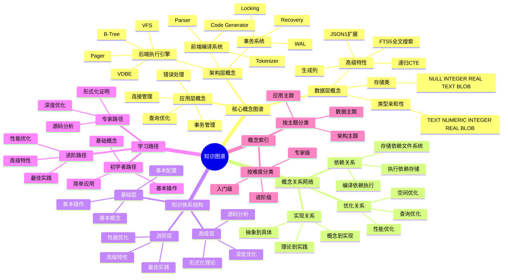

# 知识图谱：SQLite概念关系与知识体系

> **创建日期**：2025-11-13
> **最后更新**：2025-01-15
> **版本**：SQLite 3.31+ 至 3.47.x

---

## 📋 概述

本文档构建SQLite的知识图谱，展示核心概念之间的关系、知识体系结构和学习路径。

---

## 📑 目录

- [知识图谱：SQLite概念关系与知识体系](#知识图谱sqlite概念关系与知识体系)
  - [📋 概述](#-概述)
  - [📑 目录](#-目录)
  - [📊 思维导图](#-思维导图)
  - [一、核心概念图谱](#一核心概念图谱)
    - [1.1 架构层概念](#11-架构层概念)
    - [1.2 数据层概念](#12-数据层概念)
    - [1.3 应用层概念](#13-应用层概念)
  - [二、概念关系网络](#二概念关系网络)
    - [2.1 依赖关系](#21-依赖关系)
    - [2.2 实现关系](#22-实现关系)
    - [2.3 优化关系](#23-优化关系)
  - [三、知识体系结构](#三知识体系结构)
    - [3.1 基础层](#31-基础层)
    - [3.2 进阶层](#32-进阶层)
    - [3.3 高级层](#33-高级层)
  - [四、学习路径](#四学习路径)
    - [4.1 初学者路径](#41-初学者路径)
    - [4.2 进阶路径](#42-进阶路径)
    - [4.3 专家路径](#43-专家路径)
  - [五、知识图谱多维对比矩阵](#五知识图谱多维对比矩阵)
    - [5.1 知识体系层次对比矩阵](#51-知识体系层次对比矩阵)
    - [5.2 学习路径对比矩阵](#52-学习路径对比矩阵)
    - [5.3 概念关系类型对比矩阵](#53-概念关系类型对比矩阵)
  - [六、概念索引](#六概念索引)
    - [6.1 按主题分类](#61-按主题分类)
    - [6.2 按难度分类](#62-按难度分类)
  - [🔗 相关资源](#-相关资源)
  - [🔗 交叉引用](#-交叉引用)
    - [理论模型 🆕](#理论模型-)
    - [设计模型 🆕](#设计模型-)
  - [📚 参考资料](#-参考资料)

---

## 📊 思维导图



---

## 一、核心概念图谱

### 1.1 架构层概念

**架构层核心概念**：

```text
SQLite Architecture
├── Frontend (编译系统)
│   ├── Tokenizer (词法分析)
│   ├── Parser (语法分析)
│   └── Code Generator (代码生成)
│
├── Backend (执行引擎)
│   ├── VDBE (虚拟数据库引擎)
│   ├── B-Tree (存储结构)
│   ├── Pager (页面管理)
│   └── VFS (虚拟文件系统)
│
└── Transaction System
    ├── WAL (预写日志)
    ├── Locking (锁机制)
    └── Recovery (崩溃恢复)
```

**概念关系**：

- Tokenizer → Parser → Code Generator → VDBE
- VDBE → B-Tree → Pager → VFS
- Transaction System → WAL/Locking/Recovery

### 1.2 数据层概念

**数据层核心概念**：

```text
Data Model
├── Storage Classes
│   ├── NULL
│   ├── INTEGER
│   ├── REAL
│   ├── TEXT
│   └── BLOB
│
├── Type Affinity
│   ├── TEXT
│   ├── NUMERIC
│   ├── INTEGER
│   ├── REAL
│   └── BLOB
│
└── Advanced Features
    ├── Generated Columns
    ├── JSON1 Extension
    ├── FTS5 (全文搜索)
    └── Recursive CTE
```

**概念关系**：

- Storage Classes → Type Affinity → Table Design
- Advanced Features → Query Optimization

### 1.3 应用层概念

**应用层核心概念**：

```text
Application Layer
├── Connection Management
│   ├── Single Connection
│   ├── Multi-threading
│   └── Connection Pooling
│
├── Transaction Management
│   ├── BEGIN/COMMIT/ROLLBACK
│   ├── SAVEPOINT
│   └── Batch Operations
│
└── Performance Optimization
    ├── Indexing
    ├── Query Optimization
    └── PRAGMA Configuration
```

---

## 二、概念关系网络

### 2.1 依赖关系

**依赖关系图**：

```text
Dependencies:
  SQL Query
    → Tokenizer
      → Parser
        → Code Generator
          → VDBE
            → B-Tree
              → Pager
                → VFS
                  → Disk

  Transaction
    → WAL/Locking
      → Pager
        → VFS
          → Disk
```

### 2.2 实现关系

**实现关系**：

```text
Implementations:
  ACID Properties
    → Atomicity: Transaction System
    → Consistency: Constraints + Validation
    → Isolation: WAL + Locking
    → Durability: WAL + Fsync

  Performance
    → Zero IPC: Embedded Architecture
    → Fast Reads: Indexing + Caching
    → Fast Writes: WAL + Batch Transactions
```

### 2.3 优化关系

**优化关系**：

```text
Optimizations:
  Query Performance
    → Indexing
      → Covering Index
      → Partial Index
    → Query Rewriting
      → EXPLAIN QUERY PLAN
      → Query Optimization

  Write Performance
    → WAL Mode
    → Batch Transactions
    → PRAGMA Configuration
```

---

## 三、知识体系结构

### 3.1 基础层

**基础层知识**：

| 主题 | 概念 | 文档 |
|------|------|------|
| **基础操作** | CREATE, INSERT, SELECT, UPDATE, DELETE | 08.01-连接管理 |
| **数据类型** | Storage Classes, Type Affinity | 02.01-数据类型系统 |
| **表设计** | 范式化, 索引 | 02.02-表结构设计 |
| **事务基础** | BEGIN, COMMIT, ROLLBACK | 08.02-事务管理 |

### 3.2 进阶层

**进阶层知识**：

| 主题 | 概念 | 文档 |
|------|------|------|
| **架构理解** | Tokenizer, Parser, VDBE, B-Tree | 01.01-编译执行模型 |
| **并发控制** | WAL, Locking, MVCC | 01.02-事务与并发控制 |
| **性能优化** | 索引优化, 查询优化 | 03.02-优化策略 |
| **高级特性** | JSON, FTS5, Generated Columns | 02.03-高级特性 |

### 3.3 高级层

**高级层知识**：

| 主题 | 概念 | 文档 |
|------|------|------|
| **形式化理论** | ACID证明, B-Tree正确性 | 06.01-ACID原子性证明 |
| **源码分析** | 实现细节, 算法分析 | 01.03-存储引擎 |
| **选型决策** | 多维对比, 决策框架 | 05.01-多维知识矩阵 |
| **标准对齐** | SQL标准, 学术对齐 | 07.01-SQL标准对齐 |

---

## 四、学习路径

### 4.1 初学者路径

**学习顺序**：

```text
1. 基础操作 (1-2周)
   → 08.01-连接管理
   → 08.02-事务管理
   → 02.01-数据类型系统

2. 表设计 (1-2周)
   → 02.02-表结构设计
   → 08.03-查询优化

3. 实践应用 (2-3周)
   → 04.01-适用场景分析
   → 04.03-顶级应用案例
```

### 4.2 进阶路径

**学习顺序**：

```text
1. 架构理解 (2-3周)
   → 01.01-编译执行模型
   → 01.02-事务与并发控制
   → 01.03-存储引擎

2. 性能优化 (2-3周)
   → 03.01-性能特征分析
   → 03.02-优化策略
   → 03.03-性能调优决策树

3. 高级特性 (1-2周)
   → 02.03-高级特性
   → 08.04-PRAGMA配置
```

### 4.3 专家路径

**学习顺序**：

```text
1. 形式化理论 (3-4周)
   → 06.01-ACID原子性证明
   → 06.02-B-Tree正确性证明
   → 06.03-知识图谱

2. 标准对齐 (2-3周)
   → 07.01-SQL标准对齐
   → 07.02-Wikipedia概念对齐
   → 07.03-大学课程对齐

3. 选型决策 (1-2周)
   → 05.01-多维知识矩阵
   → 05.02-选型决策框架
```

---

## 五、知识图谱多维对比矩阵

### 5.1 知识体系层次对比矩阵

| 层次 | 基础层 | 进阶层 | 高级层 | 专家层 |
|------|-------|-------|-------|-------|
| **概念数量** | 50+ | 80+ | 50+ | 20+ |
| **学习难度** | ⭐⭐⭐ | ⭐⭐⭐⭐ | ⭐⭐⭐⭐⭐ | ⭐⭐⭐⭐⭐ |
| **实践要求** | ⭐⭐ | ⭐⭐⭐⭐ | ⭐⭐⭐⭐⭐ | ⭐⭐⭐⭐⭐ |
| **理论深度** | ⭐⭐ | ⭐⭐⭐ | ⭐⭐⭐⭐⭐ | ⭐⭐⭐⭐⭐ |
| **适用人群** | 初学者 | 开发者 | 架构师 | 研究者 |

### 5.2 学习路径对比矩阵

| 路径 | 初学者路径 | 进阶路径 | 专家路径 |
|------|-----------|---------|---------|
| **学习时间** | 1-2周 | 1-2月 | 3-6月 |
| **知识深度** | ⭐⭐ | ⭐⭐⭐⭐ | ⭐⭐⭐⭐⭐ |
| **实践项目** | 简单应用 | 中等应用 | 复杂应用 |
| **理论要求** | ⭐⭐ | ⭐⭐⭐⭐ | ⭐⭐⭐⭐⭐ |
| **推荐度** | ⭐⭐⭐⭐⭐推荐 | ⭐⭐⭐⭐⭐推荐 | ⭐⭐⭐⭐推荐 |

### 5.3 概念关系类型对比矩阵

| 关系类型 | 依赖关系 | 实现关系 | 优化关系 | 组合关系 |
|------|---------|---------|---------|---------|
| **关系强度** | ⭐⭐⭐⭐⭐ | ⭐⭐⭐⭐ | ⭐⭐⭐ | ⭐⭐⭐⭐ |
| **理解难度** | ⭐⭐⭐ | ⭐⭐⭐⭐ | ⭐⭐⭐⭐ | ⭐⭐⭐ |
| **重要性** | ⭐⭐⭐⭐⭐ | ⭐⭐⭐⭐ | ⭐⭐⭐ | ⭐⭐⭐⭐ |

## 六、概念索引

### 6.1 按主题分类

**架构主题**：

- Tokenizer, Parser, Code Generator
- VDBE, B-Tree, Pager, VFS
- WAL, Locking, Recovery

**数据主题**：

- Storage Classes, Type Affinity
- Table Design, Indexing
- JSON, FTS5, Generated Columns

**性能主题**：

- Zero IPC, WAL Mode
- Indexing, Query Optimization
- Batch Transactions, PRAGMA

**应用主题**：

- Connection Management
- Transaction Management
- Error Handling

### 6.2 按难度分类

**入门级**：

- 基础SQL操作
- 数据类型使用
- 简单查询优化

**进阶级**：

- 架构理解
- 并发控制
- 性能优化

**专家级**：

- 形式化证明
- 源码分析
- 选型决策

---

## 🔗 相关资源

- [06.01 ACID原子性证明](./06.01-ACID原子性证明.md)
- [06.02 B-Tree正确性证明](./06.02-B-Tree正确性证明.md)
- [总索引](../INDEX.md)
- [全局概念索引](../00-概念索引.md) - 完整的概念索引和关系图谱

---

## 🔗 交叉引用

### 理论模型 🆕

- ⭐⭐⭐ [系统理论模型](../11-理论模型/11.01-系统理论模型.md) - 系统组合理论、知识体系结构
- ⭐⭐ [数据模型理论](../11-理论模型/11.02-数据模型理论.md) - 概念关系网络

### 设计模型 🆕

- ⭐⭐ [架构设计模型](../12-设计模型/12.01-架构设计模型.md) - 知识体系架构设计
- ⭐ [设计原则](../12-设计模型/12.02-设计原则.md) - 知识组织原则

---

## 📚 参考资料

- [知识图谱](https://en.wikipedia.org/wiki/Knowledge_graph)
- [概念映射](https://en.wikipedia.org/wiki/Concept_map)
- [SQLite官方文档](https://www.sqlite.org/docs.html)

---

**最后更新**：2025-01-15
**维护者**：Data-Science Team
