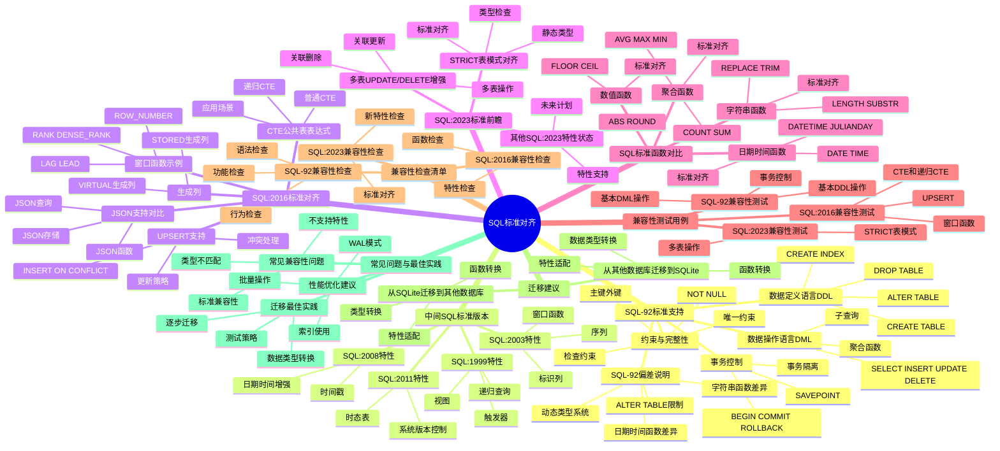

# SQL标准对齐：SQL-92, SQL:2016, SQL:2023

> **创建日期**：2025-11-13
> **最后更新**：2025-01-15
> **版本**：SQLite 3.31+ 至 3.47.x

---

## 📋 概述

本文档详细说明SQLite与SQL标准的对齐情况，包括SQL-92、SQL:2016和SQL:2023标准的支持情况。

---

## 📑 目录

- [SQL标准对齐：SQL-92, SQL:2016, SQL:2023](#sql标准对齐sql-92-sql2016-sql2023)
  - [📋 概述](#-概述)
  - [📑 目录](#-目录)
  - [3. 📊 思维导图](#3--思维导图)
  - [4. SQL-92标准支持情况](#4-sql-92标准支持情况)
    - [4.1. 数据定义语言（DDL）](#41-数据定义语言ddl)
    - [4.2. 数据操作语言（DML）](#42-数据操作语言dml)
    - [4.3. 事务控制](#43-事务控制)
    - [4.4. 约束与完整性](#44-约束与完整性)
    - [4.5. SQL-92偏差说明](#45-sql-92偏差说明)
      - [4.5.1. 偏差1：动态类型系统](#451-偏差1动态类型系统)
      - [4.5.2. 偏差2：ALTER TABLE限制](#452-偏差2alter-table限制)
      - [4.5.3. 偏差3：日期时间函数差异](#453-偏差3日期时间函数差异)
      - [4.5.4. 偏差4：字符串函数差异](#454-偏差4字符串函数差异)
  - [5. 中间SQL标准版本支持（SQL:1999 - SQL:2011）](#5-中间sql标准版本支持sql1999---sql2011)
    - [5.1. SQL标准演进概览](#51-sql标准演进概览)
    - [5.2. SQL:1999特性支持](#52-sql1999特性支持)
    - [5.3. SQL:2003特性支持](#53-sql2003特性支持)
    - [5.4. SQL:2008特性支持](#54-sql2008特性支持)
    - [5.5. SQL:2011特性支持](#55-sql2011特性支持)
  - [6. SQL:2016标准对齐](#6-sql2016标准对齐)
    - [6.1. SQL:2016 JSON支持对比](#61-sql2016-json支持对比)
    - [6.2. 窗口函数示例（SQL:2016标准）](#62-窗口函数示例sql2016标准)
    - [6.3. CTE（公共表表达式）支持](#63-cte公共表表达式支持)
    - [6.4. UPSERT支持（INSERT ... ON CONFLICT）](#64-upsert支持insert--on-conflict)
    - [6.5. 生成列（Generated Columns）](#65-生成列generated-columns)
  - [7. SQL:2023标准前瞻](#7-sql2023标准前瞻)
    - [7.1. SQL:2023 STRICT表模式对齐](#71-sql2023-strict表模式对齐)
    - [7.2. 多表UPDATE/DELETE增强](#72-多表updatedelete增强)
    - [7.3. 其他SQL:2023特性状态](#73-其他sql2023特性状态)
  - [8. 📊 标准支持总结](#8--标准支持总结)
    - [8.1. 支持程度](#81-支持程度)
    - [8.2. 主要偏差](#82-主要偏差)
    - [8.3. 优势特性](#83-优势特性)
  - [9. SQL标准函数对比表](#9-sql标准函数对比表)
    - [9.1. 字符串函数对比](#91-字符串函数对比)
    - [9.2. 数值函数对比](#92-数值函数对比)
    - [9.3. 日期时间函数对比](#93-日期时间函数对比)
    - [9.4. 聚合函数对比](#94-聚合函数对比)
  - [10. 兼容性测试用例](#10-兼容性测试用例)
    - [10.1. SQL-92兼容性测试](#101-sql-92兼容性测试)
      - [10.1.1. 测试用例1：基本DDL操作](#1011-测试用例1基本ddl操作)
      - [10.1.2. 测试用例2：基本DML操作](#1012-测试用例2基本dml操作)
      - [10.1.3. 测试用例3：事务控制](#1013-测试用例3事务控制)
    - [10.2. SQL:2016兼容性测试](#102-sql2016兼容性测试)
      - [10.2.1. 测试用例4：窗口函数](#1021-测试用例4窗口函数)
      - [10.2.2. 测试用例5：CTE和递归CTE](#1022-测试用例5cte和递归cte)
      - [10.2.3. 测试用例6：UPSERT](#1023-测试用例6upsert)
    - [10.3. SQL:2023兼容性测试](#103-sql2023兼容性测试)
      - [10.3.1. 测试用例7：STRICT表模式](#1031-测试用例7strict表模式)
  - [11. 兼容性检查清单](#11-兼容性检查清单)
    - [11.1. SQL-92兼容性检查](#111-sql-92兼容性检查)
    - [11.2. SQL:2016兼容性检查](#112-sql2016兼容性检查)
    - [11.3. SQL:2023兼容性检查](#113-sql2023兼容性检查)
    - [11.4. 已知限制检查](#114-已知限制检查)
  - [12. 迁移建议](#12-迁移建议)
    - [12.1. 从其他数据库迁移到SQLite](#121-从其他数据库迁移到sqlite)
    - [12.2. 从SQLite迁移到其他数据库](#122-从sqlite迁移到其他数据库)
  - [13. 常见问题与最佳实践](#13-常见问题与最佳实践)
    - [13.1. 常见兼容性问题](#131-常见兼容性问题)
      - [13.1.1. 问题1：为什么SQLite允许类型不匹配？](#1311-问题1为什么sqlite允许类型不匹配)
      - [13.1.2. 问题2：如何处理SQLite不支持的特性？](#1312-问题2如何处理sqlite不支持的特性)
      - [13.1.3. 问题3：如何确保SQL标准兼容性？](#1313-问题3如何确保sql标准兼容性)
    - [13.2. 性能优化建议](#132-性能优化建议)
      - [13.2.1. 建议1：合理使用索引](#1321-建议1合理使用索引)
      - [13.2.2. 建议2：使用WAL模式提升并发性能](#1322-建议2使用wal模式提升并发性能)
      - [13.2.3. 建议3：批量操作使用事务](#1323-建议3批量操作使用事务)
    - [13.3. 迁移最佳实践](#133-迁移最佳实践)
      - [13.3.1. 实践1：逐步迁移策略](#1331-实践1逐步迁移策略)
      - [13.3.2. 实践2：数据类型转换](#1332-实践2数据类型转换)
    - [13.4. 测试策略](#134-测试策略)
      - [13.4.1. 策略1：兼容性测试套件](#1341-策略1兼容性测试套件)
      - [13.4.2. 策略2：回归测试](#1342-策略2回归测试)
  - [14. 常见错误与解决方案](#14-常见错误与解决方案)
  - [15. 快速参考表](#15-快速参考表)
    - [15.1. SQL标准特性快速查找](#151-sql标准特性快速查找)
    - [15.2. 函数快速查找](#152-函数快速查找)
    - [15.3. 数据类型映射快速参考](#153-数据类型映射快速参考)
    - [15.4. 版本兼容性矩阵](#154-版本兼容性矩阵)
  - [16. 🔗 相关资源](#16--相关资源)
  - [17. 🔗 交叉引用](#17--交叉引用)
    - [17.1. 理论模型 🆕](#171-理论模型-)
    - [17.2. 设计模型 🆕](#172-设计模型-)
    - [17.3. 数据模型文档 🆕](#173-数据模型文档-)
    - [17.4. 核心架构文档 🆕](#174-核心架构文档-)
    - [17.5. 知识图谱与导航 🆕](#175-知识图谱与导航-)
    - [17.6. 相关概念链接 🆕](#176-相关概念链接-)
      - [17.6.1. SQL标准概念](#1761-sql标准概念)
  - [18. 📚 参考资料](#18--参考资料)

---

## 3. 📊 思维导图



---

## 4. SQL-92标准支持情况

SQLite实现了**SQL-92标准的核心子集**，包括：

### 4.1. 数据定义语言（DDL）

| SQL-92特性 | SQLite支持 | 说明 |
|-----------|----------|------|
| CREATE TABLE | ✅ 完全支持 | 支持列约束、主键、外键、CHECK约束 |
| ALTER TABLE | ⚠️ 部分支持 | 仅支持ADD COLUMN、RENAME TABLE，不支持DROP COLUMN |
| CREATE INDEX | ✅ 完全支持 | 支持唯一索引、复合索引、部分索引 |
| CREATE VIEW | ✅ 完全支持 | 支持可更新视图（WITH CHECK OPTION） |
| DROP TABLE/INDEX/VIEW | ✅ 完全支持 | |

### 4.2. 数据操作语言（DML）

| SQL-92特性 | SQLite支持 | 说明 |
|-----------|----------|------|
| SELECT | ✅ 完全支持 | 支持子查询、UNION、EXCEPT、INTERSECT |
| INSERT | ✅ 完全支持 | 支持INSERT OR REPLACE、INSERT OR IGNORE |
| UPDATE | ✅ 完全支持 | 支持多表UPDATE（3.33+） |
| DELETE | ✅ 完全支持 | 支持多表DELETE（3.33+） |

### 4.3. 事务控制

| SQL-92特性 | SQLite支持 | 说明 |
|-----------|----------|------|
| BEGIN TRANSACTION | ✅ 完全支持 | 支持DEFERRED/IMMEDIATE/EXCLUSIVE |
| COMMIT | ✅ 完全支持 | |
| ROLLBACK | ✅ 完全支持 | |
| SAVEPOINT | ✅ 完全支持 | SQLite 3.6.8+ |

### 4.4. 约束与完整性

| SQL-92特性 | SQLite支持 | 说明 |
|-----------|----------|------|
| PRIMARY KEY | ✅ 完全支持 | INTEGER PRIMARY KEY = rowid别名 |
| FOREIGN KEY | ✅ 完全支持 | 需PRAGMA foreign_keys=ON |
| UNIQUE | ✅ 完全支持 | |
| CHECK | ✅ 完全支持 | |
| NOT NULL | ✅ 完全支持 | |

### 4.5. SQL-92偏差说明

#### 4.5.1. 偏差1：动态类型系统

SQL-92要求严格的静态类型，SQLite采用动态类型（存储类系统）

**SQL-92标准（严格类型）**：

```sql
CREATE TABLE t(id INTEGER, name VARCHAR(50));
INSERT INTO t VALUES ('123', 456); -- 错误：类型不匹配
```

**SQLite（动态类型）**：

```sql
CREATE TABLE t(id INTEGER, name TEXT);
INSERT INTO t VALUES ('123', 456); -- 允许：'123'存储为TEXT，456存储为INTEGER
```

**类型亲和性（Type Affinity）**：

SQLite通过类型亲和性提供部分类型检查：

```sql
-- INTEGER亲和性：优先存储为INTEGER
CREATE TABLE t1(id INTEGER, count INT, num NUMERIC);
INSERT INTO t1 VALUES (1.5, 2.7, 3.9); -- 全部存储为INTEGER: 1, 2, 3

-- TEXT亲和性：优先存储为TEXT
CREATE TABLE t2(name VARCHAR(50), title CHAR(100));
INSERT INTO t2 VALUES (123, 456); -- 存储为TEXT: '123', '456'

-- REAL亲和性：优先存储为REAL
CREATE TABLE t3(price REAL, value FLOAT, amount DOUBLE);
INSERT INTO t3 VALUES ('3.14', '2.71', '1.41'); -- 存储为REAL: 3.14, 2.71, 1.41
```

#### 4.5.2. 偏差2：ALTER TABLE限制

SQL-92支持完整的ALTER TABLE，SQLite仅支持有限操作

**SQL-92标准**：

```sql
ALTER TABLE t DROP COLUMN name; -- SQLite不支持
ALTER TABLE t MODIFY COLUMN id BIGINT; -- SQLite不支持
ALTER TABLE t ALTER COLUMN name SET DEFAULT 'unknown'; -- SQLite不支持
```

**SQLite支持**：

```sql
ALTER TABLE t ADD COLUMN email TEXT; -- ✅ 支持
ALTER TABLE t RENAME TO t_new; -- ✅ 支持
ALTER TABLE t RENAME COLUMN old_name TO new_name; -- ✅ 支持（3.25.0+）
```

**SQLite ALTER TABLE限制的解决方案**：

```sql
-- 删除列（需要重建表）
BEGIN TRANSACTION;

-- 1. 创建新表（不包含要删除的列）
CREATE TABLE t_new AS SELECT id, email FROM t;

-- 2. 删除旧表
DROP TABLE t;

-- 3. 重命名新表
ALTER TABLE t_new RENAME TO t;

COMMIT;
```

#### 4.5.3. 偏差3：日期时间函数差异

SQL-92定义了标准日期时间函数，SQLite使用自定义函数

**SQL-92标准**：

```sql
SELECT CURRENT_DATE, CURRENT_TIME, CURRENT_TIMESTAMP;
SELECT EXTRACT(YEAR FROM date_col) FROM t;
```

**SQLite实现**：

```sql
-- SQLite日期时间函数（兼容SQL-92）
SELECT date('now'), time('now'), datetime('now');
SELECT strftime('%Y', date_col) FROM t;

-- SQLite扩展函数
SELECT date('now', '+1 day'); -- 日期计算
SELECT julianday('2024-01-01'); -- 儒略日
```

#### 4.5.4. 偏差4：字符串函数差异

SQL-92定义了标准字符串函数，SQLite使用略有不同的函数名

**SQL-92标准**：

```sql
SELECT SUBSTRING(name, 1, 5) FROM t;
SELECT POSITION('x' IN name) FROM t;
SELECT CHAR_LENGTH(name) FROM t;
SELECT UPPER(name), LOWER(name) FROM t;
SELECT TRIM(BOTH ' ' FROM name) FROM t;
```

**SQLite实现**：

```sql
-- SQLite字符串函数（兼容SQL-92）
SELECT substr(name, 1, 5) FROM t; -- 注意：SUBSTRING → substr
SELECT instr(name, 'x') FROM t; -- 注意：POSITION → instr
SELECT length(name) FROM t; -- 注意：CHAR_LENGTH → length
SELECT upper(name), lower(name) FROM t; -- ✅ 完全兼容
SELECT trim(name) FROM t; -- ✅ 完全兼容（简化语法）

-- SQLite扩展函数
SELECT printf('Name: %s, Age: %d', name, age) FROM t;
SELECT replace(name, 'old', 'new') FROM t;
SELECT hex(blob_col) FROM t;
```

---

## 5. 中间SQL标准版本支持（SQL:1999 - SQL:2011）

SQLite在SQL-92和SQL:2016之间逐步引入了多个标准版本的特性：

### 5.1. SQL标准演进概览

| SQL标准版本 | 发布时间 | SQLite关键特性支持 | 说明 |
|-----------|---------|-----------------|------|
| **SQL-92** | 1992 | ✅ 核心子集 | 基础SQL语法和DDL/DML |
| **SQL:1999** | 1999 | ⚠️ 部分支持 | 递归查询、触发器 |
| **SQL:2003** | 2003 | ⚠️ 部分支持 | 窗口函数（3.25.0+） |
| **SQL:2008** | 2008 | ⚠️ 部分支持 | 增强的日期时间函数 |
| **SQL:2011** | 2011 | ⚠️ 部分支持 | 时态表（不支持） |
| **SQL:2016** | 2016 | ✅ 主要特性 | JSON、完整窗口函数、CTE |

### 5.2. SQL:1999特性支持

**SQL:1999引入的关键特性**：

| SQL:1999特性 | SQLite支持 | 版本要求 | 说明 |
|------------|----------|---------|------|
| **递归查询（WITH RECURSIVE）** | ✅ 完全支持 | 3.8.3+ | 支持递归CTE |
| **触发器（TRIGGER）** | ✅ 完全支持 | 3.0.0+ | BEFORE/AFTER触发器 |
| **存储过程** | ❌ 不支持 | - | SQLite无存储过程，需应用层实现 |
| **用户定义函数（UDF）** | ✅ 支持 | 3.0.0+ | 通过C API扩展 |

**递归查询示例（SQL:1999标准）**：

```sql
-- SQL:1999递归查询（SQLite 3.8.3+完全支持）
WITH RECURSIVE org_hierarchy AS (
    -- 锚点：根节点
    SELECT id, name, parent_id, 0 as level
    FROM employees
    WHERE parent_id IS NULL

    UNION ALL

    -- 递归：子节点
    SELECT e.id, e.name, e.parent_id, oh.level + 1
    FROM employees e
    JOIN org_hierarchy oh ON e.parent_id = oh.id
)
SELECT * FROM org_hierarchy ORDER BY level, id;
```

**触发器示例（SQL:1999标准）**：

```sql
-- SQL:1999触发器（SQLite完全支持）
CREATE TRIGGER update_timestamp
AFTER UPDATE ON users
FOR EACH ROW
BEGIN
    UPDATE users SET updated_at = datetime('now') WHERE id = NEW.id;
END;
```

### 5.3. SQL:2003特性支持

**SQL:2003引入的关键特性**：

| SQL:2003特性 | SQLite支持 | 版本要求 | 说明 |
|------------|----------|---------|------|
| **窗口函数** | ✅ 完全支持 | 3.25.0+ | ROW_NUMBER, RANK, LAG, LEAD等 |
| **MERGE语句** | ⚠️ 变体支持 | 3.24.0+ | INSERT ... ON CONFLICT（UPSERT） |
| **XML数据类型** | ❌ 不支持 | - | 使用TEXT存储XML，应用层解析 |
| **序列（SEQUENCE）** | ⚠️ 变体支持 | - | 使用AUTOINCREMENT或应用层实现 |

**窗口函数示例（SQL:2003标准，SQLite 3.25.0+）**：

```sql
-- SQL:2003窗口函数（SQLite完全支持）
SELECT
    employee_id,
    department_id,
    salary,
    ROW_NUMBER() OVER (PARTITION BY department_id ORDER BY salary DESC) as rank,
    AVG(salary) OVER (PARTITION BY department_id) as dept_avg,
    SUM(salary) OVER (ORDER BY employee_id ROWS BETWEEN UNBOUNDED PRECEDING AND CURRENT ROW) as cumulative
FROM employees;
```

### 5.4. SQL:2008特性支持

**SQL:2008引入的关键特性**：

| SQL:2008特性 | SQLite支持 | 版本要求 | 说明 |
|------------|----------|---------|------|
| **增强日期时间函数** | ⚠️ 部分支持 | 3.0.0+ | 使用自定义函数（date, time, datetime） |
| **INSTEAD OF触发器** | ✅ 完全支持 | 3.0.0+ | 视图触发器 |
| **TRUNCATE TABLE** | ❌ 不支持 | - | 使用DELETE FROM替代 |
| **MERGE增强** | ⚠️ 变体支持 | 3.24.0+ | INSERT ... ON CONFLICT |

**日期时间函数对比**：

```sql
-- SQL:2008标准日期时间函数
SELECT
    CURRENT_DATE,           -- SQLite: date('now')
    CURRENT_TIME,           -- SQLite: time('now')
    CURRENT_TIMESTAMP,      -- SQLite: datetime('now')
    EXTRACT(YEAR FROM date_col)  -- SQLite: strftime('%Y', date_col)
FROM t;

-- SQLite日期时间扩展函数
SELECT
    date('now', '+1 day'),           -- 日期计算
    datetime('now', 'localtime'),     -- 本地时间
    julianday('2024-01-01'),          -- 儒略日
    strftime('%Y-%m-%d', date_col);  -- 格式化
```

### 5.5. SQL:2011特性支持

**SQL:2011引入的关键特性**：

| SQL:2011特性 | SQLite支持 | 版本要求 | 说明 |
|------------|----------|---------|------|
| **时态表（Temporal Tables）** | ❌ 不支持 | - | 无原生时态表支持 |
| **PERIOD数据类型** | ❌ 不支持 | - | 需应用层实现 |
| **时间点查询** | ❌ 不支持 | - | 需应用层实现 |

**时态表替代方案**：

```sql
-- SQL:2011时态表（SQLite不支持）
-- 标准语法：
-- CREATE TABLE products (
--     id INTEGER,
--     name TEXT,
--     price REAL,
--     PERIOD FOR SYSTEM_TIME (valid_from, valid_to)
-- ) WITH SYSTEM VERSIONING;

-- SQLite替代方案：应用层实现
CREATE TABLE products (
    id INTEGER PRIMARY KEY,
    name TEXT NOT NULL,
    price REAL NOT NULL,
    valid_from TEXT NOT NULL DEFAULT (datetime('now')),
    valid_to TEXT
);

-- 查询历史版本
SELECT * FROM products
WHERE id = 1
  AND datetime('now') BETWEEN valid_from AND COALESCE(valid_to, '9999-12-31');
```

---

## 6. SQL:2016标准对齐

SQL:2016引入了JSON支持、窗口函数等特性，SQLite的兼容情况：

| SQL:2016特性 | SQLite支持 | 版本要求 | 说明 |
|------------|----------|---------|------|
| **JSON函数** | ✅ 完全支持 | 3.9.0+ | JSON1扩展，RFC 7159兼容 |
| **窗口函数** | ✅ 完全支持 | 3.25.0+ | ROW_NUMBER, RANK, DENSE_RANK, LAG, LEAD等 |
| **CTE（WITH子句）** | ✅ 完全支持 | 3.8.3+ | 支持递归CTE（WITH RECURSIVE） |
| **UPSERT** | ✅ 完全支持 | 3.24.0+ | INSERT ... ON CONFLICT |
| **生成列** | ✅ 完全支持 | 3.31.0+ | GENERATED ALWAYS AS ... STORED/VIRTUAL |
| **布尔类型** | ⚠️ 部分支持 | 3.23.0+ | 存储为INTEGER (0/1)，无原生BOOLEAN类型 |

### 6.1. SQL:2016 JSON支持对比

**SQL:2016标准JSON函数**：

```sql
SELECT
    JSON_EXTRACT(data, '$.name') as name,  -- SQLite: json_extract()
    JSON_ARRAY_LENGTH(data, '$.items') as count,  -- SQLite: json_array_length()
    JSON_TYPE(data, '$.status') as type  -- SQLite: json_type()
FROM documents;
```

**SQLite JSON1扩展（完全兼容SQL:2016）**：

```sql
SELECT
    json_extract(config, '$.network.ip') as ip,
    json_array_length(config, '$.sensors') as sensor_count
FROM device_configs
WHERE json_type(config, '$.network') = 'object';
```

### 6.2. 窗口函数示例（SQL:2016标准）

**SQL:2016窗口函数（SQLite 3.25.0+完全支持）**：

```sql
SELECT
    employee_id,
    department_id,
    salary,
    ROW_NUMBER() OVER (PARTITION BY department_id ORDER BY salary DESC) as rank,
    AVG(salary) OVER (PARTITION BY department_id) as dept_avg,
    LAG(salary, 1) OVER (ORDER BY employee_id) as prev_salary
FROM employees;
```

**SQLite支持的窗口函数完整列表**：

| 窗口函数 | SQL:2016标准 | SQLite支持 | 说明 |
|---------|------------|----------|------|
| **ROW_NUMBER()** | ✅ | ✅ 3.25.0+ | 行号 |
| **RANK()** | ✅ | ✅ 3.25.0+ | 排名（允许并列） |
| **DENSE_RANK()** | ✅ | ✅ 3.25.0+ | 密集排名 |
| **PERCENT_RANK()** | ✅ | ✅ 3.25.0+ | 百分比排名 |
| **CUME_DIST()** | ✅ | ✅ 3.25.0+ | 累积分布 |
| **NTILE(n)** | ✅ | ✅ 3.25.0+ | 分桶函数 |
| **LAG(expr, offset)** | ✅ | ✅ 3.25.0+ | 前N行值 |
| **LEAD(expr, offset)** | ✅ | ✅ 3.25.0+ | 后N行值 |
| **FIRST_VALUE(expr)** | ✅ | ✅ 3.25.0+ | 窗口第一行值 |
| **LAST_VALUE(expr)** | ✅ | ✅ 3.25.0+ | 窗口最后一行值 |
| **NTH_VALUE(expr, n)** | ✅ | ✅ 3.25.0+ | 窗口第N行值 |
| **聚合函数 OVER()** | ✅ | ✅ 3.25.0+ | COUNT, SUM, AVG等 |

**窗口函数高级示例**：

```sql
-- 示例1：计算移动平均
SELECT
    date,
    sales,
    AVG(sales) OVER (
        ORDER BY date
        ROWS BETWEEN 2 PRECEDING AND CURRENT ROW
    ) as moving_avg_3day
FROM daily_sales;

-- 示例2：计算累计总和
SELECT
    month,
    revenue,
    SUM(revenue) OVER (
        ORDER BY month
        ROWS UNBOUNDED PRECEDING
    ) as cumulative_revenue
FROM monthly_revenue;

-- 示例3：分组排名
SELECT
    product_id,
    category,
    sales,
    RANK() OVER (PARTITION BY category ORDER BY sales DESC) as category_rank,
    PERCENT_RANK() OVER (PARTITION BY category ORDER BY sales DESC) as percentile
FROM product_sales;
```

### 6.3. CTE（公共表表达式）支持

**SQL:2016标准CTE（SQLite 3.8.3+完全支持）**：

```sql
-- 简单CTE
WITH sales_summary AS (
    SELECT
        product_id,
        SUM(quantity) as total_quantity,
        SUM(amount) as total_amount
    FROM orders
    GROUP BY product_id
)
SELECT
    p.name,
    s.total_quantity,
    s.total_amount
FROM products p
JOIN sales_summary s ON p.id = s.product_id;
```

**递归CTE（WITH RECURSIVE）**：

```sql
-- 示例：生成数字序列
WITH RECURSIVE numbers(n) AS (
    SELECT 1
    UNION ALL
    SELECT n + 1 FROM numbers WHERE n < 100
)
SELECT n FROM numbers;

-- 示例：树形结构查询（组织架构）
WITH RECURSIVE org_tree AS (
    -- 根节点
    SELECT id, name, parent_id, 0 as level
    FROM employees
    WHERE parent_id IS NULL

    UNION ALL

    -- 递归查询子节点
    SELECT e.id, e.name, e.parent_id, ot.level + 1
    FROM employees e
    JOIN org_tree ot ON e.parent_id = ot.id
)
SELECT * FROM org_tree ORDER BY level, id;
```

### 6.4. UPSERT支持（INSERT ... ON CONFLICT）

**SQL:2016标准UPSERT（SQLite 3.24.0+完全支持）**：

```sql
-- 基本UPSERT语法
INSERT INTO users (id, name, email)
VALUES (1, 'Alice', 'alice@example.com')
ON CONFLICT(id) DO UPDATE SET
    name = excluded.name,
    email = excluded.email;

-- 忽略冲突（不更新）
INSERT INTO users (id, name, email)
VALUES (1, 'Alice', 'alice@example.com')
ON CONFLICT(id) DO NOTHING;

-- 多列唯一约束
INSERT INTO user_emails (user_id, email, verified)
VALUES (1, 'alice@example.com', 0)
ON CONFLICT(user_id, email) DO UPDATE SET
    verified = excluded.verified;
```

### 6.5. 生成列（Generated Columns）

**SQL:2016标准生成列（SQLite 3.31.0+完全支持）**：

```sql
-- STORED生成列（存储计算值）
CREATE TABLE products (
    id INTEGER PRIMARY KEY,
    price REAL NOT NULL,
    quantity INTEGER NOT NULL,
    total_value REAL GENERATED ALWAYS AS (price * quantity) STORED
);

-- VIRTUAL生成列（不存储，按需计算）
CREATE TABLE users (
    id INTEGER PRIMARY KEY,
    first_name TEXT NOT NULL,
    last_name TEXT NOT NULL,
    full_name TEXT GENERATED ALWAYS AS (first_name || ' ' || last_name) VIRTUAL
);

-- 使用生成列
INSERT INTO products (price, quantity) VALUES (10.5, 3);
-- total_value自动计算为31.5

SELECT * FROM users;
-- full_name自动计算为 "John Doe"
```

---

## 7. SQL:2023标准前瞻

SQL:2023标准的新特性与SQLite的兼容性：

| SQL:2023特性 | SQLite状态 | 说明 |
|------------|----------|------|
| **JSON5支持** | 🔄 规划中 | 当前仅支持RFC 7159 JSON |
| **多表UPDATE/DELETE增强** | ✅ 已支持 | SQLite 3.33.0+ |
| **STRICT表模式** | ✅ 已支持 | SQLite 3.37.0+，符合SQL:2023类型严格性要求 |
| **分区表** | ❌ 不支持 | SQLite无原生分区表，需应用层实现 |
| **并行查询** | 🔄 实验性 | SQLite 3.38.0+实验性支持 |

### 7.1. SQL:2023 STRICT表模式对齐

**SQL:2023要求：严格类型检查**

```sql
CREATE TABLE users STRICT (
    id INTEGER PRIMARY KEY,
    age INTEGER NOT NULL,
    email TEXT UNIQUE
);
```

**SQL:2023标准行为（SQLite 3.37+）**：

```sql
INSERT INTO users VALUES (1, 'twenty', 'test@example.com');
-- 错误：age必须是INTEGER类型，不能是TEXT

-- 正确用法
INSERT INTO users VALUES (1, 20, 'test@example.com'); -- ✅
```

**STRICT模式类型检查规则**：

```sql
-- STRICT模式：严格类型检查
CREATE TABLE products STRICT (
    id INTEGER PRIMARY KEY,
    name TEXT NOT NULL,
    price REAL NOT NULL,
    quantity INTEGER NOT NULL,
    active INTEGER NOT NULL CHECK(active IN (0, 1))
);

-- 类型检查示例
INSERT INTO products VALUES (1, 'Widget', 10.5, 5, 1); -- ✅ 正确
INSERT INTO products VALUES (2, 'Gadget', '9.99', 3, 1); -- ❌ 错误：price必须是REAL
INSERT INTO products VALUES (3, 'Tool', 8.0, 'two', 1); -- ❌ 错误：quantity必须是INTEGER
INSERT INTO products VALUES (4, 123, 7.5, 2, 1); -- ❌ 错误：name必须是TEXT

-- 非STRICT模式：动态类型（向后兼容）
CREATE TABLE products_legacy (
    id INTEGER PRIMARY KEY,
    name TEXT,
    price REAL,
    quantity INTEGER
);

INSERT INTO products_legacy VALUES (1, 'Widget', '10.5', '5'); -- ✅ 允许（类型转换）
```

### 7.2. 多表UPDATE/DELETE增强

**SQL:2023多表UPDATE（SQLite 3.33.0+支持）**：

```sql
-- 多表UPDATE语法
UPDATE orders o
SET o.status = 'shipped'
FROM customers c
WHERE o.customer_id = c.id
  AND c.country = 'USA'
  AND o.order_date < date('now', '-30 days');

-- SQLite实现（3.33.0+）
UPDATE orders
SET status = 'shipped'
FROM customers
WHERE orders.customer_id = customers.id
  AND customers.country = 'USA'
  AND orders.order_date < date('now', '-30 days');
```

**SQL:2023多表DELETE（SQLite 3.33.0+支持）**：

```sql
-- 多表DELETE语法
DELETE o
FROM orders o
JOIN customers c ON o.customer_id = c.id
WHERE c.status = 'inactive'
  AND o.order_date < date('now', '-1 year');

-- SQLite实现（3.33.0+）
DELETE FROM orders
WHERE EXISTS (
    SELECT 1 FROM customers
    WHERE customers.id = orders.customer_id
      AND customers.status = 'inactive'
) AND orders.order_date < date('now', '-1 year');
```

### 7.3. 其他SQL:2023特性状态

**JSON5支持**：

```sql
-- SQL:2023 JSON5标准（SQLite当前不支持）
-- JSON5允许：
-- - 单引号字符串
-- - 尾随逗号
-- - 注释
-- - 未引用的键名

-- SQLite当前仅支持RFC 7159 JSON
SELECT json_extract('{"name": "Alice", "age": 30}', '$.name'); -- ✅ 支持
```

**分区表**：

```sql
-- SQL:2023分区表（SQLite不支持）
-- PostgreSQL示例：
-- CREATE TABLE orders (
--     id INTEGER,
--     order_date DATE
-- ) PARTITION BY RANGE (order_date);

-- SQLite替代方案：应用层分区
-- 1. 按日期创建多个表
CREATE TABLE orders_2024_01 (...);
CREATE TABLE orders_2024_02 (...);

-- 2. 使用视图统一查询
CREATE VIEW orders AS
SELECT * FROM orders_2024_01
UNION ALL
SELECT * FROM orders_2024_02;
```

**并行查询**：

```sql
-- SQL:2023并行查询（SQLite 3.38.0+实验性支持）
-- 需要编译时启用SQLITE_ENABLE_PARALLEL_QUERY

-- 并行查询示例（实验性）
PRAGMA parallel_query = ON;
SELECT COUNT(*) FROM large_table WHERE condition;
```

---

## 8. 📊 标准支持总结

### 8.1. 支持程度

- **SQL-92核心子集**：✅ 90%+支持
- **SQL:2016关键特性**：✅ 80%+支持
- **SQL:2023前瞻特性**：🔄 部分支持

### 8.2. 主要偏差

1. **动态类型系统**：与SQL-92静态类型要求不同
2. **ALTER TABLE限制**：不支持DROP COLUMN、MODIFY COLUMN
3. **分区表**：无原生支持
4. **并行查询**：仅实验性支持

### 8.3. 优势特性

1. **JSON1扩展**：完全兼容SQL:2016 JSON标准
2. **窗口函数**：完整支持SQL:2016窗口函数
3. **STRICT表模式**：符合SQL:2023类型严格性要求
4. **UPSERT**：支持INSERT ... ON CONFLICT

---

## 9. SQL标准函数对比表

### 9.1. 字符串函数对比

| SQL标准函数 | SQLite函数 | 支持情况 | 说明 |
|-----------|----------|---------|------|
| **CHAR_LENGTH(str)** | `length(str)` | ✅ 完全支持 | 返回字符数 |
| **CHARACTER_LENGTH(str)** | `length(str)` | ✅ 完全支持 | 同CHAR_LENGTH |
| **SUBSTRING(str, start, len)** | `substr(str, start, len)` | ✅ 完全支持 | 提取子字符串 |
| **POSITION(substr IN str)** | `instr(str, substr)` | ✅ 完全支持 | 查找子字符串位置 |
| **UPPER(str)** | `upper(str)` | ✅ 完全支持 | 转大写 |
| **LOWER(str)** | `lower(str)` | ✅ 完全支持 | 转小写 |
| **TRIM([BOTH\|LEADING\|TRAILING] chars FROM str)** | `trim(str, chars)` | ✅ 完全支持 | 去除首尾字符 |
| **LTRIM(str, chars)** | `ltrim(str, chars)` | ✅ 完全支持 | 去除左侧字符 |
| **RTRIM(str, chars)** | `rtrim(str, chars)` | ✅ 完全支持 | 去除右侧字符 |
| **CONCAT(str1, str2, ...)** | `str1 \|\| str2` | ✅ 完全支持 | 字符串连接（使用\|\|运算符） |
| **OVERLAY(str PLACING new FROM pos)** | `substr(str, 1, pos-1) \|\| new \|\| substr(str, pos+len)` | ⚠️ 需手动实现 | 替换子字符串 |
| **REPLACE(str, old, new)** | `replace(str, old, new)` | ✅ 完全支持 | SQLite扩展函数 |

**示例对比**：

```sql
-- SQL标准
SELECT
    CHAR_LENGTH('Hello') as len,                    -- 5
    SUBSTRING('Hello', 2, 3) as substr,             -- 'ell'
    POSITION('l' IN 'Hello') as pos,                -- 3
    UPPER('hello') as upper,                        -- 'HELLO'
    TRIM(BOTH ' ' FROM '  hello  ') as trimmed,     -- 'hello'
    CONCAT('Hello', ' ', 'World') as concat;        -- 'Hello World'

-- SQLite等价实现
SELECT
    length('Hello') as len,                         -- 5
    substr('Hello', 2, 3) as substr,                -- 'ell'
    instr('Hello', 'l') as pos,                     -- 3
    upper('hello') as upper,                        -- 'HELLO'
    trim('  hello  ') as trimmed,                   -- 'hello'
    'Hello' || ' ' || 'World' as concat;           -- 'Hello World'
```

### 9.2. 数值函数对比

| SQL标准函数 | SQLite函数 | 支持情况 | 说明 |
|-----------|----------|---------|------|
| **ABS(n)** | `abs(n)` | ✅ 完全支持 | 绝对值 |
| **MOD(x, y)** | `x % y` | ✅ 完全支持 | 取模（使用%运算符） |
| **FLOOR(n)** | `floor(n)` | ✅ 完全支持 | 向下取整 |
| **CEIL(n)** / **CEILING(n)** | `ceil(n)` | ✅ 完全支持 | 向上取整 |
| **ROUND(n, d)** | `round(n, d)` | ✅ 完全支持 | 四舍五入 |
| **TRUNCATE(n, d)** | `round(n, d)` | ⚠️ 部分支持 | SQLite使用round，需注意行为差异 |
| **POWER(x, y)** | `pow(x, y)` | ✅ 完全支持 | 幂运算 |
| **SQRT(n)** | `sqrt(n)` | ✅ 完全支持 | 平方根 |
| **EXP(n)** | `exp(n)` | ✅ 完全支持 | 自然指数 |
| **LN(n)** | `log(n)` | ✅ 完全支持 | 自然对数 |
| **LOG10(n)** | `log10(n)` | ✅ 完全支持 | 常用对数 |
| **SIN(n)**, **COS(n)**, **TAN(n)** | `sin(n)`, `cos(n)`, `tan(n)` | ✅ 完全支持 | 三角函数 |
| **RANDOM()** | `random()` | ✅ 完全支持 | 随机数 |

**示例对比**：

```sql
-- SQL标准
SELECT
    ABS(-5) as abs,                    -- 5
    MOD(10, 3) as mod,                 -- 1
    FLOOR(3.7) as floor,               -- 3
    CEIL(3.2) as ceil,                 -- 4
    ROUND(3.14159, 2) as round,        -- 3.14
    POWER(2, 3) as power,              -- 8
    SQRT(16) as sqrt;                  -- 4

-- SQLite等价实现
SELECT
    abs(-5) as abs,                     -- 5
    10 % 3 as mod,                      -- 1
    floor(3.7) as floor,               -- 3
    ceil(3.2) as ceil,                 -- 4
    round(3.14159, 2) as round,        -- 3.14
    pow(2, 3) as power,                -- 8
    sqrt(16) as sqrt;                  -- 4
```

### 9.3. 日期时间函数对比

| SQL标准函数 | SQLite函数 | 支持情况 | 说明 |
|-----------|----------|---------|------|
| **CURRENT_DATE** | `date('now')` | ✅ 完全支持 | 当前日期 |
| **CURRENT_TIME** | `time('now')` | ✅ 完全支持 | 当前时间 |
| **CURRENT_TIMESTAMP** | `datetime('now')` | ✅ 完全支持 | 当前时间戳 |
| **EXTRACT(field FROM datetime)** | `strftime('%format', datetime)` | ✅ 完全支持 | 提取日期时间部分 |
| **DATE_ADD(date, INTERVAL n unit)** | `date(date, '+n unit')` | ✅ 完全支持 | 日期加法 |
| **DATE_SUB(date, INTERVAL n unit)** | `date(date, '-n unit')` | ✅ 完全支持 | 日期减法 |
| **DATEDIFF(date1, date2)** | `julianday(date1) - julianday(date2)` | ⚠️ 需手动计算 | 日期差（天数） |
| **YEAR(date)**, **MONTH(date)**, **DAY(date)** | `strftime('%Y', date)`, `strftime('%m', date)`, `strftime('%d', date)` | ✅ 完全支持 | 提取年月日 |

**示例对比**：

```sql
-- SQL标准
SELECT
    CURRENT_DATE as today,
    CURRENT_TIMESTAMP as now,
    EXTRACT(YEAR FROM '2024-01-15') as year,
    DATE_ADD('2024-01-15', INTERVAL 1 MONTH) as next_month,
    DATEDIFF('2024-02-15', '2024-01-15') as days_diff;

-- SQLite等价实现
SELECT
    date('now') as today,
    datetime('now') as now,
    CAST(strftime('%Y', '2024-01-15') AS INTEGER) as year,
    date('2024-01-15', '+1 month') as next_month,
    julianday('2024-02-15') - julianday('2024-01-15') as days_diff;
```

### 9.4. 聚合函数对比

| SQL标准函数 | SQLite函数 | 支持情况 | 说明 |
|-----------|----------|---------|------|
| **COUNT(\*)** | `count(*)` | ✅ 完全支持 | 计数 |
| **COUNT(expr)** | `count(expr)` | ✅ 完全支持 | 非NULL值计数 |
| **SUM(expr)** | `sum(expr)` | ✅ 完全支持 | 求和 |
| **AVG(expr)** | `avg(expr)` | ✅ 完全支持 | 平均值 |
| **MIN(expr)** | `min(expr)` | ✅ 完全支持 | 最小值 |
| **MAX(expr)** | `max(expr)` | ✅ 完全支持 | 最大值 |
| **STDDEV(expr)** | - | ❌ 不支持 | 标准差（需手动计算） |
| **VARIANCE(expr)** | - | ❌ 不支持 | 方差（需手动计算） |
| **GROUP_CONCAT(expr, separator)** | `group_concat(expr, separator)` | ✅ 完全支持 | SQLite扩展函数 |

**示例对比**：

```sql
-- SQL标准聚合函数
SELECT
    COUNT(*) as total,
    SUM(amount) as total_amount,
    AVG(amount) as avg_amount,
    MIN(amount) as min_amount,
    MAX(amount) as max_amount
FROM orders;

-- SQLite等价实现（完全相同）
SELECT
    count(*) as total,
    sum(amount) as total_amount,
    avg(amount) as avg_amount,
    min(amount) as min_amount,
    max(amount) as max_amount
FROM orders;

-- SQLite扩展：GROUP_CONCAT
SELECT
    department,
    group_concat(name, ', ') as employees
FROM employees
GROUP BY department;
```

---

## 10. 兼容性测试用例

### 10.1. SQL-92兼容性测试

#### 10.1.1. 测试用例1：基本DDL操作

```sql
-- 测试CREATE TABLE
CREATE TABLE test_table (
    id INTEGER PRIMARY KEY,
    name TEXT NOT NULL,
    age INTEGER,
    email TEXT UNIQUE
);

-- 测试CREATE INDEX
CREATE INDEX idx_name ON test_table(name);
CREATE UNIQUE INDEX idx_email ON test_table(email);

-- 测试CREATE VIEW
CREATE VIEW test_view AS
SELECT id, name, age FROM test_table WHERE age > 18;

-- 验证
SELECT sql FROM sqlite_master WHERE type='table' AND name='test_table';
SELECT sql FROM sqlite_master WHERE type='index' AND name='idx_name';
SELECT sql FROM sqlite_master WHERE type='view' AND name='test_view';
```

#### 10.1.2. 测试用例2：基本DML操作

```sql
-- 测试INSERT
INSERT INTO test_table (name, age, email) VALUES ('Alice', 25, 'alice@example.com');
INSERT INTO test_table (name, age, email) VALUES ('Bob', 30, 'bob@example.com');

-- 测试SELECT（子查询、UNION）
SELECT * FROM test_table WHERE age > 20;
SELECT name FROM test_table
UNION
SELECT name FROM test_table WHERE age < 25;

-- 测试UPDATE
UPDATE test_table SET age = 26 WHERE name = 'Alice';

-- 测试DELETE
DELETE FROM test_table WHERE age < 20;
```

#### 10.1.3. 测试用例3：事务控制

```sql
-- 测试事务
BEGIN TRANSACTION;
INSERT INTO test_table (name, age, email) VALUES ('Charlie', 28, 'charlie@example.com');
COMMIT;

-- 测试回滚
BEGIN TRANSACTION;
INSERT INTO test_table (name, age, email) VALUES ('David', 32, 'david@example.com');
ROLLBACK;

-- 测试SAVEPOINT
BEGIN TRANSACTION;
SAVEPOINT sp1;
INSERT INTO test_table (name, age, email) VALUES ('Eve', 27, 'eve@example.com');
ROLLBACK TO sp1;
COMMIT;
```

### 10.2. SQL:2016兼容性测试

#### 10.2.1. 测试用例4：窗口函数

```sql
-- 创建测试数据
CREATE TABLE employees (
    id INTEGER PRIMARY KEY,
    name TEXT,
    department TEXT,
    salary REAL
);

INSERT INTO employees (name, department, salary) VALUES
    ('Alice', 'Sales', 50000),
    ('Bob', 'Sales', 60000),
    ('Charlie', 'Engineering', 80000),
    ('David', 'Engineering', 90000);

-- 测试窗口函数
SELECT
    name,
    department,
    salary,
    ROW_NUMBER() OVER (PARTITION BY department ORDER BY salary DESC) as rank,
    AVG(salary) OVER (PARTITION BY department) as dept_avg
FROM employees;
```

#### 10.2.2. 测试用例5：CTE和递归CTE

```sql
-- 测试简单CTE
WITH sales AS (
    SELECT department, SUM(salary) as total
    FROM employees
    GROUP BY department
)
SELECT * FROM sales;

-- 测试递归CTE
WITH RECURSIVE numbers(n) AS (
    SELECT 1
    UNION ALL
    SELECT n + 1 FROM numbers WHERE n < 10
)
SELECT n FROM numbers;
```

#### 10.2.3. 测试用例6：UPSERT

```sql
-- 测试UPSERT
INSERT INTO employees (id, name, department, salary)
VALUES (1, 'Alice', 'Sales', 55000)
ON CONFLICT(id) DO UPDATE SET
    name = excluded.name,
    salary = excluded.salary;
```

### 10.3. SQL:2023兼容性测试

#### 10.3.1. 测试用例7：STRICT表模式

```sql
-- 测试STRICT模式
CREATE TABLE products STRICT (
    id INTEGER PRIMARY KEY,
    name TEXT NOT NULL,
    price REAL NOT NULL,
    quantity INTEGER NOT NULL
);

-- 正确插入
INSERT INTO products (name, price, quantity) VALUES ('Widget', 10.5, 5); -- ✅

-- 错误插入（应失败）
INSERT INTO products (name, price, quantity) VALUES ('Gadget', '9.99', 3); -- ❌
```

---

## 11. 兼容性检查清单

### 11.1. SQL-92兼容性检查

- [ ] **DDL操作**
  - [ ] CREATE TABLE支持所有标准约束
  - [ ] CREATE INDEX支持唯一索引和复合索引
  - [ ] CREATE VIEW支持可更新视图
  - [ ] ALTER TABLE支持ADD COLUMN和RENAME

- [ ] **DML操作**
  - [ ] SELECT支持子查询、JOIN、UNION
  - [ ] INSERT支持多行插入和子查询插入
  - [ ] UPDATE支持多列更新和条件更新
  - [ ] DELETE支持条件删除

- [ ] **事务控制**
  - [ ] BEGIN TRANSACTION支持DEFERRED/IMMEDIATE/EXCLUSIVE
  - [ ] COMMIT和ROLLBACK正常工作
  - [ ] SAVEPOINT支持嵌套事务

- [ ] **约束和完整性**
  - [ ] PRIMARY KEY约束
  - [ ] FOREIGN KEY约束（需启用PRAGMA foreign_keys=ON）
  - [ ] UNIQUE约束
  - [ ] CHECK约束
  - [ ] NOT NULL约束

### 11.2. SQL:2016兼容性检查

- [ ] **JSON支持**
  - [ ] json_extract()函数
  - [ ] json_array_length()函数
  - [ ] json_type()函数
  - [ ] json_valid()函数

- [ ] **窗口函数**
  - [ ] ROW_NUMBER(), RANK(), DENSE_RANK()
  - [ ] LAG(), LEAD()
  - [ ] 聚合函数OVER()子句
  - [ ] 窗口框架（ROWS/RANGE）

- [ ] **CTE支持**
  - [ ] 简单CTE（WITH子句）
  - [ ] 递归CTE（WITH RECURSIVE）

- [ ] **UPSERT**
  - [ ] INSERT ... ON CONFLICT DO UPDATE
  - [ ] INSERT ... ON CONFLICT DO NOTHING

- [ ] **生成列**
  - [ ] STORED生成列
  - [ ] VIRTUAL生成列

### 11.3. SQL:2023兼容性检查

- [ ] **STRICT表模式**
  - [ ] CREATE TABLE STRICT语法
  - [ ] 严格类型检查
  - [ ] 类型不匹配错误处理

- [ ] **多表UPDATE/DELETE**
  - [ ] UPDATE ... FROM语法
  - [ ] DELETE ... FROM语法

- [ ] **其他特性**
  - [ ] 并行查询（实验性）
  - [ ] JSON5支持（规划中）

### 11.4. 已知限制检查

- [ ] **ALTER TABLE限制**
  - [ ] 不支持DROP COLUMN（需重建表）
  - [ ] 不支持MODIFY COLUMN（需重建表）

- [ ] **类型系统**
  - [ ] 动态类型系统（非严格类型）
  - [ ] 类型亲和性行为

- [ ] **函数差异**
  - [ ] 日期时间函数（date(), time(), datetime()）
  - [ ] 字符串函数（substr(), instr()）

---

## 12. 迁移建议

### 12.1. 从其他数据库迁移到SQLite

**PostgreSQL迁移**：

```sql
-- PostgreSQL语法
CREATE TABLE users (
    id SERIAL PRIMARY KEY,
    name VARCHAR(100) NOT NULL,
    created_at TIMESTAMP DEFAULT CURRENT_TIMESTAMP
);

-- SQLite等价语法
CREATE TABLE users (
    id INTEGER PRIMARY KEY AUTOINCREMENT,
    name TEXT NOT NULL,
    created_at TEXT DEFAULT (datetime('now'))
);
```

**MySQL迁移**：

```sql
-- MySQL语法
CREATE TABLE products (
    id INT AUTO_INCREMENT PRIMARY KEY,
    name VARCHAR(255),
    price DECIMAL(10,2)
);

-- SQLite等价语法
CREATE TABLE products (
    id INTEGER PRIMARY KEY AUTOINCREMENT,
    name TEXT,
    price REAL
);
```

### 12.2. 从SQLite迁移到其他数据库

**迁移到PostgreSQL**：

```sql
-- SQLite语法
CREATE TABLE users (
    id INTEGER PRIMARY KEY,
    name TEXT,
    age INTEGER,
    created_at TEXT DEFAULT (datetime('now'))
);

-- PostgreSQL等价语法
CREATE TABLE users (
    id SERIAL PRIMARY KEY,
    name VARCHAR(255),
    age INTEGER,
    created_at TIMESTAMP DEFAULT CURRENT_TIMESTAMP
);
```

**迁移到MySQL**：

```sql
-- SQLite语法
CREATE TABLE products (
    id INTEGER PRIMARY KEY,
    name TEXT,
    price REAL,
    quantity INTEGER
);

-- MySQL等价语法
CREATE TABLE products (
    id INT AUTO_INCREMENT PRIMARY KEY,
    name VARCHAR(255),
    price DECIMAL(10,2),
    quantity INT
);
```

**迁移到SQL Server**：

```sql
-- SQLite语法
CREATE TABLE orders (
    id INTEGER PRIMARY KEY,
    customer_id INTEGER,
    total REAL,
    order_date TEXT
);

-- SQL Server等价语法
CREATE TABLE orders (
    id INT IDENTITY(1,1) PRIMARY KEY,
    customer_id INT,
    total DECIMAL(10,2),
    order_date DATETIME2
);
```

**迁移到Oracle**：

```sql
-- SQLite语法
CREATE TABLE employees (
    id INTEGER PRIMARY KEY,
    name TEXT,
    salary REAL,
    hire_date TEXT
);

-- Oracle等价语法
CREATE TABLE employees (
    id NUMBER GENERATED BY DEFAULT AS IDENTITY PRIMARY KEY,
    name VARCHAR2(255),
    salary NUMBER(10,2),
    hire_date DATE
);
```

**迁移注意事项**：

1. **数据类型映射**：
   - SQLite TEXT → PostgreSQL VARCHAR/TEXT, MySQL VARCHAR/TEXT
   - SQLite REAL → PostgreSQL REAL/DOUBLE PRECISION, MySQL DOUBLE
   - SQLite INTEGER → PostgreSQL INTEGER/BIGINT, MySQL INT/BIGINT

2. **自增主键**：
   - SQLite: `INTEGER PRIMARY KEY AUTOINCREMENT`
   - PostgreSQL: `SERIAL` 或 `GENERATED ALWAYS AS IDENTITY`
   - MySQL: `AUTO_INCREMENT`
   - SQL Server: `IDENTITY(1,1)`
   - Oracle: `GENERATED BY DEFAULT AS IDENTITY`

3. **日期时间处理**：
   - SQLite: `TEXT` 存储ISO 8601格式
   - PostgreSQL/MySQL: `TIMESTAMP` 或 `DATETIME`
   - SQL Server: `DATETIME2`
   - Oracle: `DATE` 或 `TIMESTAMP`

4. **JSON数据**：
   - SQLite: `TEXT` + JSON1扩展函数
   - PostgreSQL: 原生 `JSON`/`JSONB` 类型
   - MySQL 5.7+: 原生 `JSON` 类型
   - SQL Server 2016+: `NVARCHAR(MAX)` + JSON函数

---

## 13. 常见问题与最佳实践

### 13.1. 常见兼容性问题

#### 13.1.1. 问题1：为什么SQLite允许类型不匹配？

**原因**：SQLite采用动态类型系统，这是其设计哲学的一部分。

**解决方案**：

- 使用STRICT表模式（SQLite 3.37+）启用严格类型检查
- 在应用层进行类型验证
- 使用CHECK约束限制数据类型

```sql
-- 使用STRICT模式
CREATE TABLE products STRICT (
    id INTEGER PRIMARY KEY,
    price REAL NOT NULL CHECK(typeof(price) = 'real')
);
```

#### 13.1.2. 问题2：如何处理SQLite不支持的特性？

**策略**：

1. **使用替代方案**：如用视图模拟分区表
2. **应用层实现**：如存储过程用应用代码实现
3. **扩展SQLite**：使用C API添加自定义函数

**示例：模拟存储过程**：

```sql
-- SQLite不支持存储过程，使用视图+触发器模拟
CREATE VIEW get_user_stats AS
SELECT
    user_id,
    COUNT(*) as order_count,
    SUM(amount) as total_amount
FROM orders
GROUP BY user_id;

-- 或使用应用层封装
-- Python示例
def get_user_stats(db, user_id):
    return db.execute("""
        SELECT COUNT(*) as order_count, SUM(amount) as total_amount
        FROM orders WHERE user_id = ?
    """, (user_id,)).fetchone()
```

#### 13.1.3. 问题3：如何确保SQL标准兼容性？

**最佳实践**：

1. 使用STRICT表模式（SQLite 3.37+）
2. 启用外键约束：`PRAGMA foreign_keys = ON;`
3. 使用标准SQL函数名（如`substr`而非`SUBSTRING`）
4. 编写兼容性测试用例

```sql
-- 启用标准兼容性设置
PRAGMA foreign_keys = ON;
PRAGMA strict = ON;  -- SQLite 3.37+

-- 使用标准函数
SELECT substr(name, 1, 10) FROM users;  -- ✅ 标准
-- SELECT SUBSTRING(name, 1, 10) FROM users;  -- ❌ SQLite不支持
```

### 13.2. 性能优化建议

#### 13.2.1. 建议1：合理使用索引

```sql
-- ✅ 好的实践：为常用查询创建索引
CREATE INDEX idx_user_email ON users(email);
CREATE INDEX idx_order_date ON orders(order_date, status);

-- ❌ 避免：过度索引
-- 不要为每个列都创建索引，会增加写入开销
```

#### 13.2.2. 建议2：使用WAL模式提升并发性能

```sql
-- 启用WAL模式（推荐用于多读少写场景）
PRAGMA journal_mode = WAL;
PRAGMA synchronous = NORMAL;  -- 平衡性能和数据安全
```

#### 13.2.3. 建议3：批量操作使用事务

```sql
-- ✅ 好的实践：批量插入使用事务
BEGIN TRANSACTION;
INSERT INTO orders VALUES (...);
INSERT INTO orders VALUES (...);
-- ... 更多插入
COMMIT;

-- ❌ 避免：逐条提交
-- INSERT INTO orders VALUES (...);  -- 每次提交
-- INSERT INTO orders VALUES (...);  -- 每次提交
```

### 13.3. 迁移最佳实践

#### 13.3.1. 实践1：逐步迁移策略

```sql
-- 步骤1：创建兼容表结构
CREATE TABLE users_new (
    id INTEGER PRIMARY KEY,
    name TEXT NOT NULL,
    email TEXT UNIQUE
);

-- 步骤2：迁移数据
INSERT INTO users_new SELECT * FROM users_old;

-- 步骤3：验证数据完整性
SELECT COUNT(*) FROM users_old;  -- 原始数据
SELECT COUNT(*) FROM users_new;  -- 迁移后数据

-- 步骤4：切换表名
BEGIN TRANSACTION;
DROP TABLE users_old;
ALTER TABLE users_new RENAME TO users;
COMMIT;
```

#### 13.3.2. 实践2：数据类型转换

```sql
-- SQLite到PostgreSQL：类型转换
-- SQLite
CREATE TABLE products (
    id INTEGER PRIMARY KEY,
    price REAL,
    created_at TEXT
);

-- PostgreSQL迁移脚本
CREATE TABLE products (
    id SERIAL PRIMARY KEY,
    price DECIMAL(10,2),
    created_at TIMESTAMP
);

-- 数据迁移时转换
INSERT INTO products (id, price, created_at)
SELECT
    id,
    CAST(price AS DECIMAL(10,2)),
    created_at::TIMESTAMP
FROM sqlite_products;
```

### 13.4. 测试策略

#### 13.4.1. 策略1：兼容性测试套件

```sql
-- 创建测试数据库
ATTACH DATABASE 'test.db' AS test;

-- 测试SQL-92兼容性
CREATE TABLE test.test_table (
    id INTEGER PRIMARY KEY,
    name TEXT NOT NULL,
    age INTEGER CHECK(age > 0)
);

-- 测试SQL:2016兼容性
WITH test_cte AS (
    SELECT 1 as n
)
SELECT * FROM test_cte;

-- 测试SQL:2023兼容性
CREATE TABLE test.strict_table STRICT (
    id INTEGER PRIMARY KEY,
    name TEXT NOT NULL
);
```

#### 13.4.2. 策略2：回归测试

```python
# Python测试示例
import sqlite3

def test_sql_compatibility():
    conn = sqlite3.connect(':memory:')
    cursor = conn.cursor()

# 测试SQL-92
    cursor.execute("CREATE TABLE t (id INTEGER PRIMARY KEY, name TEXT)")
    cursor.execute("INSERT INTO t VALUES (1, 'test')")
    assert cursor.execute("SELECT * FROM t").fetchone() == (1, 'test')

# 测试SQL:2016窗口函数
    cursor.execute("""
        SELECT id, ROW_NUMBER() OVER (ORDER BY id) as rn FROM t
    """)
    assert cursor.fetchone()[1] == 1

# 测试SQL:2023 STRICT模式
    cursor.execute("CREATE TABLE s STRICT (id INTEGER, name TEXT)")
    try:
        cursor.execute("INSERT INTO s VALUES ('1', 'test')")  # 应该失败
        assert False, "STRICT模式应该拒绝类型不匹配"
    except sqlite3.OperationalError:
        pass  # 预期错误

    conn.close()
```

## 14. 常见错误与解决方案

| 错误场景 | 原因 | 解决方案 |
|---------|------|---------|
| **类型不匹配错误** | 动态类型系统允许类型转换 | 使用STRICT表模式或应用层验证 |
| **外键约束不生效** | 默认关闭外键约束 | 执行`PRAGMA foreign_keys = ON;` |
| **ALTER TABLE失败** | 不支持DROP COLUMN | 重建表或使用应用层逻辑 |
| **日期时间格式问题** | TEXT存储，格式不统一 | 使用ISO 8601格式或应用层标准化 |
| **并发写入冲突** | 默认DELETE模式并发性能差 | 使用WAL模式提升并发性能 |

---

## 15. 快速参考表

### 15.1. SQL标准特性快速查找

| SQL标准 | 特性 | SQLite支持 | 版本要求 | 备注 |
|--------|------|----------|---------|------|
| **SQL-92** | CREATE TABLE | ✅ | 3.0.0+ | 完全支持 |
| **SQL-92** | ALTER TABLE | ⚠️ | 3.0.0+ | 仅ADD COLUMN、RENAME |
| **SQL-92** | SELECT子查询 | ✅ | 3.0.0+ | 完全支持 |
| **SQL-92** | UNION/EXCEPT/INTERSECT | ✅ | 3.0.0+ | 完全支持 |
| **SQL-92** | 外键约束 | ✅ | 3.6.19+ | 需PRAGMA foreign_keys=ON |
| **SQL:1999** | WITH RECURSIVE | ✅ | 3.8.3+ | 递归CTE |
| **SQL:1999** | 触发器 | ✅ | 3.0.0+ | BEFORE/AFTER触发器 |
| **SQL:2003** | 窗口函数 | ✅ | 3.25.0+ | 完整支持 |
| **SQL:2003** | MERGE语句 | ⚠️ | 3.24.0+ | INSERT ... ON CONFLICT |
| **SQL:2008** | INSTEAD OF触发器 | ✅ | 3.0.0+ | 视图触发器 |
| **SQL:2011** | 时态表 | ❌ | - | 需应用层实现 |
| **SQL:2016** | JSON函数 | ✅ | 3.9.0+ | JSON1扩展 |
| **SQL:2016** | CTE | ✅ | 3.8.3+ | 支持递归CTE |
| **SQL:2016** | UPSERT | ✅ | 3.24.0+ | INSERT ... ON CONFLICT |
| **SQL:2016** | 生成列 | ✅ | 3.31.0+ | STORED/VIRTUAL |
| **SQL:2023** | STRICT表模式 | ✅ | 3.37.0+ | 严格类型检查 |
| **SQL:2023** | 多表UPDATE | ✅ | 3.33.0+ | UPDATE ... FROM |
| **SQL:2023** | 多表DELETE | ✅ | 3.33.0+ | DELETE ... FROM |

### 15.2. 函数快速查找

| 函数类别 | SQL标准函数 | SQLite函数 | 支持情况 |
|---------|-----------|----------|---------|
| **字符串** | CHAR_LENGTH() | length() | ✅ |
| **字符串** | SUBSTRING() | substr() | ✅ |
| **字符串** | POSITION() | instr() | ✅ |
| **字符串** | UPPER()/LOWER() | upper()/lower() | ✅ |
| **字符串** | TRIM() | trim() | ✅ |
| **字符串** | CONCAT() | \|\| | ✅ |
| **数值** | ABS() | abs() | ✅ |
| **数值** | MOD() | % | ✅ |
| **数值** | FLOOR()/CEIL() | floor()/ceil() | ✅ |
| **数值** | ROUND() | round() | ✅ |
| **数值** | POWER() | pow() | ✅ |
| **数值** | SQRT() | sqrt() | ✅ |
| **日期** | CURRENT_DATE | date('now') | ✅ |
| **日期** | CURRENT_TIMESTAMP | datetime('now') | ✅ |
| **日期** | EXTRACT() | strftime() | ✅ |
| **日期** | DATE_ADD() | date(..., '+n unit') | ✅ |
| **聚合** | COUNT() | count() | ✅ |
| **聚合** | SUM()/AVG() | sum()/avg() | ✅ |
| **聚合** | MIN()/MAX() | min()/max() | ✅ |
| **聚合** | GROUP_CONCAT() | group_concat() | ✅ SQLite扩展 |

### 15.3. 数据类型映射快速参考

| SQLite类型 | PostgreSQL | MySQL | SQL Server | Oracle |
|-----------|-----------|-------|-----------|--------|
| **INTEGER** | INTEGER/BIGINT | INT/BIGINT | INT/BIGINT | NUMBER |
| **REAL** | REAL/DOUBLE PRECISION | DOUBLE | FLOAT | NUMBER |
| **TEXT** | VARCHAR/TEXT | VARCHAR/TEXT | NVARCHAR | VARCHAR2 |
| **BLOB** | BYTEA | BLOB | VARBINARY | BLOB |
| **NULL** | NULL | NULL | NULL | NULL |

### 15.4. 版本兼容性矩阵

| SQLite版本 | SQL-92 | SQL:1999 | SQL:2003 | SQL:2008 | SQL:2011 | SQL:2016 | SQL:2023 |
|-----------|--------|---------|---------|---------|---------|---------|---------|
| **3.0.0** | ✅ 核心 | ⚠️ 部分 | ❌ | ❌ | ❌ | ❌ | ❌ |
| **3.6.19** | ✅ 核心 | ⚠️ 部分 | ❌ | ❌ | ❌ | ❌ | ❌ |
| **3.8.3** | ✅ 核心 | ✅ 部分 | ❌ | ❌ | ❌ | ⚠️ 部分 | ❌ |
| **3.9.0** | ✅ 核心 | ✅ 部分 | ❌ | ❌ | ❌ | ⚠️ 部分 | ❌ |
| **3.24.0** | ✅ 核心 | ✅ 部分 | ⚠️ 部分 | ❌ | ❌ | ⚠️ 部分 | ❌ |
| **3.25.0** | ✅ 核心 | ✅ 部分 | ✅ 部分 | ❌ | ❌ | ⚠️ 部分 | ❌ |
| **3.31.0** | ✅ 核心 | ✅ 部分 | ✅ 部分 | ❌ | ❌ | ✅ 部分 | ❌ |
| **3.33.0** | ✅ 核心 | ✅ 部分 | ✅ 部分 | ❌ | ❌ | ✅ 部分 | ⚠️ 部分 |
| **3.37.0** | ✅ 核心 | ✅ 部分 | ✅ 部分 | ❌ | ❌ | ✅ 部分 | ✅ 部分 |

**图例**：

- ✅ 完全支持
- ⚠️ 部分支持
- ❌ 不支持

---

## 16. 🔗 相关资源

- [SQLite官方文档 - SQL标准](https://www.sqlite.org/lang.html)
- [ISO/IEC 9075 SQL标准](https://www.iso.org/standard/76583.html)
- [SQL:2016标准文档](https://www.iso.org/standard/76583.html)
- [SQL:2023标准文档](https://www.iso.org/standard/76583.html)
- [SQLite兼容性测试](https://www.sqlite.org/testing.html)

---

## 17. 🔗 交叉引用

### 17.1. 理论模型 🆕

- ⭐⭐ [数据模型理论](../11-理论模型/11.02-数据模型理论.md) - SQL标准理论、类型系统理论
- ⭐ [系统理论模型](../11-理论模型/11.01-系统理论模型.md) - 标准对齐理论

### 17.2. 设计模型 🆕

- ⭐⭐ [设计决策](../12-设计模型/12.04-设计决策.md) - 标准兼容性决策
- ⭐ [设计原则](../12-设计模型/12.02-设计原则.md) - 标准对齐原则

### 17.3. 数据模型文档 🆕

- ⭐⭐⭐ [数据类型系统](../02-数据模型/02.01-数据类型系统.md) - 类型系统标准对齐（含形式化定义和交叉引用）
- ⭐⭐ [表结构设计](../02-数据模型/02.02-表结构设计.md) - 表结构标准对齐（含交叉引用）

### 17.4. 核心架构文档 🆕

- ⭐⭐ [核心机制全景图](../01-核心架构/01.05-SQLite核心机制全景图-多维度整合分析.md) - 核心机制标准对齐
- ⭐⭐ [事务与并发控制](../01-核心架构/01.02-事务与并发控制.md) - 事务标准对齐

### 17.5. 知识图谱与导航 🆕

- ⭐⭐⭐ [知识图谱与概念关系网络](../09-最新特性/09.03-SQLite知识图谱与概念关系网络.md) - SQL标准概念关系（400+概念）
- ⭐⭐ [文档依赖关系图](../00-项目导航/06-文档依赖关系图.md) - SQL标准对齐文档依赖
- ⭐⭐ [术语标准化词典](../00-项目导航/03-术语词典/SQLite术语标准化词典.md) - SQL标准术语索引

### 17.6. 相关概念链接 🆕

#### 17.6.1. SQL标准概念

- **SQL标准对齐** → [知识图谱：SQL标准概念](../09-最新特性/09.03-SQLite知识图谱与概念关系网络.md#数据模型本体)
- **标准兼容性** → [SQL标准对齐](./07.01-SQL标准对齐.md)
- **类型系统标准** → [数据类型系统](../02-数据模型/02.01-数据类型系统.md)

---

## 18. 📚 参考资料

- [SQLite官方文档](https://www.sqlite.org/docs.html)
- [SQL标准对比表](https://www.sqlite.org/lang.html)
- [SQL:2016特性列表](https://en.wikipedia.org/wiki/SQL:2016)
- [SQLite最佳实践](https://www.sqlite.org/bestpractices.html)

---

**最后更新**：2025-01-15
**文档版本**：v2.0（已完善：新增中间标准版本、函数对比表、快速参考表、最佳实践）
**维护者**：Data-Science Team
