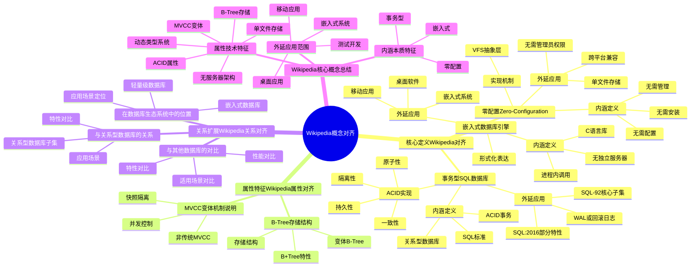
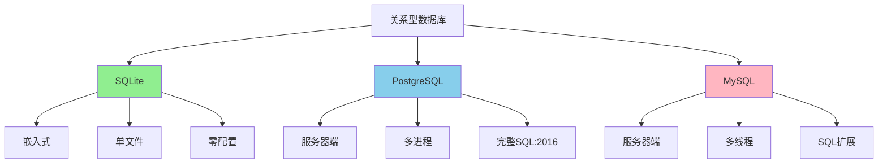

# Wikipedia概念对齐：定义、属性、内涵、外延

> **创建日期**：2025-11-13
> **最后更新**：2025-01-15
> **版本**：SQLite 3.31+ 至 3.47.x

---

## 1. 📋 概述

本文档对齐Wikipedia中SQLite的核心概念，包括定义、属性、内涵、外延和关系扩展。

---

## 2. 📑 目录

- [Wikipedia概念对齐：定义、属性、内涵、外延](#wikipedia概念对齐定义属性内涵外延)
  - [1. 📋 概述](#1--概述)
  - [2. 📑 目录](#2--目录)
  - [3. 📊 思维导图](#3--思维导图)
  - [4. 核心定义（Wikipedia对齐）](#4-核心定义wikipedia对齐)
    - [4.1. 嵌入式数据库引擎](#41-嵌入式数据库引擎)
    - [4.2. 零配置（Zero-Configuration）](#42-零配置zero-configuration)
    - [4.3. 事务型SQL数据库](#43-事务型sql数据库)
  - [5. 属性特征（Wikipedia属性对齐）](#5-属性特征wikipedia属性对齐)
    - [5.1. MVCC变体机制说明](#51-mvcc变体机制说明)
    - [5.2. B-Tree存储结构](#52-b-tree存储结构)
  - [6. 关系扩展（Wikipedia关系对齐）](#6-关系扩展wikipedia关系对齐)
    - [6.1. 与关系型数据库的关系](#61-与关系型数据库的关系)
    - [6.2. 在数据库生态系统中的位置](#62-在数据库生态系统中的位置)
    - [6.3. 与其他数据库的对比](#63-与其他数据库的对比)
  - [7. Wikipedia概念对齐多维对比矩阵](#7-wikipedia概念对齐多维对比矩阵)
    - [7.1. 概念定义对比矩阵](#71-概念定义对比矩阵)
    - [7.2. 属性特征对比矩阵](#72-属性特征对比矩阵)
    - [7.3. 应用场景对比矩阵](#73-应用场景对比矩阵)
  - [8. Wikipedia核心概念总结](#8-wikipedia核心概念总结)
    - [8.1. 内涵（本质特征）](#81-内涵本质特征)
    - [8.2. 外延（应用范围）](#82-外延应用范围)
    - [8.3. 属性（技术特征）](#83-属性技术特征)
  - [9. 🔗 相关资源](#9--相关资源)
  - [10. 🔗 交叉引用](#10--交叉引用)
    - [10.1. 理论模型 🆕](#101-理论模型-)
    - [10.2. 设计模型 🆕](#102-设计模型-)
    - [10.3. 标准对齐文档 🆕](#103-标准对齐文档-)
    - [10.4. 核心架构文档 🆕](#104-核心架构文档-)
    - [10.5. 知识图谱与导航 🆕](#105-知识图谱与导航-)
    - [10.6. 相关概念链接 🆕](#106-相关概念链接-)
      - [10.6.1. Wikipedia概念对齐](#1061-wikipedia概念对齐)
  - [11. 📚 参考资料](#11--参考资料)

---

## 3. 📊 思维导图



---

## 4. 核心定义（Wikipedia对齐）

根据Wikipedia的定义，SQLite具有以下**内涵**（本质特征）：

### 4.1. 嵌入式数据库引擎

**内涵**：作为C语言库嵌入到应用程序中，无需独立服务器进程

**外延**：

- 适用于移动应用、桌面软件、嵌入式系统
- 进程内调用，无网络协议开销
- 单文件存储，便于部署和备份

**形式化表达**：

```text
SQLite ∈ {Database Engine | Embedded ∧ Serverless}
```

### 4.2. 零配置（Zero-Configuration）

**内涵**：无需安装、配置、管理数据库服务器

**外延**：

- 单文件存储，自动创建
- 跨平台兼容（Windows、Linux、macOS等）
- 无需管理员权限

**实现机制**：通过VFS抽象层实现跨平台文件操作

### 4.3. 事务型SQL数据库

**内涵**：完全支持ACID事务，遵循SQL标准

**外延**：

- 支持SQL-92核心子集
- 支持SQL:2016部分特性（JSON、窗口函数等）
- 通过WAL或回滚日志保证ACID特性

**ACID实现**：

- **原子性**：通过WAL或回滚日志保证
- **一致性**：通过约束和触发器保证
- **隔离性**：通过快照隔离（Snapshot Isolation）实现
- **持久性**：通过fsync和日志机制保证

---

## 5. 属性特征（Wikipedia属性对齐）

| Wikipedia属性 | SQLite实现 | 技术细节 |
|-------------|----------|---------|
| **ACID属性** | ✅ 完全实现 | WAL模式或DELETE模式，通过Pager层保证 |
| **MVCC（多版本并发控制）** | ⚠️ 变体实现 | 快照隔离（Snapshot Isolation），非传统MVCC |
| **B-Tree存储** | ✅ 完全实现 | 变体B-Tree，支持B+Tree特性 |
| **动态类型系统** | ✅ 核心特性 | 5种存储类：NULL, INTEGER, REAL, TEXT, BLOB |
| **单文件存储** | ✅ 核心特性 | 数据库文件 + WAL文件 + SHM文件（WAL模式） |
| **无服务器架构** | ✅ 核心特性 | 进程内调用，无网络协议 |

### 5.1. MVCC变体机制说明

Wikipedia指出SQLite使用"快照隔离"而非传统MVCC。传统MVCC（如PostgreSQL）在存储层维护多版本数据，SQLite通过**日志机制**实现类似效果：

**传统MVCC（PostgreSQL）**：

```text
- 存储层：每个元组维护多个版本（xmin, xmax）
- 读操作：根据事务快照选择可见版本
- 写操作：创建新版本，旧版本由VACUUM清理
```

**SQLite快照隔离（变体MVCC）**：

```text
- 存储层：单版本数据（B-Tree页）
- 读操作：事务开始时获取快照（指向特定WAL帧）
- 写操作：写入WAL文件，读操作读取db文件（不冲突）
```

### 5.2. B-Tree存储结构

**Wikipedia描述**：SQLite使用B-Tree作为主要存储结构

**SQLite实现**：

- **表B-Tree**：存储表数据，rowid作为键
- **索引B-Tree**：存储索引数据，索引列作为键
- **变体B-Tree**：支持B+Tree特性，叶子节点存储数据

---

## 6. 关系扩展（Wikipedia关系对齐）

### 6.1. 与关系型数据库的关系



### 6.2. 在数据库生态系统中的位置

**按架构分类**：

- SQLite：嵌入式数据库（Embedded Database）
- PostgreSQL/MySQL：客户端-服务器数据库（Client-Server Database）

**按数据模型分类**：

- SQLite：关系型数据库（Relational Database）
- MongoDB：文档数据库（Document Database）
- Redis：键值数据库（Key-Value Database）

**按部署方式分类**：

- SQLite：进程内数据库（In-Process Database）
- PostgreSQL/MySQL：独立服务器数据库（Standalone Server Database）

### 6.3. 与其他数据库的对比

| 维度 | SQLite | PostgreSQL | MySQL | LevelDB |
|------|--------|------------|-------|---------|
| **架构** | 嵌入式 | C/S | C/S | 嵌入式 |
| **进程模型** | In-Process | Multi-Process | Multi-Thread | In-Process |
| **存储模型** | B-Tree | B-Tree + Heap | B+Tree | LSM-Tree |
| **事务隔离** | 快照隔离 | 完整MVCC | MVCC | 无多行事务 |
| **并发读写** | WAL下一写多读 | 完全读写并发 | 完全读写并发 | 一写多读 |

---

## 7. Wikipedia概念对齐多维对比矩阵

### 7.1. 概念定义对比矩阵

| 维度 | Wikipedia定义 | SQLite实现 | 对齐度 |
|------|-------------|-----------|--------|
| **嵌入式数据库** | 进程内调用，无独立服务器 | ✅ 完全符合 | ⭐⭐⭐⭐⭐ |
| **零配置** | 无需安装、配置、管理 | ✅ 完全符合 | ⭐⭐⭐⭐⭐ |
| **事务型SQL数据库** | ACID事务，SQL标准 | ✅ 完全符合 | ⭐⭐⭐⭐⭐ |
| **MVCC变体** | 快照隔离机制 | ✅ 完全符合 | ⭐⭐⭐⭐ |
| **B-Tree存储** | B-Tree/B+Tree结构 | ✅ 完全符合 | ⭐⭐⭐⭐⭐ |

### 7.2. 属性特征对比矩阵

| 属性 | Wikipedia描述 | SQLite实现 | 技术细节 |
|------|-------------|-----------|---------|
| **架构类型** | 嵌入式、单文件 | ✅ 单文件数据库 | 文件格式：SQLite Database File |
| **并发模型** | 一写多读 | ✅ WAL模式支持 | 5种锁状态：UNLOCKED→SHARED→RESERVED→PENDING→EXCLUSIVE |
| **存储结构** | B-Tree变体 | ✅ B-Tree/B+Tree | 表B-Tree存储数据，索引B-Tree存储索引 |
| **事务隔离** | 快照隔离 | ✅ 快照隔离 | 读操作看到事务开始时的快照 |

### 7.3. 应用场景对比矩阵

| 场景 | Wikipedia描述 | SQLite适用性 | 推荐度 |
|------|-------------|------------|--------|
| **移动应用** | 移动设备本地存储 | ⭐⭐⭐⭐⭐ | ⭐⭐⭐⭐⭐推荐 |
| **桌面软件** | 桌面应用数据存储 | ⭐⭐⭐⭐⭐ | ⭐⭐⭐⭐⭐推荐 |
| **嵌入式系统** | 嵌入式设备存储 | ⭐⭐⭐⭐⭐ | ⭐⭐⭐⭐⭐推荐 |
| **Web应用** | 小型Web应用 | ⭐⭐⭐ | ⭐⭐⭐推荐 |
| **高并发写** | 多写并发场景 | ❌ 不适用 | 不推荐 |

## 8. Wikipedia核心概念总结

### 8.1. 内涵（本质特征）

1. **嵌入式**：作为库嵌入应用程序
2. **零配置**：无需服务器和管理
3. **事务型**：完全支持ACID
4. **SQL兼容**：支持SQL标准核心子集

### 8.2. 外延（应用范围）

1. **移动应用**：Android/iOS本地存储
2. **桌面应用**：浏览器、办公软件
3. **嵌入式系统**：IoT设备、边缘计算
4. **测试环境**：单元测试、原型开发

### 8.3. 属性（技术特征）

1. **ACID保证**：通过WAL或回滚日志
2. **快照隔离**：变体MVCC实现
3. **B-Tree存储**：高效的索引结构
4. **动态类型**：灵活的存储类系统

---

## 9. 🔗 相关资源

- [Wikipedia - SQLite](https://en.wikipedia.org/wiki/SQLite)
- [Wikipedia - 关系型数据库](https://en.wikipedia.org/wiki/Relational_database)
- [Wikipedia - ACID](https://en.wikipedia.org/wiki/ACID)
- [Wikipedia - MVCC](https://en.wikipedia.org/wiki/Multiversion_concurrency_control)

---

## 10. 🔗 交叉引用

### 10.1. 理论模型 🆕

- ⭐⭐ [系统理论模型](../11-理论模型/11.01-系统理论模型.md) - 系统概念对齐
- ⭐ [数据模型理论](../11-理论模型/11.02-数据模型理论.md) - 数据模型概念对齐

### 10.2. 设计模型 🆕

- ⭐ [设计原则](../12-设计模型/12.02-设计原则.md) - 设计概念对齐

### 10.3. 标准对齐文档 🆕

- ⭐⭐⭐ [SQL标准对齐](./07.01-SQL标准对齐.md) - SQL标准对齐（含交叉引用）
- ⭐⭐ [学术研究参考](./07.04-学术研究参考.md) - 学术研究参考

### 10.4. 核心架构文档 🆕

- ⭐⭐ [核心机制全景图](../01-核心架构/01.05-SQLite核心机制全景图-多维度整合分析.md) - 核心机制概念对齐
- ⭐⭐ [事务与并发控制](../01-核心架构/01.02-事务与并发控制.md) - 事务概念对齐

### 10.5. 知识图谱与导航 🆕

- ⭐⭐⭐ [知识图谱与概念关系网络](../09-最新特性/09.03-SQLite知识图谱与概念关系网络.md) - Wikipedia概念对齐关系（400+概念）
- ⭐⭐ [文档依赖关系图](../00-项目导航/06-文档依赖关系图.md) - Wikipedia概念对齐文档依赖
- ⭐⭐ [术语标准化词典](../00-项目导航/03-术语词典/SQLite术语标准化词典.md) - Wikipedia概念术语索引

### 10.6. 相关概念链接 🆕

#### 10.6.1. Wikipedia概念对齐

- **SQLite概念** → [知识图谱：SQLite核心概念](../09-最新特性/09.03-SQLite知识图谱与概念关系网络.md#核心本体)
- **数据库概念** → [知识图谱：数据库概念](../09-最新特性/09.03-SQLite知识图谱与概念关系网络.md#核心本体)
- **标准对齐** → [SQL标准对齐](./07.01-SQL标准对齐.md)

---

## 11. 📚 参考资料

- [SQLite官方文档](https://www.sqlite.org/docs.html)
- [Wikipedia SQLite条目](https://en.wikipedia.org/wiki/SQLite)
- [数据库系统概念](https://en.wikipedia.org/wiki/Database)

---

**最后更新**：2025-01-15
**维护者**：Data-Science Team
