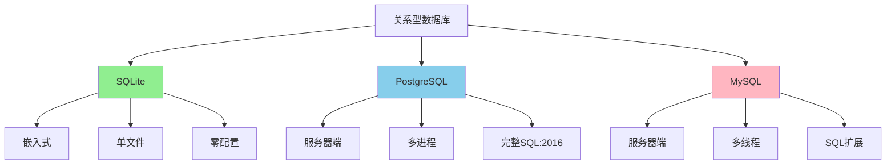

# Wikipedia概念对齐：定义、属性、内涵、外延

> **创建日期**：2025-11-13
> **最后更新**：2025-11-13
> **版本**：SQLite 3.31+ 至 3.47+

---

## 📋 概述

本文档对齐Wikipedia中SQLite的核心概念，包括定义、属性、内涵、外延和关系扩展。

---

## 一、核心定义（Wikipedia对齐）

根据Wikipedia的定义，SQLite具有以下**内涵**（本质特征）：

### 1.1 嵌入式数据库引擎

**内涵**：作为C语言库嵌入到应用程序中，无需独立服务器进程

**外延**：

- 适用于移动应用、桌面软件、嵌入式系统
- 进程内调用，无网络协议开销
- 单文件存储，便于部署和备份

**形式化表达**：

```text
SQLite ∈ {Database Engine | Embedded ∧ Serverless}
```

### 1.2 零配置（Zero-Configuration）

**内涵**：无需安装、配置、管理数据库服务器

**外延**：

- 单文件存储，自动创建
- 跨平台兼容（Windows、Linux、macOS等）
- 无需管理员权限

**实现机制**：通过VFS抽象层实现跨平台文件操作

### 1.3 事务型SQL数据库

**内涵**：完全支持ACID事务，遵循SQL标准

**外延**：

- 支持SQL-92核心子集
- 支持SQL:2016部分特性（JSON、窗口函数等）
- 通过WAL或回滚日志保证ACID特性

**ACID实现**：

- **原子性**：通过WAL或回滚日志保证
- **一致性**：通过约束和触发器保证
- **隔离性**：通过快照隔离（Snapshot Isolation）实现
- **持久性**：通过fsync和日志机制保证

---

## 二、属性特征（Wikipedia属性对齐）

| Wikipedia属性 | SQLite实现 | 技术细节 |
|-------------|----------|---------|
| **ACID属性** | ✅ 完全实现 | WAL模式或DELETE模式，通过Pager层保证 |
| **MVCC（多版本并发控制）** | ⚠️ 变体实现 | 快照隔离（Snapshot Isolation），非传统MVCC |
| **B-Tree存储** | ✅ 完全实现 | 变体B-Tree，支持B+Tree特性 |
| **动态类型系统** | ✅ 核心特性 | 5种存储类：NULL, INTEGER, REAL, TEXT, BLOB |
| **单文件存储** | ✅ 核心特性 | 数据库文件 + WAL文件 + SHM文件（WAL模式） |
| **无服务器架构** | ✅ 核心特性 | 进程内调用，无网络协议 |

### 2.1 MVCC变体机制说明

Wikipedia指出SQLite使用"快照隔离"而非传统MVCC。传统MVCC（如PostgreSQL）在存储层维护多版本数据，SQLite通过**日志机制**实现类似效果：

**传统MVCC（PostgreSQL）**：

```text
- 存储层：每个元组维护多个版本（xmin, xmax）
- 读操作：根据事务快照选择可见版本
- 写操作：创建新版本，旧版本由VACUUM清理
```

**SQLite快照隔离（变体MVCC）**：

```text
- 存储层：单版本数据（B-Tree页）
- 读操作：事务开始时获取快照（指向特定WAL帧）
- 写操作：写入WAL文件，读操作读取db文件（不冲突）
```

### 2.2 B-Tree存储结构

**Wikipedia描述**：SQLite使用B-Tree作为主要存储结构

**SQLite实现**：

- **表B-Tree**：存储表数据，rowid作为键
- **索引B-Tree**：存储索引数据，索引列作为键
- **变体B-Tree**：支持B+Tree特性，叶子节点存储数据

---

## 三、关系扩展（Wikipedia关系对齐）

### 3.1 与关系型数据库的关系



### 3.2 在数据库生态系统中的位置

**按架构分类**：

- SQLite：嵌入式数据库（Embedded Database）
- PostgreSQL/MySQL：客户端-服务器数据库（Client-Server Database）

**按数据模型分类**：

- SQLite：关系型数据库（Relational Database）
- MongoDB：文档数据库（Document Database）
- Redis：键值数据库（Key-Value Database）

**按部署方式分类**：

- SQLite：进程内数据库（In-Process Database）
- PostgreSQL/MySQL：独立服务器数据库（Standalone Server Database）

### 3.3 与其他数据库的对比

| 维度 | SQLite | PostgreSQL | MySQL | LevelDB |
|------|--------|------------|-------|---------|
| **架构** | 嵌入式 | C/S | C/S | 嵌入式 |
| **进程模型** | In-Process | Multi-Process | Multi-Thread | In-Process |
| **存储模型** | B-Tree | B-Tree + Heap | B+Tree | LSM-Tree |
| **事务隔离** | 快照隔离 | 完整MVCC | MVCC | 无多行事务 |
| **并发读写** | WAL下一写多读 | 完全读写并发 | 完全读写并发 | 一写多读 |

---

## 四、Wikipedia核心概念总结

### 4.1 内涵（本质特征）

1. **嵌入式**：作为库嵌入应用程序
2. **零配置**：无需服务器和管理
3. **事务型**：完全支持ACID
4. **SQL兼容**：支持SQL标准核心子集

### 4.2 外延（应用范围）

1. **移动应用**：Android/iOS本地存储
2. **桌面应用**：浏览器、办公软件
3. **嵌入式系统**：IoT设备、边缘计算
4. **测试环境**：单元测试、原型开发

### 4.3 属性（技术特征）

1. **ACID保证**：通过WAL或回滚日志
2. **快照隔离**：变体MVCC实现
3. **B-Tree存储**：高效的索引结构
4. **动态类型**：灵活的存储类系统

---

## 🔗 相关资源

- [Wikipedia - SQLite](https://en.wikipedia.org/wiki/SQLite)
- [Wikipedia - 关系型数据库](https://en.wikipedia.org/wiki/Relational_database)
- [Wikipedia - ACID](https://en.wikipedia.org/wiki/ACID)
- [Wikipedia - MVCC](https://en.wikipedia.org/wiki/Multiversion_concurrency_control)

---

## 📚 参考资料

- [SQLite官方文档](https://www.sqlite.org/docs.html)
- [Wikipedia SQLite条目](https://en.wikipedia.org/wiki/SQLite)
- [数据库系统概念](https://en.wikipedia.org/wiki/Database)

---

**最后更新**：2025-11-13
**维护者**：Data-Science Team
