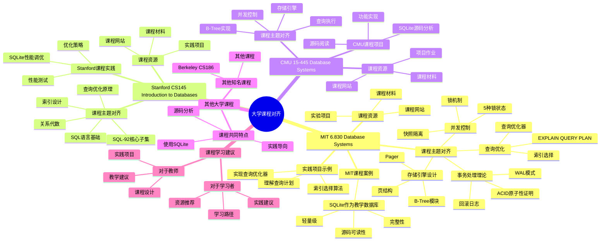

# 大学课程内容对齐

> **创建日期**：2025-11-13
> **最后更新**：2025-01-15
> **版本**：SQLite 3.31+ 至 3.47.x

---

## 📋 概述

本文档对齐MIT、Stanford、CMU等著名大学的数据库系统课程内容，说明SQLite在课程教学中的应用。

---

## 📑 目录

- [大学课程内容对齐](#大学课程内容对齐)
  - [📋 概述](#-概述)
  - [📑 目录](#-目录)
  - [📊 思维导图](#-思维导图)
  - [一、MIT 6.830 Database Systems](#一mit-6830-database-systems)
    - [1.1 课程主题对齐](#11-课程主题对齐)
    - [1.2 MIT课程案例：SQLite作为教学数据库](#12-mit课程案例sqlite作为教学数据库)
    - [1.3 实践项目示例](#13-实践项目示例)
    - [1.4 课程资源](#14-课程资源)
  - [二、Stanford CS145 Introduction to Databases](#二stanford-cs145-introduction-to-databases)
    - [2.1 课程主题对齐](#21-课程主题对齐)
    - [2.2 Stanford课程实践：SQLite性能调优](#22-stanford课程实践sqlite性能调优)
    - [2.3 课程资源](#23-课程资源)
  - [三、CMU 15-445 Database Systems](#三cmu-15-445-database-systems)
    - [3.1 课程主题对齐](#31-课程主题对齐)
    - [3.2 CMU课程项目：SQLite源码分析](#32-cmu课程项目sqlite源码分析)
    - [3.3 课程资源](#33-课程资源)
  - [四、其他大学课程](#四其他大学课程)
    - [4.1 其他知名课程](#41-其他知名课程)
    - [4.2 课程共同特点](#42-课程共同特点)
  - [五、大学课程对齐多维对比矩阵](#五大学课程对齐多维对比矩阵)
    - [5.1 课程主题对齐对比矩阵](#51-课程主题对齐对比矩阵)
    - [5.2 课程实践项目对比矩阵](#52-课程实践项目对比矩阵)
    - [5.3 课程难度与SQLite学习路径对比矩阵](#53-课程难度与sqlite学习路径对比矩阵)
  - [六、课程学习建议](#六课程学习建议)
    - [6.1 对于学习者](#61-对于学习者)
    - [6.2 对于教师](#62-对于教师)
  - [🔗 相关资源](#-相关资源)
  - [📚 参考资料](#-参考资料)

---

## 📊 思维导图



---

## 一、MIT 6.830 Database Systems

### 1.1 课程主题对齐

| MIT 6.830主题 | SQLite对应实现 | 学习重点 |
|-------------|--------------|---------|
| **事务处理理论** | WAL模式、回滚日志 | ACID原子性证明、崩溃恢复 |
| **存储引擎设计** | B-Tree模块、Pager | 页结构、B-Tree分裂算法 |
| **查询优化** | 查询优化器、索引选择 | EXPLAIN QUERY PLAN分析 |
| **并发控制** | 锁机制、快照隔离 | 5种锁状态、WAL并发模型 |

### 1.2 MIT课程案例：SQLite作为教学数据库

MIT 6.830课程使用SQLite作为实践平台，原因：

- **源码可读性**：C语言实现，代码结构清晰
- **完整性**：包含完整的数据库系统组件
- **轻量级**：易于编译、调试、修改

### 1.3 实践项目示例

**MIT 6.830项目：实现简单的查询优化器**:

```c
// 目标：理解SQLite查询优化器的工作原理

// 1. 分析查询计划
EXPLAIN QUERY PLAN
SELECT * FROM orders
WHERE user_id = 123 AND status = 'pending';

// 输出：
// SEARCH orders USING INDEX idx_user_status (user_id=? AND status=?)

// 2. 理解索引选择算法
// SQLite使用代价估算模型：
// cost = rows_scanned × disk_io_cost + index_lookup_cost
```

### 1.4 课程资源

- **课程网站**：<https://mit.edu/6.830/>
- **课程材料**：包含SQLite源码分析作业
- **实验项目**：基于SQLite实现数据库功能

---

## 二、Stanford CS145 Introduction to Databases

### 2.1 课程主题对齐

| Stanford CS145主题 | SQLite对应内容 | 实践建议 |
|------------------|--------------|---------|
| **SQL语言基础** | SQL-92核心子集 | 练习DDL、DML、事务控制 |
| **关系代数** | SELECT查询实现 | 理解JOIN、UNION、子查询 |
| **查询优化原理** | 查询优化器 | 使用EXPLAIN分析执行计划 |
| **索引设计** | B-Tree索引 | 覆盖索引、部分索引优化 |

### 2.2 Stanford课程实践：SQLite性能调优

**Stanford CS145作业：优化慢查询**:

```sql
-- 原始查询（全表扫描）
SELECT * FROM users WHERE email = 'alice@example.com';
-- 执行计划：SCAN TABLE users

-- 优化1：创建索引
CREATE INDEX idx_email ON users(email);
-- 执行计划：SEARCH users USING INDEX idx_email (email=?)

-- 优化2：覆盖索引（避免回表）
CREATE INDEX idx_email_covering ON users(email, name, age);
SELECT email, name, age FROM users WHERE email = 'alice@example.com';
-- 执行计划：SEARCH users USING COVERING INDEX idx_email_covering
```

### 2.3 课程资源

- **课程网站**：<https://cs145.stanford.edu/>
- **在线课程**：提供视频和作业
- **实践项目**：使用SQLite进行数据库设计

---

## 三、CMU 15-445 Database Systems

### 3.1 课程主题对齐

| CMU 15-445主题 | SQLite实现细节 | 源码位置 |
|--------------|--------------|---------|
| **B-Tree索引实现** | btree.c | 表B-Tree、索引B-Tree |
| **并发控制算法** | pager.c, wal.c | WAL模式、锁机制 |
| **查询执行引擎** | vdbe.c | VDBE虚拟机、操作码 |
| **存储管理** | pager.c | 页缓存、脏页管理 |

### 3.2 CMU课程项目：SQLite源码分析

CMU 15-445要求学生分析SQLite源码，理解数据库系统实现：

```c
// CMU 15-445项目：分析SQLite B-Tree插入算法

// 源码位置：btree.c
// 关键函数：sqlite3BtreeInsert()

// 1. 查找插入位置
// 2. 检查页面空间
// 3. 执行插入（可能触发分裂）
// 4. 更新父节点指针

// 学生任务：
// - 理解B-Tree分裂算法
// - 分析时间复杂度
// - 实现简单的B-Tree插入函数
```

### 3.3 课程资源

- **课程网站**：<https://15445.courses.cs.cmu.edu/>
- **课程视频**：YouTube公开课程
- **实验项目**：基于SQLite的数据库系统实现

---

## 四、其他大学课程

### 4.1 其他知名课程

| 大学 | 课程 | SQLite应用 |
|------|------|-----------|
| **UC Berkeley** | CS186 Introduction to Database Systems | 数据库系统设计项目 |
| **UIUC** | CS411 Database Systems | SQLite性能分析 |
| **UT Austin** | CS347 Database Systems | SQLite源码阅读 |

### 4.2 课程共同特点

1. **源码分析**：要求学生阅读SQLite源码
2. **实践项目**：基于SQLite实现数据库功能
3. **性能调优**：使用SQLite进行性能优化实验
4. **理论验证**：通过SQLite验证数据库理论

---

## 五、大学课程对齐多维对比矩阵

### 5.1 课程主题对齐对比矩阵

| 主题 | MIT 6.830 | Stanford CS145 | CMU 15-445 | SQLite对应内容 |
|------|----------|---------------|-------------|--------------|
| **事务处理** | ⭐⭐⭐⭐⭐ | ⭐⭐⭐⭐ | ⭐⭐⭐⭐⭐ | WAL模式、回滚日志 |
| **存储引擎** | ⭐⭐⭐⭐⭐ | ⭐⭐⭐ | ⭐⭐⭐⭐⭐ | B-Tree、Pager |
| **查询优化** | ⭐⭐⭐⭐ | ⭐⭐⭐⭐⭐ | ⭐⭐⭐⭐ | EXPLAIN QUERY PLAN |
| **并发控制** | ⭐⭐⭐⭐ | ⭐⭐⭐ | ⭐⭐⭐⭐⭐ | 锁机制、快照隔离 |
| **索引设计** | ⭐⭐⭐⭐ | ⭐⭐⭐⭐⭐ | ⭐⭐⭐⭐ | B-Tree索引、覆盖索引 |

### 5.2 课程实践项目对比矩阵

| 项目类型 | MIT 6.830 | Stanford CS145 | CMU 15-445 | SQLite适用性 |
|------|----------|---------------|-------------|------------|
| **查询优化器** | ⭐⭐⭐⭐⭐ | ⭐⭐⭐⭐ | ⭐⭐⭐⭐ | ⭐⭐⭐⭐⭐推荐 |
| **存储引擎** | ⭐⭐⭐⭐⭐ | ⭐⭐⭐ | ⭐⭐⭐⭐⭐ | ⭐⭐⭐⭐⭐推荐 |
| **并发控制** | ⭐⭐⭐⭐ | ⭐⭐⭐ | ⭐⭐⭐⭐⭐ | ⭐⭐⭐⭐推荐 |
| **索引设计** | ⭐⭐⭐⭐ | ⭐⭐⭐⭐⭐ | ⭐⭐⭐⭐ | ⭐⭐⭐⭐⭐推荐 |
| **性能调优** | ⭐⭐⭐ | ⭐⭐⭐⭐⭐ | ⭐⭐⭐ | ⭐⭐⭐⭐⭐推荐 |

### 5.3 课程难度与SQLite学习路径对比矩阵

| 难度 | 课程 | SQLite学习内容 | 推荐学习顺序 |
|------|------|--------------|------------|
| **入门** | Stanford CS145 | SQL基础、简单查询 | 1. 数据类型系统<br>2. 基本SQL操作 |
| **进阶** | MIT 6.830 | 事务处理、存储引擎 | 3. 事务管理<br>4. 存储引擎 |
| **高级** | CMU 15-445 | 源码分析、并发控制 | 5. 并发控制<br>6. 源码分析 |

## 六、课程学习建议

### 6.1 对于学习者

1. **跟随课程**：选择一门数据库系统课程
2. **阅读源码**：深入理解SQLite实现
3. **实践项目**：完成课程实验和作业
4. **理论结合**：将理论知识与SQLite实现对应

### 6.2 对于教师

1. **使用SQLite**：作为教学数据库系统
2. **源码教学**：通过SQLite源码讲解数据库原理
3. **实践项目**：设计基于SQLite的实验
4. **理论验证**：用SQLite验证数据库理论

---

## 🔗 相关资源

- [MIT 6.830 Database Systems](https://mit.edu/6.830/)
- [Stanford CS145 Introduction to Databases](https://cs145.stanford.edu/)
- [CMU 15-445 Database Systems](https://15445.courses.cs.cmu.edu/)
- [SQLite官方文档](https://www.sqlite.org/docs.html)

---

## 🔗 交叉引用

### 理论模型 🆕

- ⭐⭐⭐ [系统理论模型](../11-理论模型/11.01-系统理论模型.md) - 系统架构理论、课程内容对齐
- ⭐⭐ [数据模型理论](../11-理论模型/11.02-数据模型理论.md) - 关系模型理论、课程内容对齐
- ⭐⭐ [并发控制理论](../11-理论模型/11.04-并发控制理论.md) - 事务理论、课程内容对齐
- ⭐ [算法复杂度理论](../11-理论模型/11.03-算法复杂度理论.md) - 算法理论、课程内容对齐

### 设计模型 🆕

- ⭐⭐ [架构设计模型](../12-设计模型/12.01-架构设计模型.md) - 架构设计、课程内容对齐
- ⭐ [设计原则](../12-设计模型/12.02-设计原则.md) - 设计原则、课程内容对齐

---

## 📚 参考资料

- [数据库系统课程列表](https://github.com/rxin/db-readings)
- [SQLite源码阅读指南](https://www.sqlite.org/arch.html)
- [数据库系统实现](https://www.sqlite.org/arch.html)

---

**最后更新**：2025-01-15
**维护者**：Data-Science Team
