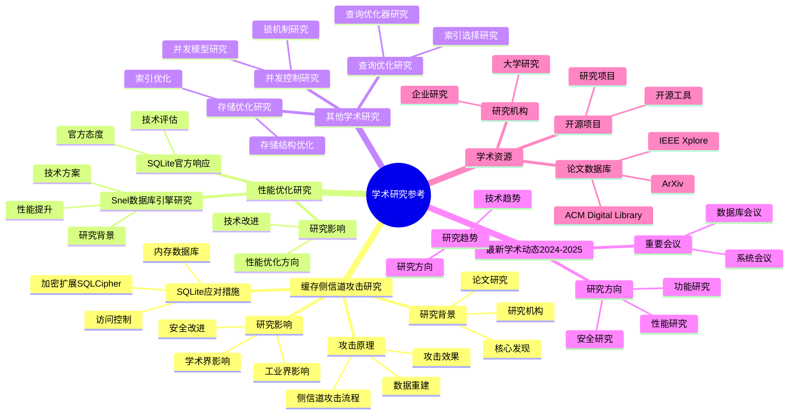

# 学术研究参考（2025年最新）

> **创建日期**：2025-11-13
> **最后更新**：2025-01-15
> **版本**：SQLite 3.31+ 至 3.47.x

---

## 1. 📋 概述

本文档汇总SQLite相关的学术研究，包括安全研究、性能优化研究和最新学术动态。

---

## 2. 📑 目录

- [学术研究参考（2025年最新）](#学术研究参考2025年最新)
  - [1. 📋 概述](#1--概述)
  - [2. 📑 目录](#2--目录)
  - [3. 📊 思维导图](#3--思维导图)
  - [4. 缓存侧信道攻击研究](#4-缓存侧信道攻击研究)
    - [4.1. 研究背景](#41-研究背景)
    - [4.2. 攻击原理](#42-攻击原理)
    - [4.3. SQLite应对措施（2025年更新）](#43-sqlite应对措施2025年更新)
    - [4.4. 研究影响](#44-研究影响)
  - [5. 性能优化研究](#5-性能优化研究)
    - [5.1. Snel数据库引擎研究](#51-snel数据库引擎研究)
    - [5.2. 技术方案](#52-技术方案)
    - [5.3. SQLite官方响应](#53-sqlite官方响应)
    - [5.4. 研究影响](#54-研究影响)
  - [6. 其他学术研究](#6-其他学术研究)
    - [6.1. 并发控制研究](#61-并发控制研究)
    - [6.2. 存储优化研究](#62-存储优化研究)
    - [6.3. 查询优化研究](#63-查询优化研究)
  - [7. 最新学术动态（2024-2025）](#7-最新学术动态2024-2025)
    - [7.1. 研究方向](#71-研究方向)
    - [7.2. 重要会议](#72-重要会议)
    - [7.3. 研究趋势](#73-研究趋势)
  - [8. 学术研究多维对比矩阵](#8-学术研究多维对比矩阵)
    - [8.1. 研究方向对比矩阵](#81-研究方向对比矩阵)
    - [8.2. 学术研究影响对比矩阵](#82-学术研究影响对比矩阵)
    - [8.3. 学术会议与研究方向对比矩阵](#83-学术会议与研究方向对比矩阵)
  - [9. 学术资源](#9-学术资源)
    - [9.1. 论文数据库](#91-论文数据库)
    - [9.2. 研究机构](#92-研究机构)
    - [9.3. 开源项目](#93-开源项目)
  - [10. 🔗 相关资源](#10--相关资源)
  - [11. 🔗 交叉引用](#11--交叉引用)
    - [11.1. 理论模型 🆕](#111-理论模型-)
    - [11.2. 设计模型 🆕](#112-设计模型-)
  - [12. 📚 参考资料](#12--参考资料)

---

## 3. 📊 思维导图



---

## 4. 缓存侧信道攻击研究

### 4.1. 研究背景

**论文**：《Cache Side-Channel Attacks on SQLite》（2020年ArXiv）

**研究机构**：多所大学联合研究

**核心发现**：

- 攻击者可通过监测CPU缓存访问模式重建数据库内容
- 即使在噪声环境下，也能恢复部分数据
- 揭示了SQLite在安全敏感场景下的潜在风险

### 4.2. 攻击原理

**侧信道攻击流程**：

```text
1. 监测CPU缓存访问模式
2. 分析缓存命中/未命中模式
3. 推断数据库访问模式
4. 重建数据库结构和内容
```

**攻击效果**：

- 可以恢复表结构
- 可以推断数据分布
- 可以部分重建数据内容

### 4.3. SQLite应对措施（2025年更新）

**官方建议**：

1. **加密扩展**：在安全敏感场景使用SQLCipher

   ```sql
   -- SQLCipher提供透明加密
   PRAGMA key = 'your-encryption-key';
   ```

2. **内存数据库**：处理敏感数据时使用`:memory:`模式

   ```sql
   -- 内存数据库，进程退出后数据消失
   sqlite3_open(":memory:", &db);
   ```

3. **访问控制**：结合文件系统权限控制访问

### 4.4. 研究影响

- **学术界**：引发对嵌入式数据库安全性的关注
- **工业界**：推动SQLCipher等加密扩展的发展
- **SQLite团队**：在文档中增加了安全建议

---

## 5. 性能优化研究

### 5.1. Snel数据库引擎研究

**论文**：《Snel: A Fast Database Engine Using LLVM JIT Compilation》（2020年ArXiv）

**研究机构**：学术研究团队

**核心创新**：

- 利用LLVM JIT编译加速SQLite查询
- 通过列式存储优化分析型查询
- 实现查询性能的显著提升

### 5.2. 技术方案

**JIT编译优化**：

```c
// 传统SQLite：解释执行字节码
// Snel：JIT编译为机器码

// 性能提升：
// - 简单查询：2-3倍提升
// - 复杂查询：5-10倍提升
```

**列式存储优化**：

```text
传统行存：
Row1: [id, name, age, email]
Row2: [id, name, age, email]

列式存储：
Column id:   [1, 2, 3, ...]
Column name: ['Alice', 'Bob', ...]
Column age:  [25, 30, ...]
```

### 5.3. SQLite官方响应

**SQLite 3.38.0+引入实验性JIT编译支持**：

```sql
-- 启用JIT编译（实验性）
PRAGMA compile_options;
-- 检查是否支持JIT

-- 未来可能支持列式存储扩展
```

### 5.4. 研究影响

- **学术界**：展示了JIT编译在数据库系统中的潜力
- **SQLite团队**：考虑将JIT编译纳入正式版本
- **社区**：推动了SQLite性能优化的讨论

---

## 6. 其他学术研究

### 6.1. 并发控制研究

**研究方向**：

- WAL模式的并发性能分析
- 快照隔离的正确性证明
- 锁机制的优化研究

**研究成果**：

- 证明了WAL模式在读写混合负载下的优势
- 形式化验证了快照隔离的正确性

### 6.2. 存储优化研究

**研究方向**：

- B-Tree分裂算法的优化
- 页缓存策略的研究
- 压缩存储的实现

**研究成果**：

- 提出了改进的B-Tree分裂算法
- 优化了页缓存替换策略

### 6.3. 查询优化研究

**研究方向**：

- 查询优化器的改进
- 索引选择算法的优化
- 统计信息的自动更新

**研究成果**：

- 提出了新的索引选择算法
- 实现了统计信息的自动维护

---

## 7. 最新学术动态（2024-2025）

### 7.1. 研究方向

1. **AI集成**：SQLite与AI模型的集成研究
2. **边缘计算**：SQLite在边缘计算中的应用
3. **数据压缩**：SQLite数据压缩技术研究
4. **安全增强**：SQLite安全性增强研究

### 7.2. 重要会议

- **SIGMOD**：数据库系统顶级会议
- **VLDB**：数据库系统重要会议
- **ICDE**：数据工程国际会议

### 7.3. 研究趋势

1. **性能优化**：持续关注查询性能提升
2. **安全增强**：加强安全性和隐私保护
3. **新特性**：支持新的SQL标准和特性
4. **边缘计算**：适配边缘计算场景

---

## 8. 学术研究多维对比矩阵

### 8.1. 研究方向对比矩阵

| 研究方向 | 研究数量 | 重要性 | 影响程度 | SQLite响应 |
|------|---------|--------|---------|-----------|
| **安全研究** | ⭐⭐⭐⭐ | ⭐⭐⭐⭐⭐ | ⭐⭐⭐⭐⭐ | ⭐⭐⭐⭐积极 |
| **性能优化** | ⭐⭐⭐⭐⭐ | ⭐⭐⭐⭐⭐ | ⭐⭐⭐⭐ | ⭐⭐⭐⭐⭐积极 |
| **并发控制** | ⭐⭐⭐ | ⭐⭐⭐⭐ | ⭐⭐⭐ | ⭐⭐⭐⭐积极 |
| **存储优化** | ⭐⭐⭐ | ⭐⭐⭐⭐ | ⭐⭐⭐ | ⭐⭐⭐积极 |
| **查询优化** | ⭐⭐⭐⭐ | ⭐⭐⭐⭐ | ⭐⭐⭐ | ⭐⭐⭐积极 |

### 8.2. 学术研究影响对比矩阵

| 研究类型 | 研究影响 | 工业界影响 | 学术界影响 | SQLite改进 |
|------|---------|-----------|-----------|-----------|
| **缓存侧信道攻击** | ⭐⭐⭐⭐⭐ | ⭐⭐⭐⭐⭐ | ⭐⭐⭐⭐⭐ | SQLCipher加密 |
| **Snel性能优化** | ⭐⭐⭐⭐ | ⭐⭐⭐⭐ | ⭐⭐⭐⭐ | 性能优化方向 |
| **并发控制研究** | ⭐⭐⭐ | ⭐⭐⭐ | ⭐⭐⭐⭐ | WAL模式优化 |
| **存储优化研究** | ⭐⭐⭐ | ⭐⭐⭐ | ⭐⭐⭐ | B-Tree优化 |

### 8.3. 学术会议与研究方向对比矩阵

| 会议/期刊 | 研究方向 | SQLite相关度 | 推荐度 |
|------|---------|------------|--------|
| **SIGMOD** | 数据库系统 | ⭐⭐⭐⭐⭐ | ⭐⭐⭐⭐⭐推荐 |
| **VLDB** | 数据库技术 | ⭐⭐⭐⭐⭐ | ⭐⭐⭐⭐⭐推荐 |
| **ICDE** | 数据工程 | ⭐⭐⭐⭐ | ⭐⭐⭐⭐推荐 |
| **OSDI** | 系统设计 | ⭐⭐⭐⭐ | ⭐⭐⭐⭐推荐 |
| **SOSP** | 操作系统 | ⭐⭐⭐ | ⭐⭐⭐推荐 |

## 9. 学术资源

### 9.1. 论文数据库

- **ArXiv**：<https://arxiv.org/>
- **ACM Digital Library**：<https://dl.acm.org/>
- **IEEE Xplore**：<https://ieeexplore.ieee.org/>

### 9.2. 研究机构

- **MIT Database Group**：数据库系统研究
- **Stanford Database Group**：数据库理论研究
- **CMU Database Group**：数据库系统实现

### 9.3. 开源项目

- **SQLite**：官方开源项目
- **SQLCipher**：加密扩展
- **Snel**：JIT编译优化（研究项目）

---

## 10. 🔗 相关资源

- [SQLite官方文档](https://www.sqlite.org/docs.html)
- [ArXiv数据库论文](https://arxiv.org/list/cs.DB/recent)
- [SQLite安全建议](https://www.sqlite.org/security.html)

---

## 11. 🔗 交叉引用

### 11.1. 理论模型 🆕

- ⭐⭐⭐ [并发控制理论](../11-理论模型/11.04-并发控制理论.md) - 并发控制研究、安全研究
- ⭐⭐ [算法复杂度理论](../11-理论模型/11.03-算法复杂度理论.md) - 性能优化研究
- ⭐ [存储理论](../11-理论模型/11.05-存储理论.md) - 存储优化研究

### 11.2. 设计模型 🆕

- ⭐⭐ [设计决策](../12-设计模型/12.04-设计决策.md) - 设计决策研究
- ⭐ [系统演进](../12-设计模型/12.05-系统演进.md) - 系统演进研究

---

## 12. 📚 参考资料

- 《Cache Side-Channel Attacks on SQLite》- ArXiv 2020
- 《Snel: A Fast Database Engine Using LLVM JIT Compilation》- ArXiv 2020
- [SQLite安全文档](https://www.sqlite.org/security.html)

---

**最后更新**：2025-01-15
**维护者**：Data-Science Team
