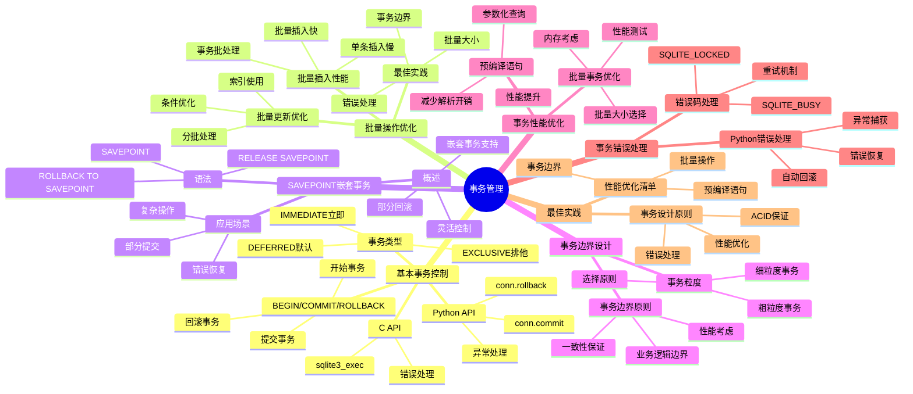

# 事务管理：批量操作与性能优化

> **创建日期**：2025-11-13
> **最后更新**：2025-01-15
> **版本**：SQLite 3.31+ 至 3.47.x

---

## 1. 📋 概述

事务管理是SQLite性能优化的关键。
本文档深入解析事务控制、批量操作优化和嵌套事务的使用。

---

## 1. 📑 目录

- [事务管理：批量操作与性能优化](#事务管理批量操作与性能优化)
  - [1. 📋 概述](#1--概述)
  - [1. 📑 目录](#1--目录)
  - [3. 📊 思维导图](#3--思维导图)
  - [4. 基本事务控制](#4-基本事务控制)
    - [4.1. BEGIN/COMMIT/ROLLBACK](#41-begincommitrollback)
    - [4.2. 事务类型](#42-事务类型)
  - [5. 批量操作优化](#5-批量操作优化)
    - [5.1. 批量插入性能对比](#51-批量插入性能对比)
  - [6. 批量更新优化](#6-批量更新优化)
  - [7. 批量操作最佳实践](#7-批量操作最佳实践)
  - [8. SAVEPOINT嵌套事务](#8-savepoint嵌套事务)
    - [8.1. SAVEPOINT概述](#81-savepoint概述)
    - [8.2. 应用场景](#82-应用场景)
  - [9. 事务边界设计](#9-事务边界设计)
    - [9.1. 事务粒度](#91-事务粒度)
  - [10. 事务边界原则](#10-事务边界原则)
  - [11. 事务性能优化](#11-事务性能优化)
    - [11.1. 批量事务优化](#111-批量事务优化)
  - [12. 预编译语句](#12-预编译语句)
  - [13. 事务错误处理](#13-事务错误处理)
    - [13.1. 错误码处理](#131-错误码处理)
    - [13.2. Python错误处理](#132-python错误处理)
  - [14. 事务管理多维对比矩阵](#14-事务管理多维对比矩阵)
    - [14.1. 事务类型多维对比矩阵](#141-事务类型多维对比矩阵)
    - [14.2. 批量操作策略对比矩阵](#142-批量操作策略对比矩阵)
    - [14.3. SAVEPOINT vs 嵌套事务对比矩阵](#143-savepoint-vs-嵌套事务对比矩阵)
    - [14.4. 事务最佳实践](#144-事务最佳实践)
    - [14.5. 事务设计原则](#145-事务设计原则)
    - [14.6. 性能优化清单](#146-性能优化清单)
  - [15. 🔗 相关资源](#15--相关资源)
  - [16. 🔗 交叉引用](#16--交叉引用)
    - [16.1. 理论模型 🆕](#161-理论模型-)
    - [16.2. 设计模型 🆕](#162-设计模型-)
  - [17. 📚 参考资料](#17--参考资料)

---

## 3. 📊 思维导图



---

## 4. 基本事务控制

### 4.1. BEGIN/COMMIT/ROLLBACK

**基本语法**：

```sql
-- 开始事务
BEGIN TRANSACTION;

-- 执行操作
INSERT INTO users (name, email) VALUES ('Alice', 'alice@example.com');
UPDATE accounts SET balance = balance - 100 WHERE user_id = 1;

-- 提交事务
COMMIT;

-- 或回滚事务
ROLLBACK;
```

**C API**：

```c
// 开始事务
sqlite3_exec(db, "BEGIN TRANSACTION;", NULL, NULL, NULL);

// 执行操作
sqlite3_exec(db, "INSERT INTO users ...", NULL, NULL, NULL);
sqlite3_exec(db, "UPDATE accounts ...", NULL, NULL, NULL);

// 提交或回滚
int rc = sqlite3_exec(db, "COMMIT;", NULL, NULL, NULL);
if (rc != SQLITE_OK) {
    sqlite3_exec(db, "ROLLBACK;", NULL, NULL, NULL);
}
```

**Python API**：

```python
import sqlite3

conn = sqlite3.connect('app.db')
cursor = conn.cursor()

try:
    cursor.execute('BEGIN TRANSACTION')
    cursor.execute('INSERT INTO users ...')
    cursor.execute('UPDATE accounts ...')
    conn.commit()  # 提交事务
except sqlite3.Error:
    conn.rollback()  # 回滚事务
finally:
    conn.close()
```

### 4.2. 事务类型

**DEFERRED（默认）**：

```sql
-- 延迟获取锁，直到第一次写入
BEGIN DEFERRED TRANSACTION;
```

**IMMEDIATE**：

```sql
-- 立即获取RESERVED锁
BEGIN IMMEDIATE TRANSACTION;
```

**EXCLUSIVE**：

```sql
-- 立即获取EXCLUSIVE锁（阻塞所有其他操作）
BEGIN EXCLUSIVE TRANSACTION;
```

---

## 5. 批量操作优化

### 5.1. 批量插入性能对比

**方式1：无事务（慢）**：

```python
# ❌ 慢：每条插入都提交
for item in items:
    cursor.execute('INSERT INTO orders VALUES (?, ?, ?)', item)
    conn.commit()  # 每次提交

# 性能：1000条插入 ~5000ms
```

**方式2：单事务（快）**：

```python
# ✅ 快：批量提交
cursor.execute('BEGIN TRANSACTION')
for item in items:
    cursor.execute('INSERT INTO orders VALUES (?, ?, ?)', item)
conn.commit()  # 一次提交

# 性能：1000条插入 ~50ms（提升100倍）
```

**方式3：executemany（最快）**：

```python
# ✅ 最快：使用executemany
cursor.execute('BEGIN TRANSACTION')
cursor.executemany('INSERT INTO orders VALUES (?, ?, ?)', items)
conn.commit()

# 性能：1000条插入 ~20ms（提升250倍）
```

## 6. 批量更新优化

**批量更新示例**：

```python
# 批量更新状态
cursor.execute('BEGIN TRANSACTION')
cursor.executemany(
    'UPDATE orders SET status = ? WHERE id = ?',
    [('shipped', 1), ('shipped', 2), ...]
)
conn.commit()
```

**批量删除优化**：

```sql
-- 使用IN子句批量删除
BEGIN TRANSACTION;
DELETE FROM orders WHERE id IN (1, 2, 3, ..., 1000);
COMMIT;

-- 性能：比逐条删除快100倍+
```

## 7. 批量操作最佳实践

**推荐模式**：

```python
def batch_insert(conn, table, data_list, batch_size=1000):
    """批量插入数据"""
    cursor = conn.cursor()

    try:
        cursor.execute('BEGIN TRANSACTION')

# 分批插入
        for i in range(0, len(data_list), batch_size):
            batch = data_list[i:i+batch_size]
            cursor.executemany(f'INSERT INTO {table} VALUES (?, ?, ?)', batch)

        conn.commit()
    except sqlite3.Error as e:
        conn.rollback()
        raise e
```

**性能数据**：

| 方式 | 1000条插入耗时 | 性能提升 |
|------|--------------|---------|
| 无事务 | ~5000ms | 基准 |
| 单事务 | ~50ms | 100倍 |
| executemany | ~20ms | 250倍 |

---

## 8. SAVEPOINT嵌套事务

### 8.1. SAVEPOINT概述

**定义**：SAVEPOINT允许在事务内创建嵌套的保存点，支持部分回滚。

**语法**：

```sql
BEGIN TRANSACTION;

-- 操作1
INSERT INTO users (name) VALUES ('Alice');
SAVEPOINT sp1;

-- 操作2
INSERT INTO orders (user_id, amount) VALUES (1, 100);
SAVEPOINT sp2;

-- 操作3
UPDATE accounts SET balance = balance - 100;

-- 回滚到sp2（保留操作1和操作2）
ROLLBACK TO sp2;

-- 或释放保存点
RELEASE sp1;

COMMIT;
```

### 8.2. 应用场景

**场景1：复杂业务逻辑**：

```python
def process_order(conn, order_data):
    cursor = conn.cursor()

    try:
        cursor.execute('BEGIN TRANSACTION')

# 步骤1：创建订单
        cursor.execute('INSERT INTO orders ...')
        order_id = cursor.lastrowid
        cursor.execute('SAVEPOINT sp_order')

# 步骤2：扣减库存
        for item in order_data['items']:
            cursor.execute(
                'UPDATE inventory SET quantity = quantity - ? WHERE product_id = ?',
                (item['qty'], item['product_id'])
            )
# 检查库存
            if cursor.rowcount == 0:
                cursor.execute('ROLLBACK TO sp_order')
                raise ValueError('Insufficient inventory')

# 步骤3：扣减余额
        cursor.execute(
            'UPDATE accounts SET balance = balance - ? WHERE user_id = ?',
            (order_data['total'], order_data['user_id'])
        )

        conn.commit()
    except Exception:
        conn.rollback()
        raise
```

**场景2：数据迁移**：

```python
def migrate_data(conn, source_data):
    cursor = conn.cursor()

    cursor.execute('BEGIN TRANSACTION')

    for batch in source_data:
        cursor.execute('SAVEPOINT sp_batch')
        try:
# 处理一批数据
            process_batch(cursor, batch)
        except Exception:
# 回滚当前批次，继续下一批次
            cursor.execute('ROLLBACK TO sp_batch')
            continue

    conn.commit()
```

---

## 9. 事务边界设计

### 9.1. 事务粒度

**细粒度事务（不推荐）**：

```python
# ❌ 不推荐：事务太小
def update_user(user_id, name):
    conn.execute('BEGIN')
    conn.execute('UPDATE users SET name = ? WHERE id = ?', (name, user_id))
    conn.commit()  # 每个操作一个事务
```

**粗粒度事务（推荐）**：

```python
# ✅ 推荐：批量操作一个事务
def update_users(user_updates):
    conn.execute('BEGIN')
    for user_id, name in user_updates:
        conn.execute('UPDATE users SET name = ? WHERE id = ?', (name, user_id))
    conn.commit()  # 批量操作一个事务
```

## 10. 事务边界原则

**原则1：业务逻辑完整性**：

```python
# 一个业务操作 = 一个事务
def transfer_money(from_account, to_account, amount):
    conn.execute('BEGIN')
    try:
# 扣减源账户
        conn.execute('UPDATE accounts SET balance = balance - ? WHERE id = ?',
                    (amount, from_account))
# 增加目标账户
        conn.execute('UPDATE accounts SET balance = balance + ? WHERE id = ?',
                    (amount, to_account))
        conn.commit()
    except:
        conn.rollback()
        raise
```

**原则2：性能优化**：

```python
# 批量操作合并为一个事务
def import_orders(orders):
    conn.execute('BEGIN')
    try:
        conn.executemany('INSERT INTO orders VALUES (?, ?, ?)', orders)
        conn.commit()
    except:
        conn.rollback()
        raise
```

---

## 11. 事务性能优化

### 11.1. 批量事务优化

**优化前**：

```python
# 慢：每个操作一个事务
for order in orders:
    conn.execute('BEGIN')
    conn.execute('INSERT INTO orders ...', order)
    conn.commit()
# 耗时：~5000ms（1000条）
```

**优化后**：

```python
# 快：批量操作一个事务
conn.execute('BEGIN')
conn.executemany('INSERT INTO orders ...', orders)
conn.commit()
# 耗时：~20ms（1000条，提升250倍）
```

## 12. 预编译语句

**使用预编译语句提升性能**：

```c
// C API：预编译语句
sqlite3_stmt* stmt;
sqlite3_prepare_v2(db, "INSERT INTO users (name, email) VALUES (?, ?)", -1, &stmt, NULL);

// 批量插入
for (int i = 0; i < count; i++) {
    sqlite3_bind_text(stmt, 1, names[i], -1, SQLITE_STATIC);
    sqlite3_bind_text(stmt, 2, emails[i], -1, SQLITE_STATIC);
    sqlite3_step(stmt);
    sqlite3_reset(stmt);  // 重置语句，准备下次使用
}

sqlite3_finalize(stmt);
```

**Python预编译**：

```python
# 预编译语句
stmt = conn.prepare('INSERT INTO users (name, email) VALUES (?, ?)')

# 批量插入
for name, email in users:
    stmt.execute(name, email)
```

---

## 13. 事务错误处理

### 13.1. 错误码处理

**SQLite错误码**：

| 错误码 | 说明 | 处理方式 |
|--------|------|---------|
| SQLITE_OK | 成功 | 继续 |
| SQLITE_BUSY | 数据库被锁定 | 重试或等待 |
| SQLITE_LOCKED | 表被锁定 | 重试 |
| SQLITE_CONSTRAINT | 约束违反 | 回滚并报告错误 |
| SQLITE_ERROR | SQL错误 | 回滚并报告错误 |

**错误处理示例**：

```c
int rc = sqlite3_exec(db, "INSERT INTO ...", NULL, NULL, NULL);

if (rc == SQLITE_BUSY) {
    // 数据库被锁定，等待后重试
    usleep(100000);  // 等待100ms
    rc = sqlite3_exec(db, "INSERT INTO ...", NULL, NULL, NULL);
} else if (rc == SQLITE_CONSTRAINT) {
    // 约束违反，回滚
    sqlite3_exec(db, "ROLLBACK;", NULL, NULL, NULL);
    fprintf(stderr, "Constraint violation: %s\n", sqlite3_errmsg(db));
}
```

### 13.2. Python错误处理

```python
import sqlite3

try:
    conn.execute('BEGIN')
    conn.execute('INSERT INTO users ...')
    conn.commit()
except sqlite3.IntegrityError as e:
# 约束违反
    conn.rollback()
    print(f"Integrity error: {e}")
except sqlite3.OperationalError as e:
# 操作错误（如锁定）
    conn.rollback()
    print(f"Operational error: {e}")
except sqlite3.Error as e:
# 其他数据库错误
    conn.rollback()
    print(f"Database error: {e}")
```

---

## 14. 事务管理多维对比矩阵

### 14.1. 事务类型多维对比矩阵

| 维度 | DEFERRED | IMMEDIATE | EXCLUSIVE |
|------|----------|-----------|-----------|
| **锁获取时机** | 首次写入 | 事务开始 | 事务开始 |
| **并发性能** | ⭐⭐⭐⭐ | ⭐⭐⭐ | ⭐⭐ |
| **死锁风险** | 低 | 中 | 高 |
| **适用场景** | 读多写少（推荐） | 写多读少 | 独占访问 |
| **性能影响** | 最小 | 中等 | 较大 |
| **推荐度** | ⭐⭐⭐⭐⭐推荐 | ⭐⭐⭐ | ⭐⭐ |

### 14.2. 批量操作策略对比矩阵

| 维度 | 逐条操作 | 批量事务 | 批量预编译 | 批量COPY |
|------|---------|---------|-----------|---------|
| **性能** | ⭐⭐ | ⭐⭐⭐⭐ | ⭐⭐⭐⭐⭐ | ⭐⭐⭐⭐⭐ |
| **内存占用** | ⭐⭐⭐⭐⭐ | ⭐⭐⭐⭐ | ⭐⭐⭐ | ⭐⭐ |
| **实施难度** | ⭐⭐⭐⭐⭐ | ⭐⭐⭐⭐ | ⭐⭐⭐ | ⭐⭐ |
| **适用场景** | 少量数据 | 中等批量 | 大批量 | 超大批量 |
| **事务开销** | 高 | 低 | 低 | 最低 |
| **错误恢复** | ⭐⭐⭐ | ⭐⭐⭐⭐ | ⭐⭐⭐⭐ | ⭐⭐⭐ |

### 14.3. SAVEPOINT vs 嵌套事务对比矩阵

| 维度 | SAVEPOINT | 嵌套事务 | 独立事务 |
|------|-----------|---------|---------|
| **嵌套支持** | ✅ | ❌ | ❌ |
| **部分回滚** | ✅ | ❌ | ❌ |
| **性能** | ⭐⭐⭐⭐ | ⭐⭐⭐⭐⭐ | ⭐⭐⭐⭐⭐ |
| **灵活性** | ⭐⭐⭐⭐⭐ | ⭐⭐⭐ | ⭐⭐⭐ |
| **适用场景** | 复杂操作、错误恢复 | 简单操作 | 独立操作 |
| **代码复杂度** | ⭐⭐⭐ | ⭐⭐⭐⭐⭐ | ⭐⭐⭐⭐⭐ |

### 14.4. 事务最佳实践

### 14.5. 事务设计原则

1. **批量操作**：将多个操作合并为一个事务
2. **业务完整性**：一个业务操作 = 一个事务
3. **错误处理**：完善的错误处理和回滚机制
4. **性能优化**：使用executemany和预编译语句

### 14.6. 性能优化清单

- ✅ 使用批量事务（性能提升10-250倍）
- ✅ 使用executemany（比循环插入快）
- ✅ 使用预编译语句（减少解析开销）
- ✅ 启用WAL模式（支持并发）
- ✅ 设置合适的synchronous（NORMAL平衡性能和安全）

---

## 15. 🔗 相关资源

- [08.01 连接管理](./08.01-连接管理.md)
- [08.03 查询优化](./08.03-查询优化.md)
- [01.02 事务与并发控制](../01-核心架构/01.02-事务与并发控制.md)

---

## 16. 🔗 交叉引用

### 16.1. 理论模型 🆕

- ⭐⭐⭐ [并发控制理论](../11-理论模型/11.04-并发控制理论.md) - 事务理论、隔离性理论
- ⭐ [算法复杂度理论](../11-理论模型/11.03-算法复杂度理论.md) - 事务操作复杂度

### 16.2. 设计模型 🆕

- ⭐⭐ [设计决策](../12-设计模型/12.04-设计决策.md) - 事务设计决策
- ⭐ [设计模式](../12-设计模型/12.03-设计模式.md) - 事务管理模式

---

## 17. 📚 参考资料

- [SQLite事务文档](https://www.sqlite.org/lang_transaction.html)
- [SQLite性能优化](https://www.sqlite.org/performance.html)
- [批量操作最佳实践](https://www.sqlite.org/faq.html#q19)

---

**最后更新**：2025-01-15
**维护者**：Data-Science Team
