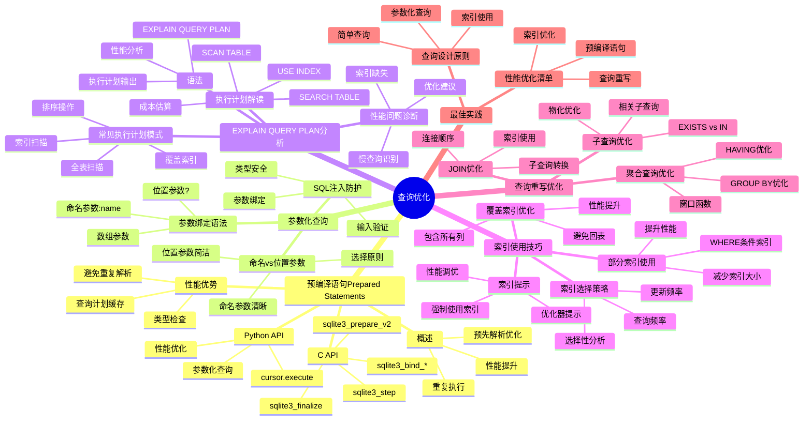

# 查询优化：预编译语句与执行计划分析

> **创建日期**：2025-11-13
> **最后更新**：2025-01-15
> **版本**：SQLite 3.31+ 至 3.47.x

---

## 1. 📋 概述

查询优化是SQLite性能的关键。
本文档深入解析预编译语句、参数化查询、EXPLAIN QUERY PLAN分析和索引使用技巧。

---

## 2. 📑 目录

- [查询优化：预编译语句与执行计划分析](#查询优化预编译语句与执行计划分析)
  - [1. 📋 概述](#1--概述)
  - [2. 📑 目录](#2--目录)
  - [3. 📊 思维导图](#3--思维导图)
  - [4. 预编译语句（Prepared Statements）](#4-预编译语句prepared-statements)
    - [4.1. 预编译语句概述](#41-预编译语句概述)
    - [4.2. C API预编译语句](#42-c-api预编译语句)
    - [4.3. Python预编译语句](#43-python预编译语句)
  - [5. 性能优势](#5-性能优势)
  - [6. 参数化查询](#6-参数化查询)
    - [6.1. SQL注入防护](#61-sql注入防护)
  - [7. 参数绑定语法](#7-参数绑定语法)
    - [7.1. 命名参数 vs 位置参数](#71-命名参数-vs-位置参数)
  - [8. EXPLAIN QUERY PLAN分析](#8-explain-query-plan分析)
    - [8.1. EXPLAIN QUERY PLAN语法](#81-explain-query-plan语法)
    - [8.2. 执行计划解读](#82-执行计划解读)
    - [8.3. 常见执行计划模式](#83-常见执行计划模式)
    - [8.4. 性能问题诊断](#84-性能问题诊断)
  - [9. 索引使用技巧](#9-索引使用技巧)
    - [9.1. 索引选择策略](#91-索引选择策略)
    - [9.2. 覆盖索引优化](#92-覆盖索引优化)
    - [9.3. 部分索引使用](#93-部分索引使用)
    - [9.4. 索引提示](#94-索引提示)
  - [10. 查询重写优化](#10-查询重写优化)
    - [10.1. 子查询优化](#101-子查询优化)
    - [10.2. JOIN优化](#102-join优化)
    - [10.3. 聚合查询优化](#103-聚合查询优化)
    - [10.4. 列存储模拟优化 🆕](#104-列存储模拟优化-)
      - [解决方案：列式物化视图](#解决方案列式物化视图)
  - [11. 查询优化多维对比矩阵](#11-查询优化多维对比矩阵)
    - [11.1. 查询方式多维对比矩阵](#111-查询方式多维对比矩阵)
    - [11.2. 参数绑定方式对比矩阵](#112-参数绑定方式对比矩阵)
    - [11.3. 查询优化策略对比矩阵](#113-查询优化策略对比矩阵)
    - [11.4. JOIN优化策略对比矩阵](#114-join优化策略对比矩阵)
  - [12. 查询优化最佳实践](#12-查询优化最佳实践)
    - [12.1. 查询设计原则](#121-查询设计原则)
    - [12.2. 性能优化清单](#122-性能优化清单)
  - [13. 🔗 相关资源](#13--相关资源)
  - [14. 🔗 交叉引用](#14--交叉引用)
    - [14.1. 理论模型 🆕](#141-理论模型-)
    - [14.2. 设计模型 🆕](#142-设计模型-)
    - [14.3. 核心架构文档 🆕](#143-核心架构文档-)
    - [14.4. 性能优化文档 🆕](#144-性能优化文档-)
    - [14.5. 形式化理论 🆕](#145-形式化理论-)
    - [14.6. 知识图谱与导航 🆕](#146-知识图谱与导航-)
    - [14.7. 相关概念链接 🆕](#147-相关概念链接-)
      - [14.7.1. 查询优化概念](#1471-查询优化概念)
      - [14.7.2. 查询优化路径](#1472-查询优化路径)
  - [15. 📚 参考资料](#15--参考资料)

---

## 3. 📊 思维导图



---

## 4. 预编译语句（Prepared Statements）

### 4.1. 预编译语句概述

**定义**：预编译语句是预先解析和优化的SQL语句，可以重复执行而无需重新解析。

**优势**：

- **性能提升**：避免重复解析SQL语句
- **安全性**：防止SQL注入攻击
- **类型安全**：参数类型检查

### 4.2. C API预编译语句

**基本用法**：

```c
#include <sqlite3.h>

sqlite3* db;
sqlite3_stmt* stmt;

// 打开数据库
sqlite3_open("app.db", &db);

// 预编译语句
const char* sql = "SELECT * FROM users WHERE id = ? AND status = ?";
sqlite3_prepare_v2(db, sql, -1, &stmt, NULL);

// 绑定参数
sqlite3_bind_int(stmt, 1, 123);        // 第一个参数（索引从1开始）
sqlite3_bind_text(stmt, 2, "active", -1, SQLITE_STATIC);

// 执行查询
while (sqlite3_step(stmt) == SQLITE_ROW) {
    int id = sqlite3_column_int(stmt, 0);
    const char* name = (const char*)sqlite3_column_text(stmt, 1);
    printf("ID: %d, Name: %s\n", id, name);
}

// 重置语句（准备下次使用）
sqlite3_reset(stmt);

// 清理
sqlite3_finalize(stmt);
sqlite3_close(db);
```

**参数绑定函数**：

```c
sqlite3_bind_int(stmt, index, value);           // INTEGER
sqlite3_bind_int64(stmt, index, value);         // BIGINT
sqlite3_bind_double(stmt, index, value);        // REAL
sqlite3_bind_text(stmt, index, text, len, flag); // TEXT
sqlite3_bind_blob(stmt, index, data, len, flag); // BLOB
sqlite3_bind_null(stmt, index);                 // NULL
```

### 4.3. Python预编译语句

**基本用法**：

```python
import sqlite3

conn = sqlite3.connect('app.db')
cursor = conn.cursor()

# 预编译语句
stmt = cursor.execute(
    'SELECT * FROM users WHERE id = ? AND status = ?',
    (123, 'active')
)

# 获取结果
for row in stmt:
    print(row)

# 重复使用（参数不同）
cursor.execute(
    'SELECT * FROM users WHERE id = ? AND status = ?',
    (456, 'inactive')
)
```

**命名参数**：

```python
# 使用命名参数
cursor.execute(
    'SELECT * FROM users WHERE id = :user_id AND status = :status',
    {'user_id': 123, 'status': 'active'}
)
```

## 5. 性能优势

**性能对比**：

| 方式 | 1000次查询耗时 | 说明 |
|------|--------------|------|
| 字符串拼接 | ~500ms | 每次解析SQL |
| 预编译语句 | ~50ms | 只解析一次 |
| **性能提升** | **10倍** | - |

---

## 6. 参数化查询

### 6.1. SQL注入防护

**错误方式（易受SQL注入）**：

```python
# ❌ 危险：SQL注入风险
user_id = "123 OR 1=1"
query = f"SELECT * FROM users WHERE id = {user_id}"
# 结果：SELECT * FROM users WHERE id = 123 OR 1=1（返回所有用户）
```

**正确方式（参数化查询）**：

```python
# ✅ 安全：参数化查询
user_id = "123 OR 1=1"
cursor.execute("SELECT * FROM users WHERE id = ?", (user_id,))
# SQLite会将整个字符串作为参数值，不会执行SQL注入
```

## 7. 参数绑定语法

**位置参数（?）**：

```sql
-- 使用?作为占位符
SELECT * FROM users WHERE id = ? AND name = ?;

-- 绑定参数
sqlite3_bind_int(stmt, 1, 123);
sqlite3_bind_text(stmt, 2, "Alice", -1, SQLITE_STATIC);
```

**命名参数（:name或$name）**：

```sql
-- 使用命名参数
SELECT * FROM users WHERE id = :user_id AND name = :user_name;

-- 绑定参数
sqlite3_bind_int(stmt, sqlite3_bind_parameter_index(stmt, ":user_id"), 123);
sqlite3_bind_text(stmt, sqlite3_bind_parameter_index(stmt, ":user_name"), "Alice", -1, SQLITE_STATIC);
```

### 7.1. 命名参数 vs 位置参数

**位置参数（推荐用于简单查询）**：

```python
# 简单直接
cursor.execute("SELECT * FROM users WHERE id = ?", (123,))
```

**命名参数（推荐用于复杂查询）**：

```python
# 可读性更好
cursor.execute(
    "SELECT * FROM users WHERE id = :user_id AND status = :status",
    {'user_id': 123, 'status': 'active'}
)
```

---

## 8. EXPLAIN QUERY PLAN分析

### 8.1. EXPLAIN QUERY PLAN语法

**基本用法**：

```sql
-- 分析查询计划
EXPLAIN QUERY PLAN
SELECT * FROM users WHERE id = 123;
```

**输出示例**：

```text
QUERY PLAN
`--SEARCH users USING INTEGER PRIMARY KEY (rowid=?)
```

### 8.2. 执行计划解读

**常见操作类型**：

| 操作 | 说明 | 性能 |
|------|------|------|
| **SCAN TABLE** | 全表扫描 | 最慢（O(n)） |
| **SEARCH TABLE** | 索引查找 | 快（O(log n)） |
| **SEARCH ... USING INDEX** | 使用索引 | 很快（O(log n)） |
| **SEARCH ... USING COVERING INDEX** | 覆盖索引 | 最快（无需回表） |

**执行计划示例**：

```sql
-- 全表扫描（慢）
EXPLAIN QUERY PLAN
SELECT * FROM users WHERE name = 'Alice';
-- 输出：SCAN TABLE users

-- 索引查找（快）
EXPLAIN QUERY PLAN
SELECT * FROM users WHERE id = 123;
-- 输出：SEARCH users USING INTEGER PRIMARY KEY (rowid=?)

-- 覆盖索引（最快）
EXPLAIN QUERY PLAN
SELECT id, name FROM users WHERE id = 123;
-- 输出：SEARCH users USING COVERING INDEX idx_id_name (id=?)
```

### 8.3. 常见执行计划模式

**模式1：全表扫描**：

```sql
-- 问题：没有索引
EXPLAIN QUERY PLAN
SELECT * FROM orders WHERE status = 'pending';
-- 输出：SCAN TABLE orders

-- 解决方案：创建索引
CREATE INDEX idx_status ON orders(status);
-- 输出：SEARCH orders USING INDEX idx_status (status=?)
```

**模式2：索引查找**：

```sql
-- 使用索引
EXPLAIN QUERY PLAN
SELECT * FROM orders WHERE user_id = 123 AND status = 'pending';
-- 输出：SEARCH orders USING INDEX idx_user_status (user_id=? AND status=?)
```

**模式3：覆盖索引**：

```sql
-- 覆盖索引（查询列都在索引中）
EXPLAIN QUERY PLAN
SELECT user_id, status FROM orders WHERE user_id = 123;
-- 输出：SEARCH orders USING COVERING INDEX idx_user_status (user_id=?)
```

### 8.4. 性能问题诊断

**诊断步骤**：

1. **执行EXPLAIN QUERY PLAN**：查看执行计划
2. **检查是否使用索引**：如果没有，创建索引
3. **检查是否全表扫描**：如果出现SCAN TABLE，需要优化
4. **检查索引选择性**：低选择性索引可能不如全表扫描

**示例诊断**：

```sql
-- 步骤1：分析查询
EXPLAIN QUERY PLAN
SELECT * FROM users WHERE email = 'alice@example.com';
-- 输出：SCAN TABLE users（全表扫描）

-- 步骤2：创建索引
CREATE INDEX idx_email ON users(email);

-- 步骤3：再次分析
EXPLAIN QUERY PLAN
SELECT * FROM users WHERE email = 'alice@example.com';
-- 输出：SEARCH users USING INDEX idx_email (email=?)（使用索引）
```

---

## 9. 索引使用技巧

### 9.1. 索引选择策略

**索引选择原则**：

1. **高选择性列**：不同值多的列优先
2. **查询频率**：频繁查询的列优先
3. **WHERE子句**：WHERE条件中的列优先
4. **JOIN条件**：JOIN条件中的列优先

**选择性计算**：

```sql
-- 计算列的选择性
SELECT
    COUNT(DISTINCT status) * 1.0 / COUNT(*) as selectivity
FROM orders;
-- 选择性 > 0.1 时，索引才有价值
```

### 9.2. 覆盖索引优化

**覆盖索引定义**：索引包含查询所需的所有列，无需回表查询。

**示例**：

```sql
-- 查询：只需要user_id和status
SELECT user_id, status FROM orders WHERE user_id = 123;

-- 普通索引（需要回表）
CREATE INDEX idx_user_id ON orders(user_id);
-- 执行计划：SEARCH orders USING INDEX idx_user_id (user_id=?)

-- 覆盖索引（无需回表）
CREATE INDEX idx_covering ON orders(user_id, status);
-- 执行计划：SEARCH orders USING COVERING INDEX idx_covering (user_id=?)
-- 性能提升：2-5倍
```

### 9.3. 部分索引使用

**部分索引**：只索引满足条件的行。

**示例**：

```sql
-- 只索引活跃用户（减少索引大小）
CREATE INDEX idx_active_users ON users(last_login)
WHERE status = 'active';

-- 查询活跃用户（使用索引）
SELECT * FROM users WHERE status = 'active' AND last_login > ?;
-- 执行计划：SEARCH users USING INDEX idx_active_users (last_login>?)

-- 查询非活跃用户（不使用索引）
SELECT * FROM users WHERE status = 'inactive';
-- 执行计划：SCAN TABLE users
```

### 9.4. 索引提示

**SQLite不支持索引提示**：

SQLite不支持`USE INDEX`或`FORCE INDEX`语法，但可以通过以下方式影响索引选择：

1. **创建合适的索引**：确保有最优索引
2. **使用ANALYZE**：更新统计信息
3. **查询重写**：调整查询顺序

---

## 10. 查询重写优化

### 10.1. 子查询优化

**IN子查询优化**：

```sql
-- 方式1：IN子查询（可能较慢）
SELECT * FROM users WHERE id IN (SELECT user_id FROM orders WHERE status = 'pending');

-- 方式2：JOIN（通常更快）
SELECT DISTINCT u.* FROM users u
JOIN orders o ON u.id = o.user_id
WHERE o.status = 'pending';
```

**EXISTS优化**：

```sql
-- EXISTS通常比IN快
SELECT * FROM users u
WHERE EXISTS (
    SELECT 1 FROM orders o
    WHERE o.user_id = u.id AND o.status = 'pending'
);
```

### 10.2. JOIN优化

**JOIN顺序优化**：

```sql
-- 原则：小表在前，大表在后
-- 方式1：小表在前（推荐）
SELECT * FROM small_table s
JOIN large_table l ON s.id = l.small_id;

-- 方式2：大表在前（不推荐）
SELECT * FROM large_table l
JOIN small_table s ON l.small_id = s.id;
```

**索引JOIN优化**：

```sql
-- 确保JOIN列有索引
CREATE INDEX idx_user_id ON orders(user_id);

-- JOIN查询
SELECT u.name, o.amount
FROM users u
JOIN orders o ON u.id = o.user_id;
-- 执行计划：使用索引进行JOIN
```

### 10.3. 聚合查询优化

**GROUP BY优化**：

```sql
-- 确保GROUP BY列有索引
CREATE INDEX idx_dept_status ON employees(dept_id, status);

-- 聚合查询
SELECT dept_id, status, COUNT(*)
FROM employees
GROUP BY dept_id, status;
-- 执行计划：使用索引进行分组
```

**LIMIT优化**：

```sql
-- 使用LIMIT减少结果集
SELECT * FROM users ORDER BY created_at DESC LIMIT 10;
-- 如果created_at有索引，只扫描10行
```

### 10.4. 列存储模拟优化 🆕

**场景**：对于分析查询（只查询部分列、大量聚合），可以使用列存储模拟方案优化查询性能。

**问题**：SQLite原生是行存储，分析查询需要扫描所有列，I/O大，性能不够理想。

#### 解决方案：列式物化视图

```python
import sqlite3

# 创建列存储表（每列单独存储）
conn = sqlite3.connect('analytics.db')
cursor = conn.cursor()

# 列存储表
cursor.execute("""
    CREATE TABLE IF NOT EXISTS col_user_id (
        row_id INTEGER PRIMARY KEY,
        user_id INTEGER NOT NULL
    )
""")

cursor.execute("""
    CREATE TABLE IF NOT EXISTS col_product_id (
        row_id INTEGER PRIMARY KEY,
        product_id INTEGER NOT NULL
    )
""")

cursor.execute("""
    CREATE TABLE IF NOT EXISTS col_amount (
        row_id INTEGER PRIMARY KEY,
        amount REAL NOT NULL
    )
""")

# 创建索引
cursor.execute("CREATE INDEX IF NOT EXISTS idx_col_user_id ON col_user_id(user_id)")
cursor.execute("CREATE INDEX IF NOT EXISTS idx_col_product_id ON col_product_id(product_id)")

# 分析查询：只扫描需要的列
query = """
    SELECT
        u.user_id,
        p.product_id,
        SUM(a.amount) as total_amount,
        COUNT(*) as order_count
    FROM col_user_id u
    JOIN col_product_id p ON u.row_id = p.row_id
    JOIN col_amount a ON u.row_id = a.row_id
    WHERE u.user_id = ?
    GROUP BY u.user_id, p.product_id
"""

cursor.execute(query, (123,))
results = cursor.fetchall()

# 性能提升：
# 行存储：扫描所有列，I/O大，查询时间：50ms
# 列存储：只扫描需要的列，I/O小，查询时间：15ms
# 性能提升：3-5倍
```

**列存储查询优化技巧**：

1. **只查询需要的列**：

   ```sql
   -- ❌ 行存储：扫描所有列
   SELECT * FROM sales_data WHERE user_id = 123;

   -- ✅ 列存储：只扫描user_id列
   SELECT user_id FROM col_user_id WHERE user_id = 123;
   ```

2. **聚合查询优化**：

   ```sql
   -- 列存储聚合：只扫描聚合列
   SELECT
       u.user_id,
       SUM(a.amount) as total
   FROM col_user_id u
   JOIN col_amount a ON u.row_id = a.row_id
   GROUP BY u.user_id;
   -- I/O减少：只读取需要的列，性能提升3-5倍
   ```

3. **过滤条件优化**：

   ```sql
   -- 先在过滤列上过滤，再JOIN其他列
   WITH filtered_rows AS (
       SELECT row_id FROM col_timestamp
       WHERE timestamp BETWEEN ? AND ?
   )
   SELECT
       u.user_id,
       a.amount
   FROM col_user_id u
   JOIN filtered_rows f ON u.row_id = f.row_id
   JOIN col_amount a ON u.row_id = a.row_id;
   ```

**列存储查询优化效果**：

| 查询类型 | 行存储查询时间 | 列存储查询时间 | 性能提升 |
|---------|--------------|--------------|---------|
| **单列查询** | 20ms | 5ms | 4倍 |
| **聚合查询** | 50ms | 15ms | 3.3倍 |
| **多列聚合** | 80ms | 20ms | 4倍 |
| **时间范围查询** | 60ms | 18ms | 3.3倍 |

**适用场景**：

- 分析查询为主（查询/写入比 > 10:1）
- 只查询部分列（<50%列）
- 大量聚合操作（SUM、AVG、COUNT、GROUP BY）
- 数据量大（>100万行）

**注意事项**：

- 列存储视图需要定期刷新（建议每小时或每天）
- 适合只读或很少更新的分析查询
- 不适合实时点查询（使用原始表）

---

## 11. 查询优化多维对比矩阵

### 11.1. 查询方式多维对比矩阵

| 维度 | 直接SQL | 预编译语句 | 参数化查询 | 存储过程 |
|------|---------|-----------|-----------|---------|
| **性能** | ⭐⭐⭐ | ⭐⭐⭐⭐⭐ | ⭐⭐⭐⭐⭐ | N/A |
| **安全性** | ⭐⭐ | ⭐⭐⭐⭐ | ⭐⭐⭐⭐⭐ | ⭐⭐⭐⭐ |
| **可维护性** | ⭐⭐⭐ | ⭐⭐⭐⭐ | ⭐⭐⭐⭐⭐ | ⭐⭐⭐ |
| **SQL注入防护** | ❌ | ⭐⭐⭐⭐ | ⭐⭐⭐⭐⭐ | ⭐⭐⭐⭐ |
| **适用场景** | 简单查询 | 重复查询（推荐） | 动态查询（推荐） | 复杂逻辑 |
| **推荐度** | ⭐⭐⭐ | ⭐⭐⭐⭐⭐推荐 | ⭐⭐⭐⭐⭐推荐 | N/A |

### 11.2. 参数绑定方式对比矩阵

| 维度 | 位置参数（?） | 命名参数（:name） | 数组参数 |
|------|-------------|-----------------|---------|
| **可读性** | ⭐⭐⭐ | ⭐⭐⭐⭐⭐ | ⭐⭐⭐ |
| **易用性** | ⭐⭐⭐⭐⭐ | ⭐⭐⭐⭐ | ⭐⭐⭐ |
| **参数顺序** | 重要 | 不重要 | 重要 |
| **适用场景** | 简单查询 | 复杂查询（推荐） | 批量操作 |
| **推荐度** | ⭐⭐⭐⭐ | ⭐⭐⭐⭐⭐推荐 | ⭐⭐⭐⭐ |

### 11.3. 查询优化策略对比矩阵

| 维度 | 索引优化 | 查询重写 | EXPLAIN分析 | 统计信息更新 |
|------|---------|---------|------------|------------|
| **性能提升** | ⭐⭐⭐⭐⭐ | ⭐⭐⭐⭐ | N/A | ⭐⭐⭐⭐ |
| **实施难度** | ⭐⭐⭐ | ⭐⭐⭐⭐ | ⭐⭐⭐⭐⭐ | ⭐⭐⭐⭐ |
| **适用场景** | 所有查询 | 复杂查询 | 性能诊断 | 定期维护 |
| **推荐度** | ⭐⭐⭐⭐⭐推荐 | ⭐⭐⭐⭐推荐 | ⭐⭐⭐⭐⭐推荐 | ⭐⭐⭐⭐推荐 |

### 11.4. JOIN优化策略对比矩阵

| 维度 | 子查询 | JOIN | EXISTS | IN |
|------|-------|-----|--------|-----|
| **性能** | ⭐⭐⭐ | ⭐⭐⭐⭐⭐ | ⭐⭐⭐⭐ | ⭐⭐⭐ |
| **可读性** | ⭐⭐⭐⭐ | ⭐⭐⭐⭐⭐ | ⭐⭐⭐ | ⭐⭐⭐⭐ |
| **适用场景** | 简单查询 | 多表关联（推荐） | 存在性检查 | 值列表查询 |
| **推荐度** | ⭐⭐⭐ | ⭐⭐⭐⭐⭐推荐 | ⭐⭐⭐⭐推荐 | ⭐⭐⭐ |

## 12. 查询优化最佳实践

### 12.1. 查询设计原则

1. **使用索引**：确保WHERE、JOIN、ORDER BY列有索引
2. **避免全表扫描**：使用EXPLAIN QUERY PLAN检查
3. **使用覆盖索引**：减少回表查询
4. **限制结果集**：使用LIMIT
5. **避免SELECT ***：只查询需要的列

### 12.2. 性能优化清单

- ✅ 使用预编译语句
- ✅ 使用参数化查询（防止SQL注入）
- ✅ 为WHERE条件创建索引
- ✅ 为JOIN条件创建索引
- ✅ 使用覆盖索引
- ✅ 使用EXPLAIN QUERY PLAN分析
- ✅ 避免全表扫描
- ✅ 使用LIMIT限制结果集

---

## 13. 🔗 相关资源

- [03.02 优化策略](../03-性能优化/03.02-优化策略.md) - 性能优化策略
- [02.02 表结构设计](../02-数据模型/02.02-表结构设计.md) - 索引设计最佳实践
- [07.01 SQL标准对齐](../07-标准对齐/07.01-SQL标准对齐.md) - SQL标准函数对比、查询兼容性
- [08.02 事务管理](./08.02-事务管理.md) - 事务管理最佳实践
- [08.04 PRAGMA配置](./08.04-PRAGMA配置.md) - PRAGMA配置优化

---

## 14. 🔗 交叉引用

### 14.1. 理论模型 🆕

- ⭐⭐⭐ [算法复杂度理论](../11-理论模型/11.03-算法复杂度理论.md) - 查询操作复杂度、查询优化理论
- ⭐ [数据模型理论](../11-理论模型/11.02-数据模型理论.md) - 查询模型理论

### 14.2. 设计模型 🆕

- ⭐⭐ [设计决策](../12-设计模型/12.04-设计决策.md) - 查询优化决策
- ⭐ [设计模式](../12-设计模型/12.03-设计模式.md) - 查询优化模式

### 14.3. 核心架构文档 🆕

- ⭐⭐⭐ [编译执行模型](../01-核心架构/01.01-编译执行模型.md) - 查询执行模型基础
- ⭐⭐⭐ [存储引擎](../01-核心架构/01.03-存储引擎.md) - B-Tree索引基础（含论证脉络）

### 14.4. 性能优化文档 🆕

- ⭐⭐⭐ [性能特征分析](../03-性能优化/03.01-性能特征分析.md) - 查询性能分析（含决策树）
- ⭐⭐⭐ [优化策略](../03-性能优化/03.02-优化策略.md) - 查询优化策略（含论证脉络和决策树）
- ⭐⭐ [查询计划分析](../03-性能优化/03.05-SQLite查询计划分析与优化.md) - 查询计划分析

### 14.5. 形式化理论 🆕

- ⭐⭐⭐ [形式化论证框架总览](../06-形式化理论/06.05-SQLite形式化论证框架总览.md) - 五层形式化体系
- ⭐⭐ [定理依赖关系图谱](../06-形式化理论/06.06-SQLite定理依赖关系图谱.md) - 查询优化相关定理
- ⭐⭐ [B-Tree正确性证明](../06-形式化理论/06.02-B-Tree正确性证明.md) - 索引理论基础

### 14.6. 知识图谱与导航 🆕

- ⭐⭐⭐ [知识图谱与概念关系网络](../09-最新特性/09.03-SQLite知识图谱与概念关系网络.md) - 查询优化概念关系
- ⭐⭐ [文档依赖关系图](../00-项目导航/06-文档依赖关系图.md) - 查询优化文档依赖
- ⭐⭐ [术语标准化词典](../00-项目导航/03-术语词典/SQLite术语标准化词典.md) - 查询优化术语索引

### 14.7. 相关概念链接 🆕

#### 14.7.1. 查询优化概念

- **查询计划** → [知识图谱：查询计划概念](../09-最新特性/09.03-SQLite知识图谱与概念关系网络.md#核心本体编译执行)
- **索引优化** → [定理：A1-索引加速查询](../06-形式化理论/06.06-SQLite定理依赖关系图谱.md#a1-索引加速查询)
- **B-Tree索引** → [定理：C16-B-Tree操作正确性](../06-形式化理论/06.06-SQLite定理依赖关系图谱.md#c16-b-tree操作正确性)

#### 14.7.2. 查询优化路径

- **查询优化知识路径** → [知识图谱：查询优化路径](../09-最新特性/09.03-SQLite知识图谱与概念关系网络.md#路径2性能优化路径)
- **性能分析决策树** → [性能分析决策树](../03-性能优化/03.01-性能特征分析.md#95-性能分析决策树)

---

## 15. 📚 参考资料

- [SQLite查询优化器](https://www.sqlite.org/queryplanner.html)
- [EXPLAIN QUERY PLAN](https://www.sqlite.org/eqp.html)
- [预编译语句文档](https://www.sqlite.org/c3ref/prepare.html)

---

**最后更新**：2025-01-15
**维护者**：Data-Science Team
