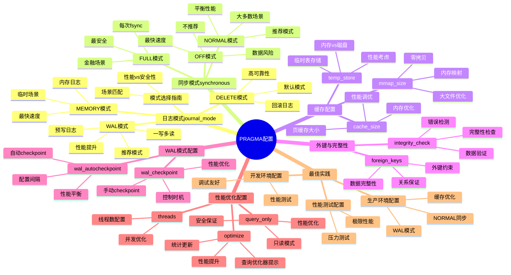

# PRAGMA配置：性能与安全调优

> **创建日期**：2025-11-13
> **最后更新**：2025-01-15
> **版本**：SQLite 3.31+ 至 3.47.x

---

## 1. 📋 概述

PRAGMA是SQLite的配置命令，用于控制数据库行为。
本文档深入解析各种PRAGMA配置的使用场景和最佳实践。

---

## 2. 📑 目录

- [PRAGMA配置：性能与安全调优](#pragma配置性能与安全调优)
  - [1. 📋 概述](#1--概述)
  - [2. 📑 目录](#2--目录)
  - [3. 📊 思维导图](#3--思维导图)
  - [4. 日志模式配置（journal\_mode）](#4-日志模式配置journal_mode)
    - [4.1. DELETE模式（默认）](#41-delete模式默认)
    - [4.2. WAL模式（推荐）](#42-wal模式推荐)
    - [4.3. MEMORY模式](#43-memory模式)
    - [4.4. 模式选择指南](#44-模式选择指南)
    - [4.5. 日志模式多维对比矩阵](#45-日志模式多维对比矩阵)
  - [5. 同步模式配置（synchronous）](#5-同步模式配置synchronous)
    - [5.1. FULL模式（最安全）](#51-full模式最安全)
    - [5.2. NORMAL模式（推荐）](#52-normal模式推荐)
    - [5.3. OFF模式（最快，不推荐）](#53-off模式最快不推荐)
    - [5.4. 同步模式多维对比矩阵](#54-同步模式多维对比矩阵)
  - [6. 缓存配置](#6-缓存配置)
    - [6.1. cache\_size（页缓存大小）](#61-cache_size页缓存大小)
    - [6.2. temp\_store（临时表存储）](#62-temp_store临时表存储)
    - [6.3. mmap\_size（内存映射大小）](#63-mmap_size内存映射大小)
    - [6.4. 缓存配置多维对比矩阵](#64-缓存配置多维对比矩阵)
  - [7. 外键与完整性](#7-外键与完整性)
    - [7.1. foreign\_keys（外键约束）](#71-foreign_keys外键约束)
    - [7.2. integrity\_check（完整性检查）](#72-integrity_check完整性检查)
  - [8. WAL模式配置](#8-wal模式配置)
    - [8.1. wal\_autocheckpoint（自动Checkpoint）](#81-wal_autocheckpoint自动checkpoint)
    - [8.2. wal\_checkpoint（手动Checkpoint）](#82-wal_checkpoint手动checkpoint)
  - [9. 性能优化配置](#9-性能优化配置)
    - [9.1. optimize（查询优化器提示）](#91-optimize查询优化器提示)
    - [9.2. query\_only（只读模式）](#92-query_only只读模式)
    - [9.3. threads（线程数）](#93-threads线程数)
  - [10. PRAGMA配置最佳实践](#10-pragma配置最佳实践)
    - [10.1. 生产环境配置](#101-生产环境配置)
    - [10.2. 开发环境配置](#102-开发环境配置)
    - [10.3. 性能测试配置](#103-性能测试配置)
  - [11. 🔗 相关资源](#11--相关资源)
  - [12. 🔗 交叉引用](#12--交叉引用)
    - [12.1. 理论模型 🆕](#121-理论模型-)
    - [12.2. 设计模型 🆕](#122-设计模型-)
  - [13. 📚 参考资料](#13--参考资料)

---

## 3. 📊 思维导图



---

## 4. 日志模式配置（journal_mode）

### 4.1. DELETE模式（默认）

**配置**：

```sql
PRAGMA journal_mode=DELETE;
```

**特点**：

- 使用回滚日志文件
- 写操作需要两次磁盘写入
- 读操作可能阻塞写提交

**适用场景**：

- 金融等高可靠性场景
- 需要最强一致性保证

### 4.2. WAL模式（推荐）

**配置**：

```sql
PRAGMA journal_mode=WAL;
```

**特点**：

- 使用预写日志（Write-Ahead Logging）
- 写操作只需一次磁盘写入
- 读不阻塞写，支持一写多读

**性能提升**：

- 写性能提升2-3倍
- 并发读性能显著提升

**适用场景**：

- 大多数应用场景（推荐）
- 读密集型应用
- 移动应用、IoT设备

### 4.3. MEMORY模式

**配置**：

```sql
PRAGMA journal_mode=MEMORY;
```

**特点**：

- 日志存储在内存中
- 崩溃时可能丢失数据
- 性能最快

**适用场景**：

- 临时数据库
- 测试环境
- 可以接受数据丢失的场景

### 4.4. 模式选择指南

| 模式 | 性能 | 安全性 | 适用场景 |
|------|------|--------|---------|
| DELETE | 中等 | 最高 | 金融、高可靠性 |
| WAL | 最高 | 高 | 大多数应用（推荐） |
| MEMORY | 最高 | 最低 | 临时、测试 |

### 4.5. 日志模式多维对比矩阵

| 维度 | DELETE | WAL | MEMORY | TRUNCATE | PERSIST |
|------|--------|-----|--------|----------|---------|
| **写性能** | ⭐⭐⭐ | ⭐⭐⭐⭐⭐ | ⭐⭐⭐⭐⭐ | ⭐⭐⭐⭐ | ⭐⭐⭐ |
| **读性能** | ⭐⭐⭐ | ⭐⭐⭐⭐⭐ | ⭐⭐⭐⭐⭐ | ⭐⭐⭐ | ⭐⭐⭐ |
| **并发性能** | ⭐⭐ | ⭐⭐⭐⭐⭐ | ⭐⭐⭐⭐⭐ | ⭐⭐ | ⭐⭐ |
| **数据安全性** | ⭐⭐⭐⭐⭐ | ⭐⭐⭐⭐ | ⭐⭐ | ⭐⭐⭐⭐ | ⭐⭐⭐⭐ |
| **崩溃恢复** | ⭐⭐⭐⭐⭐ | ⭐⭐⭐⭐ | ⭐ | ⭐⭐⭐⭐ | ⭐⭐⭐⭐ |
| **磁盘I/O** | 高 | 低 | 最低 | 中 | 中 |
| **适用场景** | 金融、高可靠性 | 大多数应用（推荐） | 临时、测试 | 快速删除日志 | 持久化日志 |
| **文件数量** | 2个 | 3个 | 1个 | 2个 | 2个 |
| **WAL文件** | 无 | 有 | 无 | 无 | 无 |

---

## 5. 同步模式配置（synchronous）

### 5.1. FULL模式（最安全）

**配置**：

```sql
PRAGMA synchronous=FULL;
```

**特点**：

- 每次写入后执行fsync
- 最高数据安全性
- 性能较慢

**适用场景**：

- 金融系统
- 关键数据存储

### 5.2. NORMAL模式（推荐）

**配置**：

```sql
PRAGMA synchronous=NORMAL;
```

**特点**：

- 关键操作执行fsync
- 平衡性能和安全
- 推荐用于大多数场景

**适用场景**：

- 大多数生产环境（推荐）
- 一般应用

### 5.3. OFF模式（最快，不推荐）

**配置**：

```sql
PRAGMA synchronous=OFF;
```

**特点**：

- 不执行fsync
- 性能最快
- 崩溃可能丢失数据

**适用场景**：

- 临时数据库
- 测试环境
- 可以接受数据丢失的场景

### 5.4. 同步模式多维对比矩阵

| 维度 | FULL | NORMAL | OFF |
|------|------|--------|-----|
| **数据安全性** | ⭐⭐⭐⭐⭐ | ⭐⭐⭐⭐ | ⭐⭐ |
| **写性能** | ⭐⭐ | ⭐⭐⭐⭐ | ⭐⭐⭐⭐⭐ |
| **fsync频率** | 每次写入 | 关键操作 | 无 |
| **崩溃恢复** | ⭐⭐⭐⭐⭐ | ⭐⭐⭐⭐ | ⭐⭐ |
| **数据丢失风险** | 最低 | 低 | 高 |
| **适用场景** | 金融系统、关键数据 | 大多数生产环境（推荐） | 临时、测试 |
| **性能影响** | 较大 | 中等 | 最小 |
| **推荐度** | 特殊场景 | ⭐⭐⭐⭐⭐推荐 | 不推荐 |

---

## 6. 缓存配置

### 6.1. cache_size（页缓存大小）

**配置**：

```sql
-- 设置缓存大小为64MB（负值表示KB）
PRAGMA cache_size=-64000;

-- 查看当前缓存大小
PRAGMA cache_size;
```

**默认值**：-2000（2MB）

**推荐值**：

- 小数据库：-2000（2MB）
- 中等数据库：-16000（16MB）
- 大数据库：-64000（64MB）或更大

**性能影响**：

- 缓存越大，查询性能越好
- 但占用更多内存

### 6.2. temp_store（临时表存储）

**配置**：

```sql
-- 临时表存储在内存中（推荐）
PRAGMA temp_store=MEMORY;

-- 临时表存储在磁盘上
PRAGMA temp_store=FILE;
```

**推荐**：`MEMORY`（性能更好）

### 6.3. mmap_size（内存映射大小）

**配置**：

```sql
-- 设置内存映射大小为256MB
PRAGMA mmap_size=268435456;
```

**特点**：

- 使用内存映射文件
- 减少内存复制
- 提升大文件读取性能

**适用场景**：

- 大数据库文件
- 读密集型应用

### 6.4. 缓存配置多维对比矩阵

| 维度 | cache_size | temp_store | mmap_size |
|------|-----------|-----------|-----------|
| **配置类型** | 页缓存大小 | 临时表存储 | 内存映射大小 |
| **默认值** | -2000 (2MB) | FILE | 0 |
| **推荐值** | -64000 (64MB) | MEMORY | 256MB+ |
| **性能影响** | ⭐⭐⭐⭐⭐ | ⭐⭐⭐⭐ | ⭐⭐⭐⭐ |
| **内存占用** | 高 | 中 | 中 |
| **适用场景** | 所有场景 | 临时表频繁 | 大文件读取 |
| **调优难度** | 中等 | 低 | 低 |
| **效果明显度** | ⭐⭐⭐⭐⭐ | ⭐⭐⭐⭐ | ⭐⭐⭐ |

---

## 7. 外键与完整性

### 7.1. foreign_keys（外键约束）

**配置**：

```sql
-- 启用外键约束
PRAGMA foreign_keys=ON;

-- 检查是否启用
PRAGMA foreign_keys;
```

**重要**：默认关闭，需要显式启用

**示例**：

```sql
-- 启用外键
PRAGMA foreign_keys=ON;

-- 创建表
CREATE TABLE orders (
    id INTEGER PRIMARY KEY,
    user_id INTEGER,
    FOREIGN KEY (user_id) REFERENCES users(id)
);

-- 尝试插入无效外键（会失败）
INSERT INTO orders (user_id) VALUES (999);  -- 错误：外键约束违反
```

### 7.2. integrity_check（完整性检查）

**配置**：

```sql
-- 检查数据库完整性
PRAGMA integrity_check;

-- 快速检查
PRAGMA quick_check;
```

**用途**：

- 检查数据库损坏
- 定期维护检查

---

## 8. WAL模式配置

### 8.1. wal_autocheckpoint（自动Checkpoint）

**配置**：

```sql
-- 当WAL文件达到1000页时自动Checkpoint
PRAGMA wal_autocheckpoint=1000;

-- 查看当前设置
PRAGMA wal_autocheckpoint;
```

**默认值**：1000页

**推荐值**：

- 小数据库：1000
- 大数据库：10000或更大

### 8.2. wal_checkpoint（手动Checkpoint）

**配置**：

```sql
-- 手动Checkpoint（非阻塞）
PRAGMA wal_checkpoint;

-- 完全Checkpoint（阻塞直到完成）
PRAGMA wal_checkpoint(FULL);

-- 截断Checkpoint（尽可能截断WAL文件）
PRAGMA wal_checkpoint(TRUNCATE);
```

**使用场景**：

- 定期维护
- 应用关闭时
- 需要减少WAL文件大小时

---

## 9. 性能优化配置

### 9.1. optimize（查询优化器提示）

**配置**：

```sql
-- 提示优化器分析表和索引
PRAGMA optimize;

-- 分析特定表
PRAGMA optimize('users');
```

**用途**：

- 更新统计信息
- 优化查询计划选择

### 9.2. query_only（只读模式）

**配置**：

```sql
-- 启用只读模式
PRAGMA query_only=ON;
```

**特点**：

- 禁止所有写操作
- 提升查询性能
- 适合备份、分析场景

### 9.3. threads（线程数）

**配置**：

```sql
-- 设置线程数（实验性）
PRAGMA threads=4;
```

**注意**：SQLite 3.38.0+实验性功能

---

## 10. PRAGMA配置最佳实践

### 10.1. 生产环境配置

**推荐配置**：

```sql
-- 日志模式：WAL（性能最优）
PRAGMA journal_mode=WAL;

-- 同步模式：NORMAL（平衡性能和安全）
PRAGMA synchronous=NORMAL;

-- 缓存大小：根据数据库大小调整
PRAGMA cache_size=-64000;  -- 64MB

-- 临时表：内存存储
PRAGMA temp_store=MEMORY;

-- 外键：启用
PRAGMA foreign_keys=ON;

-- WAL自动Checkpoint
PRAGMA wal_autocheckpoint=1000;
```

### 10.2. 开发环境配置

**推荐配置**：

```sql
-- 日志模式：WAL
PRAGMA journal_mode=WAL;

-- 同步模式：NORMAL
PRAGMA synchronous=NORMAL;

-- 缓存大小：较小
PRAGMA cache_size=-2000;  -- 2MB

-- 外键：启用（便于测试）
PRAGMA foreign_keys=ON;
```

### 10.3. 性能测试配置

**推荐配置**：

```sql
-- 日志模式：WAL
PRAGMA journal_mode=WAL;

-- 同步模式：OFF（最快，仅测试）
PRAGMA synchronous=OFF;

-- 缓存大小：大
PRAGMA cache_size=-128000;  -- 128MB

-- 临时表：内存
PRAGMA temp_store=MEMORY;
```

---

## 11. 🔗 相关资源

- [08.01 连接管理](./08.01-连接管理.md)
- [08.02 事务管理](./08.02-事务管理.md)
- [01.02 事务与并发控制](../01-核心架构/01.02-事务与并发控制.md)

---

## 12. 🔗 交叉引用

### 12.1. 理论模型 🆕

- ⭐⭐ [存储理论](../11-理论模型/11.05-存储理论.md) - 缓存理论、持久化理论
- ⭐ [并发控制理论](../11-理论模型/11.04-并发控制理论.md) - 并发配置理论

### 12.2. 设计模型 🆕

- ⭐⭐ [设计决策](../12-设计模型/12.04-设计决策.md) - 配置设计决策
- ⭐ [设计原则](../12-设计模型/12.02-设计原则.md) - 配置设计原则

### 12.3. 核心架构文档 🆕

- ⭐⭐⭐ [事务与并发控制](../01-核心架构/01.02-事务与并发控制.md) - WAL模式配置基础（含论证脉络）
- ⭐⭐ [存储引擎](../01-核心架构/01.03-存储引擎.md) - 存储配置基础

### 12.4. 编程实践文档 🆕

- ⭐⭐⭐ [连接管理](./08.01-连接管理.md) - 连接管理实践（含交叉引用）
- ⭐⭐ [事务管理](./08.02-事务管理.md) - 事务管理实践（含交叉引用）

### 12.5. 知识图谱与导航 🆕

- ⭐⭐⭐ [知识图谱与概念关系网络](../09-最新特性/09.03-SQLite知识图谱与概念关系网络.md) - PRAGMA配置概念关系（400+概念）
- ⭐⭐ [文档依赖关系图](../00-项目导航/06-文档依赖关系图.md) - PRAGMA配置文档依赖
- ⭐⭐ [术语标准化词典](../00-项目导航/03-术语词典/SQLite术语标准化词典.md) - PRAGMA配置术语索引

### 12.6. 相关概念链接 🆕

#### 12.6.1. PRAGMA配置概念

- **PRAGMA配置** → [知识图谱：PRAGMA概念](../09-最新特性/09.03-SQLite知识图谱与概念关系网络.md#开发实践本体)
- **WAL模式配置** → [知识图谱：WAL机制](../09-最新特性/09.03-SQLite知识图谱与概念关系网络.md#核心本体wal机制)
- **性能配置** → [优化策略](../03-性能优化/03.02-优化策略.md)

---

## 13. 📚 参考资料

- [SQLite PRAGMA文档](https://www.sqlite.org/pragma.html)
- [WAL模式文档](https://www.sqlite.org/wal.html)
- [性能优化指南](https://www.sqlite.org/performance.html)

---

**最后更新**：2025-01-15
**维护者**：Data-Science Team
