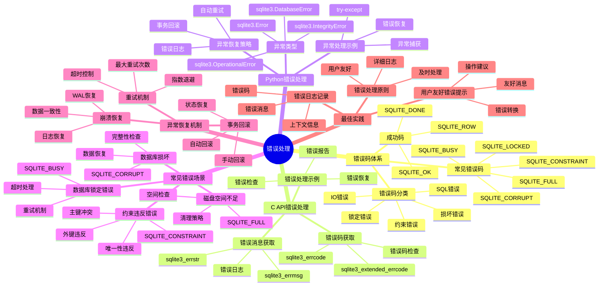

# 错误处理：错误码体系与异常恢复

> **创建日期**：2025-11-13
> **最后更新**：2025-01-15
> **版本**：SQLite 3.31+ 至 3.47.x

---

## 📋 概述

完善的错误处理是SQLite应用稳定性的关键。
本文档深入解析错误码体系、异常恢复策略和最佳实践。

---

## 📑 目录

- [错误处理：错误码体系与异常恢复](#错误处理错误码体系与异常恢复)
  - [📋 概述](#-概述)
  - [📑 目录](#-目录)
  - [3. 📊 思维导图](#3--思维导图)
  - [4. 错误码体系](#4-错误码体系)
    - [4.1. 成功码](#41-成功码)
    - [4.2. 错误码分类](#42-错误码分类)
    - [4.3. 常见错误码](#43-常见错误码)
  - [5. C API错误处理](#5-c-api错误处理)
    - [5.1. 错误码获取](#51-错误码获取)
    - [5.2. 错误消息获取](#52-错误消息获取)
    - [5.3. 错误处理示例](#53-错误处理示例)
  - [6. Python错误处理](#6-python错误处理)
    - [6.1. 异常类型](#61-异常类型)
    - [6.2. 异常处理示例](#62-异常处理示例)
  - [7. 异常恢复策略](#7-异常恢复策略)
  - [8. 常见错误场景](#8-常见错误场景)
    - [8.1. 数据库锁定错误](#81-数据库锁定错误)
  - [9. 约束违反错误](#9-约束违反错误)
  - [10. 磁盘空间不足](#10-磁盘空间不足)
  - [11. 数据库损坏](#11-数据库损坏)
  - [12. 异常恢复机制](#12-异常恢复机制)
    - [12.1. 事务回滚](#121-事务回滚)
    - [12.2. 重试机制](#122-重试机制)
  - [13. 崩溃恢复](#13-崩溃恢复)
  - [14. 错误处理多维对比矩阵](#14-错误处理多维对比矩阵)
    - [14.1. 错误码类型多维对比矩阵](#141-错误码类型多维对比矩阵)
    - [14.2. 错误处理策略对比矩阵](#142-错误处理策略对比矩阵)
    - [14.3. 编程语言错误处理对比矩阵](#143-编程语言错误处理对比矩阵)
  - [14.4. 错误处理决策树](#144-错误处理决策树)
  - [15. 错误处理最佳实践](#15-错误处理最佳实践)
    - [15.1. 错误处理原则](#151-错误处理原则)
    - [15.2. 错误日志记录](#152-错误日志记录)
  - [16. 用户友好错误提示](#16-用户友好错误提示)
  - [17. 🔗 相关资源](#17--相关资源)
  - [18. 🔗 交叉引用](#18--交叉引用)
    - [18.1. 理论模型 🆕](#181-理论模型-)
    - [18.2. 设计模型 🆕](#182-设计模型-)
    - [18.3. 核心架构文档 🆕](#183-核心架构文档-)
    - [18.4. 编程实践文档 🆕](#184-编程实践文档-)
    - [18.5. 知识图谱与导航 🆕](#185-知识图谱与导航-)
    - [18.6. 相关概念链接 🆕](#186-相关概念链接-)
      - [18.6.1. 错误处理概念](#1861-错误处理概念)
  - [19. 📚 参考资料](#19--参考资料)

---

## 3. 📊 思维导图



---

## 4. 错误码体系

### 4.1. 成功码

**SQLITE_OK**：

```c
#define SQLITE_OK           0   // 成功
```

**扩展成功码**：

```c
#define SQLITE_ROW          100 // 有数据行
#define SQLITE_DONE         101 // 执行完成
```

### 4.2. 错误码分类

**主要错误码类别**：

| 类别 | 错误码范围 | 说明 |
|------|----------|------|
| **成功** | 0, 100-101 | SQLITE_OK, SQLITE_ROW, SQLITE_DONE |
| **SQL错误** | 1 | SQLITE_ERROR |
| **内部错误** | 2 | SQLITE_INTERNAL |
| **权限错误** | 3 | SQLITE_PERM |
| **中止错误** | 4 | SQLITE_ABORT |
| **忙错误** | 5 | SQLITE_BUSY |
| **锁定错误** | 6 | SQLITE_LOCKED |
| **内存错误** | 7 | SQLITE_NOMEM |
| **只读错误** | 8 | SQLITE_READONLY |
| **中断错误** | 9 | SQLITE_INTERRUPT |
| **IO错误** | 10 | SQLITE_IOERR |
| **损坏错误** | 11 | SQLITE_CORRUPT |
| **未找到错误** | 12 | SQLITE_NOTFOUND |
| **满错误** | 13 | SQLITE_FULL |
| **不能打开错误** | 14 | SQLITE_CANTOPEN |
| **协议错误** | 15 | SQLITE_PROTOCOL |
| **空错误** | 16 | SQLITE_EMPTY |
| **架构错误** | 17 | SQLITE_SCHEMA |
| **过大错误** | 18 | SQLITE_TOOBIG |
| **约束错误** | 19 | SQLITE_CONSTRAINT |
| **不匹配错误** | 20 | SQLITE_MISMATCH |
| **使用错误** | 21 | SQLITE_MISUSE |
| **不支持错误** | 22 | SQLITE_NOLFS |
| **授权错误** | 23 | SQLITE_AUTH |
| **格式错误** | 24 | SQLITE_FORMAT |
| **范围错误** | 25 | SQLITE_RANGE |
| **非数据库错误** | 26 | SQLITE_NOTADB |
| **通知错误** | 27 | SQLITE_NOTICE |
| **警告错误** | 28 | SQLITE_WARNING |

### 4.3. 常见错误码

**SQLITE_BUSY（5）**：

```c
// 数据库被锁定
#define SQLITE_BUSY          5
```

**SQLITE_LOCKED（6）**：

```c
// 表被锁定
#define SQLITE_LOCKED         6
```

**SQLITE_CONSTRAINT（19）**：

```c
// 约束违反（主键、外键、唯一性等）
#define SQLITE_CONSTRAINT    19
```

**SQLITE_CORRUPT（11）**：

```c
// 数据库损坏
#define SQLITE_CORRUPT       11
```

---

## 5. C API错误处理

### 5.1. 错误码获取

**获取错误码**：

```c
int rc = sqlite3_exec(db, "INSERT INTO ...", NULL, NULL, NULL);
if (rc != SQLITE_OK) {
    int error_code = rc;
    // 处理错误
}
```

**获取扩展错误码**：

```c
int rc = sqlite3_exec(db, "INSERT INTO ...", NULL, NULL, NULL);
if (rc != SQLITE_OK) {
    int extended_code = sqlite3_extended_errcode(db);
    // 获取更详细的错误码
}
```

### 5.2. 错误消息获取

**获取错误消息**：

```c
int rc = sqlite3_exec(db, "INSERT INTO ...", NULL, NULL, NULL);
if (rc != SQLITE_OK) {
    const char* err_msg = sqlite3_errmsg(db);
    fprintf(stderr, "SQLite error: %s\n", err_msg);
}
```

**获取错误字符串**：

```c
const char* err_str = sqlite3_errstr(rc);
printf("Error: %s\n", err_str);
```

### 5.3. 错误处理示例

**完整错误处理**：

```c
int execute_sql(sqlite3* db, const char* sql) {
    char* err_msg = NULL;
    int rc = sqlite3_exec(db, sql, NULL, NULL, &err_msg);

    if (rc != SQLITE_OK) {
        fprintf(stderr, "SQL error: %s\n", err_msg);
        sqlite3_free(err_msg);

        // 根据错误码处理
        switch (rc) {
            case SQLITE_BUSY:
                // 数据库被锁定，重试
                return retry_operation(db, sql);
            case SQLITE_CONSTRAINT:
                // 约束违反，回滚
                sqlite3_exec(db, "ROLLBACK;", NULL, NULL, NULL);
                return -1;
            case SQLITE_CORRUPT:
                // 数据库损坏，需要修复
                return handle_corruption(db);
            default:
                return -1;
        }
    }

    return 0;
}
```

---

## 6. Python错误处理

### 6.1. 异常类型

**SQLite异常层次**：

```python
sqlite3.Error
├── sqlite3.Warning
├── sqlite3.Error
│   ├── sqlite3.DatabaseError
│   │   ├── sqlite3.IntegrityError  # 约束违反
│   │   └── sqlite3.OperationalError  # 操作错误（锁定、IO等）
│   └── sqlite3.ProgrammingError  # SQL语法错误
```

### 6.2. 异常处理示例

**基本异常处理**：

```python
import sqlite3

try:
    conn = sqlite3.connect('app.db')
    cursor = conn.cursor()
    cursor.execute('INSERT INTO users (name) VALUES (?)', ('Alice',))
    conn.commit()
except sqlite3.IntegrityError as e:
# 约束违反（主键、外键、唯一性等）
    print(f"Integrity error: {e}")
    conn.rollback()
except sqlite3.OperationalError as e:
# 操作错误（锁定、IO等）
    print(f"Operational error: {e}")
    conn.rollback()
except sqlite3.Error as e:
# 其他数据库错误
    print(f"Database error: {e}")
    conn.rollback()
finally:
    conn.close()
```

## 7. 异常恢复策略

**重试机制**：

```python
import sqlite3
import time

def execute_with_retry(conn, sql, params, max_retries=3):
    for attempt in range(max_retries):
        try:
            cursor = conn.cursor()
            cursor.execute(sql, params)
            conn.commit()
            return True
        except sqlite3.OperationalError as e:
            if 'locked' in str(e).lower() and attempt < max_retries - 1:
# 数据库被锁定，等待后重试
                time.sleep(0.1 * (attempt + 1))
                continue
            else:
                raise
    return False
```

---

## 8. 常见错误场景

### 8.1. 数据库锁定错误

**错误码**：`SQLITE_BUSY` (5)

**原因**：

- 另一个连接持有写锁
- WAL模式下Checkpoint正在进行

**处理方式**：

```c
// 设置超时
sqlite3_busy_timeout(db, 5000);  // 5秒超时

// 或使用忙处理回调
sqlite3_busy_handler(db, busy_callback, NULL);
```

**Python处理**：

```python
# 设置超时
conn.execute('PRAGMA busy_timeout=5000')

# 或使用重试
try:
    cursor.execute('INSERT INTO ...')
except sqlite3.OperationalError as e:
    if 'locked' in str(e).lower():
        time.sleep(0.1)
        cursor.execute('INSERT INTO ...')  # 重试
```

## 9. 约束违反错误

**错误码**：`SQLITE_CONSTRAINT` (19)

**原因**：

- 主键冲突
- 外键约束违反
- 唯一性约束违反
- CHECK约束违反

**处理方式**：

```python
try:
    cursor.execute('INSERT INTO users (id, name) VALUES (?, ?)', (1, 'Alice'))
    conn.commit()
except sqlite3.IntegrityError as e:
    if 'UNIQUE constraint' in str(e):
# 主键或唯一性约束违反
        print("User already exists")
    elif 'FOREIGN KEY constraint' in str(e):
# 外键约束违反
        print("Invalid foreign key")
    conn.rollback()
```

## 10. 磁盘空间不足

**错误码**：`SQLITE_FULL` (13)

**处理方式**：

```python
try:
    cursor.execute('INSERT INTO ...')
    conn.commit()
except sqlite3.OperationalError as e:
    if 'database or disk is full' in str(e).lower():
# 磁盘空间不足
        print("Disk space full, need cleanup")
# 执行清理操作
        cleanup_database(conn)
```

## 11. 数据库损坏

**错误码**：`SQLITE_CORRUPT` (11)

**检测**：

```sql
-- 检查数据库完整性
PRAGMA integrity_check;
```

**处理方式**：

```python
# 检查完整性
result = conn.execute('PRAGMA integrity_check').fetchone()
if result[0] != 'ok':
    print("Database corrupted!")
# 尝试恢复或重建数据库
    recover_database(conn)
```

---

## 12. 异常恢复机制

### 12.1. 事务回滚

**自动回滚**：

```python
try:
    conn.execute('BEGIN')
    conn.execute('INSERT INTO ...')
    conn.execute('UPDATE ...')
    conn.commit()
except sqlite3.Error:
    conn.rollback()  # 自动回滚
    raise
```

### 12.2. 重试机制

**指数退避重试**：

```python
import time
import random

def execute_with_backoff(conn, sql, params, max_retries=5):
    for attempt in range(max_retries):
        try:
            cursor = conn.cursor()
            cursor.execute(sql, params)
            conn.commit()
            return True
        except sqlite3.OperationalError as e:
            if 'locked' in str(e).lower() and attempt < max_retries - 1:
# 指数退避
                wait_time = (2 ** attempt) + random.uniform(0, 1)
                time.sleep(wait_time)
                continue
            else:
                raise
    return False
```

## 13. 崩溃恢复

**WAL模式恢复**：

SQLite在WAL模式下自动处理崩溃恢复：

```python
# 打开数据库时自动恢复
conn = sqlite3.connect('app.db')
# SQLite自动检查WAL文件并恢复未完成事务
```

**手动恢复**：

```python
# 检查并修复
result = conn.execute('PRAGMA integrity_check').fetchone()
if result[0] != 'ok':
# 尝试恢复
    conn.execute('PRAGMA wal_checkpoint(FULL)')
```

---

## 14. 错误处理多维对比矩阵

### 14.1. 错误码类型多维对比矩阵

| 维度 | SQL错误 | IO错误 | 锁定错误 | 约束错误 | 损坏错误 |
|------|---------|--------|---------|---------|---------|
| **严重程度** | ⭐⭐⭐ | ⭐⭐⭐⭐ | ⭐⭐⭐ | ⭐⭐⭐ | ⭐⭐⭐⭐⭐ |
| **可恢复性** | ⭐⭐⭐⭐ | ⭐⭐⭐ | ⭐⭐⭐⭐ | ⭐⭐⭐⭐ | ⭐⭐ |
| **发生频率** | ⭐⭐⭐⭐ | ⭐⭐ | ⭐⭐⭐ | ⭐⭐⭐⭐ | ⭐ |
| **处理难度** | ⭐⭐⭐ | ⭐⭐⭐⭐ | ⭐⭐⭐ | ⭐⭐⭐ | ⭐⭐⭐⭐⭐ |
| **用户影响** | ⭐⭐⭐ | ⭐⭐⭐⭐ | ⭐⭐⭐ | ⭐⭐⭐ | ⭐⭐⭐⭐⭐ |
| **推荐处理** | 重试/修正 | 检查磁盘 | 重试/等待 | 修正数据 | 恢复/修复 |

### 14.2. 错误处理策略对比矩阵

| 维度 | 忽略错误 | 记录日志 | 自动重试 | 用户提示 | 事务回滚 |
|------|---------|---------|---------|---------|---------|
| **适用场景** | 非关键操作 | 所有错误 | 临时错误 | 用户操作 | 事务错误 |
| **用户体验** | ⭐⭐⭐ | ⭐⭐⭐ | ⭐⭐⭐⭐ | ⭐⭐⭐⭐⭐ | ⭐⭐⭐⭐ |
| **系统稳定性** | ⭐⭐ | ⭐⭐⭐⭐ | ⭐⭐⭐⭐ | ⭐⭐⭐⭐ | ⭐⭐⭐⭐⭐ |
| **实施难度** | ⭐⭐⭐⭐⭐ | ⭐⭐⭐⭐ | ⭐⭐⭐ | ⭐⭐⭐ | ⭐⭐⭐ |
| **推荐度** | 不推荐 | ⭐⭐⭐⭐推荐 | ⭐⭐⭐⭐⭐推荐 | ⭐⭐⭐⭐⭐推荐 | ⭐⭐⭐⭐⭐推荐 |

### 14.3. 编程语言错误处理对比矩阵

| 维度 | C API | Python | JavaScript | Go | Rust |
|------|-------|--------|-----------|-----|------|
| **错误码** | ✅ | ✅ | ✅ | ✅ | ✅ |
| **异常机制** | ❌ | ✅ | ✅ | ✅ | ✅ |
| **类型安全** | ⭐⭐ | ⭐⭐⭐ | ⭐⭐⭐ | ⭐⭐⭐⭐ | ⭐⭐⭐⭐⭐ |
| **易用性** | ⭐⭐ | ⭐⭐⭐⭐⭐ | ⭐⭐⭐⭐ | ⭐⭐⭐⭐ | ⭐⭐⭐⭐ |
| **错误恢复** | ⭐⭐⭐ | ⭐⭐⭐⭐ | ⭐⭐⭐⭐ | ⭐⭐⭐⭐ | ⭐⭐⭐⭐⭐ |
| **推荐度** | 底层开发 | ⭐⭐⭐⭐⭐推荐 | ⭐⭐⭐⭐推荐 | ⭐⭐⭐⭐推荐 | ⭐⭐⭐⭐⭐推荐 |

## 14.4. 错误处理决策树

```text
错误处理决策树
══════════════════════════════════════════════════════════════════════════════

问题：如何处理SQLite错误？
    │
    ├─ 错误类型？
    │   ├─ SQLITE_BUSY（数据库被锁定）？
    │   │   ├─ 是 → 重试机制
    │   │   │   ├─ 指数退避
    │   │   │   ├─ 最大重试次数
    │   │   │   └─ 超时处理
    │   │   │
    │   │   └─ 否 → 检查其他错误
    │   │
    │   ├─ SQLITE_LOCKED（表被锁定）？
    │   │   ├─ 是 → 等待或重试
    │   │   │   ├─ 等待锁释放
    │   │   │   └─ 超时处理
    │   │   │
    │   │   └─ 否 → 检查其他错误
    │   │
    │   ├─ SQLITE_CONSTRAINT（约束违反）？
    │   │   ├─ 是 → 回滚事务
    │   │   │   ├─ 事务回滚
    │   │   │   ├─ 错误日志
    │   │   │   └─ 用户提示
    │   │   │
    │   │   └─ 否 → 检查其他错误
    │   │
    │   ├─ SQLITE_CORRUPT（数据库损坏）？
    │   │   ├─ 是 → 数据库修复
    │   │   │   ├─ 完整性检查
    │   │   │   ├─ 备份恢复
    │   │   │   └─ 数据恢复
    │   │   │
    │   │   └─ 否 → 检查其他错误
    │   │
    │   └─ SQLITE_FULL（磁盘空间不足）？
    │       ├─ 是 → 空间清理
    │       │   ├─ 清理临时文件
    │       │   ├─ 删除旧数据
    │       │   └─ 扩展存储
    │       │
    │       └─ 否 → 其他错误处理
    │
    ├─ 错误处理策略？
    │   ├─ 可恢复错误？
    │   │   ├─ 是 → 重试机制
    │   │   │   ├─ 指数退避
    │   │   │   ├─ 最大重试次数
    │   │   │   └─ 超时处理
    │   │   │
    │   │   └─ 否 → 错误报告
    │   │       ├─ 错误日志
    │   │       ├─ 用户提示
    │   │       └─ 事务回滚
    │   │
    │   └─ 不可恢复错误？
    │       ├─ 是 → 错误报告
    │       │   ├─ 错误日志
    │       │   ├─ 用户提示
    │       │   └─ 系统通知
    │       │
    │       └─ 否 → 正常处理
    │
    └─ 错误日志记录？
        ├─ 需要记录？ → 错误日志
        │   ├─ 错误码
        │   ├─ 错误消息
        │   ├─ 堆栈跟踪
        │   └─ 上下文信息
        │
        └─ 不需要记录？ → 简单处理
            └─ 用户提示

推荐错误处理策略:
1. SQLITE_BUSY: 重试机制（指数退避，最大3次）
2. SQLITE_LOCKED: 等待或重试（超时5秒）
3. SQLITE_CONSTRAINT: 回滚事务，记录错误
4. SQLITE_CORRUPT: 完整性检查，备份恢复
5. SQLITE_FULL: 空间清理，扩展存储
6. 其他错误: 记录日志，用户提示
```

---

## 15. 错误处理最佳实践

### 15.1. 错误处理原则

1. **总是检查返回值**：检查所有SQLite API调用的返回值
2. **使用异常处理**：Python中使用try-except
3. **记录错误日志**：记录所有错误信息
4. **优雅降级**：提供备用方案
5. **用户友好提示**：将技术错误转换为用户可理解的提示

### 15.2. 错误日志记录

**日志记录示例**：

```python
import logging

logger = logging.getLogger(__name__)

try:
    cursor.execute('INSERT INTO ...')
    conn.commit()
except sqlite3.IntegrityError as e:
    logger.error(f"Integrity error: {e}", exc_info=True)
# 用户友好提示
    raise UserFriendlyError("数据已存在，请勿重复添加")
except sqlite3.OperationalError as e:
    logger.error(f"Operational error: {e}", exc_info=True)
# 用户友好提示
    raise UserFriendlyError("数据库暂时不可用，请稍后重试")
```

## 16. 用户友好错误提示

**错误映射**：

```python
def get_user_friendly_error(error):
    """将技术错误转换为用户友好提示"""
    error_str = str(error).lower()

    if 'unique constraint' in error_str:
        return "该记录已存在，请勿重复添加"
    elif 'foreign key constraint' in error_str:
        return "关联数据不存在，请检查输入"
    elif 'not null constraint' in error_str:
        return "必填字段不能为空"
    elif 'locked' in error_str:
        return "数据库正在使用中，请稍后重试"
    elif 'disk' in error_str and 'full' in error_str:
        return "存储空间不足，请清理后重试"
    else:
        return "操作失败，请稍后重试或联系管理员"
```

---

## 17. 🔗 相关资源

- [08.01 连接管理](./08.01-连接管理.md)
- [08.02 事务管理](./08.02-事务管理.md)
- [08.03 查询优化](./08.03-查询优化.md)

---

## 18. 🔗 交叉引用

### 18.1. 理论模型 🆕

- ⭐ [系统理论模型](../11-理论模型/11.01-系统理论模型.md) - 错误处理理论
- ⭐ [并发控制理论](../11-理论模型/11.04-并发控制理论.md) - 并发错误处理理论

### 18.2. 设计模型 🆕

- ⭐⭐ [设计模式](../12-设计模型/12.03-设计模式.md) - 错误处理模式
- ⭐ [设计原则](../12-设计模型/12.02-设计原则.md) - 错误处理原则

### 18.3. 核心架构文档 🆕

- ⭐⭐⭐ [事务与并发控制](../01-核心架构/01.02-事务与并发控制.md) - 并发错误处理基础（含论证脉络）
- ⭐⭐ [存储引擎](../01-核心架构/01.03-存储引擎.md) - 存储错误处理基础

### 18.4. 编程实践文档 🆕

- ⭐⭐⭐ [连接管理](./08.01-连接管理.md) - 连接错误处理（含交叉引用）
- ⭐⭐⭐ [事务管理](./08.02-事务管理.md) - 事务错误处理（含交叉引用）
- ⭐⭐ [PRAGMA配置](./08.04-PRAGMA配置.md) - 配置错误处理（含交叉引用）

### 18.5. 知识图谱与导航 🆕

- ⭐⭐⭐ [知识图谱与概念关系网络](../09-最新特性/09.03-SQLite知识图谱与概念关系网络.md) - 错误处理概念关系（400+概念）
- ⭐⭐ [文档依赖关系图](../00-项目导航/06-文档依赖关系图.md) - 错误处理文档依赖
- ⭐⭐ [术语标准化词典](../00-项目导航/03-术语词典/SQLite术语标准化词典.md) - 错误处理术语索引

### 18.6. 相关概念链接 🆕

#### 18.6.1. 错误处理概念

- **错误处理** → [知识图谱：错误处理概念](../09-最新特性/09.03-SQLite知识图谱与概念关系网络.md#开发实践本体)
- **并发错误** → [知识图谱：并发控制概念](../09-最新特性/09.03-SQLite知识图谱与概念关系网络.md#核心本体事务与并发)
- **错误恢复** → [知识图谱：崩溃恢复概念](../09-最新特性/09.03-SQLite知识图谱与概念关系网络.md#核心本体wal机制)

---

## 19. 📚 参考资料

- [SQLite错误码文档](https://www.sqlite.org/rescode.html)
- [错误处理最佳实践](https://www.sqlite.org/c3ref/errcode.html)
- [崩溃恢复机制](https://www.sqlite.org/wal.html#recovery)

---

**最后更新**：2025-01-15
**维护者**：Data-Science Team
