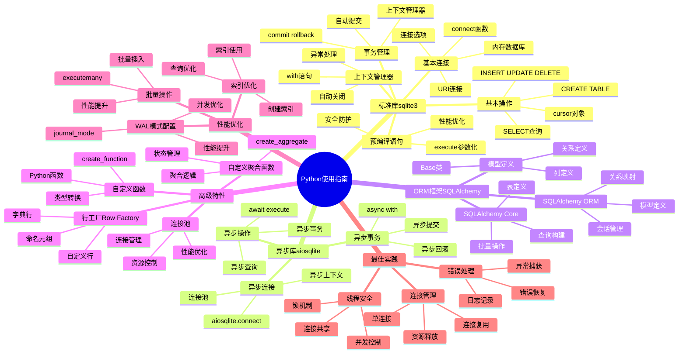

# SQLite Python使用指南

> **创建日期**：2025-11-13
> **最后更新**：2025-01-15
> **版本**：Python 3.7+，SQLite 3.31+ 至 3.47.x
> **适用库**：sqlite3（标准库）、aiosqlite、sqlalchemy

---

## 1. 📋 概述

本文档提供SQLite在Python中的完整使用指南，包括标准库sqlite3、异步库aiosqlite和ORM框架SQLAlchemy的使用方法。

---

## 1. 📑 目录

- [SQLite Python使用指南](#sqlite-python使用指南)
  - [1. 📋 概述](#1--概述)
  - [1. 📑 目录](#1--目录)
  - [3. 📊 思维导图](#3--思维导图)
  - [4. 标准库sqlite3](#4-标准库sqlite3)
    - [4.1. 基本连接](#41-基本连接)
  - [5. 基本操作](#5-基本操作)
  - [6. 事务管理](#6-事务管理)
  - [7. 预编译语句](#7-预编译语句)
  - [8. 上下文管理器](#8-上下文管理器)
  - [9. 异步库aiosqlite](#9-异步库aiosqlite)
    - [9.1. 异步连接](#91-异步连接)
  - [10. 异步操作](#10-异步操作)
  - [11. 异步事务](#11-异步事务)
  - [12. ORM框架SQLAlchemy](#12-orm框架sqlalchemy)
    - [12.1. SQLAlchemy Core](#121-sqlalchemy-core)
  - [13. SQLAlchemy ORM](#13-sqlalchemy-orm)
  - [14. 模型定义](#14-模型定义)
  - [15. 高级特性](#15-高级特性)
    - [15.1. 自定义函数](#151-自定义函数)
    - [15.2. 自定义聚合函数](#152-自定义聚合函数)
    - [15.3. 行工厂（Row Factory）](#153-行工厂row-factory)
  - [16. 连接池](#16-连接池)
  - [17. 性能优化](#17-性能优化)
    - [17.1. 批量操作](#171-批量操作)
  - [18. 索引优化](#18-索引优化)
  - [19. WAL模式配置](#19-wal模式配置)
  - [20. Python库多维对比矩阵](#20-python库多维对比矩阵)
    - [20.1. Python SQLite库对比矩阵](#201-python-sqlite库对比矩阵)
    - [20.2. Python使用方式对比矩阵](#202-python使用方式对比矩阵)
    - [20.3. Python最佳实践对比矩阵](#203-python最佳实践对比矩阵)
  - [21. 最佳实践](#21-最佳实践)
    - [21.1. 连接管理](#211-连接管理)
  - [22. 错误处理](#22-错误处理)
    - [22.1. 线程安全](#221-线程安全)
  - [23. 🔗 相关资源](#23--相关资源)
  - [24. 🔗 交叉引用](#24--交叉引用)
    - [24.1. 理论模型 🆕](#241-理论模型-)
    - [24.2. 设计模型 🆕](#242-设计模型-)
  - [25. 📚 参考资料](#25--参考资料)

---

## 3. 📊 思维导图



---

## 4. 标准库sqlite3

Python标准库提供了`sqlite3`模块，无需额外安装即可使用SQLite。

### 4.1. 基本连接

**基本连接**：

```python
import sqlite3

# 连接到数据库文件（不存在则创建）
conn = sqlite3.connect('example.db')

# 使用内存数据库
conn = sqlite3.connect(':memory:')

# 使用URI连接（支持更多选项）
conn = sqlite3.connect('file:example.db?mode=rwc', uri=True)

# 关闭连接
conn.close()
```

**连接选项**：

```python
# 设置超时时间（秒）
conn = sqlite3.connect('example.db', timeout=5.0)

# 检查连接是否已关闭
if conn:
    print("连接已建立")
```

## 5. 基本操作

**创建表和插入数据**：

```python
import sqlite3

conn = sqlite3.connect('example.db')
cursor = conn.cursor()

# 创建表
cursor.execute('''
    CREATE TABLE IF NOT EXISTS users (
        id INTEGER PRIMARY KEY AUTOINCREMENT,
        name TEXT NOT NULL,
        email TEXT UNIQUE,
        age INTEGER,
        created_at TEXT DEFAULT (datetime('now'))
    )
''')

# 插入单条数据
cursor.execute('''
    INSERT INTO users (name, email, age)
    VALUES (?, ?, ?)
''', ('Alice', 'alice@example.com', 25))

# 插入多条数据
users = [
    ('Bob', 'bob@example.com', 30),
    ('Charlie', 'charlie@example.com', 35)
]
cursor.executemany('''
    INSERT INTO users (name, email, age)
    VALUES (?, ?, ?)
''', users)

# 提交事务
conn.commit()

# 关闭游标和连接
cursor.close()
conn.close()
```

**查询数据**：

```python
import sqlite3

conn = sqlite3.connect('example.db')
cursor = conn.cursor()

# 查询单条记录
cursor.execute('SELECT * FROM users WHERE id = ?', (1,))
user = cursor.fetchone()
print(user)  # (1, 'Alice', 'alice@example.com', 25, '2024-01-01 10:00:00')

# 查询多条记录
cursor.execute('SELECT * FROM users WHERE age > ?', (25,))
users = cursor.fetchall()
for user in users:
    print(user)

# 使用字典游标（Python 3.6+）
conn.row_factory = sqlite3.Row
cursor = conn.cursor()
cursor.execute('SELECT * FROM users WHERE id = ?', (1,))
user = cursor.fetchone()
print(user['name'])  # 'Alice'
print(dict(user))  # {'id': 1, 'name': 'Alice', ...}

cursor.close()
conn.close()
```

## 6. 事务管理

**手动事务管理**：

```python
import sqlite3

conn = sqlite3.connect('example.db')
cursor = conn.cursor()

try:
# 开始事务（隐式）
    cursor.execute('INSERT INTO users (name, email) VALUES (?, ?)',
                   ('David', 'david@example.com'))
    cursor.execute('UPDATE users SET age = ? WHERE id = ?', (26, 1))

# 提交事务
    conn.commit()
    print("事务提交成功")
except sqlite3.Error as e:
# 回滚事务
    conn.rollback()
    print(f"事务回滚: {e}")
finally:
    cursor.close()
    conn.close()
```

**自动提交模式**：

```python
import sqlite3

# 自动提交模式（不推荐，性能差）
conn = sqlite3.connect('example.db', isolation_level=None)
cursor = conn.cursor()

cursor.execute('INSERT INTO users (name, email) VALUES (?, ?)',
               ('Eve', 'eve@example.com'))
# 自动提交，无需conn.commit()

conn.close()
```

## 7. 预编译语句

**使用预编译语句提升性能**：

```python
import sqlite3

conn = sqlite3.connect('example.db')
cursor = conn.cursor()

# 预编译语句
stmt = cursor.execute('SELECT * FROM users WHERE age > ? AND age < ?')

# 执行多次查询
cursor.execute('SELECT * FROM users WHERE age > ? AND age < ?', (20, 30))
results1 = cursor.fetchall()

cursor.execute('SELECT * FROM users WHERE age > ? AND age < ?', (30, 40))
results2 = cursor.fetchall()

# 使用命名参数
cursor.execute('''
    SELECT * FROM users
    WHERE age > :min_age AND age < :max_age
''', {'min_age': 20, 'max_age': 30})

cursor.close()
conn.close()
```

## 8. 上下文管理器

**使用上下文管理器自动管理连接**：

```python
import sqlite3

# 连接上下文管理器（Python 3.10+）
with sqlite3.connect('example.db') as conn:
    cursor = conn.cursor()
    cursor.execute('SELECT * FROM users')
    results = cursor.fetchall()
# 自动提交或回滚

# 手动实现上下文管理器（兼容旧版本）
class SQLiteConnection:
    def __init__(self, db_path):
        self.db_path = db_path
        self.conn = None

    def __enter__(self):
        self.conn = sqlite3.connect(self.db_path)
        return self.conn

    def __exit__(self, exc_type, exc_val, exc_tb):
        if exc_type:
            self.conn.rollback()
        else:
            self.conn.commit()
        self.conn.close()
        return False

# 使用
with SQLiteConnection('example.db') as conn:
    cursor = conn.cursor()
    cursor.execute('INSERT INTO users (name) VALUES (?)', ('Frank',))
```

---

## 9. 异步库aiosqlite

对于异步应用，可以使用`aiosqlite`库。

### 9.1. 异步连接

**安装和基本使用**：

```bash
pip install aiosqlite
```

```python
import aiosqlite
import asyncio

async def main():
# 异步连接
    async with aiosqlite.connect('example.db') as db:
# 执行查询
        async with db.execute('SELECT * FROM users') as cursor:
            async for row in cursor:
                print(row)

asyncio.run(main())
```

## 10. 异步操作

**异步CRUD操作**：

```python
import aiosqlite
import asyncio

async def create_user(db, name, email, age):
    await db.execute('''
        INSERT INTO users (name, email, age)
        VALUES (?, ?, ?)
    ''', (name, email, age))
    await db.commit()

async def get_users(db):
    async with db.execute('SELECT * FROM users') as cursor:
        return await cursor.fetchall()

async def main():
    async with aiosqlite.connect('example.db') as db:
# 创建表
        await db.execute('''
            CREATE TABLE IF NOT EXISTS users (
                id INTEGER PRIMARY KEY AUTOINCREMENT,
                name TEXT NOT NULL,
                email TEXT,
                age INTEGER
            )
        ''')
        await db.commit()

# 插入数据
        await create_user(db, 'Alice', 'alice@example.com', 25)

# 查询数据
        users = await get_users(db)
        for user in users:
            print(user)

asyncio.run(main())
```

## 11. 异步事务

**异步事务管理**：

```python
import aiosqlite
import asyncio

async def batch_insert(db, users):
    try:
        await db.execute('BEGIN')
        for name, email, age in users:
            await db.execute('''
                INSERT INTO users (name, email, age)
                VALUES (?, ?, ?)
            ''', (name, email, age))
        await db.commit()
        print("批量插入成功")
    except Exception as e:
        await db.rollback()
        print(f"批量插入失败: {e}")

async def main():
    async with aiosqlite.connect('example.db') as db:
        users = [
            ('Bob', 'bob@example.com', 30),
            ('Charlie', 'charlie@example.com', 35)
        ]
        await batch_insert(db, users)

asyncio.run(main())
```

---

## 12. ORM框架SQLAlchemy

SQLAlchemy是Python最流行的ORM框架，支持SQLite。

### 12.1. SQLAlchemy Core

**使用SQLAlchemy Core（类似原生SQL）**：

```python
from sqlalchemy import create_engine, MetaData, Table, Column, Integer, String
from sqlalchemy.sql import select

# 创建引擎
engine = create_engine('sqlite:///example.db', echo=True)

# 定义表结构
metadata = MetaData()
users = Table('users', metadata,
    Column('id', Integer, primary_key=True),
    Column('name', String(50), nullable=False),
    Column('email', String(100)),
    Column('age', Integer)
)

# 创建表
metadata.create_all(engine)

# 插入数据
with engine.connect() as conn:
    conn.execute(users.insert(), [
        {'name': 'Alice', 'email': 'alice@example.com', 'age': 25},
        {'name': 'Bob', 'email': 'bob@example.com', 'age': 30}
    ])
    conn.commit()

# 查询数据
with engine.connect() as conn:
    stmt = select(users).where(users.c.age > 25)
    result = conn.execute(stmt)
    for row in result:
        print(row)
```

## 13. SQLAlchemy ORM

**使用SQLAlchemy ORM**：

```python
from sqlalchemy import create_engine, Column, Integer, String, DateTime
from sqlalchemy.ext.declarative import declarative_base
from sqlalchemy.orm import sessionmaker
from datetime import datetime

Base = declarative_base()

# 定义模型
class User(Base):
    __tablename__ = 'users'

    id = Column(Integer, primary_key=True, autoincrement=True)
    name = Column(String(50), nullable=False)
    email = Column(String(100), unique=True)
    age = Column(Integer)
    created_at = Column(DateTime, default=datetime.now)

    def __repr__(self):
        return f"<User(id={self.id}, name='{self.name}')>"

# 创建引擎和会话
engine = create_engine('sqlite:///example.db', echo=True)
Base.metadata.create_all(engine)
Session = sessionmaker(bind=engine)

# 使用ORM操作
session = Session()

# 创建用户
user1 = User(name='Alice', email='alice@example.com', age=25)
user2 = User(name='Bob', email='bob@example.com', age=30)
session.add(user1)
session.add(user2)
session.commit()

# 查询用户
users = session.query(User).filter(User.age > 25).all()
for user in users:
    print(user)

# 更新用户
user = session.query(User).filter(User.id == 1).first()
if user:
    user.age = 26
    session.commit()

# 删除用户
user = session.query(User).filter(User.id == 2).first()
if user:
    session.delete(user)
    session.commit()

session.close()
```

## 14. 模型定义

**完整的模型定义示例**：

```python
from sqlalchemy import create_engine, Column, Integer, String, ForeignKey, Text
from sqlalchemy.ext.declarative import declarative_base
from sqlalchemy.orm import relationship, sessionmaker

Base = declarative_base()

class User(Base):
    __tablename__ = 'users'

    id = Column(Integer, primary_key=True)
    name = Column(String(50), nullable=False)
    email = Column(String(100), unique=True)

# 一对多关系
    orders = relationship('Order', back_populates='user')

    def __repr__(self):
        return f"<User(id={self.id}, name='{self.name}')>"

class Order(Base):
    __tablename__ = 'orders'

    id = Column(Integer, primary_key=True)
    user_id = Column(Integer, ForeignKey('users.id'), nullable=False)
    product = Column(String(100), nullable=False)
    amount = Column(Integer, nullable=False)

# 多对一关系
    user = relationship('User', back_populates='orders')

    def __repr__(self):
        return f"<Order(id={self.id}, product='{self.product}')>"

# 使用
engine = create_engine('sqlite:///example.db')
Base.metadata.create_all(engine)
Session = sessionmaker(bind=engine)

session = Session()

# 创建用户和订单
user = User(name='Alice', email='alice@example.com')
order1 = Order(user=user, product='Laptop', amount=1000)
order2 = Order(user=user, product='Mouse', amount=20)
session.add(user)
session.commit()

# 查询用户及其订单
user = session.query(User).filter(User.name == 'Alice').first()
print(f"User: {user.name}")
for order in user.orders:
    print(f"  Order: {order.product} - ${order.amount}")

session.close()
```

---

## 15. 高级特性

### 15.1. 自定义函数

**注册Python函数为SQLite函数**：

```python
import sqlite3
import hashlib

def md5_hash(text):
    """计算MD5哈希值"""
    return hashlib.md5(text.encode()).hexdigest()

def upper_case(text):
    """转换为大写"""
    return text.upper()

conn = sqlite3.connect('example.db')
conn.create_function('md5', 1, md5_hash)
conn.create_function('upper', 1, upper_case)

cursor = conn.cursor()
cursor.execute('SELECT md5(name), upper(email) FROM users')
results = cursor.fetchall()

cursor.close()
conn.close()
```

### 15.2. 自定义聚合函数

**创建自定义聚合函数**：

```python
import sqlite3

class Median:
    """计算中位数的聚合函数"""
    def __init__(self):
        self.values = []

    def step(self, value):
        if value is not None:
            self.values.append(value)

    def finalize(self):
        if not self.values:
            return None
        sorted_values = sorted(self.values)
        n = len(sorted_values)
        if n % 2 == 0:
            return (sorted_values[n//2 - 1] + sorted_values[n//2]) / 2
        else:
            return sorted_values[n//2]

conn = sqlite3.connect('example.db')
conn.create_aggregate('median', 1, Median)

cursor = conn.cursor()
cursor.execute('SELECT median(age) FROM users')
result = cursor.fetchone()
print(f"年龄中位数: {result[0]}")

cursor.close()
conn.close()
```

### 15.3. 行工厂（Row Factory）

**使用行工厂返回字典**：

```python
import sqlite3

def dict_factory(cursor, row):
    """将行转换为字典"""
    d = {}
    for idx, col in enumerate(cursor.description):
        d[col[0]] = row[idx]
    return d

conn = sqlite3.connect('example.db')
conn.row_factory = dict_factory

cursor = conn.cursor()
cursor.execute('SELECT * FROM users WHERE id = ?', (1,))
user = cursor.fetchone()
print(user)  # {'id': 1, 'name': 'Alice', 'email': 'alice@example.com', ...}
print(user['name'])  # 'Alice'

cursor.close()
conn.close()
```

**使用sqlite3.Row（推荐）**：

```python
import sqlite3

conn = sqlite3.connect('example.db')
conn.row_factory = sqlite3.Row

cursor = conn.cursor()
cursor.execute('SELECT * FROM users')
for row in cursor.fetchall():
    print(f"ID: {row['id']}, Name: {row['name']}")
# 也可以使用索引
    print(f"Email: {row[2]}")

cursor.close()
conn.close()
```

## 16. 连接池

**使用连接池（SQLAlchemy）**：

```python
from sqlalchemy import create_engine
from sqlalchemy.pool import QueuePool

# 配置连接池
engine = create_engine(
    'sqlite:///example.db',
    poolclass=QueuePool,
    pool_size=5,
    max_overflow=10,
    pool_pre_ping=True  # 连接前检查连接是否有效
)

# 使用连接池
with engine.connect() as conn:
    result = conn.execute('SELECT * FROM users')
    for row in result:
        print(row)
```

---

## 17. 性能优化

### 17.1. 批量操作

**批量插入优化**：

```python
import sqlite3

conn = sqlite3.connect('example.db')
cursor = conn.cursor()

# 方法1：使用executemany
users = [
    ('User1', 'user1@example.com', 20),
    ('User2', 'user2@example.com', 25),
# ... 更多用户
]
cursor.executemany('''
    INSERT INTO users (name, email, age)
    VALUES (?, ?, ?)
''', users)
conn.commit()

# 方法2：使用事务批量插入
def batch_insert(users, batch_size=1000):
    conn = sqlite3.connect('example.db')
    cursor = conn.cursor()

    try:
        for i in range(0, len(users), batch_size):
            batch = users[i:i+batch_size]
            cursor.executemany('''
                INSERT INTO users (name, email, age)
                VALUES (?, ?, ?)
            ''', batch)
            conn.commit()
    except Exception as e:
        conn.rollback()
        raise e
    finally:
        cursor.close()
        conn.close()

cursor.close()
conn.close()
```

## 18. 索引优化

**创建和使用索引**：

```python
import sqlite3

conn = sqlite3.connect('example.db')
cursor = conn.cursor()

# 创建索引
cursor.execute('CREATE INDEX IF NOT EXISTS idx_email ON users(email)')
cursor.execute('CREATE INDEX IF NOT EXISTS idx_age ON users(age)')

# 复合索引
cursor.execute('''
    CREATE INDEX IF NOT EXISTS idx_name_age
    ON users(name, age)
''')

conn.commit()

# 分析查询计划
cursor.execute('EXPLAIN QUERY PLAN SELECT * FROM users WHERE email = ?',
               ('alice@example.com',))
plan = cursor.fetchall()
for row in plan:
    print(row)

cursor.close()
conn.close()
```

## 19. WAL模式配置

**配置WAL模式提升并发性能**：

```python
import sqlite3

conn = sqlite3.connect('example.db')

# 启用WAL模式
conn.execute('PRAGMA journal_mode=WAL')
conn.execute('PRAGMA synchronous=NORMAL')
conn.execute('PRAGMA cache_size=-16000')  # 16MB缓存
conn.execute('PRAGMA foreign_keys=ON')

# 检查配置
cursor = conn.cursor()
cursor.execute('PRAGMA journal_mode')
print(f"Journal mode: {cursor.fetchone()[0]}")

cursor.close()
conn.close()
```

---

## 20. Python库多维对比矩阵

### 20.1. Python SQLite库对比矩阵

| 维度 | sqlite3（标准库） | aiosqlite | SQLAlchemy |
|------|------------------|-----------|------------|
| **类型** | 同步库 | 异步库 | ORM框架 |
| **安装** | 内置 | pip install | pip install |
| **性能** | ⭐⭐⭐⭐ | ⭐⭐⭐⭐ | ⭐⭐⭐ |
| **易用性** | ⭐⭐⭐⭐⭐ | ⭐⭐⭐⭐ | ⭐⭐⭐⭐⭐ |
| **异步支持** | ❌ | ✅ | ✅（异步引擎） |
| **ORM支持** | ❌ | ❌ | ✅ |
| **类型安全** | ⭐⭐⭐ | ⭐⭐⭐ | ⭐⭐⭐⭐ |
| **学习曲线** | ⭐⭐⭐⭐⭐ | ⭐⭐⭐⭐ | ⭐⭐⭐ |
| **适用场景** | 简单应用、脚本 | 异步应用 | 复杂应用、ORM需求 |
| **文档质量** | ⭐⭐⭐⭐⭐ | ⭐⭐⭐⭐ | ⭐⭐⭐⭐⭐ |
| **社区支持** | ⭐⭐⭐⭐⭐ | ⭐⭐⭐⭐ | ⭐⭐⭐⭐⭐ |

### 20.2. Python使用方式对比矩阵

| 维度 | 原生SQL | ORM | 异步ORM |
|------|---------|-----|---------|
| **性能** | ⭐⭐⭐⭐⭐ | ⭐⭐⭐ | ⭐⭐⭐⭐ |
| **灵活性** | ⭐⭐⭐⭐⭐ | ⭐⭐⭐ | ⭐⭐⭐ |
| **开发效率** | ⭐⭐⭐ | ⭐⭐⭐⭐⭐ | ⭐⭐⭐⭐ |
| **类型安全** | ⭐⭐ | ⭐⭐⭐⭐ | ⭐⭐⭐⭐ |
| **学习成本** | ⭐⭐⭐⭐ | ⭐⭐⭐ | ⭐⭐⭐ |
| **适用场景** | 简单查询、性能要求高 | 复杂应用、快速开发 | 异步应用、高并发 |
| **代码可读性** | ⭐⭐⭐ | ⭐⭐⭐⭐⭐ | ⭐⭐⭐⭐ |
| **维护成本** | ⭐⭐⭐ | ⭐⭐⭐⭐ | ⭐⭐⭐⭐ |

### 20.3. Python最佳实践对比矩阵

| 实践项 | 推荐做法 | 不推荐做法 | 性能影响 |
|--------|---------|-----------|---------|
| **连接管理** | 使用上下文管理器 | 手动管理连接 | ⭐⭐⭐⭐⭐ |
| **事务管理** | 批量操作使用事务 | 逐条操作 | ⭐⭐⭐⭐⭐ |
| **预编译语句** | 使用参数化查询 | 字符串拼接 | ⭐⭐⭐⭐ |
| **错误处理** | 捕获具体异常 | 捕获所有异常 | ⭐⭐⭐ |
| **线程安全** | 每线程独立连接 | 共享连接 | ⭐⭐⭐⭐⭐ |
| **WAL模式** | 启用WAL模式 | 使用DELETE模式 | ⭐⭐⭐⭐ |

## 21. 最佳实践

### 21.1. 连接管理

**连接管理最佳实践**：

```python
import sqlite3
from contextlib import contextmanager

@contextmanager
def get_db_connection(db_path='example.db'):
    """数据库连接上下文管理器"""
    conn = sqlite3.connect(db_path)
    conn.row_factory = sqlite3.Row
    try:
        yield conn
        conn.commit()
    except Exception:
        conn.rollback()
        raise
    finally:
        conn.close()

# 使用
with get_db_connection() as conn:
    cursor = conn.cursor()
    cursor.execute('SELECT * FROM users')
    users = cursor.fetchall()
```

## 22. 错误处理

**完善的错误处理**：

```python
import sqlite3

def safe_execute(conn, sql, params=None):
    """安全执行SQL语句"""
    try:
        cursor = conn.cursor()
        if params:
            cursor.execute(sql, params)
        else:
            cursor.execute(sql)
        conn.commit()
        return cursor.fetchall() if cursor.description else None
    except sqlite3.IntegrityError as e:
        print(f"完整性错误: {e}")
        conn.rollback()
        return None
    except sqlite3.OperationalError as e:
        print(f"操作错误: {e}")
        conn.rollback()
        return None
    except sqlite3.Error as e:
        print(f"数据库错误: {e}")
        conn.rollback()
        return None

conn = sqlite3.connect('example.db')
result = safe_execute(conn, 'SELECT * FROM users WHERE id = ?', (1,))
conn.close()
```

### 22.1. 线程安全

**多线程使用SQLite**：

```python
import sqlite3
import threading

# SQLite默认支持多线程（每个线程使用独立连接）
def worker(db_path, user_id):
    conn = sqlite3.connect(db_path, check_same_thread=False)
    cursor = conn.cursor()
    cursor.execute('SELECT * FROM users WHERE id = ?', (user_id,))
    result = cursor.fetchone()
    cursor.close()
    conn.close()
    return result

# 多线程查询
threads = []
for i in range(1, 6):
    t = threading.Thread(target=worker, args=('example.db', i))
    threads.append(t)
    t.start()

for t in threads:
    t.join()
```

---

## 23. 🔗 相关资源

- [08.01 连接管理](./08.01-连接管理.md) - 连接管理最佳实践
- [08.02 事务管理](./08.02-事务管理.md) - 事务管理详解
- [08.03 查询优化](./08.03-查询优化.md) - 查询优化技巧
- [08.07 JavaScript/TypeScript使用指南](./08.07-JavaScript-TypeScript使用指南.md) - 其他语言使用指南
- [08.08 Go使用指南](./08.08-Go使用指南.md) - 其他语言使用指南
- [Python sqlite3官方文档](https://docs.python.org/3/library/sqlite3.html)
- [SQLAlchemy文档](https://docs.sqlalchemy.org/)
- [aiosqlite文档](https://aiosqlite.omnilib.dev/)

---

## 24. 🔗 交叉引用

### 24.1. 理论模型 🆕

- ⭐ [系统理论模型](../11-理论模型/11.01-系统理论模型.md) - 编程接口理论
- ⭐ [算法复杂度理论](../11-理论模型/11.03-算法复杂度理论.md) - Python操作复杂度

### 24.2. 设计模型 🆕

- ⭐⭐ [设计模式](../12-设计模型/12.03-设计模式.md) - Python编程模式
- ⭐ [设计原则](../12-设计模型/12.02-设计原则.md) - Python编程原则

---

## 25. 📚 参考资料

- [Python sqlite3模块](https://docs.python.org/3/library/sqlite3.html)
- [SQLAlchemy SQLite支持](https://docs.sqlalchemy.org/en/14/dialects/sqlite.html)
- [aiosqlite GitHub](https://github.com/omnilib/aiosqlite)

---

**最后更新**：2025-01-15
**维护者**：Data-Science Team
