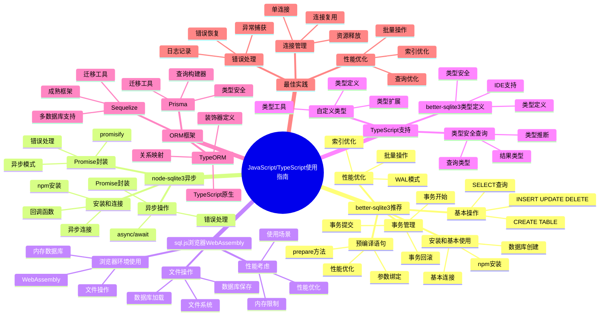

# SQLite JavaScript/TypeScript使用指南

> **创建日期**：2025-11-13
> **最后更新**：2025-01-15
> **版本**：Node.js 14+，TypeScript 4.0+，SQLite 3.31+ 至 3.47.x
> **适用库**：better-sqlite3、sql.js、node-sqlite3

---

## 📋 概述

本文档提供SQLite在JavaScript和TypeScript中的完整使用指南，包括Node.js环境下的同步/异步库和浏览器环境下的WebAssembly版本。

---

## 📑 目录

- [SQLite JavaScript/TypeScript使用指南](#sqlite-javascripttypescript使用指南)
  - [📋 概述](#-概述)
  - [📑 目录](#-目录)
  - [📊 思维导图](#-思维导图)
  - [一、better-sqlite3（推荐）](#一better-sqlite3推荐)
    - [1.1 安装和基本使用](#11-安装和基本使用)
    - [1.2 基本操作](#12-基本操作)
    - [1.3 事务管理](#13-事务管理)
    - [1.4 预编译语句](#14-预编译语句)
    - [1.5 性能优化](#15-性能优化)
  - [二、node-sqlite3（异步）](#二node-sqlite3异步)
    - [2.1 安装和连接](#21-安装和连接)
    - [2.2 异步操作](#22-异步操作)
    - [2.3 Promise封装](#23-promise封装)
  - [三、sql.js（浏览器/WebAssembly）](#三sqljs浏览器webassembly)
    - [3.1 浏览器环境使用](#31-浏览器环境使用)
    - [3.2 文件操作](#32-文件操作)
    - [3.3 性能考虑](#33-性能考虑)
  - [四、TypeScript支持](#四typescript支持)
    - [4.1 better-sqlite3类型定义](#41-better-sqlite3类型定义)
    - [4.2 类型安全查询](#42-类型安全查询)
    - [4.3 自定义类型](#43-自定义类型)
  - [五、ORM框架](#五orm框架)
    - [5.1 TypeORM](#51-typeorm)
    - [5.2 Sequelize](#52-sequelize)
    - [5.3 Prisma](#53-prisma)
  - [六、JavaScript/TypeScript库多维对比矩阵](#六javascripttypescript库多维对比矩阵)
    - [6.1 JavaScript/TypeScript SQLite库对比矩阵](#61-javascripttypescript-sqlite库对比矩阵)
    - [6.2 JavaScript/TypeScript ORM框架对比矩阵](#62-javascripttypescript-orm框架对比矩阵)
    - [6.3 JavaScript/TypeScript使用方式对比矩阵](#63-javascripttypescript使用方式对比矩阵)
  - [七、最佳实践](#七最佳实践)
    - [7.1 连接管理](#71-连接管理)
    - [7.2 错误处理](#72-错误处理)
    - [7.3 性能优化](#73-性能优化)
  - [🔗 相关资源](#-相关资源)
  - [🔗 交叉引用](#-交叉引用)
    - [理论模型 🆕](#理论模型-)
    - [设计模型 🆕](#设计模型-)
  - [📚 参考资料](#-参考资料)

---

## 📊 思维导图



---

## 一、better-sqlite3（推荐）

`better-sqlite3`是Node.js环境下最推荐的SQLite库，提供同步API，性能优异。

### 1.1 安装和基本使用

**安装**：

```bash
npm install better-sqlite3
# 或
yarn add better-sqlite3
```

**基本使用**：

```javascript
const Database = require('better-sqlite3');

// 连接到数据库（不存在则创建）
const db = new Database('example.db');

// 创建表
db.exec(`
    CREATE TABLE IF NOT EXISTS users (
        id INTEGER PRIMARY KEY AUTOINCREMENT,
        name TEXT NOT NULL,
        email TEXT UNIQUE,
        age INTEGER,
        created_at TEXT DEFAULT (datetime('now'))
    )
`);

// 关闭连接
db.close();
```

### 1.2 基本操作

**插入数据**：

```javascript
const Database = require('better-sqlite3');
const db = new Database('example.db');

// 插入单条数据
const insert = db.prepare('INSERT INTO users (name, email, age) VALUES (?, ?, ?)');
const info = insert.run('Alice', 'alice@example.com', 25);
console.log(`插入成功，ID: ${info.lastInsertRowid}`);

// 插入多条数据
const insertMany = db.prepare('INSERT INTO users (name, email, age) VALUES (?, ?, ?)');
const insertManyTransaction = db.transaction((users) => {
    for (const user of users) {
        insertMany.run(user.name, user.email, user.age);
    }
});

insertManyTransaction([
    { name: 'Bob', email: 'bob@example.com', age: 30 },
    { name: 'Charlie', email: 'charlie@example.com', age: 35 }
]);

db.close();
```

**查询数据**：

```javascript
const Database = require('better-sqlite3');
const db = new Database('example.db');

// 查询单条记录
const get = db.prepare('SELECT * FROM users WHERE id = ?');
const user = get.get(1);
console.log(user);

// 查询多条记录
const getAll = db.prepare('SELECT * FROM users WHERE age > ?');
const users = getAll.all(25);
users.forEach(user => {
    console.log(`${user.name} - ${user.email}`);
});

// 查询单个值
const count = db.prepare('SELECT COUNT(*) as count FROM users');
const result = count.get();
console.log(`用户总数: ${result.count}`);

db.close();
```

**更新和删除**：

```javascript
const Database = require('better-sqlite3');
const db = new Database('example.db');

// 更新数据
const update = db.prepare('UPDATE users SET age = ? WHERE id = ?');
const info = update.run(26, 1);
console.log(`更新了 ${info.changes} 行`);

// 删除数据
const del = db.prepare('DELETE FROM users WHERE id = ?');
const info2 = del.run(2);
console.log(`删除了 ${info2.changes} 行`);

db.close();
```

### 1.3 事务管理

**使用事务**：

```javascript
const Database = require('better-sqlite3');
const db = new Database('example.db');

// 简单事务
const transfer = db.transaction((fromId, toId, amount) => {
    const updateFrom = db.prepare('UPDATE accounts SET balance = balance - ? WHERE id = ?');
    const updateTo = db.prepare('UPDATE accounts SET balance = balance + ? WHERE id = ?');

    updateFrom.run(amount, fromId);
    updateTo.run(amount, toId);
});

try {
    transfer(1, 2, 100);
    console.log('转账成功');
} catch (error) {
    console.error('转账失败:', error);
}

// 嵌套事务（使用SAVEPOINT）
const nestedTransaction = db.transaction((operations) => {
    for (const op of operations) {
        const stmt = db.prepare(op.sql);
        stmt.run(...op.params);
    }
});

db.close();
```

### 1.4 预编译语句

**预编译语句提升性能**：

```javascript
const Database = require('better-sqlite3');
const db = new Database('example.db');

// 预编译语句可以重复使用
const getUser = db.prepare('SELECT * FROM users WHERE id = ?');
const getUsersByAge = db.prepare('SELECT * FROM users WHERE age > ? AND age < ?');

// 多次使用
const user1 = getUser.get(1);
const user2 = getUser.get(2);

const youngUsers = getUsersByAge.all(20, 30);
const middleUsers = getUsersByAge.all(30, 40);

db.close();
```

### 1.5 性能优化

**批量操作优化**：

```javascript
const Database = require('better-sqlite3');
const db = new Database('example.db');

// 启用WAL模式
db.pragma('journal_mode = WAL');
db.pragma('synchronous = NORMAL');
db.pragma('cache_size = -16000'); // 16MB

// 批量插入
const insert = db.prepare('INSERT INTO users (name, email, age) VALUES (?, ?, ?)');
const insertMany = db.transaction((users) => {
    for (const user of users) {
        insert.run(user.name, user.email, user.age);
    }
});

const users = Array.from({ length: 10000 }, (_, i) => ({
    name: `User${i}`,
    email: `user${i}@example.com`,
    age: 20 + (i % 50)
}));

insertMany(users);

db.close();
```

---

## 二、node-sqlite3（异步）

`node-sqlite3`提供异步API，适合需要异步操作的场景。

### 2.1 安装和连接

**安装**：

```bash
npm install sqlite3
```

**基本连接**：

```javascript
const sqlite3 = require('sqlite3').verbose();

// 打开数据库
const db = new sqlite3.Database('example.db', (err) => {
    if (err) {
        console.error('打开数据库失败:', err.message);
    } else {
        console.log('数据库连接成功');
    }
});

// 关闭数据库
db.close((err) => {
    if (err) {
        console.error('关闭数据库失败:', err.message);
    } else {
        console.log('数据库连接已关闭');
    }
});
```

### 2.2 异步操作

**异步CRUD操作**：

```javascript
const sqlite3 = require('sqlite3').verbose();
const db = new sqlite3.Database('example.db');

// 创建表
db.serialize(() => {
    db.run(`
        CREATE TABLE IF NOT EXISTS users (
            id INTEGER PRIMARY KEY AUTOINCREMENT,
            name TEXT NOT NULL,
            email TEXT UNIQUE,
            age INTEGER
        )
    `);

    // 插入数据
    db.run('INSERT INTO users (name, email, age) VALUES (?, ?, ?)',
        ['Alice', 'alice@example.com', 25],
        function(err) {
            if (err) {
                console.error('插入失败:', err.message);
            } else {
                console.log(`插入成功，ID: ${this.lastID}`);
            }
        }
    );

    // 查询数据
    db.all('SELECT * FROM users', [], (err, rows) => {
        if (err) {
            console.error('查询失败:', err.message);
        } else {
            rows.forEach(row => {
                console.log(row);
            });
        }
    });

    // 查询单条
    db.get('SELECT * FROM users WHERE id = ?', [1], (err, row) => {
        if (err) {
            console.error('查询失败:', err.message);
        } else {
            console.log(row);
        }
    });
});

db.close();
```

### 2.3 Promise封装

**使用Promise封装**：

```javascript
const sqlite3 = require('sqlite3').verbose();
const { open } = require('sqlite');
const { Database } = require('sqlite3');

async function main() {
    // 使用sqlite库（基于sqlite3的Promise封装）
    const db = await open({
        filename: 'example.db',
        driver: Database
    });

    // 创建表
    await db.exec(`
        CREATE TABLE IF NOT EXISTS users (
            id INTEGER PRIMARY KEY AUTOINCREMENT,
            name TEXT NOT NULL,
            email TEXT UNIQUE,
            age INTEGER
        )
    `);

    // 插入数据
    await db.run('INSERT INTO users (name, email, age) VALUES (?, ?, ?)',
        ['Alice', 'alice@example.com', 25]
    );

    // 查询数据
    const users = await db.all('SELECT * FROM users');
    console.log(users);

    // 查询单条
    const user = await db.get('SELECT * FROM users WHERE id = ?', [1]);
    console.log(user);

    await db.close();
}

main().catch(console.error);
```

---

## 三、sql.js（浏览器/WebAssembly）

`sql.js`是SQLite的WebAssembly版本，可以在浏览器中运行。

### 3.1 浏览器环境使用

**基本使用**：

```html
<!DOCTYPE html>
<html>
<head>
    <script src="https://cdnjs.cloudflare.com/ajax/libs/sql.js/1.8.0/sql-wasm.js"></script>
</head>
<body>
    <script>
        initSqlJs({
            locateFile: file => `https://cdnjs.cloudflare.com/ajax/libs/sql.js/1.8.0/${file}`
        }).then(SQL => {
            // 创建数据库
            const db = new SQL.Database();

            // 创建表
            db.run(`
                CREATE TABLE users (
                    id INTEGER PRIMARY KEY AUTOINCREMENT,
                    name TEXT NOT NULL,
                    email TEXT UNIQUE,
                    age INTEGER
                )
            `);

            // 插入数据
            db.run('INSERT INTO users (name, email, age) VALUES (?, ?, ?)',
                ['Alice', 'alice@example.com', 25]
            );

            // 查询数据
            const result = db.exec('SELECT * FROM users');
            console.log(result);

            // 导出数据库
            const data = db.export();
            const buffer = Buffer.from(data);

            // 关闭数据库
            db.close();
        });
    </script>
</body>
</html>
```

### 3.2 文件操作

**加载和保存数据库文件**：

```javascript
// 在Node.js环境中
const initSqlJs = require('sql.js');
const fs = require('fs');

async function main() {
    const SQL = await initSqlJs();

    // 从文件加载数据库
    const buffer = fs.readFileSync('example.db');
    const db = new SQL.Database(buffer);

    // 执行操作
    const result = db.exec('SELECT * FROM users');
    console.log(result);

    // 保存数据库
    const data = db.export();
    const buffer2 = Buffer.from(data);
    fs.writeFileSync('example_backup.db', buffer2);

    db.close();
}

main();
```

### 3.3 性能考虑

**性能优化建议**：

```javascript
// sql.js性能优化
const SQL = await initSqlJs();

const db = new SQL.Database();

// 使用预编译语句
const stmt = db.prepare('SELECT * FROM users WHERE age > ?');
stmt.bind([25]);
while (stmt.step()) {
    const row = stmt.getAsObject();
    console.log(row);
}
stmt.free();

// 批量操作
db.run('BEGIN TRANSACTION');
for (let i = 0; i < 1000; i++) {
    db.run('INSERT INTO users (name, age) VALUES (?, ?)', [`User${i}`, 20 + i]);
}
db.run('COMMIT');

db.close();
```

---

## 四、TypeScript支持

### 4.1 better-sqlite3类型定义

**TypeScript类型定义**：

```typescript
import Database from 'better-sqlite3';

interface User {
    id: number;
    name: string;
    email: string | null;
    age: number | null;
    created_at: string;
}

const db = new Database('example.db');

// 类型安全的查询
const getUser = db.prepare<User, [number]>('SELECT * FROM users WHERE id = ?');
const user = getUser.get(1);
if (user) {
    console.log(user.name); // TypeScript知道user有name属性
}

// 类型安全的插入
const insertUser = db.prepare<Database.RunResult, [string, string, number]>(
    'INSERT INTO users (name, email, age) VALUES (?, ?, ?)'
);
const result = insertUser.run('Alice', 'alice@example.com', 25);

db.close();
```

### 4.2 类型安全查询

**创建类型安全的查询函数**：

```typescript
import Database from 'better-sqlite3';

interface User {
    id: number;
    name: string;
    email: string | null;
    age: number | null;
}

class UserRepository {
    private db: Database.Database;

    constructor(db: Database.Database) {
        this.db = db;
    }

    findById(id: number): User | undefined {
        const stmt = this.db.prepare<User, [number]>(
            'SELECT * FROM users WHERE id = ?'
        );
        return stmt.get(id);
    }

    findByAge(minAge: number, maxAge: number): User[] {
        const stmt = this.db.prepare<User, [number, number]>(
            'SELECT * FROM users WHERE age > ? AND age < ?'
        );
        return stmt.all(minAge, maxAge);
    }

    create(user: Omit<User, 'id'>): number {
        const stmt = this.db.prepare<Database.RunResult, [string, string | null, number | null]>(
            'INSERT INTO users (name, email, age) VALUES (?, ?, ?)'
        );
        const result = stmt.run(user.name, user.email, user.age);
        return Number(result.lastInsertRowid);
    }
}

const db = new Database('example.db');
const userRepo = new UserRepository(db);

const user = userRepo.findById(1);
const users = userRepo.findByAge(20, 30);
const newUserId = userRepo.create({
    name: 'Bob',
    email: 'bob@example.com',
    age: 30
});

db.close();
```

### 4.3 自定义类型

**使用泛型创建类型安全的数据库操作**：

```typescript
import Database from 'better-sqlite3';

class TypedDatabase<T> {
    private db: Database.Database;

    constructor(dbPath: string) {
        this.db = new Database(dbPath);
    }

    prepare<Params extends any[] = []>(
        sql: string
    ): Database.Statement<T, Params> {
        return this.db.prepare<T, Params>(sql);
    }

    transaction<Params extends any[], Return>(
        fn: (...args: Params) => Return
    ): (...args: Params) => Return {
        return this.db.transaction(fn);
    }

    close(): void {
        this.db.close();
    }
}

interface User {
    id: number;
    name: string;
    email: string;
}

const db = new TypedDatabase<User>('example.db');
const getUser = db.prepare<[number]>('SELECT * FROM users WHERE id = ?');
const user = getUser.get(1);

db.close();
```

---

## 五、ORM框架

### 5.1 TypeORM

**使用TypeORM**：

```typescript
import { DataSource, Entity, PrimaryGeneratedColumn, Column } from 'typeorm';

@Entity()
class User {
    @PrimaryGeneratedColumn()
    id: number;

    @Column()
    name: string;

    @Column({ unique: true })
    email: string;

    @Column({ nullable: true })
    age: number;
}

const AppDataSource = new DataSource({
    type: 'better-sqlite3',
    database: 'example.db',
    entities: [User],
    synchronize: true
});

AppDataSource.initialize().then(async () => {
    const userRepository = AppDataSource.getRepository(User);

    // 创建用户
    const user = new User();
    user.name = 'Alice';
    user.email = 'alice@example.com';
    user.age = 25;
    await userRepository.save(user);

    // 查询用户
    const users = await userRepository.find();
    console.log(users);

    AppDataSource.destroy();
});
```

### 5.2 Sequelize

**使用Sequelize**：

```javascript
const { Sequelize, DataTypes } = require('sequelize');

const sequelize = new Sequelize({
    dialect: 'sqlite',
    storage: 'example.db'
});

const User = sequelize.define('User', {
    id: {
        type: DataTypes.INTEGER,
        primaryKey: true,
        autoIncrement: true
    },
    name: {
        type: DataTypes.STRING,
        allowNull: false
    },
    email: {
        type: DataTypes.STRING,
        unique: true
    },
    age: {
        type: DataTypes.INTEGER
    }
});

(async () => {
    await sequelize.sync();

    // 创建用户
    const user = await User.create({
        name: 'Alice',
        email: 'alice@example.com',
        age: 25
    });

    // 查询用户
    const users = await User.findAll();
    console.log(users);

    await sequelize.close();
})();
```

### 5.3 Prisma

**使用Prisma**：

```prisma
// schema.prisma
datasource db {
    provider = "sqlite"
    url      = "file:./example.db"
}

model User {
    id        Int      @id @default(autoincrement())
    name      String
    email     String   @unique
    age       Int?
    createdAt DateTime @default(now())
}
```

```typescript
import { PrismaClient } from '@prisma/client';

const prisma = new PrismaClient();

async function main() {
    // 创建用户
    const user = await prisma.user.create({
        data: {
            name: 'Alice',
            email: 'alice@example.com',
            age: 25
        }
    });

    // 查询用户
    const users = await prisma.user.findMany({
        where: {
            age: {
                gt: 20
            }
        }
    });

    console.log(users);
}

main()
    .catch(console.error)
    .finally(() => prisma.$disconnect());
```

---

## 六、JavaScript/TypeScript库多维对比矩阵

### 6.1 JavaScript/TypeScript SQLite库对比矩阵

| 维度 | better-sqlite3 | node-sqlite3 | sql.js |
|------|---------------|--------------|--------|
| **类型** | 同步库 | 异步库 | WebAssembly库 |
| **运行环境** | Node.js | Node.js | 浏览器/Node.js |
| **性能** | ⭐⭐⭐⭐⭐ | ⭐⭐⭐⭐ | ⭐⭐⭐ |
| **易用性** | ⭐⭐⭐⭐⭐ | ⭐⭐⭐⭐ | ⭐⭐⭐ |
| **异步支持** | ❌ | ✅ | ❌ |
| **TypeScript支持** | ✅ | ✅ | ✅ |
| **类型安全** | ⭐⭐⭐⭐ | ⭐⭐⭐ | ⭐⭐⭐ |
| **学习曲线** | ⭐⭐⭐⭐⭐ | ⭐⭐⭐⭐ | ⭐⭐⭐ |
| **适用场景** | Node.js应用（推荐） | 异步Node.js应用 | 浏览器应用 |
| **文档质量** | ⭐⭐⭐⭐⭐ | ⭐⭐⭐⭐ | ⭐⭐⭐⭐ |
| **社区支持** | ⭐⭐⭐⭐ | ⭐⭐⭐⭐⭐ | ⭐⭐⭐⭐ |
| **内存占用** | 低 | 中 | 高（WASM） |

### 6.2 JavaScript/TypeScript ORM框架对比矩阵

| 维度 | TypeORM | Sequelize | Prisma |
|------|---------|-----------|--------|
| **类型** | TypeScript ORM | JavaScript ORM | 类型安全ORM |
| **TypeScript支持** | ⭐⭐⭐⭐⭐ | ⭐⭐⭐ | ⭐⭐⭐⭐⭐ |
| **性能** | ⭐⭐⭐⭐ | ⭐⭐⭐ | ⭐⭐⭐⭐ |
| **易用性** | ⭐⭐⭐⭐ | ⭐⭐⭐⭐⭐ | ⭐⭐⭐⭐⭐ |
| **代码生成** | ❌ | ❌ | ✅ |
| **迁移支持** | ✅ | ✅ | ✅ |
| **查询构建器** | ✅ | ✅ | ✅ |
| **关系映射** | ⭐⭐⭐⭐⭐ | ⭐⭐⭐⭐⭐ | ⭐⭐⭐⭐ |
| **学习曲线** | ⭐⭐⭐ | ⭐⭐⭐⭐ | ⭐⭐⭐⭐ |
| **适用场景** | TypeScript项目 | JavaScript项目 | 类型安全项目 |

### 6.3 JavaScript/TypeScript使用方式对比矩阵

| 维度 | 原生SQL | ORM | 查询构建器 |
|------|---------|-----|-----------|
| **性能** | ⭐⭐⭐⭐⭐ | ⭐⭐⭐ | ⭐⭐⭐⭐ |
| **灵活性** | ⭐⭐⭐⭐⭐ | ⭐⭐⭐ | ⭐⭐⭐⭐ |
| **开发效率** | ⭐⭐⭐ | ⭐⭐⭐⭐⭐ | ⭐⭐⭐⭐ |
| **类型安全** | ⭐⭐ | ⭐⭐⭐⭐ | ⭐⭐⭐ |
| **学习成本** | ⭐⭐⭐⭐ | ⭐⭐⭐ | ⭐⭐⭐ |
| **适用场景** | 简单查询、性能要求高 | 复杂应用、快速开发 | 中等复杂度应用 |
| **代码可读性** | ⭐⭐⭐ | ⭐⭐⭐⭐⭐ | ⭐⭐⭐⭐ |
| **维护成本** | ⭐⭐⭐ | ⭐⭐⭐⭐ | ⭐⭐⭐⭐ |

## 七、最佳实践

### 7.1 连接管理

**连接管理最佳实践**：

```typescript
import Database from 'better-sqlite3';

class DatabaseManager {
    private static instance: Database.Database | null = null;

    static getInstance(dbPath: string = 'example.db'): Database.Database {
        if (!this.instance) {
            this.instance = new Database(dbPath);
            this.instance.pragma('journal_mode = WAL');
            this.instance.pragma('foreign_keys = ON');
        }
        return this.instance;
    }

    static close(): void {
        if (this.instance) {
            this.instance.close();
            this.instance = null;
        }
    }
}

// 使用
const db = DatabaseManager.getInstance();
// ... 使用数据库
DatabaseManager.close();
```

### 7.2 错误处理

**完善的错误处理**：

```typescript
import Database from 'better-sqlite3';

function safeExecute<T>(
    db: Database.Database,
    sql: string,
    params: any[] = []
): T | null {
    try {
        const stmt = db.prepare(sql);
        if (sql.trim().toUpperCase().startsWith('SELECT')) {
            return stmt.all(...params) as T;
        } else {
            stmt.run(...params);
            return null;
        }
    } catch (error) {
        if (error instanceof Database.SqliteError) {
            console.error(`SQLite错误 (${error.code}): ${error.message}`);
        } else {
            console.error('未知错误:', error);
        }
        return null;
    }
}

const db = new Database('example.db');
const users = safeExecute<any[]>(db, 'SELECT * FROM users');
db.close();
```

### 7.3 性能优化

**性能优化建议**：

```typescript
import Database from 'better-sqlite3';

const db = new Database('example.db');

// 1. 启用WAL模式
db.pragma('journal_mode = WAL');
db.pragma('synchronous = NORMAL');

// 2. 设置缓存大小
db.pragma('cache_size = -16000'); // 16MB

// 3. 使用预编译语句
const insert = db.prepare('INSERT INTO users (name, email) VALUES (?, ?)');
const insertMany = db.transaction((users) => {
    for (const user of users) {
        insert.run(user.name, user.email);
    }
});

// 4. 批量操作使用事务
const users = Array.from({ length: 1000 }, (_, i) => ({
    name: `User${i}`,
    email: `user${i}@example.com`
}));
insertMany(users);

db.close();
```

---

## 🔗 相关资源

- [08.01 连接管理](./08.01-连接管理.md) - 连接管理最佳实践
- [08.02 事务管理](./08.02-事务管理.md) - 事务管理详解
- [08.03 查询优化](./08.03-查询优化.md) - 查询优化技巧
- [08.06 Python使用指南](./08.06-Python使用指南.md) - 其他语言使用指南
- [08.08 Go使用指南](./08.08-Go使用指南.md) - 其他语言使用指南
- [better-sqlite3文档](https://github.com/WiseLibs/better-sqlite3)
- [node-sqlite3文档](https://github.com/TryGhost/node-sqlite3)
- [sql.js文档](https://github.com/sql-js/sql.js)

---

## 🔗 交叉引用

### 理论模型 🆕

- ⭐ [系统理论模型](../11-理论模型/11.01-系统理论模型.md) - 编程接口理论
- ⭐ [算法复杂度理论](../11-理论模型/11.03-算法复杂度理论.md) - JavaScript/TypeScript操作复杂度

### 设计模型 🆕

- ⭐⭐ [设计模式](../12-设计模型/12.03-设计模式.md) - JavaScript/TypeScript编程模式
- ⭐ [设计原则](../12-设计模型/12.02-设计原则.md) - JavaScript/TypeScript编程原则

---

## 📚 参考资料

- [better-sqlite3 GitHub](https://github.com/WiseLibs/better-sqlite3)
- [node-sqlite3 GitHub](https://github.com/TryGhost/node-sqlite3)
- [sql.js GitHub](https://github.com/sql-js/sql.js)
- [TypeORM文档](https://typeorm.io/)
- [Prisma文档](https://www.prisma.io/)

---

**最后更新**：2025-01-15
**维护者**：Data-Science Team
