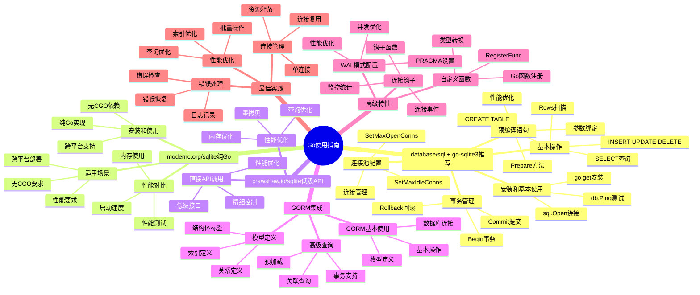

# SQLite Go使用指南

> **创建日期**：2025-11-13
> **最后更新**：2025-01-15
> **版本**：Go 1.16+，SQLite 3.31+ 至 3.47.x
> **适用库**：github.com/mattn/go-sqlite3、modernc.org/sqlite、crawshaw.io/sqlite

---

## 📋 概述

本文档提供SQLite在Go语言中的完整使用指南，包括CGO驱动、纯Go实现和现代SQL接口的使用方法。

---

## 📑 目录

- [SQLite Go使用指南](#sqlite-go使用指南)
  - [📋 概述](#-概述)
  - [📑 目录](#-目录)
  - [📊 思维导图](#-思维导图)
  - [一、database/sql + go-sqlite3（推荐）](#一databasesql--go-sqlite3推荐)
    - [1.1 安装和基本使用](#11-安装和基本使用)
    - [1.2 基本操作](#12-基本操作)
    - [1.3 事务管理](#13-事务管理)
    - [1.4 预编译语句](#14-预编译语句)
    - [1.5 连接池配置](#15-连接池配置)
  - [二、modernc.org/sqlite（纯Go）](#二moderncorgsqlite纯go)
    - [2.1 安装和使用](#21-安装和使用)
    - [2.2 性能对比](#22-性能对比)
    - [2.3 适用场景](#23-适用场景)
  - [三、crawshaw.io/sqlite（低级API）](#三crawshawiosqlite低级api)
    - [3.1 直接API调用](#31-直接api调用)
    - [3.2 性能优化](#32-性能优化)
  - [四、GORM集成](#四gorm集成)
    - [4.1 GORM基本使用](#41-gorm基本使用)
    - [4.2 模型定义](#42-模型定义)
    - [4.3 高级查询](#43-高级查询)
  - [五、高级特性](#五高级特性)
    - [5.1 自定义函数](#51-自定义函数)
    - [5.2 连接钩子](#52-连接钩子)
    - [5.3 WAL模式配置](#53-wal模式配置)
  - [六、Go库多维对比矩阵](#六go库多维对比矩阵)
    - [6.1 Go SQLite库对比矩阵](#61-go-sqlite库对比矩阵)
    - [6.2 Go使用方式对比矩阵](#62-go使用方式对比矩阵)
    - [6.3 Go最佳实践对比矩阵](#63-go最佳实践对比矩阵)
  - [七、最佳实践](#七最佳实践)
    - [7.1 连接管理](#71-连接管理)
    - [7.2 错误处理](#72-错误处理)
    - [7.3 性能优化](#73-性能优化)
  - [🔗 相关资源](#-相关资源)
  - [🔗 交叉引用](#-交叉引用)
    - [理论模型 🆕](#理论模型-)
    - [设计模型 🆕](#设计模型-)
  - [📚 参考资料](#-参考资料)

---

## 📊 思维导图



---

## 一、database/sql + go-sqlite3（推荐）

使用Go标准库`database/sql`配合`go-sqlite3`驱动是最常用的方式。

### 1.1 安装和基本使用

**安装**：

```bash
go get github.com/mattn/go-sqlite3
```

**基本连接**：

```go
package main

import (
    "database/sql"
    _ "github.com/mattn/go-sqlite3"
    "log"
)

func main() {
    // 打开数据库连接（不存在则创建）
    db, err := sql.Open("sqlite3", "example.db")
    if err != nil {
        log.Fatal(err)
    }
    defer db.Close()

    // 测试连接
    err = db.Ping()
    if err != nil {
        log.Fatal(err)
    }

    log.Println("数据库连接成功")
}
```

### 1.2 基本操作

**创建表和插入数据**：

```go
package main

import (
    "database/sql"
    _ "github.com/mattn/go-sqlite3"
    "log"
)

func main() {
    db, err := sql.Open("sqlite3", "example.db")
    if err != nil {
        log.Fatal(err)
    }
    defer db.Close()

    // 创建表
    createTableSQL := `
        CREATE TABLE IF NOT EXISTS users (
            id INTEGER PRIMARY KEY AUTOINCREMENT,
            name TEXT NOT NULL,
            email TEXT UNIQUE,
            age INTEGER,
            created_at DATETIME DEFAULT CURRENT_TIMESTAMP
        )
    `
    _, err = db.Exec(createTableSQL)
    if err != nil {
        log.Fatal(err)
    }

    // 插入单条数据
    insertSQL := "INSERT INTO users (name, email, age) VALUES (?, ?, ?)"
    result, err := db.Exec(insertSQL, "Alice", "alice@example.com", 25)
    if err != nil {
        log.Fatal(err)
    }

    id, err := result.LastInsertId()
    if err != nil {
        log.Fatal(err)
    }
    log.Printf("插入成功，ID: %d", id)

    // 插入多条数据
    stmt, err := db.Prepare(insertSQL)
    if err != nil {
        log.Fatal(err)
    }
    defer stmt.Close()

    users := []struct {
        name  string
        email string
        age   int
    }{
        {"Bob", "bob@example.com", 30},
        {"Charlie", "charlie@example.com", 35},
    }

    for _, user := range users {
        _, err = stmt.Exec(user.name, user.email, user.age)
        if err != nil {
            log.Fatal(err)
        }
    }
}
```

**查询数据**：

```go
package main

import (
    "database/sql"
    _ "github.com/mattn/go-sqlite3"
    "log"
)

type User struct {
    ID        int
    Name      string
    Email     string
    Age       sql.NullInt64
    CreatedAt string
}

func main() {
    db, err := sql.Open("sqlite3", "example.db")
    if err != nil {
        log.Fatal(err)
    }
    defer db.Close()

    // 查询单条记录
    var user User
    err = db.QueryRow("SELECT id, name, email, age, created_at FROM users WHERE id = ?", 1).
        Scan(&user.ID, &user.Name, &user.Email, &user.Age, &user.CreatedAt)
    if err != nil {
        if err == sql.ErrNoRows {
            log.Println("未找到记录")
        } else {
            log.Fatal(err)
        }
    } else {
        log.Printf("用户: %+v", user)
    }

    // 查询多条记录
    rows, err := db.Query("SELECT id, name, email, age, created_at FROM users WHERE age > ?", 25)
    if err != nil {
        log.Fatal(err)
    }
    defer rows.Close()

    var users []User
    for rows.Next() {
        var u User
        err := rows.Scan(&u.ID, &u.Name, &u.Email, &u.Age, &u.CreatedAt)
        if err != nil {
            log.Fatal(err)
        }
        users = append(users, u)
    }

    err = rows.Err()
    if err != nil {
        log.Fatal(err)
    }

    for _, u := range users {
        log.Printf("用户: %+v", u)
    }
}
```

**更新和删除**：

```go
package main

import (
    "database/sql"
    _ "github.com/mattn/go-sqlite3"
    "log"
)

func main() {
    db, err := sql.Open("sqlite3", "example.db")
    if err != nil {
        log.Fatal(err)
    }
    defer db.Close()

    // 更新数据
    updateSQL := "UPDATE users SET age = ? WHERE id = ?"
    result, err := db.Exec(updateSQL, 26, 1)
    if err != nil {
        log.Fatal(err)
    }

    rowsAffected, err := result.RowsAffected()
    if err != nil {
        log.Fatal(err)
    }
    log.Printf("更新了 %d 行", rowsAffected)

    // 删除数据
    deleteSQL := "DELETE FROM users WHERE id = ?"
    result, err = db.Exec(deleteSQL, 2)
    if err != nil {
        log.Fatal(err)
    }

    rowsAffected, err = result.RowsAffected()
    if err != nil {
        log.Fatal(err)
    }
    log.Printf("删除了 %d 行", rowsAffected)
}
```

### 1.3 事务管理

**使用事务**：

```go
package main

import (
    "database/sql"
    _ "github.com/mattn/go-sqlite3"
    "log"
)

func main() {
    db, err := sql.Open("sqlite3", "example.db")
    if err != nil {
        log.Fatal(err)
    }
    defer db.Close()

    // 开始事务
    tx, err := db.Begin()
    if err != nil {
        log.Fatal(err)
    }

    // 执行多个操作
    _, err = tx.Exec("INSERT INTO users (name, email) VALUES (?, ?)", "David", "david@example.com")
    if err != nil {
        tx.Rollback()
        log.Fatal(err)
    }

    _, err = tx.Exec("UPDATE users SET age = ? WHERE id = ?", 26, 1)
    if err != nil {
        tx.Rollback()
        log.Fatal(err)
    }

    // 提交事务
    err = tx.Commit()
    if err != nil {
        log.Fatal(err)
    }

    log.Println("事务提交成功")
}
```

### 1.4 预编译语句

**使用预编译语句**：

```go
package main

import (
    "database/sql"
    _ "github.com/mattn/go-sqlite3"
    "log"
)

func main() {
    db, err := sql.Open("sqlite3", "example.db")
    if err != nil {
        log.Fatal(err)
    }
    defer db.Close()

    // 预编译语句
    stmt, err := db.Prepare("SELECT id, name, email FROM users WHERE id = ?")
    if err != nil {
        log.Fatal(err)
    }
    defer stmt.Close()

    // 多次使用
    var name, email string
    var id int

    err = stmt.QueryRow(1).Scan(&id, &name, &email)
    if err != nil {
        log.Fatal(err)
    }
    log.Printf("ID: %d, Name: %s, Email: %s", id, name, email)

    err = stmt.QueryRow(2).Scan(&id, &name, &email)
    if err != nil {
        log.Fatal(err)
    }
    log.Printf("ID: %d, Name: %s, Email: %s", id, name, email)
}
```

### 1.5 连接池配置

**配置连接池**：

```go
package main

import (
    "database/sql"
    _ "github.com/mattn/go-sqlite3"
    "log"
    "time"
)

func main() {
    db, err := sql.Open("sqlite3", "example.db")
    if err != nil {
        log.Fatal(err)
    }
    defer db.Close()

    // 配置连接池
    db.SetMaxOpenConns(1)        // SQLite只支持单连接，设置为1
    db.SetMaxIdleConns(1)        // 空闲连接数
    db.SetConnMaxLifetime(time.Hour) // 连接最大生存时间

    // 测试连接
    err = db.Ping()
    if err != nil {
        log.Fatal(err)
    }

    log.Println("数据库连接成功")
}
```

---

## 二、modernc.org/sqlite（纯Go）

`modernc.org/sqlite`是纯Go实现的SQLite驱动，不需要CGO。

### 2.1 安装和使用

**安装**：

```bash
go get modernc.org/sqlite
```

**基本使用**：

```go
package main

import (
    "database/sql"
    _ "modernc.org/sqlite"
    "log"
)

func main() {
    // 使用方式与go-sqlite3完全相同
    db, err := sql.Open("sqlite", "example.db")
    if err != nil {
        log.Fatal(err)
    }
    defer db.Close()

    // 创建表
    _, err = db.Exec(`
        CREATE TABLE IF NOT EXISTS users (
            id INTEGER PRIMARY KEY AUTOINCREMENT,
            name TEXT NOT NULL,
            email TEXT UNIQUE
        )
    `)
    if err != nil {
        log.Fatal(err)
    }

    log.Println("数据库操作成功")
}
```

### 2.2 性能对比

**性能特点**：

- **优点**：
  - 纯Go实现，无需CGO
  - 交叉编译更容易
  - 部署更简单

- **缺点**：
  - 性能略低于CGO版本
  - 某些高级特性可能不支持

### 2.3 适用场景

**适用场景**：

- 需要交叉编译的项目
- 不想依赖C编译器的环境
- 对性能要求不是特别高的场景

---

## 三、crawshaw.io/sqlite（低级API）

`crawshaw.io/sqlite`提供更接近C API的低级接口。

### 3.1 直接API调用

**基本使用**：

```go
package main

import (
    "log"
    "crawshaw.io/sqlite"
    "crawshaw.io/sqlite/sqlitex"
)

func main() {
    // 打开数据库
    conn, err := sqlite.OpenConn("example.db", 0)
    if err != nil {
        log.Fatal(err)
    }
    defer conn.Close()

    // 执行SQL
    err = sqlitex.Exec(conn, `
        CREATE TABLE IF NOT EXISTS users (
            id INTEGER PRIMARY KEY AUTOINCREMENT,
            name TEXT NOT NULL,
            email TEXT UNIQUE
        )
    `, nil)
    if err != nil {
        log.Fatal(err)
    }

    // 插入数据
    stmt := conn.Prep("INSERT INTO users (name, email) VALUES ($name, $email);")
    stmt.SetText("$name", "Alice")
    stmt.SetText("$email", "alice@example.com")
    _, err = stmt.Step()
    if err != nil {
        log.Fatal(err)
    }
    stmt.Reset()

    // 查询数据
    stmt = conn.Prep("SELECT id, name, email FROM users WHERE id = $id;")
    stmt.SetInt64("$id", 1)
    hasRow, err := stmt.Step()
    if err != nil {
        log.Fatal(err)
    }
    if hasRow {
        id := stmt.GetInt64("id")
        name := stmt.GetText("name")
        email := stmt.GetText("email")
        log.Printf("ID: %d, Name: %s, Email: %s", id, name, email)
    }
    stmt.Reset()
}
```

### 3.2 性能优化

**性能优化技巧**：

```go
package main

import (
    "log"
    "crawshaw.io/sqlite"
    "crawshaw.io/sqlite/sqlitex"
)

func main() {
    conn, err := sqlite.OpenConn("example.db", 0)
    if err != nil {
        log.Fatal(err)
    }
    defer conn.Close()

    // 启用WAL模式
    err = sqlitex.Exec(conn, "PRAGMA journal_mode=WAL;", nil)
    if err != nil {
        log.Fatal(err)
    }

    // 设置缓存大小
    err = sqlitex.Exec(conn, "PRAGMA cache_size=-16000;", nil)
    if err != nil {
        log.Fatal(err)
    }

    // 批量插入
    err = sqlitex.Exec(conn, "BEGIN TRANSACTION;", nil)
    if err != nil {
        log.Fatal(err)
    }

    stmt := conn.Prep("INSERT INTO users (name, email) VALUES ($name, $email);")
    for i := 0; i < 1000; i++ {
        stmt.SetText("$name", fmt.Sprintf("User%d", i))
        stmt.SetText("$email", fmt.Sprintf("user%d@example.com", i))
        _, err = stmt.Step()
        if err != nil {
            log.Fatal(err)
        }
        stmt.Reset()
    }

    err = sqlitex.Exec(conn, "COMMIT;", nil)
    if err != nil {
        log.Fatal(err)
    }
}
```

---

## 四、GORM集成

GORM是Go最流行的ORM框架。

### 4.1 GORM基本使用

**安装和使用**：

```bash
go get gorm.io/gorm
go get gorm.io/driver/sqlite
```

```go
package main

import (
    "gorm.io/driver/sqlite"
    "gorm.io/gorm"
    "log"
)

type User struct {
    ID        uint   `gorm:"primaryKey"`
    Name      string
    Email     string `gorm:"unique"`
    Age       int
    CreatedAt int64  `gorm:"autoCreateTime"`
}

func main() {
    // 连接数据库
    db, err := gorm.Open(sqlite.Open("example.db"), &gorm.Config{})
    if err != nil {
        log.Fatal(err)
    }

    // 自动迁移
    err = db.AutoMigrate(&User{})
    if err != nil {
        log.Fatal(err)
    }

    // 创建用户
    user := User{Name: "Alice", Email: "alice@example.com", Age: 25}
    result := db.Create(&user)
    if result.Error != nil {
        log.Fatal(result.Error)
    }
    log.Printf("创建用户成功，ID: %d", user.ID)

    // 查询用户
    var users []User
    db.Where("age > ?", 20).Find(&users)
    for _, u := range users {
        log.Printf("用户: %+v", u)
    }

    // 更新用户
    db.Model(&user).Update("age", 26)

    // 删除用户
    db.Delete(&user)
}
```

### 4.2 模型定义

**完整的模型定义**：

```go
package main

import (
    "gorm.io/driver/sqlite"
    "gorm.io/gorm"
    "log"
)

type User struct {
    ID        uint      `gorm:"primaryKey"`
    Name      string    `gorm:"not null"`
    Email     string    `gorm:"unique;not null"`
    Age       int
    Orders    []Order   `gorm:"foreignKey:UserID"`
    CreatedAt int64     `gorm:"autoCreateTime"`
    UpdatedAt int64     `gorm:"autoUpdateTime"`
}

type Order struct {
    ID        uint   `gorm:"primaryKey"`
    UserID    uint
    User      User   `gorm:"foreignKey:UserID"`
    Product   string `gorm:"not null"`
    Amount    int
    CreatedAt int64  `gorm:"autoCreateTime"`
}

func main() {
    db, err := gorm.Open(sqlite.Open("example.db"), &gorm.Config{})
    if err != nil {
        log.Fatal(err)
    }

    err = db.AutoMigrate(&User{}, &Order{})
    if err != nil {
        log.Fatal(err)
    }

    // 创建用户和订单
    user := User{
        Name:  "Alice",
        Email: "alice@example.com",
        Age:   25,
        Orders: []Order{
            {Product: "Laptop", Amount: 1000},
            {Product: "Mouse", Amount: 20},
        },
    }
    db.Create(&user)

    // 查询用户及其订单
    var u User
    db.Preload("Orders").First(&u, user.ID)
    log.Printf("用户: %s", u.Name)
    for _, order := range u.Orders {
        log.Printf("  订单: %s - $%d", order.Product, order.Amount)
    }
}
```

### 4.3 高级查询

**GORM高级查询**：

```go
package main

import (
    "gorm.io/driver/sqlite"
    "gorm.io/gorm"
    "log"
)

type User struct {
    ID    uint
    Name  string
    Email string
    Age   int
}

func main() {
    db, err := gorm.Open(sqlite.Open("example.db"), &gorm.Config{})
    if err != nil {
        log.Fatal(err)
    }

    var users []User

    // 条件查询
    db.Where("age > ?", 25).Find(&users)

    // 链式查询
    db.Where("name LIKE ?", "%Alice%").Where("age > ?", 20).Find(&users)

    // 排序
    db.Order("age DESC").Find(&users)

    // 限制结果
    db.Limit(10).Offset(0).Find(&users)

    // 聚合查询
    var count int64
    db.Model(&User{}).Where("age > ?", 25).Count(&count)
    log.Printf("年龄大于25的用户数: %d", count)

    // 原生SQL
    db.Raw("SELECT * FROM users WHERE age > ?", 25).Scan(&users)
}
```

---

## 五、高级特性

### 5.1 自定义函数

**注册Go函数为SQLite函数**：

```go
package main

import (
    "crypto/md5"
    "database/sql"
    "fmt"
    _ "github.com/mattn/go-sqlite3"
    "log"
)

func main() {
    db, err := sql.Open("sqlite3", "example.db")
    if err != nil {
        log.Fatal(err)
    }
    defer db.Close()

    // 注意：go-sqlite3不支持直接注册自定义函数
    // 需要使用CGO扩展或使用crawshaw.io/sqlite

    // 使用crawshaw.io/sqlite注册函数
    // conn.CreateFunction("md5", true, -1, func(ctx sqlite.Context, values []sqlite.Value) {
    //     data := []byte(values[0].Text())
    //     hash := md5.Sum(data)
    //     ctx.ResultText(fmt.Sprintf("%x", hash))
    // })
}
```

### 5.2 连接钩子

**使用连接钩子**：

```go
package main

import (
    "database/sql"
    _ "github.com/mattn/go-sqlite3"
    "log"
)

func main() {
    db, err := sql.Open("sqlite3", "example.db")
    if err != nil {
        log.Fatal(err)
    }
    defer db.Close()

    // 设置连接后执行的SQL
    _, err = db.Exec("PRAGMA journal_mode=WAL;")
    if err != nil {
        log.Fatal(err)
    }

    _, err = db.Exec("PRAGMA foreign_keys=ON;")
    if err != nil {
        log.Fatal(err)
    }

    _, err = db.Exec("PRAGMA synchronous=NORMAL;")
    if err != nil {
        log.Fatal(err)
    }

    log.Println("数据库配置完成")
}
```

### 5.3 WAL模式配置

**WAL模式配置**：

```go
package main

import (
    "database/sql"
    _ "github.com/mattn/go-sqlite3"
    "log"
)

func configureDatabase(db *sql.DB) error {
    configs := []string{
        "PRAGMA journal_mode=WAL;",
        "PRAGMA synchronous=NORMAL;",
        "PRAGMA cache_size=-16000;", // 16MB
        "PRAGMA foreign_keys=ON;",
        "PRAGMA temp_store=MEMORY;",
    }

    for _, config := range configs {
        _, err := db.Exec(config)
        if err != nil {
            return err
        }
    }

    return nil
}

func main() {
    db, err := sql.Open("sqlite3", "example.db")
    if err != nil {
        log.Fatal(err)
    }
    defer db.Close()

    err = configureDatabase(db)
    if err != nil {
        log.Fatal(err)
    }

    log.Println("数据库配置成功")
}
```

---

## 六、Go库多维对比矩阵

### 6.1 Go SQLite库对比矩阵

| 维度 | go-sqlite3 | modernc.org/sqlite | crawshaw.io/sqlite |
|------|-----------|-------------------|-------------------|
| **类型** | CGO绑定 | 纯Go实现 | 低级API |
| **CGO依赖** | ✅ 需要 | ❌ 不需要 | ❌ 不需要 |
| **性能** | ⭐⭐⭐⭐⭐ | ⭐⭐⭐⭐ | ⭐⭐⭐⭐⭐ |
| **易用性** | ⭐⭐⭐⭐⭐ | ⭐⭐⭐⭐⭐ | ⭐⭐⭐ |
| **跨平台** | ⭐⭐⭐ | ⭐⭐⭐⭐⭐ | ⭐⭐⭐⭐ |
| **类型安全** | ⭐⭐⭐⭐ | ⭐⭐⭐⭐ | ⭐⭐⭐ |
| **学习曲线** | ⭐⭐⭐⭐⭐ | ⭐⭐⭐⭐⭐ | ⭐⭐⭐ |
| **适用场景** | 标准应用（推荐） | 无CGO要求 | 性能优化 |
| **文档质量** | ⭐⭐⭐⭐ | ⭐⭐⭐⭐ | ⭐⭐⭐ |
| **社区支持** | ⭐⭐⭐⭐⭐ | ⭐⭐⭐⭐ | ⭐⭐⭐ |
| **编译速度** | ⭐⭐⭐ | ⭐⭐⭐⭐⭐ | ⭐⭐⭐⭐ |

### 6.2 Go使用方式对比矩阵

| 维度 | database/sql | GORM | 原生API |
|------|-------------|------|---------|
| **性能** | ⭐⭐⭐⭐⭐ | ⭐⭐⭐ | ⭐⭐⭐⭐⭐ |
| **灵活性** | ⭐⭐⭐⭐ | ⭐⭐⭐ | ⭐⭐⭐⭐⭐ |
| **开发效率** | ⭐⭐⭐⭐ | ⭐⭐⭐⭐⭐ | ⭐⭐⭐ |
| **类型安全** | ⭐⭐⭐⭐ | ⭐⭐⭐⭐⭐ | ⭐⭐⭐ |
| **学习曲线** | ⭐⭐⭐⭐ | ⭐⭐⭐ | ⭐⭐⭐ |
| **适用场景** | 标准应用（推荐） | ORM需求 | 性能优化 |
| **代码可读性** | ⭐⭐⭐⭐ | ⭐⭐⭐⭐⭐ | ⭐⭐⭐ |
| **维护成本** | ⭐⭐⭐⭐ | ⭐⭐⭐⭐ | ⭐⭐⭐ |

### 6.3 Go最佳实践对比矩阵

| 实践项 | 推荐做法 | 不推荐做法 | 性能影响 |
|--------|---------|-----------|---------|
| **连接管理** | 使用连接池 | 频繁创建连接 | ⭐⭐⭐⭐⭐ |
| **事务管理** | 批量操作使用事务 | 逐条操作 | ⭐⭐⭐⭐⭐ |
| **预编译语句** | 使用Prepare | 直接Exec | ⭐⭐⭐⭐ |
| **错误处理** | 检查具体错误 | 忽略错误 | ⭐⭐⭐ |
| **连接池配置** | 合理设置大小 | 默认配置 | ⭐⭐⭐⭐ |
| **WAL模式** | 启用WAL模式 | 使用DELETE模式 | ⭐⭐⭐⭐ |

## 七、最佳实践

### 7.1 连接管理

**连接管理最佳实践**：

```go
package main

import (
    "database/sql"
    _ "github.com/mattn/go-sqlite3"
    "log"
    "sync"
)

type DBManager struct {
    db *sql.DB
    mu sync.Mutex
}

var instance *DBManager
var once sync.Once

func GetDB() *sql.DB {
    once.Do(func() {
        db, err := sql.Open("sqlite3", "example.db")
        if err != nil {
            log.Fatal(err)
        }

        // 配置数据库
        db.SetMaxOpenConns(1)
        db.SetMaxIdleConns(1)

        instance = &DBManager{db: db}
    })
    return instance.db
}

func main() {
    db := GetDB()
    defer db.Close()

    // 使用数据库
    _, err := db.Exec("SELECT 1")
    if err != nil {
        log.Fatal(err)
    }
}
```

### 7.2 错误处理

**完善的错误处理**：

```go
package main

import (
    "database/sql"
    "errors"
    _ "github.com/mattn/go-sqlite3"
    "log"
)

func safeQuery(db *sql.DB, query string, args ...interface{}) ([]map[string]interface{}, error) {
    rows, err := db.Query(query, args...)
    if err != nil {
        return nil, err
    }
    defer rows.Close()

    columns, err := rows.Columns()
    if err != nil {
        return nil, err
    }

    var results []map[string]interface{}
    for rows.Next() {
        values := make([]interface{}, len(columns))
        valuePtrs := make([]interface{}, len(columns))
        for i := range values {
            valuePtrs[i] = &values[i]
        }

        if err := rows.Scan(valuePtrs...); err != nil {
            return nil, err
        }

        entry := make(map[string]interface{})
        for i, col := range columns {
            entry[col] = values[i]
        }
        results = append(results, entry)
    }

    if err := rows.Err(); err != nil {
        return nil, err
    }

    return results, nil
}

func main() {
    db, err := sql.Open("sqlite3", "example.db")
    if err != nil {
        log.Fatal(err)
    }
    defer db.Close()

    results, err := safeQuery(db, "SELECT * FROM users WHERE id = ?", 1)
    if err != nil {
        if errors.Is(err, sql.ErrNoRows) {
            log.Println("未找到记录")
        } else {
            log.Fatal(err)
        }
    } else {
        for _, row := range results {
            log.Printf("结果: %+v", row)
        }
    }
}
```

### 7.3 性能优化

**性能优化建议**：

```go
package main

import (
    "database/sql"
    _ "github.com/mattn/go-sqlite3"
    "log"
)

func main() {
    db, err := sql.Open("sqlite3", "example.db")
    if err != nil {
        log.Fatal(err)
    }
    defer db.Close()

    // 1. 启用WAL模式
    db.Exec("PRAGMA journal_mode=WAL;")

    // 2. 设置缓存
    db.Exec("PRAGMA cache_size=-16000;")

    // 3. 使用预编译语句
    stmt, err := db.Prepare("INSERT INTO users (name, email) VALUES (?, ?)")
    if err != nil {
        log.Fatal(err)
    }
    defer stmt.Close()

    // 4. 批量操作使用事务
    tx, err := db.Begin()
    if err != nil {
        log.Fatal(err)
    }

    txStmt := tx.Stmt(stmt)
    for i := 0; i < 1000; i++ {
        _, err = txStmt.Exec(fmt.Sprintf("User%d", i), fmt.Sprintf("user%d@example.com", i))
        if err != nil {
            tx.Rollback()
            log.Fatal(err)
        }
    }

    err = tx.Commit()
    if err != nil {
        log.Fatal(err)
    }

    log.Println("批量插入完成")
}
```

---

## 🔗 相关资源

- [08.01 连接管理](./08.01-连接管理.md) - 连接管理最佳实践
- [08.02 事务管理](./08.02-事务管理.md) - 事务管理详解
- [08.03 查询优化](./08.03-查询优化.md) - 查询优化技巧
- [08.06 Python使用指南](./08.06-Python使用指南.md) - 其他语言使用指南
- [08.07 JavaScript/TypeScript使用指南](./08.07-JavaScript-TypeScript使用指南.md) - 其他语言使用指南
- [go-sqlite3文档](https://github.com/mattn/go-sqlite3)
- [GORM文档](https://gorm.io/)

---

## 🔗 交叉引用

### 理论模型 🆕

- ⭐ [系统理论模型](../11-理论模型/11.01-系统理论模型.md) - 编程接口理论
- ⭐ [算法复杂度理论](../11-理论模型/11.03-算法复杂度理论.md) - Go操作复杂度

### 设计模型 🆕

- ⭐⭐ [设计模式](../12-设计模型/12.03-设计模式.md) - Go编程模式
- ⭐ [设计原则](../12-设计模型/12.02-设计原则.md) - Go编程原则

---

## 📚 参考资料

- [go-sqlite3 GitHub](https://github.com/mattn/go-sqlite3)
- [modernc.org/sqlite](https://gitlab.com/cznic/sqlite)
- [crawshaw.io/sqlite](https://github.com/crawshaw/sqlite)
- [GORM文档](https://gorm.io/docs/)

---

**最后更新**：2025-01-15
**维护者**：Data-Science Team
