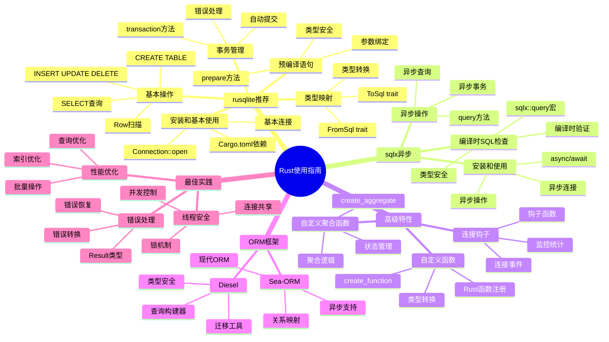

# SQLite Rust使用指南

> **创建日期**：2025-11-13
> **最后更新**：2025-01-15
> **版本**：Rust 1.56+，SQLite 3.31+ 至 3.47.x
> **适用库**：rusqlite、sqlx、libsqlite3-sys

---

## 📋 概述

本文档提供SQLite在Rust语言中的完整使用指南，包括同步库rusqlite、异步库sqlx和底层绑定libsqlite3-sys的使用方法。

---

## 📑 目录

- [SQLite Rust使用指南](#sqlite-rust使用指南)
  - [📋 概述](#-概述)
  - [📑 目录](#-目录)
  - [📊 思维导图](#-思维导图)
  - [一、rusqlite（推荐）](#一rusqlite推荐)
    - [1.1 安装和基本使用](#11-安装和基本使用)
    - [1.2 基本操作](#12-基本操作)
    - [1.3 事务管理](#13-事务管理)
    - [1.4 预编译语句](#14-预编译语句)
    - [1.5 类型映射](#15-类型映射)
  - [二、sqlx（异步）](#二sqlx异步)
    - [2.1 安装和使用](#21-安装和使用)
    - [2.2 异步操作](#22-异步操作)
    - [2.3 编译时SQL检查](#23-编译时sql检查)
  - [三、高级特性](#三高级特性)
    - [3.1 自定义函数](#31-自定义函数)
    - [3.2 自定义聚合函数](#32-自定义聚合函数)
    - [3.3 连接钩子](#33-连接钩子)
  - [四、ORM框架](#四orm框架)
    - [4.1 Diesel](#41-diesel)
    - [4.2 Sea-ORM](#42-sea-orm)
  - [五、Rust库多维对比矩阵](#五rust库多维对比矩阵)
    - [5.1 Rust SQLite库对比矩阵](#51-rust-sqlite库对比矩阵)
    - [5.2 Rust使用方式对比矩阵](#52-rust使用方式对比矩阵)
    - [5.3 Rust最佳实践对比矩阵](#53-rust最佳实践对比矩阵)
  - [六、最佳实践](#六最佳实践)
    - [6.1 错误处理](#61-错误处理)
    - [6.2 性能优化](#62-性能优化)
    - [6.3 线程安全](#63-线程安全)
  - [🔗 相关资源](#-相关资源)
  - [🔗 交叉引用](#-交叉引用)
    - [理论模型 🆕](#理论模型-)
    - [设计模型 🆕](#设计模型-)
  - [📚 参考资料](#-参考资料)

---

## 📊 思维导图



---

## 一、rusqlite（推荐）

`rusqlite`是Rust最流行的SQLite绑定库，提供类型安全的API。

### 1.1 安装和基本使用

**安装**：

在`Cargo.toml`中添加依赖：

```toml
[dependencies]
rusqlite = { version = "0.29", features = ["bundled"] }
```

**基本使用**：

```rust
use rusqlite::{Connection, Result};

fn main() -> Result<()> {
    // 连接到数据库（不存在则创建）
    let conn = Connection::open("example.db")?;

    // 创建表
    conn.execute(
        "CREATE TABLE IF NOT EXISTS users (
            id INTEGER PRIMARY KEY AUTOINCREMENT,
            name TEXT NOT NULL,
            email TEXT UNIQUE,
            age INTEGER,
            created_at TEXT DEFAULT (datetime('now'))
        )",
        [],
    )?;

    Ok(())
}
```

### 1.2 基本操作

**插入数据**：

```rust
use rusqlite::{Connection, Result, params};

fn main() -> Result<()> {
    let conn = Connection::open("example.db")?;

    // 插入单条数据
    conn.execute(
        "INSERT INTO users (name, email, age) VALUES (?1, ?2, ?3)",
        params!["Alice", "alice@example.com", 25],
    )?;

    // 获取最后插入的ID
    let last_id = conn.last_insert_rowid();
    println!("插入成功，ID: {}", last_id);

    // 插入多条数据
    let mut stmt = conn.prepare(
        "INSERT INTO users (name, email, age) VALUES (?1, ?2, ?3)"
    )?;

    let users = vec![
        ("Bob", "bob@example.com", 30),
        ("Charlie", "charlie@example.com", 35),
    ];

    for user in users {
        stmt.execute(params![user.0, user.1, user.2])?;
    }

    Ok(())
}
```

**查询数据**：

```rust
use rusqlite::{Connection, Result, params};

#[derive(Debug)]
struct User {
    id: i64,
    name: String,
    email: String,
    age: Option<i32>,
    created_at: String,
}

fn main() -> Result<()> {
    let conn = Connection::open("example.db")?;

    // 查询单条记录
    let mut stmt = conn.prepare("SELECT id, name, email, age, created_at FROM users WHERE id = ?1")?;
    let user = stmt.query_row(params![1], |row| {
        Ok(User {
            id: row.get(0)?,
            name: row.get(1)?,
            email: row.get(2)?,
            age: row.get(3)?,
            created_at: row.get(4)?,
        })
    })?;

    println!("用户: {:?}", user);

    // 查询多条记录
    let mut stmt = conn.prepare("SELECT id, name, email, age, created_at FROM users WHERE age > ?1")?;
    let users = stmt.query_map(params![25], |row| {
        Ok(User {
            id: row.get(0)?,
            name: row.get(1)?,
            email: row.get(2)?,
            age: row.get(3)?,
            created_at: row.get(4)?,
        })
    })?;

    for user in users {
        println!("用户: {:?}", user?);
    }

    Ok(())
}
```

**更新和删除**：

```rust
use rusqlite::{Connection, Result, params};

fn main() -> Result<()> {
    let conn = Connection::open("example.db")?;

    // 更新数据
    let rows_affected = conn.execute(
        "UPDATE users SET age = ?1 WHERE id = ?2",
        params![26, 1],
    )?;
    println!("更新了 {} 行", rows_affected);

    // 删除数据
    let rows_affected = conn.execute(
        "DELETE FROM users WHERE id = ?1",
        params![2],
    )?;
    println!("删除了 {} 行", rows_affected);

    Ok(())
}
```

### 1.3 事务管理

**使用事务**：

```rust
use rusqlite::{Connection, Result, params};

fn main() -> Result<()> {
    let conn = Connection::open("example.db")?;

    // 开始事务
    let tx = conn.transaction()?;

    // 执行多个操作
    tx.execute(
        "INSERT INTO users (name, email) VALUES (?1, ?2)",
        params!["David", "david@example.com"],
    )?;

    tx.execute(
        "UPDATE users SET age = ?1 WHERE id = ?2",
        params![26, 1],
    )?;

    // 提交事务
    tx.commit()?;

    println!("事务提交成功");
    Ok(())
}
```

**嵌套事务（SAVEPOINT）**：

```rust
use rusqlite::{Connection, Result, params};

fn main() -> Result<()> {
    let conn = Connection::open("example.db")?;

    let tx = conn.transaction()?;

    tx.execute(
        "INSERT INTO users (name, email) VALUES (?1, ?2)",
        params!["Eve", "eve@example.com"],
    )?;

    // 嵌套事务
    let savepoint = tx.savepoint()?;
    match savepoint.execute(
        "INSERT INTO users (name, email) VALUES (?1, ?2)",
        params!["Frank", "frank@example.com"],
    ) {
        Ok(_) => savepoint.commit()?,
        Err(e) => {
            savepoint.rollback()?;
            println!("回滚嵌套事务: {}", e);
        }
    }

    tx.commit()?;
    Ok(())
}
```

### 1.4 预编译语句

**使用预编译语句**：

```rust
use rusqlite::{Connection, Result, params};

fn main() -> Result<()> {
    let conn = Connection::open("example.db")?;

    // 预编译语句可以重复使用
    let mut stmt = conn.prepare("SELECT id, name, email FROM users WHERE id = ?1")?;

    // 多次使用
    let user1 = stmt.query_row(params![1], |row| {
        Ok((row.get::<_, i64>(0)?, row.get::<_, String>(1)?, row.get::<_, String>(2)?))
    })?;
    println!("用户1: {:?}", user1);

    let user2 = stmt.query_row(params![2], |row| {
        Ok((row.get::<_, i64>(0)?, row.get::<_, String>(1)?, row.get::<_, String>(2)?))
    })?;
    println!("用户2: {:?}", user2);

    Ok(())
}
```

### 1.5 类型映射

**Rust类型与SQLite类型映射**：

```rust
use rusqlite::{Connection, Result, params, types::ToSql};

fn main() -> Result<()> {
    let conn = Connection::open("example.db")?;

    // SQLite类型映射
    // INTEGER -> i32, i64
    // TEXT -> String, &str
    // REAL -> f64
    // BLOB -> Vec<u8>
    // NULL -> Option<T>

    // 使用Option处理NULL值
    let mut stmt = conn.prepare("INSERT INTO users (name, email, age) VALUES (?1, ?2, ?3)")?;
    stmt.execute(params!["Alice", "alice@example.com", Some(25)])?;
    stmt.execute(params!["Bob", None::<String>, None::<i32>])?;

    // 查询时处理NULL
    let mut stmt = conn.prepare("SELECT name, age FROM users")?;
    let users = stmt.query_map([], |row| {
        Ok((
            row.get::<_, String>(0)?,
            row.get::<_, Option<i32>>(1)?,
        ))
    })?;

    for user in users {
        let (name, age) = user?;
        match age {
            Some(age) => println!("{}: {}岁", name, age),
            None => println!("{}: 年龄未知", name),
        }
    }

    Ok(())
}
```

---

## 二、sqlx（异步）

`sqlx`提供异步SQLite支持，并支持编译时SQL检查。

### 2.1 安装和使用

**安装**：

```toml
[dependencies]
sqlx = { version = "0.7", features = ["runtime-tokio-native-tls", "sqlite"] }
tokio = { version = "1", features = ["full"] }
```

**基本使用**：

```rust
use sqlx::{sqlite::SqlitePool, Row};

#[tokio::main]
async fn main() -> Result<(), sqlx::Error> {
    // 创建连接池
    let pool = SqlitePool::connect("sqlite:example.db").await?;

    // 创建表
    sqlx::query(
        "CREATE TABLE IF NOT EXISTS users (
            id INTEGER PRIMARY KEY AUTOINCREMENT,
            name TEXT NOT NULL,
            email TEXT UNIQUE,
            age INTEGER
        )"
    )
    .execute(&pool)
    .await?;

    // 插入数据
    sqlx::query("INSERT INTO users (name, email, age) VALUES (?1, ?2, ?3)")
        .bind("Alice")
        .bind("alice@example.com")
        .bind(25)
        .execute(&pool)
        .await?;

    // 查询数据
    let rows = sqlx::query("SELECT id, name, email, age FROM users")
        .fetch_all(&pool)
        .await?;

    for row in rows {
        let id: i64 = row.get(0);
        let name: String = row.get(1);
        let email: String = row.get(2);
        let age: Option<i32> = row.get(3);
        println!("ID: {}, Name: {}, Email: {}, Age: {:?}", id, name, email, age);
    }

    pool.close().await;
    Ok(())
}
```

### 2.2 异步操作

**异步CRUD操作**：

```rust
use sqlx::{sqlite::SqlitePool, Row};

#[tokio::main]
async fn main() -> Result<(), sqlx::Error> {
    let pool = SqlitePool::connect("sqlite:example.db").await?;

    // 插入
    let result = sqlx::query("INSERT INTO users (name, email, age) VALUES (?1, ?2, ?3)")
        .bind("Bob")
        .bind("bob@example.com")
        .bind(30)
        .execute(&pool)
        .await?;

    println!("插入成功，ID: {}", result.last_insert_rowid());

    // 查询单条
    let row = sqlx::query("SELECT * FROM users WHERE id = ?1")
        .bind(1)
        .fetch_one(&pool)
        .await?;

    let name: String = row.get("name");
    println!("用户: {}", name);

    // 更新
    sqlx::query("UPDATE users SET age = ?1 WHERE id = ?2")
        .bind(26)
        .bind(1)
        .execute(&pool)
        .await?;

    // 删除
    sqlx::query("DELETE FROM users WHERE id = ?1")
        .bind(2)
        .execute(&pool)
        .await?;

    pool.close().await;
    Ok(())
}
```

### 2.3 编译时SQL检查

**使用宏进行编译时SQL检查**：

```rust
use sqlx::{sqlite::SqlitePool, FromRow};

#[derive(FromRow, Debug)]
struct User {
    id: i64,
    name: String,
    email: String,
    age: Option<i32>,
}

#[tokio::main]
async fn main() -> Result<(), sqlx::Error> {
    let pool = SqlitePool::connect("sqlite:example.db").await?;

    // 编译时检查SQL语法
    let users = sqlx::query_as::<_, User>(
        "SELECT id, name, email, age FROM users WHERE age > ?1"
    )
    .bind(25)
    .fetch_all(&pool)
    .await?;

    for user in users {
        println!("用户: {:?}", user);
    }

    pool.close().await;
    Ok(())
}
```

---

## 三、高级特性

### 3.1 自定义函数

**注册Rust函数为SQLite函数**：

```rust
use rusqlite::{Connection, Result, functions::Function};

fn main() -> Result<()> {
    let conn = Connection::open("example.db")?;

    // 注册自定义函数
    conn.create_scalar_function(
        "upper_case",
        1,
        rusqlite::functions::FunctionFlags::SQLITE_UTF8,
        |ctx| {
            let value = ctx.get::<String>(0)?;
            Ok(value.to_uppercase())
        },
    )?;

    // 使用自定义函数
    let result: String = conn.query_row(
        "SELECT upper_case(name) FROM users WHERE id = ?1",
        rusqlite::params![1],
        |row| row.get(0),
    )?;

    println!("结果: {}", result);
    Ok(())
}
```

### 3.2 自定义聚合函数

**创建自定义聚合函数**：

```rust
use rusqlite::{Connection, Result, functions::Aggregate};

struct Median {
    values: Vec<f64>,
}

impl Aggregate for Median {
    fn init() -> Self {
        Median { values: Vec::new() }
    }

    fn step(&mut self, ctx: &rusqlite::functions::Context) -> Result<()> {
        if let Ok(value) = ctx.get::<f64>(0) {
            self.values.push(value);
        }
        Ok(())
    }

    fn finalize(&mut self, ctx: &rusqlite::functions::Context) -> Result<()> {
        if self.values.is_empty() {
            ctx.set_result(None::<f64>);
            return Ok(());
        }

        self.values.sort_by(|a, b| a.partial_cmp(b).unwrap());
        let median = if self.values.len() % 2 == 0 {
            let mid = self.values.len() / 2;
            (self.values[mid - 1] + self.values[mid]) / 2.0
        } else {
            self.values[self.values.len() / 2]
        };

        ctx.set_result(median);
        Ok(())
    }
}

fn main() -> Result<()> {
    let conn = Connection::open("example.db")?;

    conn.create_aggregate_function(
        "median",
        1,
        rusqlite::functions::FunctionFlags::SQLITE_UTF8,
        Median::init,
        |agg, ctx| agg.step(ctx),
        |agg, ctx| agg.finalize(ctx),
    )?;

    let result: Option<f64> = conn.query_row(
        "SELECT median(age) FROM users",
        [],
        |row| row.get(0),
    )?;

    println!("年龄中位数: {:?}", result);
    Ok(())
}
```

### 3.3 连接钩子

**使用连接钩子**：

```rust
use rusqlite::{Connection, Result, hooks::Action};

fn main() -> Result<()> {
    let conn = Connection::open("example.db")?;

    // 注册更新钩子
    conn.update_hook(Some(|action, db_name, table_name, row_id| {
        match action {
            Action::SQLITE_INSERT => {
                println!("插入: {} -> {} (row_id: {})", db_name, table_name, row_id);
            }
            Action::SQLITE_UPDATE => {
                println!("更新: {} -> {} (row_id: {})", db_name, table_name, row_id);
            }
            Action::SQLITE_DELETE => {
                println!("删除: {} -> {} (row_id: {})", db_name, table_name, row_id);
            }
        }
    }));

    conn.execute("INSERT INTO users (name, email) VALUES (?1, ?2)", rusqlite::params!["Alice", "alice@example.com"])?;

    Ok(())
}
```

---

## 四、ORM框架

### 4.1 Diesel

**使用Diesel ORM**：

```toml
[dependencies]
diesel = { version = "2.1", features = ["sqlite"] }
diesel_migrations = "2.1"
```

```rust
use diesel::prelude::*;
use diesel::sqlite::SqliteConnection;

#[derive(Queryable, Insertable, Debug)]
#[diesel(table_name = users)]
struct User {
    id: Option<i32>,
    name: String,
    email: String,
    age: Option<i32>,
}

diesel::table! {
    users {
        id -> Nullable<Integer>,
        name -> Text,
        email -> Text,
        age -> Nullable<Integer>,
    }
}

fn main() -> Result<(), Box<dyn std::error::Error>> {
    let mut conn = SqliteConnection::establish("example.db")?;

    // 插入
    let new_user = User {
        id: None,
        name: "Alice".to_string(),
        email: "alice@example.com".to_string(),
        age: Some(25),
    };

    diesel::insert_into(users::table)
        .values(&new_user)
        .execute(&mut conn)?;

    // 查询
    let results = users::table
        .filter(users::age.gt(20))
        .load::<User>(&mut conn)?;

    for user in results {
        println!("用户: {:?}", user);
    }

    Ok(())
}
```

### 4.2 Sea-ORM

**使用Sea-ORM**：

```rust
use sea_orm::{Database, EntityTrait, DbErr};

#[derive(Clone, Debug, PartialEq, DeriveEntityModel)]
#[sea_orm(table_name = "users")]
pub struct Model {
    #[sea_orm(primary_key)]
    pub id: i32,
    pub name: String,
    pub email: String,
    pub age: Option<i32>,
}

#[tokio::main]
async fn main() -> Result<(), DbErr> {
    let db = Database::connect("sqlite://example.db").await?;

    // 查询所有用户
    let users = Entity::find().all(&db).await?;

    for user in users {
        println!("用户: {:?}", user);
    }

    Ok(())
}
```

---

## 五、Rust库多维对比矩阵

### 5.1 Rust SQLite库对比矩阵

| 维度 | rusqlite | sqlx | Diesel | Sea-ORM |
|------|---------|-----|--------|---------|
| **类型** | 同步库 | 异步库 | ORM框架 | 现代ORM |
| **异步支持** | ❌ | ✅ | ❌ | ✅ |
| **性能** | ⭐⭐⭐⭐⭐ | ⭐⭐⭐⭐ | ⭐⭐⭐⭐ | ⭐⭐⭐⭐ |
| **易用性** | ⭐⭐⭐⭐⭐ | ⭐⭐⭐⭐ | ⭐⭐⭐ | ⭐⭐⭐⭐⭐ |
| **类型安全** | ⭐⭐⭐⭐⭐ | ⭐⭐⭐⭐⭐ | ⭐⭐⭐⭐⭐ | ⭐⭐⭐⭐⭐ |
| **编译时检查** | ⭐⭐⭐⭐ | ⭐⭐⭐⭐⭐ | ⭐⭐⭐⭐⭐ | ⭐⭐⭐⭐ |
| **学习曲线** | ⭐⭐⭐⭐⭐ | ⭐⭐⭐ | ⭐⭐⭐ | ⭐⭐⭐⭐ |
| **适用场景** | 标准应用（推荐） | 异步应用 | 类型安全ORM | 现代异步ORM |
| **文档质量** | ⭐⭐⭐⭐⭐ | ⭐⭐⭐⭐⭐ | ⭐⭐⭐⭐ | ⭐⭐⭐⭐ |
| **社区支持** | ⭐⭐⭐⭐ | ⭐⭐⭐⭐⭐ | ⭐⭐⭐⭐⭐ | ⭐⭐⭐⭐ |

### 5.2 Rust使用方式对比矩阵

| 维度 | 原生SQL（rusqlite） | 异步SQL（sqlx） | ORM（Diesel/Sea-ORM） |
|------|-------------------|----------------|---------------------|
| **性能** | ⭐⭐⭐⭐⭐ | ⭐⭐⭐⭐ | ⭐⭐⭐ |
| **灵活性** | ⭐⭐⭐⭐⭐ | ⭐⭐⭐⭐ | ⭐⭐⭐ |
| **开发效率** | ⭐⭐⭐ | ⭐⭐⭐⭐ | ⭐⭐⭐⭐⭐ |
| **类型安全** | ⭐⭐⭐⭐ | ⭐⭐⭐⭐⭐ | ⭐⭐⭐⭐⭐ |
| **学习曲线** | ⭐⭐⭐⭐ | ⭐⭐⭐ | ⭐⭐⭐ |
| **适用场景** | 简单查询、性能要求高 | 异步应用 | 复杂应用、快速开发 |
| **代码可读性** | ⭐⭐⭐ | ⭐⭐⭐⭐ | ⭐⭐⭐⭐⭐ |
| **维护成本** | ⭐⭐⭐ | ⭐⭐⭐⭐ | ⭐⭐⭐⭐ |

### 5.3 Rust最佳实践对比矩阵

| 实践项 | 推荐做法 | 不推荐做法 | 性能影响 |
|--------|---------|-----------|---------|
| **连接管理** | 使用Connection | 频繁创建连接 | ⭐⭐⭐⭐⭐ |
| **事务管理** | 使用transaction | 逐条操作 | ⭐⭐⭐⭐⭐ |
| **预编译语句** | 使用prepare | 直接execute | ⭐⭐⭐⭐ |
| **错误处理** | 使用Result类型 | 使用unwrap | ⭐⭐⭐ |
| **类型映射** | 使用FromSql/ToSql | 手动转换 | ⭐⭐⭐ |
| **WAL模式** | 启用WAL模式 | 使用DELETE模式 | ⭐⭐⭐⭐ |

## 六、最佳实践

### 6.1 错误处理

**完善的错误处理**：

```rust
use rusqlite::{Connection, Result};

fn safe_query(conn: &Connection, id: i64) -> Result<Option<String>> {
    match conn.query_row(
        "SELECT name FROM users WHERE id = ?1",
        rusqlite::params![id],
        |row| row.get(0),
    ) {
        Ok(name) => Ok(Some(name)),
        Err(rusqlite::Error::QueryReturnedNoRows) => Ok(None),
        Err(e) => Err(e),
    }
}

fn main() -> Result<()> {
    let conn = Connection::open("example.db")?;

    match safe_query(&conn, 1)? {
        Some(name) => println!("找到用户: {}", name),
        None => println!("未找到用户"),
    }

    Ok(())
}
```

### 6.2 性能优化

**性能优化建议**：

```rust
use rusqlite::{Connection, Result};

fn main() -> Result<()> {
    let conn = Connection::open("example.db")?;

    // 1. 启用WAL模式
    conn.execute("PRAGMA journal_mode=WAL", [])?;
    conn.execute("PRAGMA synchronous=NORMAL", [])?;
    conn.execute("PRAGMA cache_size=-16000", [])?;

    // 2. 使用预编译语句
    let mut stmt = conn.prepare("INSERT INTO users (name, email) VALUES (?1, ?2)")?;

    // 3. 批量操作使用事务
    let tx = conn.transaction()?;
    for i in 0..1000 {
        tx.execute(
            "INSERT INTO users (name, email) VALUES (?1, ?2)",
            rusqlite::params![format!("User{}", i), format!("user{}@example.com", i)],
        )?;
    }
    tx.commit()?;

    Ok(())
}
```

### 6.3 线程安全

**多线程使用**：

```rust
use rusqlite::{Connection, Result};
use std::sync::{Arc, Mutex};

fn main() -> Result<()> {
    // 每个线程使用独立连接
    let conn = Connection::open("example.db")?;

    // 或者使用Arc<Mutex<Connection>>共享连接
    let shared_conn = Arc::new(Mutex::new(conn));

    let handles: Vec<_> = (0..5)
        .map(|i| {
            let conn = shared_conn.clone();
            std::thread::spawn(move || {
                let conn = conn.lock().unwrap();
                conn.execute(
                    "INSERT INTO users (name, email) VALUES (?1, ?2)",
                    rusqlite::params![format!("User{}", i), format!("user{}@example.com", i)],
                )
            })
        })
        .collect();

    for handle in handles {
        handle.join().unwrap()?;
    }

    Ok(())
}
```

---

## 🔗 相关资源

- [08.01 连接管理](./08.01-连接管理.md) - 连接管理最佳实践
- [08.02 事务管理](./08.02-事务管理.md) - 事务管理详解
- [08.03 查询优化](./08.03-查询优化.md) - 查询优化技巧
- [08.06 Python使用指南](./08.06-Python使用指南.md) - 其他语言使用指南
- [08.08 Go使用指南](./08.08-Go使用指南.md) - 其他语言使用指南
- [rusqlite文档](https://docs.rs/rusqlite/)
- [sqlx文档](https://docs.rs/sqlx/)

---

## 🔗 交叉引用

### 理论模型 🆕

- ⭐ [系统理论模型](../11-理论模型/11.01-系统理论模型.md) - 编程接口理论
- ⭐ [算法复杂度理论](../11-理论模型/11.03-算法复杂度理论.md) - Rust操作复杂度

### 设计模型 🆕

- ⭐⭐ [设计模式](../12-设计模型/12.03-设计模式.md) - Rust编程模式
- ⭐ [设计原则](../12-设计模型/12.02-设计原则.md) - Rust编程原则

---

## 📚 参考资料

- [rusqlite GitHub](https://github.com/rusqlite/rusqlite)
- [sqlx GitHub](https://github.com/launchbadge/sqlx)
- [Diesel文档](https://diesel.rs/)
- [Sea-ORM文档](https://www.sea-ql.org/SeaORM/)

---

**最后更新**：2025-01-15
**维护者**：Data-Science Team
