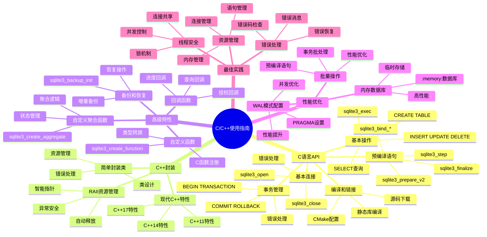

# SQLite C/C++使用指南

> **创建日期**：2025-11-13
> **最后更新**：2025-01-15
> **版本**：SQLite 3.31+ 至 3.47.x
> **适用环境**：C99+、C++11+

---

## 📋 概述

本文档提供SQLite在C和C++中的原生API使用指南，包括基本操作、事务管理、预编译语句和高级特性。

---

## 📑 目录

- [SQLite C/C++使用指南](#sqlite-cc使用指南)
  - [📋 概述](#-概述)
  - [📑 目录](#-目录)
  - [3. 📊 思维导图](#3--思维导图)
  - [4. C语言API](#4-c语言api)
    - [4.1. 编译和链接](#41-编译和链接)
  - [5. 基本连接](#5-基本连接)
    - [5.1. 基本操作](#51-基本操作)
    - [5.2. 预编译语句](#52-预编译语句)
    - [5.3. 事务管理](#53-事务管理)
  - [6. C++封装](#6-c封装)
    - [6.1. 简单封装类](#61-简单封装类)
    - [6.2. RAII资源管理](#62-raii资源管理)
    - [6.3. 现代C++特性](#63-现代c特性)
  - [7. 高级特性](#7-高级特性)
    - [7.1. 自定义函数](#71-自定义函数)
    - [7.2. 自定义聚合函数](#72-自定义聚合函数)
    - [7.3. 回调函数](#73-回调函数)
    - [7.4. 备份和恢复](#74-备份和恢复)
  - [8. 性能优化](#8-性能优化)
    - [8.1. WAL模式配置](#81-wal模式配置)
    - [8.2. 批量操作](#82-批量操作)
    - [8.3. 内存数据库](#83-内存数据库)
  - [9. C/C++使用方式多维对比矩阵](#9-cc使用方式多维对比矩阵)
    - [9.1. C/C++使用方式对比矩阵](#91-cc使用方式对比矩阵)
    - [9.2. C/C++最佳实践对比矩阵](#92-cc最佳实践对比矩阵)
  - [10. 最佳实践](#10-最佳实践)
    - [10.1. 错误处理](#101-错误处理)
    - [10.2. 资源管理](#102-资源管理)
    - [10.3. 线程安全](#103-线程安全)
  - [11. 🔗 相关资源](#11--相关资源)
  - [12. 🔗 交叉引用](#12--交叉引用)
    - [12.1. 理论模型 🆕](#121-理论模型-)
    - [12.2. 设计模型 🆕](#122-设计模型-)
  - [13. 📚 参考资料](#13--参考资料)

---

## 3. 📊 思维导图



---

## 4. C语言API

SQLite的C API是其他所有语言绑定的基础。

### 4.1. 编译和链接

**下载SQLite源码**：

```bash
# 下载amalgamation版本（单文件）
wget https://www.sqlite.org/2024/sqlite-amalgamation-3450000.zip
unzip sqlite-amalgamation-3450000.zip
```

**编译**：

```bash
# 编译为静态库
gcc -c sqlite3.c -o sqlite3.o
ar rcs libsqlite3.a sqlite3.o

# 或直接编译到程序
gcc main.c sqlite3.c -o main -lpthread -ldl
```

**CMake配置**：

```cmake
cmake_minimum_required(VERSION 3.10)
project(sqlite_example)

add_executable(main main.c sqlite3.c)
target_link_libraries(main pthread dl)
```

## 5. 基本连接

**打开和关闭数据库**：

```c
#include <sqlite3.h>
#include <stdio.h>

int main() {
    sqlite3 *db;
    int rc;

    // 打开数据库（不存在则创建）
    rc = sqlite3_open("example.db", &db);
    if (rc != SQLITE_OK) {
        fprintf(stderr, "无法打开数据库: %s\n", sqlite3_errmsg(db));
        sqlite3_close(db);
        return 1;
    }

    printf("数据库连接成功\n");

    // 关闭数据库
    sqlite3_close(db);
    return 0;
}
```

**使用内存数据库**：

```c
// 内存数据库
rc = sqlite3_open(":memory:", &db);

// 或使用URI格式
rc = sqlite3_open_v2("file:example.db?mode=rwc", &db,
                     SQLITE_OPEN_READWRITE | SQLITE_OPEN_CREATE, NULL);
```

### 5.1. 基本操作

**执行SQL语句**：

```c
#include <sqlite3.h>
#include <stdio.h>

int main() {
    sqlite3 *db;
    char *err_msg = 0;
    int rc;

    rc = sqlite3_open("example.db", &db);
    if (rc != SQLITE_OK) {
        fprintf(stderr, "无法打开数据库: %s\n", sqlite3_errmsg(db));
        sqlite3_close(db);
        return 1;
    }

    // 创建表
    const char *sql = "CREATE TABLE IF NOT EXISTS users ("
                      "id INTEGER PRIMARY KEY AUTOINCREMENT,"
                      "name TEXT NOT NULL,"
                      "email TEXT UNIQUE,"
                      "age INTEGER"
                      ");";

    rc = sqlite3_exec(db, sql, 0, 0, &err_msg);
    if (rc != SQLITE_OK) {
        fprintf(stderr, "SQL错误: %s\n", err_msg);
        sqlite3_free(err_msg);
    } else {
        printf("表创建成功\n");
    }

    // 插入数据
    sql = "INSERT INTO users (name, email, age) VALUES ('Alice', 'alice@example.com', 25);";
    rc = sqlite3_exec(db, sql, 0, 0, &err_msg);
    if (rc != SQLITE_OK) {
        fprintf(stderr, "SQL错误: %s\n", err_msg);
        sqlite3_free(err_msg);
    }

    sqlite3_close(db);
    return 0;
}
```

**查询数据（使用回调）**：

```c
#include <sqlite3.h>
#include <stdio.h>

// 查询回调函数
static int callback(void *data, int argc, char **argv, char **azColName) {
    int i;
    printf("%s: ", (const char*)data);
    for (i = 0; i < argc; i++) {
        printf("%s = %s\n", azColName[i], argv[i] ? argv[i] : "NULL");
    }
    printf("\n");
    return 0;
}

int main() {
    sqlite3 *db;
    char *err_msg = 0;
    int rc;

    rc = sqlite3_open("example.db", &db);
    if (rc != SQLITE_OK) {
        fprintf(stderr, "无法打开数据库: %s\n", sqlite3_errmsg(db));
        sqlite3_close(db);
        return 1;
    }

    // 查询数据
    const char *sql = "SELECT * FROM users;";
    const char *data = "回调函数";

    rc = sqlite3_exec(db, sql, callback, (void*)data, &err_msg);
    if (rc != SQLITE_OK) {
        fprintf(stderr, "SQL错误: %s\n", err_msg);
        sqlite3_free(err_msg);
    }

    sqlite3_close(db);
    return 0;
}
```

### 5.2. 预编译语句

**使用预编译语句（推荐）**：

```c
#include <sqlite3.h>
#include <stdio.h>

int main() {
    sqlite3 *db;
    sqlite3_stmt *stmt;
    int rc;

    rc = sqlite3_open("example.db", &db);
    if (rc != SQLITE_OK) {
        fprintf(stderr, "无法打开数据库: %s\n", sqlite3_errmsg(db));
        return 1;
    }

    // 预编译插入语句
    const char *sql = "INSERT INTO users (name, email, age) VALUES (?, ?, ?);";
    rc = sqlite3_prepare_v2(db, sql, -1, &stmt, NULL);
    if (rc != SQLITE_OK) {
        fprintf(stderr, "准备语句失败: %s\n", sqlite3_errmsg(db));
        sqlite3_close(db);
        return 1;
    }

    // 绑定参数
    sqlite3_bind_text(stmt, 1, "Bob", -1, SQLITE_STATIC);
    sqlite3_bind_text(stmt, 2, "bob@example.com", -1, SQLITE_STATIC);
    sqlite3_bind_int(stmt, 3, 30);

    // 执行
    rc = sqlite3_step(stmt);
    if (rc != SQLITE_DONE) {
        fprintf(stderr, "执行失败: %s\n", sqlite3_errmsg(db));
    }

    // 重置语句以便重用
    sqlite3_reset(stmt);

    // 再次使用
    sqlite3_bind_text(stmt, 1, "Charlie", -1, SQLITE_STATIC);
    sqlite3_bind_text(stmt, 2, "charlie@example.com", -1, SQLITE_STATIC);
    sqlite3_bind_int(stmt, 3, 35);
    sqlite3_step(stmt);

    // 释放语句
    sqlite3_finalize(stmt);

    // 查询数据
    sql = "SELECT id, name, email, age FROM users WHERE age > ?;";
    rc = sqlite3_prepare_v2(db, sql, -1, &stmt, NULL);
    if (rc == SQLITE_OK) {
        sqlite3_bind_int(stmt, 1, 25);

        while (sqlite3_step(stmt) == SQLITE_ROW) {
            int id = sqlite3_column_int(stmt, 0);
            const char *name = (const char*)sqlite3_column_text(stmt, 1);
            const char *email = (const char*)sqlite3_column_text(stmt, 2);
            int age = sqlite3_column_int(stmt, 3);

            printf("ID: %d, Name: %s, Email: %s, Age: %d\n", id, name, email, age);
        }
    }

    sqlite3_finalize(stmt);
    sqlite3_close(db);
    return 0;
}
```

### 5.3. 事务管理

**使用事务**：

```c
#include <sqlite3.h>
#include <stdio.h>

int main() {
    sqlite3 *db;
    sqlite3_stmt *stmt;
    int rc;

    rc = sqlite3_open("example.db", &db);
    if (rc != SQLITE_OK) {
        fprintf(stderr, "无法打开数据库: %s\n", sqlite3_errmsg(db));
        return 1;
    }

    // 开始事务
    sqlite3_exec(db, "BEGIN TRANSACTION;", NULL, NULL, NULL);

    const char *sql = "INSERT INTO users (name, email, age) VALUES (?, ?, ?);";
    rc = sqlite3_prepare_v2(db, sql, -1, &stmt, NULL);

    // 批量插入
    for (int i = 0; i < 1000; i++) {
        char name[32], email[64];
        sprintf(name, "User%d", i);
        sprintf(email, "user%d@example.com", i);

        sqlite3_bind_text(stmt, 1, name, -1, SQLITE_STATIC);
        sqlite3_bind_text(stmt, 2, email, -1, SQLITE_STATIC);
        sqlite3_bind_int(stmt, 3, 20 + (i % 50));

        rc = sqlite3_step(stmt);
        if (rc != SQLITE_DONE) {
            fprintf(stderr, "插入失败: %s\n", sqlite3_errmsg(db));
            sqlite3_exec(db, "ROLLBACK;", NULL, NULL, NULL);
            sqlite3_finalize(stmt);
            sqlite3_close(db);
            return 1;
        }

        sqlite3_reset(stmt);
    }

    sqlite3_finalize(stmt);

    // 提交事务
    rc = sqlite3_exec(db, "COMMIT;", NULL, NULL, NULL);
    if (rc != SQLITE_OK) {
        fprintf(stderr, "提交失败: %s\n", sqlite3_errmsg(db));
    } else {
        printf("事务提交成功\n");
    }

    sqlite3_close(db);
    return 0;
}
```

---

## 6. C++封装

### 6.1. 简单封装类

**基本的C++封装**：

```cpp
#include <sqlite3.h>
#include <string>
#include <vector>
#include <memory>

class SQLiteDB {
private:
    sqlite3 *db;

public:
    SQLiteDB(const std::string &filename) {
        int rc = sqlite3_open(filename.c_str(), &db);
        if (rc != SQLITE_OK) {
            throw std::runtime_error(sqlite3_errmsg(db));
        }
    }

    ~SQLiteDB() {
        sqlite3_close(db);
    }

    void exec(const std::string &sql) {
        char *err_msg = 0;
        int rc = sqlite3_exec(db, sql.c_str(), NULL, NULL, &err_msg);
        if (rc != SQLITE_OK) {
            std::string error = err_msg;
            sqlite3_free(err_msg);
            throw std::runtime_error(error);
        }
    }

    sqlite3* get() {
        return db;
    }
};

int main() {
    try {
        SQLiteDB db("example.db");
        db.exec("CREATE TABLE IF NOT EXISTS users ("
                "id INTEGER PRIMARY KEY AUTOINCREMENT,"
                "name TEXT NOT NULL,"
                "email TEXT UNIQUE"
                ");");

        db.exec("INSERT INTO users (name, email) VALUES ('Alice', 'alice@example.com');");
    } catch (const std::exception &e) {
        std::cerr << "错误: " << e.what() << std::endl;
        return 1;
    }

    return 0;
}
```

### 6.2. RAII资源管理

**使用RAII管理资源**：

```cpp
#include <sqlite3.h>
#include <string>
#include <memory>

class Statement {
private:
    sqlite3_stmt *stmt;

public:
    Statement(sqlite3 *db, const std::string &sql) {
        int rc = sqlite3_prepare_v2(db, sql.c_str(), -1, &stmt, NULL);
        if (rc != SQLITE_OK) {
            throw std::runtime_error(sqlite3_errmsg(db));
        }
    }

    ~Statement() {
        sqlite3_finalize(stmt);
    }

    void bind(int index, const std::string &value) {
        sqlite3_bind_text(stmt, index, value.c_str(), -1, SQLITE_STATIC);
    }

    void bind(int index, int value) {
        sqlite3_bind_int(stmt, index, value);
    }

    bool step() {
        return sqlite3_step(stmt) == SQLITE_ROW;
    }

    void reset() {
        sqlite3_reset(stmt);
    }

    int getInt(int column) {
        return sqlite3_column_int(stmt, column);
    }

    std::string getText(int column) {
        return std::string((const char*)sqlite3_column_text(stmt, column));
    }

    sqlite3_stmt* get() {
        return stmt;
    }
};

int main() {
    SQLiteDB db("example.db");

    Statement stmt(db.get(), "INSERT INTO users (name, email, age) VALUES (?, ?, ?);");
    stmt.bind(1, "Bob");
    stmt.bind(2, "bob@example.com");
    stmt.bind(3, 30);
    stmt.step();

    Statement query(db.get(), "SELECT name, email FROM users WHERE age > ?;");
    query.bind(1, 25);
    while (query.step()) {
        std::cout << query.getText(0) << " - " << query.getText(1) << std::endl;
    }

    return 0;
}
```

### 6.3. 现代C++特性

**使用现代C++特性**：

```cpp
#include <sqlite3.h>
#include <string>
#include <vector>
#include <memory>
#include <functional>

class SQLiteDB {
private:
    std::unique_ptr<sqlite3, std::function<void(sqlite3*)>> db;

    static void deleter(sqlite3 *db) {
        sqlite3_close(db);
    }

public:
    SQLiteDB(const std::string &filename) {
        sqlite3 *raw_db;
        int rc = sqlite3_open(filename.c_str(), &raw_db);
        if (rc != SQLITE_OK) {
            throw std::runtime_error(sqlite3_errmsg(raw_db));
        }
        db = std::unique_ptr<sqlite3, std::function<void(sqlite3*)>>(raw_db, deleter);
    }

    template<typename F>
    void query(const std::string &sql, F callback) {
        sqlite3_stmt *stmt;
        int rc = sqlite3_prepare_v2(db.get(), sql.c_str(), -1, &stmt, NULL);
        if (rc != SQLITE_OK) {
            throw std::runtime_error(sqlite3_errmsg(db.get()));
        }

        while (sqlite3_step(stmt) == SQLITE_ROW) {
            callback(stmt);
        }

        sqlite3_finalize(stmt);
    }

    sqlite3* get() {
        return db.get();
    }
};

int main() {
    SQLiteDB db("example.db");

    db.query("SELECT name, email FROM users;", [](sqlite3_stmt *stmt) {
        std::cout << sqlite3_column_text(stmt, 0) << " - "
                  << sqlite3_column_text(stmt, 1) << std::endl;
    });

    return 0;
}
```

---

## 7. 高级特性

### 7.1. 自定义函数

**注册C函数为SQLite函数**：

```c
#include <sqlite3.h>
#include <string.h>
#include <ctype.h>

// 自定义函数：转换为大写
static void upper_case(sqlite3_context *context, int argc, sqlite3_value **argv) {
    if (argc != 1) {
        sqlite3_result_error(context, "upper_case() 需要一个参数", -1);
        return;
    }

    const char *input = (const char*)sqlite3_value_text(argv[0]);
    if (input == NULL) {
        sqlite3_result_null(context);
        return;
    }

    int len = strlen(input);
    char *result = (char*)sqlite3_malloc(len + 1);
    for (int i = 0; i < len; i++) {
        result[i] = toupper(input[i]);
    }
    result[len] = '\0';

    sqlite3_result_text(context, result, len, sqlite3_free);
}

int main() {
    sqlite3 *db;
    sqlite3_open("example.db", &db);

    // 注册自定义函数
    sqlite3_create_function(db, "upper_case", 1, SQLITE_UTF8, NULL,
                           upper_case, NULL, NULL);

    // 使用自定义函数
    sqlite3_exec(db, "SELECT upper_case(name) FROM users;", NULL, NULL, NULL);

    sqlite3_close(db);
    return 0;
}
```

### 7.2. 自定义聚合函数

**创建自定义聚合函数**：

```c
#include <sqlite3.h>
#include <stdlib.h>

// 聚合函数上下文
typedef struct {
    double sum;
    int count;
} AvgContext;

// 聚合步骤函数
static void avg_step(sqlite3_context *context, int argc, sqlite3_value **argv) {
    AvgContext *ctx = (AvgContext*)sqlite3_aggregate_context(context, sizeof(AvgContext));
    if (ctx) {
        double value = sqlite3_value_double(argv[0]);
        ctx->sum += value;
        ctx->count++;
    }
}

// 聚合最终函数
static void avg_final(sqlite3_context *context) {
    AvgContext *ctx = (AvgContext*)sqlite3_aggregate_context(context, 0);
    if (ctx && ctx->count > 0) {
        sqlite3_result_double(context, ctx->sum / ctx->count);
    } else {
        sqlite3_result_null(context);
    }
}

int main() {
    sqlite3 *db;
    sqlite3_open("example.db", &db);

    // 注册聚合函数
    sqlite3_create_function(db, "my_avg", 1, SQLITE_UTF8, NULL,
                           NULL, avg_step, avg_final);

    sqlite3_close(db);
    return 0;
}
```

### 7.3. 回调函数

**使用各种回调函数**：

```c
#include <sqlite3.h>
#include <stdio.h>

// 更新钩子
static void update_hook(void *arg, int op, const char *db_name,
                       const char *table_name, sqlite3_int64 rowid) {
    const char *op_name[] = {"INSERT", "UPDATE", "DELETE"};
    printf("操作: %s, 表: %s, RowID: %lld\n", op_name[op-1], table_name, rowid);
}

// 提交钩子
static int commit_hook(void *arg) {
    printf("准备提交事务\n");
    return 0; // 返回0允许提交，非0回滚
}

int main() {
    sqlite3 *db;
    sqlite3_open("example.db", &db);

    // 注册更新钩子
    sqlite3_update_hook(db, update_hook, NULL);

    // 注册提交钩子
    sqlite3_commit_hook(db, commit_hook, NULL);

    sqlite3_exec(db, "INSERT INTO users (name) VALUES ('Test');", NULL, NULL, NULL);

    sqlite3_close(db);
    return 0;
}
```

### 7.4. 备份和恢复

**数据库备份**：

```c
#include <sqlite3.h>
#include <stdio.h>

static int backup_progress(void *arg, int remaining, int page_count) {
    int percent = ((page_count - remaining) * 100) / page_count;
    printf("备份进度: %d%%\n", percent);
    return 0;
}

int main() {
    sqlite3 *db;
    sqlite3_backup *backup;
    sqlite3 *backup_db;
    int rc;

    sqlite3_open("example.db", &db);
    sqlite3_open("backup.db", &backup_db);

    // 创建备份对象
    backup = sqlite3_backup_init(backup_db, "main", db, "main");
    if (backup) {
        // 执行备份
        sqlite3_backup_step(backup, -1); // -1表示备份所有页面
        sqlite3_backup_finish(backup);
    }

    rc = sqlite3_errcode(backup_db);
    if (rc == SQLITE_OK) {
        printf("备份成功\n");
    } else {
        printf("备份失败: %s\n", sqlite3_errmsg(backup_db));
    }

    sqlite3_close(backup_db);
    sqlite3_close(db);
    return 0;
}
```

---

## 8. 性能优化

### 8.1. WAL模式配置

**配置WAL模式**：

```c
#include <sqlite3.h>

void configure_database(sqlite3 *db) {
    sqlite3_exec(db, "PRAGMA journal_mode=WAL;", NULL, NULL, NULL);
    sqlite3_exec(db, "PRAGMA synchronous=NORMAL;", NULL, NULL, NULL);
    sqlite3_exec(db, "PRAGMA cache_size=-16000;", NULL, NULL, NULL); // 16MB
    sqlite3_exec(db, "PRAGMA foreign_keys=ON;", NULL, NULL, NULL);
    sqlite3_exec(db, "PRAGMA temp_store=MEMORY;", NULL, NULL, NULL);
}

int main() {
    sqlite3 *db;
    sqlite3_open("example.db", &db);
    configure_database(db);
    sqlite3_close(db);
    return 0;
}
```

### 8.2. 批量操作

**批量操作优化**：

```c
#include <sqlite3.h>
#include <stdio.h>

int main() {
    sqlite3 *db;
    sqlite3_stmt *stmt;
    int rc;

    sqlite3_open("example.db", &db);

    // 开始事务
    sqlite3_exec(db, "BEGIN TRANSACTION;", NULL, NULL, NULL);

    const char *sql = "INSERT INTO users (name, email, age) VALUES (?, ?, ?);";
    sqlite3_prepare_v2(db, sql, -1, &stmt, NULL);

    // 批量插入
    for (int i = 0; i < 10000; i++) {
        char name[32], email[64];
        sprintf(name, "User%d", i);
        sprintf(email, "user%d@example.com", i);

        sqlite3_bind_text(stmt, 1, name, -1, SQLITE_STATIC);
        sqlite3_bind_text(stmt, 2, email, -1, SQLITE_STATIC);
        sqlite3_bind_int(stmt, 3, 20 + (i % 50));

        sqlite3_step(stmt);
        sqlite3_reset(stmt);
    }

    sqlite3_finalize(stmt);

    // 提交事务
    sqlite3_exec(db, "COMMIT;", NULL, NULL, NULL);

    sqlite3_close(db);
    return 0;
}
```

### 8.3. 内存数据库

**使用内存数据库**：

```c
#include <sqlite3.h>

int main() {
    sqlite3 *db;

    // 内存数据库
    sqlite3_open(":memory:", &db);

    // 创建表
    sqlite3_exec(db, "CREATE TABLE test (id INTEGER, name TEXT);", NULL, NULL, NULL);

    // 使用完毕后关闭
    sqlite3_close(db);
    return 0;
}
```

---

## 9. C/C++使用方式多维对比矩阵

### 9.1. C/C++使用方式对比矩阵

| 维度 | C语言API | C++简单封装 | C++RAII封装 | 现代C++特性 |
|------|---------|-----------|-----------|-----------|
| **性能** | ⭐⭐⭐⭐⭐ | ⭐⭐⭐⭐⭐ | ⭐⭐⭐⭐ | ⭐⭐⭐⭐ |
| **易用性** | ⭐⭐⭐ | ⭐⭐⭐⭐ | ⭐⭐⭐⭐⭐ | ⭐⭐⭐⭐⭐ |
| **类型安全** | ⭐⭐ | ⭐⭐⭐ | ⭐⭐⭐⭐ | ⭐⭐⭐⭐⭐ |
| **资源管理** | ⭐⭐ | ⭐⭐⭐ | ⭐⭐⭐⭐⭐ | ⭐⭐⭐⭐⭐ |
| **错误处理** | ⭐⭐ | ⭐⭐⭐ | ⭐⭐⭐⭐ | ⭐⭐⭐⭐⭐ |
| **学习曲线** | ⭐⭐⭐ | ⭐⭐⭐⭐ | ⭐⭐⭐ | ⭐⭐⭐ |
| **适用场景** | 底层开发 | 简单封装 | 生产环境（推荐） | 现代C++项目 |
| **代码可读性** | ⭐⭐⭐ | ⭐⭐⭐⭐ | ⭐⭐⭐⭐⭐ | ⭐⭐⭐⭐⭐ |
| **维护成本** | ⭐⭐⭐ | ⭐⭐⭐⭐ | ⭐⭐⭐⭐ | ⭐⭐⭐⭐⭐ |

### 9.2. C/C++最佳实践对比矩阵

| 实践项 | 推荐做法 | 不推荐做法 | 性能影响 |
|--------|---------|-----------|---------|
| **资源管理** | RAII模式 | 手动管理 | ⭐⭐⭐⭐⭐ |
| **错误处理** | 检查返回值 | 忽略错误 | ⭐⭐⭐⭐⭐ |
| **预编译语句** | sqlite3_prepare_v2 | sqlite3_exec | ⭐⭐⭐⭐⭐ |
| **事务管理** | 批量操作使用事务 | 逐条操作 | ⭐⭐⭐⭐⭐ |
| **连接管理** | 单连接复用 | 频繁创建连接 | ⭐⭐⭐⭐⭐ |
| **WAL模式** | 启用WAL模式 | 使用DELETE模式 | ⭐⭐⭐⭐ |

## 10. 最佳实践

### 10.1. 错误处理

**完善的错误处理**：

```c
#include <sqlite3.h>
#include <stdio.h>
#include <stdlib.h>

void check_error(sqlite3 *db, int rc, const char *operation) {
    if (rc != SQLITE_OK) {
        fprintf(stderr, "%s 失败: %s\n", operation, sqlite3_errmsg(db));
        sqlite3_close(db);
        exit(1);
    }
}

int main() {
    sqlite3 *db;
    int rc;

    rc = sqlite3_open("example.db", &db);
    check_error(db, rc, "打开数据库");

    rc = sqlite3_exec(db, "CREATE TABLE users (id INTEGER, name TEXT);", NULL, NULL, NULL);
    check_error(db, rc, "创建表");

    sqlite3_close(db);
    return 0;
}
```

### 10.2. 资源管理

**确保资源释放**：

```c
#include <sqlite3.h>
#include <stdio.h>

int main() {
    sqlite3 *db = NULL;
    sqlite3_stmt *stmt = NULL;
    int rc;

    rc = sqlite3_open("example.db", &db);
    if (rc != SQLITE_OK) {
        goto cleanup;
    }

    rc = sqlite3_prepare_v2(db, "SELECT * FROM users;", -1, &stmt, NULL);
    if (rc != SQLITE_OK) {
        goto cleanup;
    }

    // 使用stmt...

cleanup:
    if (stmt) {
        sqlite3_finalize(stmt);
    }
    if (db) {
        sqlite3_close(db);
    }
    return rc == SQLITE_OK ? 0 : 1;
}
```

### 10.3. 线程安全

**多线程使用**：

```c
#include <sqlite3.h>
#include <pthread.h>

// SQLite默认是线程安全的（如果编译时启用了）
// 每个线程应该使用独立的连接

void* thread_func(void *arg) {
    sqlite3 *db;
    sqlite3_open("example.db", &db);

    // 使用数据库...

    sqlite3_close(db);
    return NULL;
}

int main() {
    pthread_t threads[5];

    for (int i = 0; i < 5; i++) {
        pthread_create(&threads[i], NULL, thread_func, NULL);
    }

    for (int i = 0; i < 5; i++) {
        pthread_join(threads[i], NULL);
    }

    return 0;
}
```

---

## 11. 🔗 相关资源

- [08.01 连接管理](./08.01-连接管理.md) - 连接管理最佳实践
- [08.02 事务管理](./08.02-事务管理.md) - 事务管理详解
- [08.03 查询优化](./08.03-查询优化.md) - 查询优化技巧
- [08.06 Python使用指南](./08.06-Python使用指南.md) - 其他语言使用指南
- [08.08 Go使用指南](./08.08-Go使用指南.md) - 其他语言使用指南
- [SQLite C API文档](https://www.sqlite.org/c3ref/intro.html)

---

## 12. 🔗 交叉引用

### 12.1. 理论模型 🆕

- ⭐⭐ [系统理论模型](../11-理论模型/11.01-系统理论模型.md) - 系统接口理论、C API理论
- ⭐ [算法复杂度理论](../11-理论模型/11.03-算法复杂度理论.md) - C/C++操作复杂度

### 12.2. 设计模型 🆕

- ⭐⭐ [设计模式](../12-设计模型/12.03-设计模式.md) - C/C++编程模式
- ⭐ [设计原则](../12-设计模型/12.02-设计原则.md) - C/C++编程原则

---

## 13. 📚 参考资料

- [SQLite C API参考](https://www.sqlite.org/c3ref/intro.html)
- [SQLite C++教程](https://www.sqlite.org/quickstart.html)
- [SQLite下载页面](https://www.sqlite.org/download.html)

---

**最后更新**：2025-01-15
**维护者**：Data-Science Team
