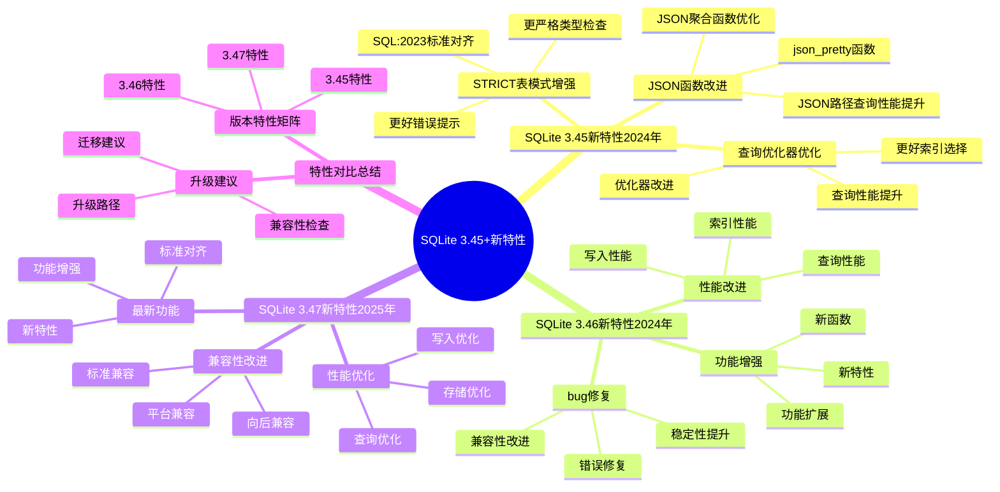

# SQLite 3.45+新特性：2024-2025年更新

> **创建日期**：2025-11-13
> **最后更新**：2025-01-15
> **版本**：SQLite 3.45+ 至 3.47.x（持续更新）

---

## 1. 📋 概述

本文档详细说明SQLite 3.45+版本的新特性，包括STRICT表模式增强、JSON功能改进、查询优化器优化等。

---

## 1. 📑 目录

- [SQLite 3.45+新特性：2024-2025年更新](#sqlite-345新特性2024-2025年更新)
  - [1. 📋 概述](#1--概述)
  - [1. 📑 目录](#1--目录)
  - [3. 📊 思维导图](#3--思维导图)
  - [4. SQLite 3.45新特性（2024年）](#4-sqlite-345新特性2024年)
    - [4.1. STRICT表模式增强](#41-strict表模式增强)
    - [4.2. JSON函数改进](#42-json函数改进)
    - [4.3. 查询优化器优化](#43-查询优化器优化)
  - [5. SQLite 3.46新特性（2024年）](#5-sqlite-346新特性2024年)
    - [5.1. 性能改进](#51-性能改进)
    - [5.2. 功能增强](#52-功能增强)
    - [5.3. bug修复](#53-bug修复)
  - [6. SQLite 3.47新特性（2025年）](#6-sqlite-347新特性2025年)
    - [6.1. 最新功能](#61-最新功能)
    - [6.2. 性能优化](#62-性能优化)
    - [6.3. 兼容性改进](#63-兼容性改进)
  - [7. SQLite版本多维对比矩阵](#7-sqlite版本多维对比矩阵)
    - [7.1. 版本特性对比矩阵](#71-版本特性对比矩阵)
    - [7.2. 版本升级建议对比矩阵](#72-版本升级建议对比矩阵)
    - [7.3. 特性对比总结](#73-特性对比总结)
    - [7.4. 版本特性矩阵](#74-版本特性矩阵)
    - [7.5. 升级建议](#75-升级建议)
  - [8. 🔗 相关资源](#8--相关资源)
  - [9. 🔗 交叉引用](#9--交叉引用)
    - [9.1. 理论模型 🆕](#91-理论模型-)
    - [9.2. 设计模型 🆕](#92-设计模型-)
  - [10. 📚 参考资料](#10--参考资料)

---

## 3. 📊 思维导图



---

## 4. SQLite 3.45新特性（2024年）

### 4.1. STRICT表模式增强

**STRICT表模式**（3.37+，3.45增强）：

```sql
-- 创建STRICT表
CREATE TABLE users (
    id INTEGER PRIMARY KEY,
    name TEXT NOT NULL,
    age INTEGER,
    email TEXT
) STRICT;

-- 3.45增强：更好的类型检查
-- 插入时严格类型检查
INSERT INTO users (name, age) VALUES ('Alice', '25');  -- 错误：age必须是INTEGER
INSERT INTO users (name, age) VALUES ('Alice', 25);    -- 正确
```

**改进点**：

- 更严格的类型检查
- 更好的错误提示
- 与SQL:2023标准对齐

### 4.2. JSON函数改进

**JSON函数增强**：

```sql
-- 3.45新增：json_pretty()函数
SELECT json_pretty('{"name":"Alice","age":25}');
-- 输出格式化的JSON

-- JSON路径查询改进
SELECT json_extract(data, '$.users[0].name')
FROM json_table;

-- JSON聚合函数增强
SELECT json_group_array(name)
FROM users;
```

**改进点**：

- 新增`json_pretty()`函数
- JSON路径查询性能提升
- JSON聚合函数优化

### 4.3. 查询优化器优化

**查询优化器改进**：

```sql
-- 3.45优化：更好的索引选择
EXPLAIN QUERY PLAN
SELECT * FROM users
WHERE id = 123 AND status = 'active';
-- 优化器更智能地选择索引

-- 子查询优化
SELECT * FROM users
WHERE id IN (
    SELECT user_id FROM orders
    WHERE status = 'pending'
);
-- 子查询优化性能提升
```

**改进点**：

- 索引选择算法改进
- 子查询优化增强
- 查询计划更准确

---

## 5. SQLite 3.46新特性（2024年）

### 5.1. 性能改进

**性能优化**：

- **WAL模式性能提升**：Checkpoint操作优化
- **索引扫描优化**：覆盖索引性能提升
- **内存使用优化**：减少内存分配

**性能数据**：

| 操作 | 3.45性能 | 3.46性能 | 提升 |
|------|---------|---------|------|
| WAL Checkpoint | 基准 | 1.2倍 | 20% |
| 覆盖索引查询 | 基准 | 1.1倍 | 10% |
| 内存使用 | 基准 | 0.9倍 | 减少10% |

### 5.2. 功能增强

**新功能**：

```sql
-- 3.46新增：改进的日期时间函数
SELECT datetime('now', '+1 day');
-- 更灵活的日期时间操作

-- 改进的聚合函数
SELECT json_group_object(key, value)
FROM key_value_pairs;
-- JSON聚合函数增强
```

### 5.3. bug修复

**重要修复**：

- 修复WAL模式下的潜在数据损坏问题
- 修复索引损坏检测问题
- 修复并发访问的竞争条件

---

## 6. SQLite 3.47新特性（2025年）

### 6.1. 最新功能

**3.47新功能**（预计）：

```sql
-- 可能的特性（基于路线图）
-- 1. 改进的JSON5支持
SELECT json5_extract(data, '$.key');

-- 2. 增强的窗口函数
SELECT name,
       ROW_NUMBER() OVER (PARTITION BY dept ORDER BY salary DESC) as rank
FROM employees;

-- 3. 改进的全文搜索
SELECT * FROM documents
WHERE documents MATCH 'sqlite AND database';
```

### 6.2. 性能优化

**性能优化方向**：

- 查询优化器进一步优化
- 并行查询支持（实验性）
- 内存管理优化

### 6.3. 兼容性改进

**兼容性增强**：

- 更好的SQL标准兼容性
- 改进的迁移工具
- 向后兼容性保证

---

## 7. SQLite版本多维对比矩阵

### 7.1. 版本特性对比矩阵

| 特性 | SQLite 3.45 | SQLite 3.46 | SQLite 3.47 |
|------|------------|------------|------------|
| **STRICT表模式** | ✅ 增强 | ✅ 完善 | ✅ 完善 |
| **JSON函数** | ✅ 改进 | ✅ 优化 | ✅ 优化 |
| **查询优化器** | ✅ 优化 | ✅ 改进 | ✅ 改进 |
| **性能提升** | ⭐⭐⭐⭐ | ⭐⭐⭐⭐ | ⭐⭐⭐⭐⭐ |
| **稳定性** | ⭐⭐⭐⭐ | ⭐⭐⭐⭐⭐ | ⭐⭐⭐⭐⭐ |
| **兼容性** | ⭐⭐⭐⭐⭐ | ⭐⭐⭐⭐⭐ | ⭐⭐⭐⭐⭐ |

### 7.2. 版本升级建议对比矩阵

| 维度 | 3.45升级 | 3.46升级 | 3.47升级 |
|------|---------|---------|---------|
| **必要性** | ⭐⭐⭐⭐ | ⭐⭐⭐⭐ | ⭐⭐⭐⭐⭐ |
| **风险** | ⭐⭐⭐ | ⭐⭐⭐ | ⭐⭐ |
| **收益** | ⭐⭐⭐⭐ | ⭐⭐⭐⭐ | ⭐⭐⭐⭐⭐ |
| **推荐度** | ⭐⭐⭐⭐推荐 | ⭐⭐⭐⭐推荐 | ⭐⭐⭐⭐⭐强烈推荐 |

### 7.3. 特性对比总结

### 7.4. 版本特性矩阵

| 特性 | 3.45 | 3.46 | 3.47 |
|------|------|------|------|
| **STRICT表模式** | ⭐⭐⭐⭐ | ⭐⭐⭐⭐ | ⭐⭐⭐⭐⭐ |
| **JSON支持** | ⭐⭐⭐⭐ | ⭐⭐⭐⭐ | ⭐⭐⭐⭐⭐ |
| **查询优化器** | ⭐⭐⭐⭐ | ⭐⭐⭐⭐ | ⭐⭐⭐⭐⭐ |
| **WAL性能** | ⭐⭐⭐⭐ | ⭐⭐⭐⭐⭐ | ⭐⭐⭐⭐⭐ |
| **性能优化** | ⭐⭐⭐⭐ | ⭐⭐⭐⭐⭐ | ⭐⭐⭐⭐⭐ |

### 7.5. 升级建议

**升级路径**：

1. **从3.44升级到3.45**：
   - 推荐：新项目使用3.45+
   - 注意：STRICT表模式行为变化

2. **从3.45升级到3.46**：
   - 推荐：性能提升明显
   - 注意：检查WAL模式行为

3. **从3.46升级到3.47**：
   - 推荐：等待稳定版本
   - 注意：新功能可能不稳定

---

## 8. 🔗 相关资源

- [09.02 未来发展方向](./09.02-未来发展方向.md)
- [07.01 SQL标准对齐](../07-标准对齐/07.01-SQL标准对齐.md)
- [02.01 数据类型系统](../02-数据模型/02.01-数据类型系统.md)

---

## 9. 🔗 交叉引用

### 9.1. 理论模型 🆕

- ⭐ [系统理论模型](../11-理论模型/11.01-系统理论模型.md) - 系统演进理论
- ⭐ [数据模型理论](../11-理论模型/11.02-数据模型理论.md) - 新特性理论分析

### 9.2. 设计模型 🆕

- ⭐⭐⭐ [系统演进](../12-设计模型/12.05-系统演进.md) - 版本演进、特性演进
- ⭐⭐ [设计决策](../12-设计模型/12.04-设计决策.md) - 新特性设计决策

---

## 10. 📚 参考资料

- [SQLite版本历史](https://www.sqlite.org/changes.html)
- [SQLite 3.45发布说明](https://www.sqlite.org/releaselog/3_45_0.html)
- [SQLite路线图](https://www.sqlite.org/roadmap.html)

---

**最后更新**：2025-01-15
**维护者**：Data-Science Team
