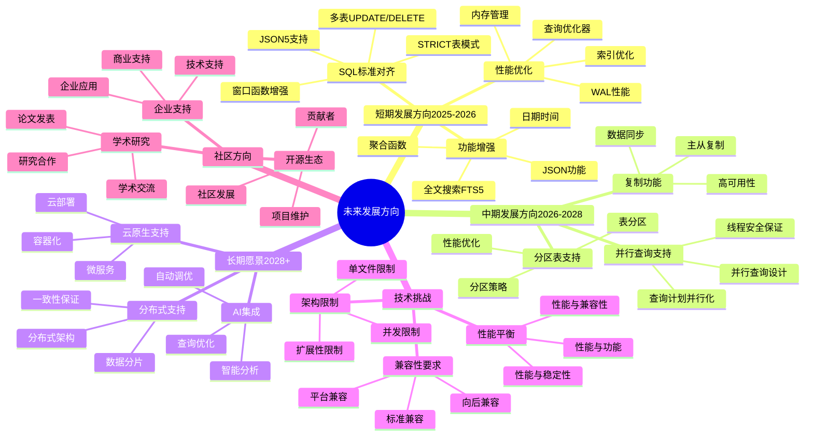

# 未来发展方向：SQLite技术路线图

> **创建日期**：2025-11-13
> **最后更新**：2025-01-15
> **版本**：SQLite 3.31+ 至 3.47.x

---

## 📋 概述

本文档分析SQLite的未来发展方向，包括技术路线图、潜在功能和长期愿景。

---

## 📑 目录

- [未来发展方向：SQLite技术路线图](#未来发展方向sqlite技术路线图)
  - [📋 概述](#-概述)
  - [📑 目录](#-目录)
  - [📊 思维导图](#-思维导图)
  - [一、短期发展方向（2025-2026）](#一短期发展方向2025-2026)
    - [1.1 SQL标准对齐](#11-sql标准对齐)
    - [1.2 性能优化](#12-性能优化)
    - [1.3 功能增强](#13-功能增强)
  - [二、中期发展方向（2026-2028）](#二中期发展方向2026-2028)
    - [2.1 并行查询支持](#21-并行查询支持)
    - [2.2 分区表支持](#22-分区表支持)
    - [2.3 复制功能](#23-复制功能)
  - [三、长期愿景（2028+）](#三长期愿景2028)
    - [3.1 分布式支持](#31-分布式支持)
    - [3.2 AI集成](#32-ai集成)
    - [3.3 云原生支持](#33-云原生支持)
  - [四、技术挑战](#四技术挑战)
    - [4.1 架构限制](#41-架构限制)
    - [4.2 兼容性要求](#42-兼容性要求)
    - [4.3 性能平衡](#43-性能平衡)
  - [五、未来发展方向多维对比矩阵](#五未来发展方向多维对比矩阵)
    - [5.1 发展方向优先级对比矩阵](#51-发展方向优先级对比矩阵)
    - [5.2 技术挑战对比矩阵](#52-技术挑战对比矩阵)
    - [5.3 社区方向对比矩阵](#53-社区方向对比矩阵)
  - [六、社区方向](#六社区方向)
    - [6.1 开源生态](#61-开源生态)
    - [6.2 企业支持](#62-企业支持)
    - [6.3 学术研究](#63-学术研究)
  - [🔗 相关资源](#-相关资源)
  - [🔗 交叉引用](#-交叉引用)
    - [理论模型 🆕](#理论模型-)
    - [设计模型 🆕](#设计模型-)
  - [📚 参考资料](#-参考资料)

---

## 📊 思维导图



---

## 一、短期发展方向（2025-2026）

### 1.1 SQL标准对齐

**SQL:2023标准对齐**：

- **STRICT表模式**：完全对齐SQL:2023
- **多表UPDATE/DELETE**：支持标准语法
- **JSON5支持**：增强JSON功能
- **窗口函数增强**：更多窗口函数支持

**预期时间**：2025-2026

### 1.2 性能优化

**性能优化方向**：

- **查询优化器**：进一步优化查询计划
- **索引优化**：更智能的索引选择
- **WAL性能**：Checkpoint性能提升
- **内存管理**：减少内存分配

**预期提升**：10-20%性能提升

### 1.3 功能增强

**功能增强方向**：

- **JSON功能**：更多JSON函数
- **全文搜索**：FTS5性能优化
- **日期时间**：更灵活的日期时间操作
- **聚合函数**：更多聚合函数支持

---

## 二、中期发展方向（2026-2028）

### 2.1 并行查询支持

**并行查询设计**：

```sql
-- 可能的语法（概念）
SELECT * FROM large_table
WHERE condition
PARALLEL 4;  -- 使用4个线程
```

**技术挑战**：

- 线程安全保证
- 查询计划并行化
- 结果合并

**预期时间**：2026-2027

### 2.2 分区表支持

**分区表设计**：

```sql
-- 可能的语法（概念）
CREATE TABLE orders (
    id INTEGER PRIMARY KEY,
    order_date DATE,
    amount REAL
) PARTITION BY RANGE (order_date) (
    PARTITION p2024 VALUES LESS THAN ('2025-01-01'),
    PARTITION p2025 VALUES LESS THAN ('2026-01-01')
);
```

**技术挑战**：

- 分区裁剪优化
- 跨分区查询
- 分区管理

**预期时间**：2027-2028

### 2.3 复制功能

**复制功能设计**：

- **主从复制**：支持只读副本
- **双向同步**：支持双向同步（有限场景）
- **冲突解决**：自动冲突解决机制

**技术挑战**：

- 单写架构限制
- 冲突解决策略
- 性能影响

**预期时间**：2027-2028

---

## 三、长期愿景（2028+）

### 3.1 分布式支持

**分布式设计**（概念）：

- **分片支持**：自动分片管理
- **分布式事务**：2PC支持
- **一致性保证**：最终一致性选项

**技术挑战**：

- 架构根本性改变
- 性能权衡
- 兼容性保证

### 3.2 AI集成

**AI集成方向**：

- **查询优化**：AI驱动的查询优化
- **索引推荐**：自动索引推荐
- **异常检测**：性能异常检测

### 3.3 云原生支持

**云原生方向**：

- **容器化**：更好的容器支持
- **Kubernetes集成**：K8s Operator
- **云存储集成**：S3、Azure Blob支持

---

## 四、技术挑战

### 4.1 架构限制

**架构挑战**：

- **单写限制**：WAL模式仅支持一写多读
- **单文件限制**：单文件存储的限制
- **进程内架构**：嵌入式架构的限制

**解决方案**：

- 保持核心架构不变
- 通过扩展支持新功能
- 提供替代方案

### 4.2 兼容性要求

**兼容性挑战**：

- **向后兼容**：必须保持向后兼容
- **API稳定性**：API不能破坏性变更
- **文件格式**：数据库文件格式兼容

**解决方案**：

- 渐进式增强
- 可选功能
- 版本管理

### 4.3 性能平衡

**性能挑战**：

- **功能 vs 性能**：新功能可能影响性能
- **复杂度 vs 速度**：复杂度增加可能降低速度
- **内存 vs 速度**：内存使用和速度的权衡

**解决方案**：

- 性能基准测试
- 可选优化
- 配置选项

---

## 五、未来发展方向多维对比矩阵

### 5.1 发展方向优先级对比矩阵

| 维度 | 短期（2025-2026） | 中期（2026-2028） | 长期（2028+） |
|------|-----------------|-----------------|--------------|
| **优先级** | ⭐⭐⭐⭐⭐ | ⭐⭐⭐⭐ | ⭐⭐⭐ |
| **可行性** | ⭐⭐⭐⭐⭐ | ⭐⭐⭐ | ⭐⭐ |
| **影响范围** | ⭐⭐⭐⭐ | ⭐⭐⭐⭐⭐ | ⭐⭐⭐⭐⭐ |
| **实施难度** | ⭐⭐⭐ | ⭐⭐⭐⭐ | ⭐⭐⭐⭐⭐ |
| **用户需求** | ⭐⭐⭐⭐⭐ | ⭐⭐⭐⭐ | ⭐⭐⭐ |

### 5.2 技术挑战对比矩阵

| 挑战 | 影响程度 | 解决难度 | 优先级 | 解决方案 |
|------|---------|---------|--------|---------|
| **架构限制** | ⭐⭐⭐⭐⭐ | ⭐⭐⭐⭐⭐ | P0 | 渐进式改进 |
| **兼容性要求** | ⭐⭐⭐⭐⭐ | ⭐⭐⭐⭐ | P0 | 向后兼容策略 |
| **性能平衡** | ⭐⭐⭐⭐ | ⭐⭐⭐ | P1 | 性能测试优化 |
| **扩展性限制** | ⭐⭐⭐⭐ | ⭐⭐⭐⭐⭐ | P1 | 架构重构 |

### 5.3 社区方向对比矩阵

| 维度 | 开源生态 | 企业支持 | 学术研究 |
|------|---------|---------|---------|
| **重要性** | ⭐⭐⭐⭐⭐ | ⭐⭐⭐⭐ | ⭐⭐⭐ |
| **当前状态** | ⭐⭐⭐⭐⭐ | ⭐⭐⭐ | ⭐⭐⭐ |
| **发展潜力** | ⭐⭐⭐⭐ | ⭐⭐⭐⭐⭐ | ⭐⭐⭐⭐ |
| **推荐度** | ⭐⭐⭐⭐⭐推荐 | ⭐⭐⭐⭐推荐 | ⭐⭐⭐⭐推荐 |

## 六、社区方向

### 6.1 开源生态

**开源生态发展**：

- **扩展开发**：更多社区扩展
- **工具开发**：更多开发工具
- **文档完善**：更完善的文档

### 6.2 企业支持

**企业支持方向**：

- **商业支持**：提供商业支持选项
- **企业功能**：企业级功能需求
- **合规性**：满足合规要求

### 6.3 学术研究

**学术研究方向**：

- **性能研究**：性能优化研究
- **安全研究**：安全性研究
- **算法研究**：新算法研究

---

## 🔗 相关资源

- [09.01 SQLite 3.45+新特性](./09.01-SQLite-3.45+新特性.md)
- [07.01 SQL标准对齐](../07-标准对齐/07.01-SQL标准对齐.md)
- [SQLite官方路线图](https://www.sqlite.org/roadmap.html)

---

## 🔗 交叉引用

### 理论模型 🆕

- ⭐⭐ [系统理论模型](../11-理论模型/11.01-系统理论模型.md) - 系统演进理论、未来发展方向
- ⭐ [算法复杂度理论](../11-理论模型/11.03-算法复杂度理论.md) - 性能优化方向

### 设计模型 🆕

- ⭐⭐⭐ [系统演进](../12-设计模型/12.05-系统演进.md) - 未来设计方向、技术债务管理
- ⭐⭐ [设计决策](../12-设计模型/12.04-设计决策.md) - 未来设计决策

---

## 📚 参考资料

- [SQLite路线图](https://www.sqlite.org/roadmap.html)
- [SQLite未来计划](https://www.sqlite.org/future.html)
- [社区讨论](https://sqlite.org/forum/)

---

**最后更新**：2025-01-15
**维护者**：Data-Science Team
