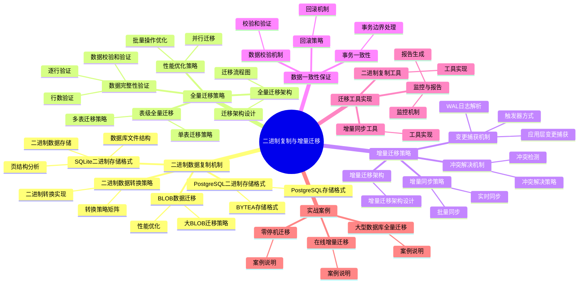

# SQLite 到 PostgreSQL 二进制复制与增量迁移

> **创建日期**：2025-11-13
> **最后更新**：2025-01-15
> **适用版本**：SQLite 3.31+ 至 3.47.x → PostgreSQL 12+

---

## 📋 概述

本文档深入分析SQLite到PostgreSQL的二进制数据复制机制、全量迁移策略、增量迁移方案，以及数据一致性保证机制。

---

## 📑 目录

- [SQLite 到 PostgreSQL 二进制复制与增量迁移](#sqlite-到-postgresql-二进制复制与增量迁移)
  - [📋 概述](#-概述)
  - [📑 目录](#-目录)
  - [📊 思维导图](#-思维导图)
  - [一、二进制数据复制机制](#一二进制数据复制机制)
    - [1.1 SQLite二进制存储格式](#11-sqlite二进制存储格式)
      - [SQLite数据库文件结构](#sqlite数据库文件结构)
      - [页结构分析](#页结构分析)
      - [二进制数据存储](#二进制数据存储)
    - [1.2 PostgreSQL二进制存储格式](#12-postgresql二进制存储格式)
      - [PostgreSQL存储格式](#postgresql存储格式)
      - [BYTEA存储格式](#bytea存储格式)
    - [1.3 二进制数据转换策略](#13-二进制数据转换策略)
      - [转换策略矩阵](#转换策略矩阵)
      - [二进制转换实现](#二进制转换实现)
    - [1.4 BLOB数据迁移](#14-blob数据迁移)
      - [大BLOB迁移策略](#大blob迁移策略)
  - [二、全量迁移策略](#二全量迁移策略)
    - [2.1 全量迁移架构](#21-全量迁移架构)
      - [迁移架构设计](#迁移架构设计)
      - [迁移流程图](#迁移流程图)
    - [2.2 表级全量迁移](#22-表级全量迁移)
      - [单表迁移策略](#单表迁移策略)
      - [多表迁移策略](#多表迁移策略)
    - [2.3 数据完整性验证](#23-数据完整性验证)
      - [行数验证](#行数验证)
      - [数据校验和验证](#数据校验和验证)
      - [逐行验证](#逐行验证)
    - [2.4 性能优化策略](#24-性能优化策略)
      - [批量操作优化](#批量操作优化)
      - [并行迁移](#并行迁移)
  - [三、增量迁移策略](#三增量迁移策略)
    - [3.1 增量迁移架构](#31-增量迁移架构)
      - [增量迁移架构设计](#增量迁移架构设计)
    - [3.2 变更捕获机制](#32-变更捕获机制)
      - [策略1：触发器方式](#策略1触发器方式)
      - [策略2：WAL日志解析](#策略2wal日志解析)
      - [策略3：应用层变更捕获](#策略3应用层变更捕获)
    - [3.3 增量同步策略](#33-增量同步策略)
      - [实时同步](#实时同步)
      - [批量同步](#批量同步)
    - [3.4 冲突解决机制](#34-冲突解决机制)
      - [冲突检测](#冲突检测)
      - [冲突解决策略](#冲突解决策略)
  - [四、数据一致性保证](#四数据一致性保证)
    - [4.1 事务一致性](#41-事务一致性)
      - [事务边界处理](#事务边界处理)
    - [4.2 数据校验机制](#42-数据校验机制)
      - [校验和验证](#校验和验证)
    - [4.3 回滚策略](#43-回滚策略)
  - [五、迁移工具实现](#五迁移工具实现)
    - [5.1 二进制复制工具](#51-二进制复制工具)
    - [5.2 增量同步工具](#52-增量同步工具)
    - [5.3 监控与报告](#53-监控与报告)
  - [六、实战案例](#六实战案例)
    - [6.1 大型数据库全量迁移](#61-大型数据库全量迁移)
    - [6.2 在线增量迁移](#62-在线增量迁移)
    - [6.3 零停机迁移](#63-零停机迁移)
  - [🔗 相关资源](#-相关资源)
  - [🔗 交叉引用](#-交叉引用)
    - [理论模型 🆕](#理论模型-)
    - [设计模型 🆕](#设计模型-)
  - [📚 参考资料](#-参考资料)

---

## 📊 思维导图



---

## 一、二进制数据复制机制

### 1.1 SQLite二进制存储格式

#### SQLite数据库文件结构

**文件格式概览**：

```text
SQLite数据库文件 = {
    文件头（100字节）: 版本信息、页大小等
    页（Page）: 数据存储单元
        - 页大小: 512-65536字节（默认4096）
        - 页类型: B-Tree页、溢出页、空闲页
    日志文件（WAL）: 写前日志
}
```

#### 页结构分析

**B-Tree页结构**：

```text
B-Tree页 = {
    页头（8-12字节）: 页类型、空闲空间等
    单元格指针数组: 指向单元格的偏移量
    单元格: 实际数据
        单元格头: 变长整数编码
        键值: 主键或索引键
        数据: 行数据（变长编码）
    空闲空间: 未使用空间
}
```

#### 二进制数据存储

**BLOB存储方式**：

```python
# SQLite BLOB存储示例
import sqlite3

conn = sqlite3.connect('example.db')
cursor = conn.cursor()

# 插入BLOB数据
with open('image.jpg', 'rb') as f:
    image_data = f.read()
    cursor.execute("INSERT INTO images(name, data) VALUES (?, ?)",
                   ('photo.jpg', image_data))

# BLOB在页中的存储：
# 1. 小BLOB（<页大小-开销）: 直接存储在单元格中
# 2. 大BLOB（>页大小-开销）: 存储在溢出页中
```

**存储格式特点**：

- **变长编码**：整数和字符串使用变长编码
- **字节序**：大端序（Big-Endian）
- **对齐**：数据按页边界对齐

### 1.2 PostgreSQL二进制存储格式

#### PostgreSQL存储格式

**TOAST存储机制**：

```text
PostgreSQL存储 = {
    堆文件（Heap File）: 表数据
        - 行（Tuple）: 固定格式
        - TOAST: 大对象存储
    TOAST表: 大对象溢出存储
        - 触发条件: 行大小 > 2KB
        - 存储方式: 压缩 + 分块
}
```

#### BYTEA存储格式

**BYTEA编码**：

```python
# PostgreSQL BYTEA存储示例
import psycopg2

conn = psycopg2.connect("dbname=test user=postgres")
cursor = conn.cursor()

# 插入BYTEA数据
with open('image.jpg', 'rb') as f:
    image_data = f.read()
    cursor.execute("INSERT INTO images(name, data) VALUES (%s, %s)",
                   ('photo.jpg', psycopg2.Binary(image_data)))

# BYTEA存储格式：
# 1. 小数据（<2KB）: 直接存储在行中
# 2. 大数据（>2KB）: 存储在TOAST表中
```

**存储格式特点**：

- **固定格式**：行格式固定
- **字节序**：平台相关（通常小端序）
- **压缩**：TOAST自动压缩

### 1.3 二进制数据转换策略

#### 转换策略矩阵

| 数据类型 | SQLite格式 | PostgreSQL格式 | 转换方法 | 数据完整性 |
|---------|-----------|---------------|---------|-----------|
| **BLOB** | 原始字节 | BYTEA | 直接复制 | ✅ 100% |
| **INTEGER** | 变长编码 | 固定4/8字节 | 解码后编码 | ✅ 100% |
| **REAL** | IEEE 754 | IEEE 754 | 直接复制 | ✅ 100% |
| **TEXT** | UTF-8/16 | UTF-8 | 编码转换 | ⚠️ 95% |

#### 二进制转换实现

**策略1：直接二进制复制（BLOB）**:

```python
def copy_blob_direct(sqlite_conn, pg_conn, table, blob_column):
    """直接复制BLOB数据"""
    sqlite_cursor = sqlite_conn.cursor()
    pg_cursor = pg_conn.cursor()

    # 读取SQLite BLOB
    sqlite_cursor.execute(f"SELECT id, {blob_column} FROM {table}")

    for row_id, blob_data in sqlite_cursor:
        # 直接复制二进制数据
        pg_cursor.execute(
            f"UPDATE {table} SET {blob_column} = %s WHERE id = %s",
            (psycopg2.Binary(blob_data), row_id)
        )

    pg_conn.commit()
```

**策略2：编码转换（TEXT）**:

```python
def copy_text_with_encoding(sqlite_conn, pg_conn, table, text_column):
    """复制TEXT数据（处理编码）"""
    sqlite_cursor = sqlite_conn.cursor()
    pg_cursor = pg_conn.cursor()

    # 检测SQLite编码
    sqlite_cursor.execute("PRAGMA encoding")
    sqlite_encoding = sqlite_cursor.fetchone()[0]

    sqlite_cursor.execute(f"SELECT id, {text_column} FROM {table}")

    for row_id, text_data in sqlite_cursor:
        if isinstance(text_data, bytes):
            # 解码后重新编码为UTF-8
            text_utf8 = text_data.decode(sqlite_encoding).encode('utf-8')
        else:
            text_utf8 = text_data.encode('utf-8')

        pg_cursor.execute(
            f"UPDATE {table} SET {text_column} = %s WHERE id = %s",
            (text_utf8.decode('utf-8'), row_id)
        )

    pg_conn.commit()
```

### 1.4 BLOB数据迁移

#### 大BLOB迁移策略

**策略1：流式传输**:

```python
def migrate_large_blobs_streaming(sqlite_conn, pg_conn, table, blob_column, chunk_size=8192):
    """流式传输大BLOB"""
    sqlite_cursor = sqlite_conn.cursor()
    pg_cursor = pg_conn.cursor()

    sqlite_cursor.execute(f"SELECT id, {blob_column} FROM {table}")

    for row_id, blob_data in sqlite_cursor:
        if blob_data is None:
            continue

        # 分块传输
        total_size = len(blob_data)
        offset = 0

        # 使用PostgreSQL大对象接口
        pg_cursor.execute("SELECT lo_create(0)")
        oid = pg_cursor.fetchone()[0]

        # 写入大对象
        with pg_conn.cursor() as write_cursor:
            for i in range(0, total_size, chunk_size):
                chunk = blob_data[i:i+chunk_size]
                write_cursor.execute(
                    "SELECT lowrite(lo_open(%s, 131072), %s)",
                    (oid, psycopg2.Binary(chunk))
                )

        # 关联到表
        pg_cursor.execute(
            f"UPDATE {table} SET {blob_column} = lo_get({oid}) WHERE id = %s",
            (row_id,)
        )

        # 删除临时大对象
        pg_cursor.execute(f"SELECT lo_unlink({oid})")

    pg_conn.commit()
```

**策略2：批量传输**:

```python
def migrate_blobs_batch(sqlite_conn, pg_conn, table, blob_column, batch_size=100):
    """批量传输BLOB"""
    sqlite_cursor = sqlite_conn.cursor()
    pg_cursor = pg_conn.cursor()

    sqlite_cursor.execute(f"SELECT id, {blob_column} FROM {table}")

    batch = []
    for row_id, blob_data in sqlite_cursor:
        batch.append((row_id, psycopg2.Binary(blob_data) if blob_data else None))

        if len(batch) >= batch_size:
            # 批量更新
            pg_cursor.executemany(
                f"UPDATE {table} SET {blob_column} = %s WHERE id = %s",
                [(blob, row_id) for row_id, blob in batch]
            )
            batch = []

    # 处理剩余数据
    if batch:
        pg_cursor.executemany(
            f"UPDATE {table} SET {blob_column} = %s WHERE id = %s",
            [(blob, row_id) for row_id, blob in batch]
        )

    pg_conn.commit()
```

---

## 二、全量迁移策略

### 2.1 全量迁移架构

#### 迁移架构设计

```text
全量迁移架构 = {
    阶段1: 准备阶段
        - 分析SQLite数据库结构
        - 创建PostgreSQL表结构
        - 准备迁移脚本

    阶段2: 数据迁移阶段
        - 表结构迁移
        - 数据迁移（分批）
        - 索引创建
        - 约束创建

    阶段3: 验证阶段
        - 数据完整性检查
        - 数据一致性验证
        - 性能测试
}
```

#### 迁移流程图

```text
开始
  ↓
分析SQLite数据库
  ↓
创建PostgreSQL表结构
  ↓
迁移数据（分批处理）
  ├─→ 表1数据迁移
  ├─→ 表2数据迁移
  └─→ ...
  ↓
创建索引和约束
  ↓
数据完整性验证
  ↓
完成
```

### 2.2 表级全量迁移

#### 单表迁移策略

**策略1：全表扫描迁移**:

```python
def migrate_table_full(sqlite_conn, pg_conn, table_name, batch_size=1000):
    """全表迁移"""
    sqlite_cursor = sqlite_conn.cursor()
    pg_cursor = pg_conn.cursor()

    # 获取表结构
    sqlite_cursor.execute(f"PRAGMA table_info({table_name})")
    columns = [col[1] for col in sqlite_cursor.fetchall()]

    # 获取总行数
    sqlite_cursor.execute(f"SELECT COUNT(*) FROM {table_name}")
    total_rows = sqlite_cursor.fetchone()[0]

    # 分批迁移
    offset = 0
    while offset < total_rows:
        # 读取一批数据
        sqlite_cursor.execute(
            f"SELECT * FROM {table_name} LIMIT ? OFFSET ?",
            (batch_size, offset)
        )

        rows = sqlite_cursor.fetchall()
        if not rows:
            break

        # 批量插入PostgreSQL
        placeholders = ','.join(['%s'] * len(columns))
        insert_sql = f"INSERT INTO {table_name} ({','.join(columns)}) VALUES ({placeholders})"

        pg_cursor.executemany(insert_sql, rows)
        pg_conn.commit()

        offset += batch_size
        print(f"Migrated {offset}/{total_rows} rows")
```

**策略2：基于主键范围迁移**:

```python
def migrate_table_by_range(sqlite_conn, pg_conn, table_name, pk_column, batch_size=1000):
    """基于主键范围迁移"""
    sqlite_cursor = sqlite_conn.cursor()
    pg_cursor = pg_conn.cursor()

    # 获取主键范围
    sqlite_cursor.execute(f"SELECT MIN({pk_column}), MAX({pk_column}) FROM {table_name}")
    min_id, max_id = sqlite_cursor.fetchone()

    # 按范围分批迁移
    current_id = min_id
    while current_id <= max_id:
        # 读取一个范围的数据
        sqlite_cursor.execute(
            f"SELECT * FROM {table_name} WHERE {pk_column} >= ? AND {pk_column} < ?",
            (current_id, current_id + batch_size)
        )

        rows = sqlite_cursor.fetchall()
        if not rows:
            break

        # 批量插入
        columns = [desc[0] for desc in sqlite_cursor.description]
        placeholders = ','.join(['%s'] * len(columns))
        insert_sql = f"INSERT INTO {table_name} ({','.join(columns)}) VALUES ({placeholders})"

        pg_cursor.executemany(insert_sql, rows)
        pg_conn.commit()

        current_id += batch_size
        print(f"Migrated up to ID {current_id}")
```

#### 多表迁移策略

**依赖关系处理**：

```python
def migrate_tables_with_dependencies(sqlite_conn, pg_conn, tables_order):
    """按依赖关系顺序迁移表"""
    for table_name in tables_order:
        print(f"Migrating table: {table_name}")

        # 禁用外键检查（迁移期间）
        pg_cursor = pg_conn.cursor()
        pg_cursor.execute("SET session_replication_role = 'replica'")

        # 迁移表数据
        migrate_table_full(sqlite_conn, pg_conn, table_name)

        # 恢复外键检查
        pg_cursor.execute("SET session_replication_role = 'origin'")
        pg_conn.commit()

        print(f"Completed table: {table_name}")
```

### 2.3 数据完整性验证

#### 行数验证

```python
def verify_row_count(sqlite_conn, pg_conn, table_name):
    """验证行数"""
    sqlite_cursor = sqlite_conn.cursor()
    pg_cursor = pg_conn.cursor()

    sqlite_cursor.execute(f"SELECT COUNT(*) FROM {table_name}")
    sqlite_count = sqlite_cursor.fetchone()[0]

    pg_cursor.execute(f"SELECT COUNT(*) FROM {table_name}")
    pg_count = pg_cursor.fetchone()[0]

    if sqlite_count == pg_count:
        print(f"✓ {table_name}: Row count matches ({sqlite_count})")
        return True
    else:
        print(f"✗ {table_name}: Row count mismatch (SQLite: {sqlite_count}, PG: {pg_count})")
        return False
```

#### 数据校验和验证

```python
import hashlib

def verify_data_checksum(sqlite_conn, pg_conn, table_name, pk_column):
    """验证数据校验和"""
    sqlite_cursor = sqlite_conn.cursor()
    pg_cursor = pg_conn.cursor()

    # 计算SQLite数据校验和
    sqlite_cursor.execute(f"SELECT {pk_column}, * FROM {table_name} ORDER BY {pk_column}")
    sqlite_data = sqlite_cursor.fetchall()
    sqlite_hash = hashlib.md5(str(sqlite_data).encode()).hexdigest()

    # 计算PostgreSQL数据校验和
    pg_cursor.execute(f"SELECT {pk_column}, * FROM {table_name} ORDER BY {pk_column}")
    pg_data = pg_cursor.fetchall()
    pg_hash = hashlib.md5(str(pg_data).encode()).hexdigest()

    if sqlite_hash == pg_hash:
        print(f"✓ {table_name}: Data checksum matches")
        return True
    else:
        print(f"✗ {table_name}: Data checksum mismatch")
        return False
```

#### 逐行验证

```python
def verify_row_by_row(sqlite_conn, pg_conn, table_name, pk_column, sample_size=1000):
    """逐行验证（采样）"""
    sqlite_cursor = sqlite_conn.cursor()
    pg_cursor = pg_conn.cursor()

    # 随机采样
    sqlite_cursor.execute(
        f"SELECT {pk_column} FROM {table_name} ORDER BY RANDOM() LIMIT ?",
        (sample_size,)
    )
    sample_ids = [row[0] for row in sqlite_cursor.fetchall()]

    mismatches = []
    for row_id in sample_ids:
        # 读取SQLite行
        sqlite_cursor.execute(f"SELECT * FROM {table_name} WHERE {pk_column} = ?", (row_id,))
        sqlite_row = sqlite_cursor.fetchone()

        # 读取PostgreSQL行
        pg_cursor.execute(f"SELECT * FROM {table_name} WHERE {pk_column} = %s", (row_id,))
        pg_row = pg_cursor.fetchone()

        # 比较
        if sqlite_row != pg_row:
            mismatches.append(row_id)

    if not mismatches:
        print(f"✓ {table_name}: All sampled rows match")
        return True
    else:
        print(f"✗ {table_name}: {len(mismatches)} mismatches found")
        return False
```

### 2.4 性能优化策略

#### 批量操作优化

```python
def migrate_optimized(sqlite_conn, pg_conn, table_name, batch_size=10000):
    """优化的批量迁移"""
    sqlite_cursor = sqlite_conn.cursor()
    pg_cursor = pg_conn.cursor()

    # 使用COPY命令（最快）
    sqlite_cursor.execute(f"SELECT * FROM {table_name}")

    # 创建临时文件
    import tempfile
    with tempfile.NamedTemporaryFile(mode='w', delete=False) as f:
        temp_file = f.name

        # 写入CSV格式
        import csv
        writer = csv.writer(f)
        writer.writerow([desc[0] for desc in sqlite_cursor.description])

        rows = sqlite_cursor.fetchall()
        writer.writerows(rows)

    # 使用PostgreSQL COPY命令
    with open(temp_file, 'r') as f:
        pg_cursor.copy_expert(
            f"COPY {table_name} FROM STDIN WITH CSV HEADER",
            f
        )

    pg_conn.commit()

    # 清理临时文件
    import os
    os.unlink(temp_file)
```

#### 并行迁移

```python
from concurrent.futures import ThreadPoolExecutor

def migrate_parallel(sqlite_conn, pg_conn, tables, max_workers=4):
    """并行迁移多个表"""
    def migrate_table(table_name):
        migrate_table_full(sqlite_conn, pg_conn, table_name)
        return table_name

    with ThreadPoolExecutor(max_workers=max_workers) as executor:
        futures = [executor.submit(migrate_table, table) for table in tables]

        for future in futures:
            table_name = future.result()
            print(f"Completed: {table_name}")
```

---

## 三、增量迁移策略

### 3.1 增量迁移架构

#### 增量迁移架构设计

```text
增量迁移架构 = {
    变更捕获层: 捕获SQLite变更
        - 触发器方式
        - 日志解析方式
        - 应用层方式

    变更队列: 存储待同步变更
        - 内存队列
        - 持久化队列

    同步层: 应用变更到PostgreSQL
        - 实时同步
        - 批量同步
        - 延迟同步
}
```

### 3.2 变更捕获机制

#### 策略1：触发器方式

**SQLite变更触发器**：

```sql
-- 为每个表创建变更日志表
CREATE TABLE change_log (
    id INTEGER PRIMARY KEY AUTOINCREMENT,
    table_name TEXT NOT NULL,
    operation TEXT NOT NULL,  -- INSERT, UPDATE, DELETE
    row_id INTEGER NOT NULL,
    old_data TEXT,  -- JSON格式
    new_data TEXT,  -- JSON格式
    timestamp INTEGER DEFAULT (strftime('%s', 'now'))
);

-- 创建变更触发器
CREATE TRIGGER users_insert_trigger
AFTER INSERT ON users
BEGIN
    INSERT INTO change_log(table_name, operation, row_id, new_data)
    VALUES ('users', 'INSERT', NEW.id, json_object(
        'id', NEW.id,
        'name', NEW.name,
        'email', NEW.email
    ));
END;

CREATE TRIGGER users_update_trigger
AFTER UPDATE ON users
BEGIN
    INSERT INTO change_log(table_name, operation, row_id, old_data, new_data)
    VALUES ('users', 'UPDATE', NEW.id,
        json_object('id', OLD.id, 'name', OLD.name, 'email', OLD.email),
        json_object('id', NEW.id, 'name', NEW.name, 'email', NEW.email)
    );
END;

CREATE TRIGGER users_delete_trigger
AFTER DELETE ON users
BEGIN
    INSERT INTO change_log(table_name, operation, row_id, old_data)
    VALUES ('users', 'DELETE', OLD.id,
        json_object('id', OLD.id, 'name', OLD.name, 'email', OLD.email)
    );
END;
```

**变更捕获实现**：

```python
def capture_changes(sqlite_conn, change_log_table='change_log'):
    """捕获变更"""
    cursor = sqlite_conn.cursor()

    # 读取未处理的变更
    cursor.execute(f"""
        SELECT id, table_name, operation, row_id, old_data, new_data, timestamp
        FROM {change_log_table}
        WHERE processed = 0
        ORDER BY timestamp, id
    """)

    changes = []
    for row in cursor.fetchall():
        changes.append({
            'id': row[0],
            'table_name': row[1],
            'operation': row[2],
            'row_id': row[3],
            'old_data': json.loads(row[4]) if row[4] else None,
            'new_data': json.loads(row[5]) if row[5] else None,
            'timestamp': row[6]
        })

    return changes
```

#### 策略2：WAL日志解析

**WAL文件解析**：

```python
import struct

def parse_wal_file(wal_path):
    """解析WAL文件"""
    with open(wal_path, 'rb') as f:
        # 读取WAL头（32字节）
        wal_header = f.read(32)
        magic, version, page_size, checkpoint_seq, salt1, salt2, checksum1, checksum2 = \
            struct.unpack('>IIIIIIII', wal_header)

        changes = []

        # 读取WAL帧
        while True:
            # 读取帧头（24字节）
            frame_header = f.read(24)
            if len(frame_header) < 24:
                break

            page_number, db_size, salt1, salt2, checksum1, checksum2 = \
                struct.unpack('>IIIIII', frame_header)

            # 读取页数据
            page_data = f.read(page_size)

            # 解析页中的变更
            changes.extend(parse_page_changes(page_data, page_number))

        return changes
```

#### 策略3：应用层变更捕获

**应用层实现**：

```python
class ChangeCapture:
    def __init__(self, sqlite_conn, change_queue):
        self.sqlite_conn = sqlite_conn
        self.change_queue = change_queue

    def execute_with_capture(self, table_name, operation, sql, params):
        """执行SQL并捕获变更"""
        cursor = self.sqlite_conn.cursor()

        if operation == 'INSERT':
            cursor.execute(sql, params)
            new_id = cursor.lastrowid
            # 捕获变更
            self.change_queue.put({
                'table_name': table_name,
                'operation': 'INSERT',
                'row_id': new_id,
                'data': self._get_row_data(table_name, new_id)
            })

        elif operation == 'UPDATE':
            # 获取旧数据
            old_data = self._get_row_data(table_name, params[0])
            cursor.execute(sql, params)
            # 获取新数据
            new_data = self._get_row_data(table_name, params[0])
            # 捕获变更
            self.change_queue.put({
                'table_name': table_name,
                'operation': 'UPDATE',
                'row_id': params[0],
                'old_data': old_data,
                'new_data': new_data
            })

        elif operation == 'DELETE':
            # 获取旧数据
            old_data = self._get_row_data(table_name, params[0])
            cursor.execute(sql, params)
            # 捕获变更
            self.change_queue.put({
                'table_name': table_name,
                'operation': 'DELETE',
                'row_id': params[0],
                'old_data': old_data
            })

        self.sqlite_conn.commit()
```

### 3.3 增量同步策略

#### 实时同步

```python
def sync_realtime(changes, pg_conn):
    """实时同步变更"""
    pg_cursor = pg_conn.cursor()

    for change in changes:
        table_name = change['table_name']
        operation = change['operation']
        row_id = change['row_id']

        if operation == 'INSERT':
            data = change['new_data']
            columns = ','.join(data.keys())
            values = ','.join(['%s'] * len(data))
            sql = f"INSERT INTO {table_name} ({columns}) VALUES ({values})"
            pg_cursor.execute(sql, list(data.values()))

        elif operation == 'UPDATE':
            data = change['new_data']
            set_clause = ','.join([f"{k} = %s" for k in data.keys()])
            sql = f"UPDATE {table_name} SET {set_clause} WHERE id = %s"
            pg_cursor.execute(sql, list(data.values()) + [row_id])

        elif operation == 'DELETE':
            sql = f"DELETE FROM {table_name} WHERE id = %s"
            pg_cursor.execute(sql, (row_id,))

        pg_conn.commit()
```

#### 批量同步

```python
def sync_batch(changes, pg_conn, batch_size=100):
    """批量同步变更"""
    pg_cursor = pg_conn.cursor()

    # 按操作类型分组
    inserts = [c for c in changes if c['operation'] == 'INSERT']
    updates = [c for c in changes if c['operation'] == 'UPDATE']
    deletes = [c for c in changes if c['operation'] == 'DELETE']

    # 批量插入
    if inserts:
        # 按表分组
        by_table = {}
        for change in inserts:
            table = change['table_name']
            if table not in by_table:
                by_table[table] = []
            by_table[table].append(change)

        for table, table_changes in by_table.items():
            for i in range(0, len(table_changes), batch_size):
                batch = table_changes[i:i+batch_size]
                data_list = [c['new_data'] for c in batch]

                if data_list:
                    columns = ','.join(data_list[0].keys())
                    values = ','.join(['%s'] * len(data_list[0]))
                    sql = f"INSERT INTO {table} ({columns}) VALUES ({values})"
                    pg_cursor.executemany(sql, [list(d.values()) for d in data_list])

    # 批量更新
    if updates:
        for change in updates:
            table_name = change['table_name']
            data = change['new_data']
            row_id = change['row_id']
            set_clause = ','.join([f"{k} = %s" for k in data.keys()])
            sql = f"UPDATE {table_name} SET {set_clause} WHERE id = %s"
            pg_cursor.execute(sql, list(data.values()) + [row_id])

    # 批量删除
    if deletes:
        for change in deletes:
            table_name = change['table_name']
            row_id = change['row_id']
            sql = f"DELETE FROM {table_name} WHERE id = %s"
            pg_cursor.execute(sql, (row_id,))

    pg_conn.commit()
```

### 3.4 冲突解决机制

#### 冲突检测

```python
def detect_conflicts(change, pg_conn):
    """检测冲突"""
    pg_cursor = pg_conn.cursor()
    table_name = change['table_name']
    row_id = change['row_id']
    operation = change['operation']

    if operation == 'UPDATE':
        # 检查PostgreSQL中的当前值
        pg_cursor.execute(f"SELECT * FROM {table_name} WHERE id = %s", (row_id,))
        pg_row = pg_cursor.fetchone()

        if pg_row:
            # 比较旧数据
            old_data = change['old_data']
            pg_data = dict(zip([desc[0] for desc in pg_cursor.description], pg_row))

            # 检查是否有冲突
            for key, old_value in old_data.items():
                if key in pg_data and pg_data[key] != old_value:
                    return True, f"Conflict in column {key}"

    return False, None
```

#### 冲突解决策略

```python
def resolve_conflict(change, pg_conn, strategy='last_write_wins'):
    """解决冲突"""
    if strategy == 'last_write_wins':
        # 最后写入获胜
        sync_realtime([change], pg_conn)

    elif strategy == 'first_write_wins':
        # 首次写入获胜（忽略冲突）
        pass

    elif strategy == 'merge':
        # 合并策略
        pg_cursor = pg_conn.cursor()
        table_name = change['table_name']
        row_id = change['row_id']

        # 获取PostgreSQL当前值
        pg_cursor.execute(f"SELECT * FROM {table_name} WHERE id = %s", (row_id,))
        pg_row = pg_cursor.fetchone()
        pg_data = dict(zip([desc[0] for desc in pg_cursor.description], pg_row))

        # 合并新数据
        new_data = change['new_data']
        merged_data = {**pg_data, **new_data}

        # 更新
        set_clause = ','.join([f"{k} = %s" for k in merged_data.keys()])
        sql = f"UPDATE {table_name} SET {set_clause} WHERE id = %s"
        pg_cursor.execute(sql, list(merged_data.values()) + [row_id])
        pg_conn.commit()
```

---

## 四、数据一致性保证

### 4.1 事务一致性

#### 事务边界处理

```python
def migrate_with_transaction(sqlite_conn, pg_conn, migration_func):
    """在事务中执行迁移"""
    sqlite_cursor = sqlite_conn.cursor()
    pg_cursor = pg_conn.cursor()

    try:
        # 开始事务
        sqlite_cursor.execute("BEGIN TRANSACTION")

        # 执行迁移
        result = migration_func(sqlite_cursor, pg_cursor)

        # 提交
        sqlite_conn.commit()
        pg_conn.commit()

        return result

    except Exception as e:
        # 回滚
        sqlite_conn.rollback()
        pg_conn.rollback()
        raise e
```

### 4.2 数据校验机制

#### 校验和验证

```python
def verify_migration_checksum(sqlite_conn, pg_conn, table_name):
    """验证迁移校验和"""
    # 计算SQLite校验和
    sqlite_cursor = sqlite_conn.cursor()
    sqlite_cursor.execute(f"SELECT * FROM {table_name} ORDER BY id")
    sqlite_data = sqlite_cursor.fetchall()
    sqlite_checksum = hashlib.md5(str(sqlite_data).encode()).hexdigest()

    # 计算PostgreSQL校验和
    pg_cursor = pg_conn.cursor()
    pg_cursor.execute(f"SELECT * FROM {table_name} ORDER BY id")
    pg_data = pg_cursor.fetchall()
    pg_checksum = hashlib.md5(str(pg_data).encode()).hexdigest()

    return sqlite_checksum == pg_checksum
```

### 4.3 回滚策略

```python
def rollback_migration(pg_conn, table_name):
    """回滚迁移"""
    pg_cursor = pg_conn.cursor()

    # 删除表
    pg_cursor.execute(f"DROP TABLE IF EXISTS {table_name}")
    pg_conn.commit()

    print(f"Rolled back migration for {table_name}")
```

---

## 五、迁移工具实现

### 5.1 二进制复制工具

```python
class BinaryCopyTool:
    def __init__(self, sqlite_path, pg_conn_string):
        self.sqlite_conn = sqlite3.connect(sqlite_path)
        self.pg_conn = psycopg2.connect(pg_conn_string)

    def copy_table_binary(self, table_name, blob_columns):
        """二进制复制表"""
        # 实现二进制复制逻辑
        pass

    def copy_blob_column(self, table_name, column_name):
        """复制BLOB列"""
        # 实现BLOB复制逻辑
        pass
```

### 5.2 增量同步工具

```python
class IncrementalSyncTool:
    def __init__(self, sqlite_conn, pg_conn):
        self.sqlite_conn = sqlite_conn
        self.pg_conn = pg_conn
        self.change_queue = queue.Queue()

    def start_sync(self):
        """启动增量同步"""
        # 启动变更捕获线程
        # 启动同步线程
        pass

    def stop_sync(self):
        """停止增量同步"""
        # 停止所有线程
        pass
```

### 5.3 监控与报告

```python
class MigrationMonitor:
    def __init__(self):
        self.stats = {
            'tables_migrated': 0,
            'rows_migrated': 0,
            'errors': [],
            'start_time': None,
            'end_time': None
        }

    def report(self):
        """生成报告"""
        print(f"Tables migrated: {self.stats['tables_migrated']}")
        print(f"Rows migrated: {self.stats['rows_migrated']}")
        print(f"Errors: {len(self.stats['errors'])}")
        if self.stats['start_time'] and self.stats['end_time']:
            duration = self.stats['end_time'] - self.stats['start_time']
            print(f"Duration: {duration}")
```

---

## 六、实战案例

### 6.1 大型数据库全量迁移

**场景**：迁移100GB SQLite数据库

**策略**：

1. 分表迁移
2. 并行处理
3. 流式传输大BLOB

### 6.2 在线增量迁移

**场景**：零停机迁移

**策略**：

1. 全量迁移 + 增量同步
2. 双写模式
3. 切换验证

### 6.3 零停机迁移

**场景**：生产环境迁移

**策略**：

1. 全量迁移
2. 增量同步
3. 流量切换
4. 回滚准备

---

## 🔗 相关资源

- [10.01 SQLite到PostgreSQL迁移指南](./10.01-SQLite到PostgreSQL迁移指南.md)
- [10.02 SQL兼容性深度分析](./10.02-SQL兼容性深度分析.md)
- [10.04 数据迁移与语义模型兼容性](./10.04-数据迁移与语义模型兼容性.md)

---

## 🔗 交叉引用

### 理论模型 🆕

- ⭐⭐ [存储理论](../11-理论模型/11.05-存储理论.md) - 二进制数据存储理论、增量迁移理论
- ⭐ [算法复杂度理论](../11-理论模型/11.03-算法复杂度理论.md) - 迁移算法复杂度

### 设计模型 🆕

- ⭐⭐ [设计决策](../12-设计模型/12.04-设计决策.md) - 迁移策略决策、增量迁移决策
- ⭐ [设计模式](../12-设计模型/12.03-设计模式.md) - 迁移模式

---

## 📚 参考资料

- [SQLite文件格式](https://www.sqlite.org/fileformat.html)
- [PostgreSQL TOAST](https://www.postgresql.org/docs/current/storage-toast.html)
- [PostgreSQL COPY命令](https://www.postgresql.org/docs/current/sql-copy.html)

---

**维护者**：Data-Science Team
**最后更新**：2025-01-15
