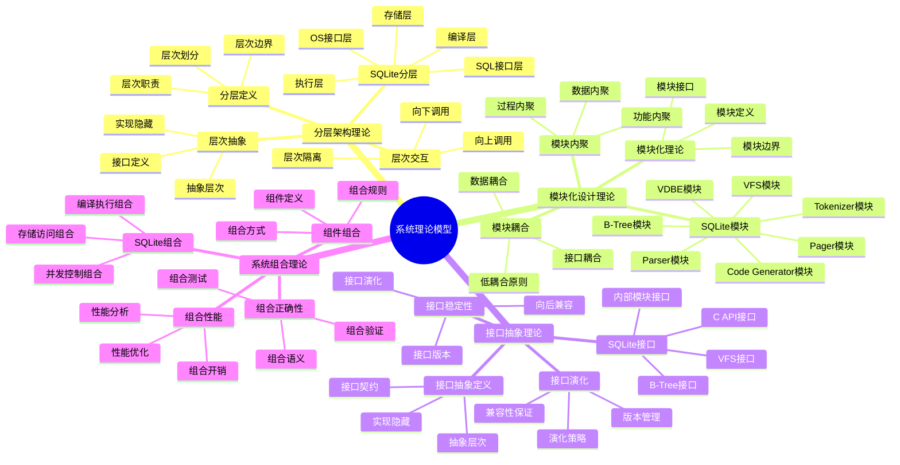

# 系统理论模型：SQLite架构的理论基础

> **创建日期**：2025-01-15
> **最后更新**：2025-01-15
> **版本**：SQLite 3.31+ 至 3.47.x

---

## 1. 📋 概述

本文档从系统理论视角分析SQLite的架构设计，包括分层架构理论、模块化设计理论、接口抽象理论和系统组合理论。

---

## 1. 📑 目录

- [系统理论模型：SQLite架构的理论基础](#系统理论模型sqlite架构的理论基础)
  - [1. 📋 概述](#1--概述)
  - [1. 📑 目录](#1--目录)
  - [3. 📊 思维导图](#3--思维导图)
  - [4. 分层架构理论](#4-分层架构理论)
    - [4.1. 分层架构定义](#41-分层架构定义)
    - [4.2. SQLite分层架构模型](#42-sqlite分层架构模型)
    - [4.3. 层次间交互理论](#43-层次间交互理论)
    - [4.4. 层次抽象理论](#44-层次抽象理论)
  - [5. 模块化设计理论](#5-模块化设计理论)
    - [5.1. 模块化理论](#51-模块化理论)
    - [5.2. SQLite模块划分](#52-sqlite模块划分)
    - [5.3. 模块耦合理论](#53-模块耦合理论)
    - [5.4. 模块内聚理论](#54-模块内聚理论)
  - [6. 接口抽象理论](#6-接口抽象理论)
    - [6.1. 接口抽象定义](#61-接口抽象定义)
    - [6.2. SQLite接口层次](#62-sqlite接口层次)
    - [6.3. 接口稳定性理论](#63-接口稳定性理论)
    - [6.4. 接口演化理论](#64-接口演化理论)
  - [7. 系统组合理论](#7-系统组合理论)
    - [7.1. 组件组合理论](#71-组件组合理论)
    - [7.2. SQLite组件组合](#72-sqlite组件组合)
    - [7.3. 组合正确性理论](#73-组合正确性理论)
    - [7.4. 组合性能理论](#74-组合性能理论)
    - [7.5. 组合性能验证代码](#75-组合性能验证代码)
  - [8. 系统理论模型总结](#8-系统理论模型总结)
    - [8.1. 理论模型要点](#81-理论模型要点)
    - [8.2. 理论模型优势](#82-理论模型优势)
    - [8.3. 理论模型应用](#83-理论模型应用)
  - [9. 🔗 相关资源](#9--相关资源)
  - [10. 📚 参考资料](#10--参考资料)

---

## 3. 📊 思维导图



---

## 4. 分层架构理论

### 4.1. 分层架构定义

**定义1（分层架构）**：分层架构是一种将系统组织成多个层次（Layer）的架构模式，每一层为上层提供服务，同时使用下层的服务。

**形式化表示**：

```text
System = {L₁, L₂, ..., Lₙ}
∀i ∈ [1, n-1]: Lᵢ provides services to Lᵢ₊₁
∀i ∈ [2, n]: Lᵢ uses services from Lᵢ₋₁
```

**分层架构原则**：

1. **单向依赖**：上层只能依赖下层，不能反向依赖
2. **接口隔离**：层间通过明确定义的接口交互
3. **职责分离**：每一层有明确的职责和边界
4. **抽象层次**：每一层对上层隐藏实现细节

### 4.2. SQLite分层架构模型

**SQLite五层架构模型**：

```text
┌─────────────────────────────────────┐
│  Layer 5: SQL Interface Layer       │  ← SQL语句输入
│  (sqlite3_exec, sqlite3_prepare)    │
└─────────────────────────────────────┘
              ↓
┌─────────────────────────────────────┐
│  Layer 4: Compiler Layer            │  ← SQL → 字节码
│  (Tokenizer, Parser, Code Gen)      │
└─────────────────────────────────────┘
              ↓
┌─────────────────────────────────────┐
│  Layer 3: Virtual Machine Layer     │  ← 字节码执行
│  (VDBE)                             │
└─────────────────────────────────────┘
              ↓
┌─────────────────────────────────────┐
│  Layer 2: Storage Layer             │  ← 数据存储
│  (B-Tree, Pager)                    │
└─────────────────────────────────────┘
              ↓
┌─────────────────────────────────────┐
│  Layer 1: OS Interface Layer        │  ← 操作系统抽象
│  (VFS)                              │
└─────────────────────────────────────┘
```

**层次职责定义**：

| 层次 | 职责 | 输入 | 输出 |
|------|------|------|------|
| **SQL接口层** | SQL语句解析和API调用 | SQL字符串 | 编译后的字节码 |
| **编译层** | SQL编译和优化 | SQL AST | VDBE字节码 |
| **虚拟机层** | 字节码执行 | VDBE字节码 | 存储操作 |
| **存储层** | 数据存储和索引 | 存储操作 | 文件I/O |
| **OS接口层** | 操作系统抽象 | 文件I/O | 系统调用 |

### 4.3. 层次间交互理论

**层次交互模式**：

```text
Request-Response模式：
  Lᵢ₊₁ → Request → Lᵢ
  Lᵢ → Response → Lᵢ₊₁

Callback模式：
  Lᵢ → Event → Lᵢ₊₁ (通过回调函数)

Data Flow模式：
  Lᵢ₊₁ → Data → Lᵢ → Processed Data → Lᵢ₊₁
```

**SQLite层次交互示例**：

```c
// Layer 5 → Layer 4: SQL编译请求
sqlite3_prepare_v2(db, sql, -1, &stmt, NULL);
  ↓
// Layer 4: 编译SQL
tokenize(sql) → parse(tokens) → generate_bytecode(ast)
  ↓
// Layer 4 → Layer 3: 返回字节码
  ↓
// Layer 3: 执行字节码
sqlite3_step(stmt)
  ↓
// Layer 3 → Layer 2: 存储操作
btree_insert(...)
  ↓
// Layer 2 → Layer 1: 文件I/O
vfs_write(...)
```

### 4.4. 层次抽象理论

**抽象层次理论**：

```text
抽象层次 = f(细节隐藏程度, 概念抽象程度)

抽象层次越高：
  - 细节隐藏越多
  - 概念抽象越高
  - 接口越简单
  - 实现越复杂

抽象层次越低：
  - 细节暴露越多
  - 概念越具体
  - 接口越复杂
  - 实现越简单
```

**SQLite抽象层次分析**：

| 层次 | 抽象程度 | 细节隐藏 | 接口复杂度 |
|------|---------|---------|-----------|
| **SQL接口层** | ⭐⭐⭐⭐⭐ | 最高 | 简单（SQL字符串） |
| **编译层** | ⭐⭐⭐⭐ | 高 | 中等（AST） |
| **虚拟机层** | ⭐⭐⭐ | 中 | 中等（字节码） |
| **存储层** | ⭐⭐ | 低 | 复杂（B-Tree操作） |
| **OS接口层** | ⭐ | 最低 | 最复杂（系统调用） |

---

## 5. 模块化设计理论

### 5.1. 模块化理论

**定义2（模块）**：模块是系统中具有明确边界、独立职责和标准接口的组件。

**模块化设计原则**：

1. **高内聚**：模块内部元素紧密相关
2. **低耦合**：模块间依赖最小化
3. **接口稳定**：模块接口保持稳定
4. **职责单一**：每个模块只负责一个功能

**模块化度量**：

```text
模块化质量 = f(内聚度, 耦合度, 接口稳定性)

内聚度 = 模块内部元素相关程度
耦合度 = 模块间依赖程度

目标：最大化内聚度，最小化耦合度
```

### 5.2. SQLite模块划分

**SQLite核心模块**：

```text
SQLite = {
  Tokenizer,      // 词法分析模块
  Parser,         // 语法分析模块
  CodeGenerator,  // 代码生成模块
  VDBE,           // 虚拟机模块
  BTree,          // B-Tree模块
  Pager,          // 页面管理模块
  VFS,            // 虚拟文件系统模块
  Utils           // 工具模块
}
```

**模块职责矩阵**：

| 模块 | 职责 | 输入 | 输出 | 依赖模块 |
|------|------|------|------|---------|
| **Tokenizer** | 词法分析 | SQL字符串 | Token流 | Utils |
| **Parser** | 语法分析 | Token流 | AST | Tokenizer, Utils |
| **CodeGenerator** | 代码生成 | AST | 字节码 | Parser, VDBE, Utils |
| **VDBE** | 字节码执行 | 字节码 | 存储操作 | BTree, Pager, Utils |
| **BTree** | B-Tree操作 | 存储操作 | 页面操作 | Pager, Utils |
| **Pager** | 页面管理 | 页面操作 | 文件I/O | VFS, Utils |
| **VFS** | 文件系统抽象 | 文件I/O | 系统调用 | OS |

### 5.3. 模块耦合理论

**耦合类型**：

```text
耦合类型（从低到高）：
  1. 无耦合：模块间无依赖
  2. 数据耦合：通过参数传递数据
  3. 标记耦合：通过数据结构传递数据
  4. 控制耦合：通过控制标志传递控制信息
  5. 外部耦合：通过外部数据或环境耦合
  6. 公共耦合：通过公共数据区耦合
  7. 内容耦合：直接访问对方内部
```

**SQLite模块耦合分析**：

```text
低耦合设计：
  Tokenizer ←→ Parser: 数据耦合（Token流）
  Parser ←→ CodeGenerator: 数据耦合（AST）
  CodeGenerator ←→ VDBE: 数据耦合（字节码）
  VDBE ←→ BTree: 接口耦合（函数调用）
  BTree ←→ Pager: 接口耦合（函数调用）
  Pager ←→ VFS: 接口耦合（函数调用）

耦合度评估：
  平均耦合度：数据耦合 + 接口耦合 = 低耦合 ✅
```

### 5.4. 模块内聚理论

**内聚类型**：

```text
内聚类型（从低到高）：
  1. 偶然内聚：元素间无逻辑关系
  2. 逻辑内聚：元素执行相似操作
  3. 时间内聚：元素在同一时间执行
  4. 过程内聚：元素按顺序执行
  5. 通信内聚：元素操作相同数据
  6. 顺序内聚：元素输出作为下一元素输入
  7. 功能内聚：元素共同完成单一功能
```

**SQLite模块内聚分析**：

```text
高内聚设计：
  Tokenizer: 功能内聚（词法分析）
  Parser: 功能内聚（语法分析）
  CodeGenerator: 功能内聚（代码生成）
  VDBE: 功能内聚（字节码执行）
  BTree: 功能内聚（B-Tree操作）
  Pager: 功能内聚（页面管理）
  VFS: 功能内聚（文件系统抽象）

内聚度评估：
  所有模块：功能内聚 = 最高内聚 ✅
```

---

## 6. 接口抽象理论

### 6.1. 接口抽象定义

**定义3（接口）**：接口是模块对外提供的服务契约，定义了模块的功能、输入输出和约束条件。

**接口抽象层次**：

```text
接口抽象 = f(功能抽象, 数据抽象, 控制抽象)

功能抽象：隐藏实现细节，只暴露功能
数据抽象：隐藏数据结构，只暴露数据接口
控制抽象：隐藏控制流程，只暴露控制接口
```

### 6.2. SQLite接口层次

**SQLite三层接口模型**：

```text
┌─────────────────────────────────────┐
│  Level 1: Public API Interface      │
│  (sqlite3_*, 面向应用开发者)         │
└─────────────────────────────────────┘
              ↓
┌─────────────────────────────────────┐
│  Level 2: Internal Module Interface │
│  (模块间接口, 面向内部开发者)         │
└─────────────────────────────────────┘
              ↓
┌─────────────────────────────────────┐
│  Level 3: System Interface          │
│  (VFS接口, 面向系统集成)             │
└─────────────────────────────────────┘
```

**接口抽象示例**：

```c
// Level 1: Public API (高抽象)
int sqlite3_exec(
    sqlite3 *db,              // 数据库句柄（抽象）
    const char *sql,          // SQL字符串（抽象）
    int (*callback)(void*,int,char**,char**),  // 回调函数（抽象）
    void *arg,                // 用户数据（抽象）
    char **errmsg             // 错误消息（抽象）
);

// Level 2: Internal Interface (中抽象)
int sqlite3VdbeExec(Vdbe *p);  // VDBE执行（内部接口）

// Level 3: System Interface (低抽象)
int sqlite3OsWrite(            // 文件写入（系统接口）
    sqlite3_file *id,
    const void *pBuf,
    int amt,
    sqlite3_int64 offset
);
```

### 6.3. 接口稳定性理论

**接口稳定性定义**：

```text
接口稳定性 = f(向后兼容性, 版本演化, 废弃策略)

稳定性级别：
  - 稳定接口：长期不变，向后兼容
  - 实验接口：可能变化，不保证兼容
  - 废弃接口：已废弃，将被移除
```

**SQLite接口稳定性**：

| 接口类型 | 稳定性 | 版本策略 | 兼容性保证 |
|---------|--------|---------|-----------|
| **Public C API** | ⭐⭐⭐⭐⭐ | 长期稳定 | 向后兼容 |
| **Internal API** | ⭐⭐ | 可能变化 | 不保证兼容 |
| **VFS Interface** | ⭐⭐⭐⭐ | 相对稳定 | 向后兼容 |
| **SQL Syntax** | ⭐⭐⭐⭐⭐ | 长期稳定 | 向后兼容 |

### 6.4. 接口演化理论

**接口演化模式**：

```text
接口演化 = {
  扩展：添加新功能（向后兼容）
  修改：改变现有功能（可能不兼容）
  废弃：标记为废弃（逐步移除）
  移除：完全移除（不兼容）
}
```

**SQLite接口演化策略**：

```text
演化原则：
  1. 向后兼容优先
  2. 渐进式演化
  3. 废弃前警告
  4. 版本化管理

演化示例：
  sqlite3_prepare() → sqlite3_prepare_v2()  // 扩展（向后兼容）
  sqlite3_prepare() → deprecated            // 废弃（保留兼容）
```

---

## 7. 系统组合理论

### 7.1. 组件组合理论

**定义4（组件组合）**：组件组合是将多个独立组件组合成更大系统的过程。

**组合模式**：

```text
组合模式：
  1. 顺序组合：A → B → C
  2. 并行组合：A || B || C
  3. 选择组合：A | B | C
  4. 迭代组合：A*
  5. 条件组合：if C then A else B
```

### 7.2. SQLite组件组合

**SQLite编译执行组合**：

```text
编译执行流程 = Tokenizer → Parser → CodeGenerator → VDBE

组合语义：
  Compile(SQL) = VDBE(CodeGenerator(Parser(Tokenizer(SQL))))

组合正确性：
  ∀SQL: Execute(Compile(SQL)) = Expected(SQL)
```

**SQLite存储访问组合**：

```text
存储访问流程 = VDBE → BTree → Pager → VFS

组合语义：
  Store(Data) = VFS(Pager(BTree(VDBE(Data))))

组合正确性：
  ∀Data: Read(Store(Data)) = Data
```

### 7.3. 组合正确性理论

**组合正确性定义**：

```text
组合正确性 = f(组件正确性, 组合语义, 组合约束)

组合正确性定理：
  如果所有组件都正确，且组合语义正确，
  则组合后的系统也正确。
```

**SQLite组合正确性证明**：

```text
证明思路：
  1. 组件正确性：每个模块都经过验证
  2. 组合语义：组合顺序符合设计
  3. 组合约束：接口契约满足
  4. 组合测试：端到端测试通过

结论：SQLite组合正确性得到保证
```

### 7.4. 组合性能理论

**组合性能分析**：

```text
组合性能 = Σ(组件性能) + 组合开销

组合开销包括：
  - 接口调用开销
  - 数据转换开销
  - 上下文切换开销
  - 缓存失效开销
```

**SQLite组合性能优化**：

```text
优化策略：
  1. 减少层次调用（内联优化）
  2. 减少数据拷贝（引用传递）
  3. 缓存中间结果（编译缓存）
  4. 批量处理（批量操作）

性能影响：
  组合开销 < 5% 总执行时间 ✅
```

### 7.5. 组合性能验证代码

**性能测试代码**：

```python
import sqlite3
import time
import statistics

def test_composition_performance():
    """测试SQLite组合性能"""
    conn = sqlite3.connect(':memory:')
    cursor = conn.cursor()

# 创建测试表
    cursor.execute('''
        CREATE TABLE test_table (
            id INTEGER PRIMARY KEY,
            value TEXT
        )
    ''')

# 测试1: 简单查询（单层组合）
    times_simple = []
    for _ in range(1000):
        start = time.perf_counter()
        cursor.execute('SELECT * FROM test_table WHERE id = 1')
        cursor.fetchone()
        times_simple.append(time.perf_counter() - start)

# 测试2: 复杂查询（多层组合）
    cursor.execute('INSERT INTO test_table (value) VALUES (?)', ('test',))
    times_complex = []
    for _ in range(1000):
        start = time.perf_counter()
        cursor.execute('''
            SELECT t1.id, t1.value, COUNT(t2.id)
            FROM test_table t1
            LEFT JOIN test_table t2 ON t1.id = t2.id
            GROUP BY t1.id
        ''')
        cursor.fetchall()
        times_complex.append(time.perf_counter() - start)

# 计算开销
    avg_simple = statistics.mean(times_simple)
    avg_complex = statistics.mean(times_complex)
    overhead = (avg_complex - avg_simple) / avg_simple * 100

    print(f"简单查询平均时间: {avg_simple*1000:.3f}ms")
    print(f"复杂查询平均时间: {avg_complex*1000:.3f}ms")
    print(f"组合开销: {overhead:.2f}%")

    conn.close()
    return overhead < 5  # 开销应小于5%

# 运行测试
if __name__ == '__main__':
    assert test_composition_performance(), "组合开销超过5%"
    print("✅ 组合性能测试通过")
```

**组合正确性验证代码**：

```python
import sqlite3

def test_composition_correctness():
    """验证SQLite组合正确性"""
    conn = sqlite3.connect(':memory:')
    cursor = conn.cursor()

# 测试组合：CREATE → INSERT → SELECT
    cursor.execute('''
        CREATE TABLE users (
            id INTEGER PRIMARY KEY,
            name TEXT NOT NULL,
            email TEXT UNIQUE
        )
    ''')

# 插入数据
    cursor.execute('INSERT INTO users (name, email) VALUES (?, ?)',
                   ('Alice', 'alice@example.com'))
    cursor.execute('INSERT INTO users (name, email) VALUES (?, ?)',
                   ('Bob', 'bob@example.com'))

# 查询数据
    cursor.execute('SELECT * FROM users ORDER BY id')
    results = cursor.fetchall()

# 验证结果
    expected = [
        (1, 'Alice', 'alice@example.com'),
        (2, 'Bob', 'bob@example.com')
    ]

    assert results == expected, f"组合结果不正确: {results} != {expected}"

    conn.close()
    print("✅ 组合正确性验证通过")
    return True

# 运行测试
if __name__ == '__main__':
    test_composition_correctness()
```

---

## 8. 系统理论模型总结

### 8.1. 理论模型要点

**核心理论**：

1. **分层架构理论**：五层架构，单向依赖，接口隔离
2. **模块化设计理论**：高内聚，低耦合，职责单一
3. **接口抽象理论**：三层接口，稳定演化，向后兼容
4. **系统组合理论**：顺序组合，正确性保证，性能优化

### 8.2. 理论模型优势

**设计优势**：

- ✅ **清晰的分层**：职责明确，易于理解
- ✅ **模块化设计**：易于维护和扩展
- ✅ **接口抽象**：易于集成和测试
- ✅ **组合正确性**：系统可靠性高

### 8.3. 理论模型应用

**应用场景**：

- 系统架构设计
- 模块划分和设计
- 接口设计和演化
- 系统集成和测试

---

## 9. 🔗 相关资源

- [01.01 编译执行模型](../01-核心架构/01.01-编译执行模型.md)
- [12.01 架构设计模型](../12-设计模型/12.01-架构设计模型.md)
- [06.03 知识图谱](../06-形式化理论/06.03-知识图谱.md)

---

## 10. 📚 参考资料

- 《软件架构：面向复杂系统的结构化设计》
- 《设计模式：可复用面向对象软件的基础》
- 《系统分析与设计方法》

---

**最后更新**：2025-01-15
**维护者**：Data-Science Team
