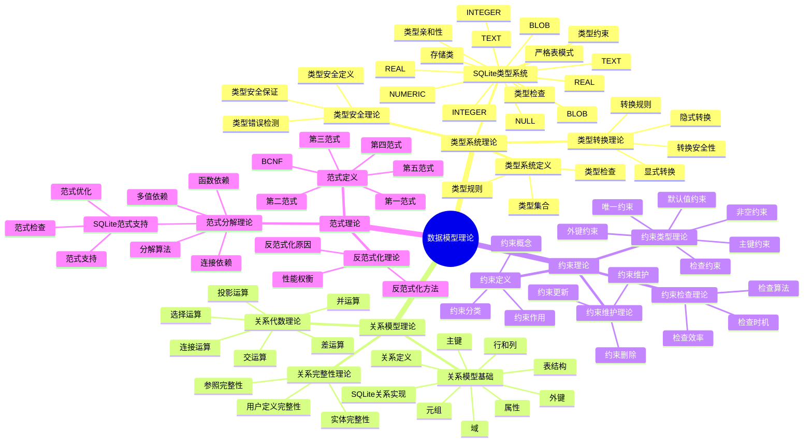

# 数据模型理论：SQLite类型系统与关系模型

> **创建日期**：2025-01-15
> **最后更新**：2025-01-15
> **版本**：SQLite 3.31+ 至 3.47.x

---

## 1. 📋 概述

本文档从数据模型理论视角深入分析SQLite的类型系统、关系模型、约束理论和范式理论，提供形式化的理论分析和数学证明。

---

## 2. 📑 目录

- [数据模型理论：SQLite类型系统与关系模型](#数据模型理论sqlite类型系统与关系模型)
  - [1. 📋 概述](#1--概述)
  - [2. 📑 目录](#2--目录)
  - [3. 📊 思维导图](#3--思维导图)
  - [4. 类型系统理论](#4-类型系统理论)
    - [4.1. 类型系统定义](#41-类型系统定义)
    - [4.2. SQLite类型系统模型](#42-sqlite类型系统模型)
    - [4.3. 类型转换理论](#43-类型转换理论)
    - [4.4. 类型安全理论](#44-类型安全理论)
  - [5. 关系模型理论](#5-关系模型理论)
    - [5.1. 关系模型基础](#51-关系模型基础)
    - [5.2. SQLite关系模型实现](#52-sqlite关系模型实现)
    - [5.3. 关系代数理论](#53-关系代数理论)
    - [5.4. 关系完整性理论](#54-关系完整性理论)
  - [6. 约束理论](#6-约束理论)
    - [6.1. 约束定义](#61-约束定义)
    - [6.2. 约束类型理论](#62-约束类型理论)
    - [6.3. 约束检查理论](#63-约束检查理论)
    - [6.4. 约束维护理论](#64-约束维护理论)
  - [7. 范式理论](#7-范式理论)
    - [7.1. 范式定义](#71-范式定义)
    - [7.2. 范式分解理论](#72-范式分解理论)
    - [7.3. SQLite范式支持](#73-sqlite范式支持)
    - [7.4. 反范式化理论](#74-反范式化理论)
  - [8. 数据模型理论总结](#8-数据模型理论总结)
    - [8.1. 理论模型要点](#81-理论模型要点)
    - [8.2. 理论模型应用](#82-理论模型应用)
    - [8.3. SQLite特性分析](#83-sqlite特性分析)
    - [8.4. 数据模型理论验证代码](#84-数据模型理论验证代码)
  - [9. 🔗 相关资源](#9--相关资源)
  - [10. 📚 参考资料](#10--参考资料)

---

## 3. 📊 思维导图



---

## 4. 类型系统理论

### 4.1. 类型系统定义

**定义1（类型系统）**：类型系统是一组规则，用于定义值的类型、类型之间的关系以及类型上的操作。

**形式化表示**：

```text
TypeSystem = (T, O, R)

其中：
  T = {t₁, t₂, ..., tₙ}  // 类型集合
  O = {o₁, o₂, ..., oₘ}  // 操作集合
  R = {r₁, r₂, ..., rₖ}  // 类型规则集合
```

**类型系统属性**：

1. **类型安全**：防止类型错误
2. **类型推断**：自动推导类型
3. **类型转换**：类型间的转换规则
4. **类型检查**：编译时或运行时检查

### 4.2. SQLite类型系统模型

**SQLite存储类模型**：

```text
StorageClasses = {INTEGER, REAL, TEXT, BLOB, NULL}

类型定义：
  INTEGER: ℤ (整数集合)
  REAL: ℝ (实数集合)
  TEXT: String (字符串集合)
  BLOB: Byte[] (字节数组集合)
  NULL: {null} (空值)
```

**类型亲和性模型**：

```text
TypeAffinity = {NUMERIC, INTEGER, TEXT, REAL, BLOB}

亲和性映射：
  NUMERIC → INTEGER | REAL
  INTEGER → INTEGER
  TEXT → TEXT
  REAL → REAL
  BLOB → BLOB
```

**严格表模式模型**：

```text
StrictMode = {
  TypeCheck: ∀v ∈ Value, t ∈ Type: v.type = t
  ConstraintCheck: ∀c ∈ Constraint: c.check(v)
}

严格模式保证：
  ∀v, t: Insert(v, t) → (v.type = t) ∧ Valid(v, t)
```

### 4.3. 类型转换理论

**类型转换定义**：

```text
类型转换函数：
  Convert: Value × Type → Value

转换规则：
  Convert(v, t) = {
    if v.type = t: v
    else if Compatible(v.type, t): Coerce(v, t)
    else: Error
  }
```

**SQLite类型转换规则**：

```text
转换矩阵：

        → INTEGER  REAL    TEXT    BLOB
INTEGER    -       ✓       ✓       ✗
REAL       ✓       -       ✓       ✗
TEXT       ✓       ✓       -       ✗
BLOB       ✗       ✗       ✗       -
NULL       NULL    NULL    NULL    NULL

转换规则：
  INTEGER → REAL: 直接转换
  REAL → INTEGER: 截断转换
  INTEGER/REAL → TEXT: 字符串转换
  TEXT → INTEGER/REAL: 数值解析
  BLOB: 不转换
```

**类型转换安全性**：

```text
安全转换：
  SafeConvert(v, t) = {
    if Lossless(v, t): Convert(v, t)
    else: Warning + Convert(v, t)
  }

无损转换：
  Lossless(v, t) = {
    INTEGER → REAL: ✓ (无损)
    REAL → INTEGER: ✗ (有损，截断)
    TEXT → INTEGER: ✗ (可能失败)
  }
```

### 4.4. 类型安全理论

**类型安全定义**：

```text
类型安全 = ∀Operation, ∀Value:
  TypeCheck(Operation, Value) →
    (ValidType(Value) ∧ ValidOperation(Operation, Value.type))

类型安全保证：
  1. 类型检查：编译时或运行时检查
  2. 类型错误：检测并报告类型错误
  3. 类型约束：强制执行类型约束
```

**SQLite类型安全模型**：

```text
类型安全级别：

  动态类型模式（默认）：
    TypeSafety = RuntimeCheck
    - 运行时类型检查
    - 允许类型转换
    - 类型错误在运行时发现

  严格表模式：
    TypeSafety = CompileTimeCheck + RuntimeCheck
    - 编译时类型检查（DDL）
    - 运行时类型检查（DML）
    - 禁止不兼容类型转换
    - 类型错误在编译时或运行时发现
```

---

## 5. 关系模型理论

### 5.1. 关系模型基础

**定义2（关系）**：关系是元组的集合，每个元组由属性值组成。

**形式化表示**：

```text
关系定义：
  R(A₁, A₂, ..., Aₙ)

其中：
  R: 关系名
  Aᵢ: 属性（i = 1, 2, ..., n）
  Domain(Aᵢ): 属性Aᵢ的值域

关系实例：
  r = {t₁, t₂, ..., tₘ}

其中：
  tᵢ = (a₁ᵢ, a₂ᵢ, ..., aₙᵢ)  // 元组
  aⱼᵢ ∈ Domain(Aⱼ)          // 属性值
```

**关系模型基本概念**：

1. **关系（Relation）**：二维表
2. **元组（Tuple）**：表中的行
3. **属性（Attribute）**：表中的列
4. **域（Domain）**：属性的取值范围
5. **主键（Primary Key）**：唯一标识元组的属性集合

### 5.2. SQLite关系模型实现

**SQLite表结构模型**：

```text
Table = (Name, Schema, Data, Constraints)

其中：
  Name: 表名
  Schema = {Column₁, Column₂, ..., Columnₙ}
  Column = (Name, Type, Constraints)
  Data = {Row₁, Row₂, ..., Rowₘ}
  Row = (Value₁, Value₂, ..., Valueₙ)
  Constraints = {PK, FK, UNIQUE, CHECK, NOT NULL, ...}
```

**关系完整性实现**：

```text
实体完整性：
  ∀Row ∈ Table: PK(Row) ≠ NULL ∧ Unique(PK(Row))

参照完整性：
  ∀Row ∈ ChildTable:
    FK(Row) ∈ PK(ParentTable) ∨ FK(Row) = NULL

用户定义完整性：
  ∀Row ∈ Table: CheckConstraints(Row) = True
```

### 5.3. 关系代数理论

**关系代数运算**：

```text
基本运算：
  1. 选择（Selection）: σₚ(R)
  2. 投影（Projection）: πₐ(R)
  3. 连接（Join）: R ⋈ S
  4. 并（Union）: R ∪ S
  5. 差（Difference）: R - S
  6. 交（Intersection）: R ∩ S
```

**SQLite关系代数实现**：

```sql
-- 选择运算
SELECT * FROM R WHERE P
-- 对应：σₚ(R)

-- 投影运算
SELECT A, B FROM R
-- 对应：πₐ,ₑ(R)

-- 连接运算
SELECT * FROM R JOIN S ON R.A = S.B
-- 对应：R ⋈ᵣ.ₐ=ₛ.ᵦ S

-- 并运算
SELECT * FROM R UNION SELECT * FROM S
-- 对应：R ∪ S

-- 差运算
SELECT * FROM R EXCEPT SELECT * FROM S
-- 对应：R - S
```

**关系代数性质**：

```text
交换律：
  R ∪ S = S ∪ R
  R ∩ S = S ∩ R

结合律：
  (R ∪ S) ∪ T = R ∪ (S ∪ T)
  (R ⋈ S) ⋈ T = R ⋈ (S ⋈ T)

分配律：
  σₚ(R ∪ S) = σₚ(R) ∪ σₚ(S)
  πₐ(R ⋈ S) = πₐ(R) ⋈ πₐ(S)
```

### 5.4. 关系完整性理论

**完整性约束定义**：

```text
完整性约束 = {
  实体完整性: ∀t ∈ R: PK(t) ≠ NULL ∧ Unique(PK(t))
  参照完整性: ∀t ∈ R: FK(t) ∈ PK(S) ∨ FK(t) = NULL
  用户定义完整性: ∀t ∈ R: UserConstraint(t) = True
}
```

**完整性维护理论**：

```text
插入操作完整性：
  Insert(t, R) → {
    EntityIntegrity(t) ∧
    ReferentialIntegrity(t) ∧
    UserIntegrity(t)
  }

删除操作完整性：
  Delete(t, R) → {
    CheckReferentialIntegrity(t)  // 检查外键引用
  }

更新操作完整性：
  Update(t, R, t') → {
    EntityIntegrity(t') ∧
    ReferentialIntegrity(t') ∧
    UserIntegrity(t')
  }
```

---

## 6. 约束理论

### 6.1. 约束定义

**定义3（约束）**：约束是对数据值的限制条件，用于保证数据的完整性和一致性。

**形式化表示**：

```text
约束定义：
  Constraint = (Type, Scope, Condition, Action)

其中：
  Type: 约束类型（PK, FK, UNIQUE, CHECK, NOT NULL, DEFAULT）
  Scope: 约束作用域（Column, Table, Database）
  Condition: 约束条件（逻辑表达式）
  Action: 违反约束时的动作（REJECT, CASCADE, SET NULL, SET DEFAULT）
```

### 6.2. 约束类型理论

**约束类型分类**：

```text
约束类型 = {
  主键约束（PK）:
    ∀t₁, t₂ ∈ R: t₁ ≠ t₂ → PK(t₁) ≠ PK(t₂)
    ∀t ∈ R: PK(t) ≠ NULL

  唯一约束（UNIQUE）:
    ∀t₁, t₂ ∈ R: t₁ ≠ t₂ → UNIQUE(t₁) ≠ UNIQUE(t₂)
    UNIQUE(t) 可以为 NULL（但NULL值唯一）

  非空约束（NOT NULL）:
    ∀t ∈ R: NOT_NULL(t) ≠ NULL

  检查约束（CHECK）:
    ∀t ∈ R: CHECK_CONDITION(t) = True

  外键约束（FK）:
    ∀t ∈ Child: FK(t) ∈ PK(Parent) ∨ FK(t) = NULL

  默认值约束（DEFAULT）:
    Insert(t, R) ∧ t.A = NULL → t.A = DEFAULT(A)
}
```

### 6.3. 约束检查理论

**约束检查时机**：

```text
检查时机 = {
  编译时检查: DDL约束定义检查
  运行时检查: DML操作约束检查
  延迟检查: 事务提交时检查（DEFERRABLE约束）
}

检查顺序：
  1. NOT NULL约束
  2. DEFAULT约束
  3. CHECK约束
  4. UNIQUE约束
  5. 主键约束
  6. 外键约束
```

**约束检查算法**：

```text
约束检查算法：

  CheckConstraints(t, R):
    for each constraint c in R.constraints:
      if not c.check(t):
        return Error(c)
    return Success

  主键检查：
    CheckPK(t, R):
      if t.PK = NULL: return Error("PK cannot be NULL")
      if ∃t' ∈ R: t' ≠ t ∧ t'.PK = t.PK:
        return Error("PK violation")
      return Success

  外键检查：
    CheckFK(t, Child, Parent):
      if t.FK = NULL: return Success  // 允许NULL
      if t.FK ∉ {t'.PK | t' ∈ Parent}:
        return Error("FK violation")
      return Success
```

### 6.4. 约束维护理论

**约束维护策略**：

```text
约束维护 = {
  立即维护: 操作时立即检查
  延迟维护: 事务提交时检查
  级联维护: 违反时自动处理（CASCADE, SET NULL, SET DEFAULT）
}

外键级联操作：
  ON DELETE CASCADE: 删除父记录时删除子记录
  ON DELETE SET NULL: 删除父记录时子记录FK设为NULL
  ON DELETE SET DEFAULT: 删除父记录时子记录FK设为默认值
  ON DELETE RESTRICT: 禁止删除有子记录的父记录
```

---

## 7. 范式理论

### 7.1. 范式定义

**定义4（范式）**：范式是关系数据库设计的规范化程度，用于消除数据冗余和更新异常。

**范式层次**：

```text
范式层次：
  1NF ⊆ 2NF ⊆ 3NF ⊆ BCNF ⊆ 4NF ⊆ 5NF

第一范式（1NF）:
  ∀A ∈ R: Domain(A) 是原子值（不可再分）

第二范式（2NF）:
  R ∈ 1NF ∧
  ∀非主属性A: A完全依赖于主键（不存在部分依赖）

第三范式（3NF）:
  R ∈ 2NF ∧
  ∀非主属性A: A不传递依赖于主键

BCNF（Boyce-Codd范式）:
  R ∈ 3NF ∧
  ∀函数依赖X → Y: X是超键

第四范式（4NF）:
  R ∈ BCNF ∧
  ∀多值依赖X →→ Y: X是超键

第五范式（5NF）:
  R ∈ 4NF ∧
  ∀连接依赖: 被包含的投影都是超键
```

### 7.2. 范式分解理论

**函数依赖理论**：

```text
函数依赖定义：
  X → Y: 对于R中的任意两个元组t₁, t₂,
    如果t₁[X] = t₂[X], 则t₁[Y] = t₂[Y]

函数依赖性质：
  自反性: Y ⊆ X → X → Y
  增广性: X → Y → XZ → YZ
  传递性: X → Y, Y → Z → X → Z
```

**范式分解算法**：

```text
3NF分解算法：
  1. 计算函数依赖集的闭包F⁺
  2. 找到最小覆盖
  3. 对每个函数依赖X → Y，创建关系R(X, Y)
  4. 如果某个关系不包含候选键，添加候选键关系
  5. 合并相同左部的函数依赖

BCNF分解算法：
  1. 如果R不满足BCNF，找到违反BCNF的函数依赖X → Y
  2. 分解R为R₁(X, Y)和R₂(X, R - Y)
  3. 递归分解R₁和R₂直到满足BCNF
```

### 7.3. SQLite范式支持

**SQLite范式支持**：

```text
范式支持：
  1NF: ✅ 完全支持（列值原子性）
  2NF: ✅ 支持（主键约束）
  3NF: ✅ 支持（外键约束，CHECK约束）
  BCNF: ⚠️ 部分支持（需要手动设计）
  4NF: ⚠️ 部分支持（多值依赖需要应用层处理）
  5NF: ❌ 不支持（连接依赖需要应用层处理）
```

**范式检查**：

```sql
-- SQLite不提供自动范式检查
-- 需要手动设计和验证

-- 示例：3NF设计
CREATE TABLE users (
    id INTEGER PRIMARY KEY,      -- 主键
    name TEXT NOT NULL,
    email TEXT UNIQUE NOT NULL
);

CREATE TABLE orders (
    id INTEGER PRIMARY KEY,
    user_id INTEGER NOT NULL,
    FOREIGN KEY (user_id) REFERENCES users(id)  -- 外键保证参照完整性
);
```

### 7.4. 反范式化理论

**反范式化定义**：

```text
反范式化 = 故意违反范式规则以提升性能

反范式化原因：
  1. 性能优化：减少JOIN操作
  2. 查询简化：减少查询复杂度
  3. 存储优化：减少存储空间（某些情况）
```

**反范式化权衡**：

```text
权衡分析：

  范式化优势：
    ✅ 数据一致性
    ✅ 减少冗余
    ✅ 更新简单
    ❌ 查询复杂（需要JOIN）
    ❌ 性能可能较差

  反范式化优势：
    ✅ 查询简单（无需JOIN）
    ✅ 性能可能更好
    ❌ 数据冗余
    ❌ 更新复杂（需要维护冗余）
    ❌ 一致性风险
```

**反范式化决策模型**：

```text
反范式化决策 = f(查询频率, 更新频率, 数据量, 一致性要求)

决策规则：
  if 查询频率 >> 更新频率:
    考虑反范式化
  else if 一致性要求高:
    保持范式化
  else:
    根据具体情况权衡
```

---

## 8. 数据模型理论总结

### 8.1. 理论模型要点

**核心理论**：

1. **类型系统理论**：存储类、类型亲和性、类型转换、类型安全
2. **关系模型理论**：关系定义、关系代数、关系完整性
3. **约束理论**：约束类型、约束检查、约束维护
4. **范式理论**：范式定义、范式分解、反范式化

### 8.2. 理论模型应用

**应用场景**：

- 数据库设计
- 类型系统设计
- 约束设计
- 范式化设计
- 性能优化

### 8.3. SQLite特性分析

**SQLite特性**：

- ✅ 灵活的类型系统（动态类型 + 严格模式）
- ✅ 完整的关系模型支持
- ✅ 丰富的约束支持
- ✅ 范式支持（1NF-3NF，部分BCNF）
- ⚠️ 需要手动范式化设计

### 8.4. 数据模型理论验证代码

**类型系统验证**：

```python
import sqlite3

def test_type_system():
    """验证SQLite类型系统"""
    conn = sqlite3.connect(':memory:')
    cursor = conn.cursor()

# 测试动态类型
    cursor.execute('CREATE TABLE test (id INTEGER, value TEXT)')
    cursor.execute('INSERT INTO test VALUES (?, ?)', (1, 'text'))
    cursor.execute('INSERT INTO test VALUES (?, ?)', ('2', 123))  # 类型转换

    cursor.execute('SELECT typeof(id), typeof(value) FROM test')
    results = cursor.fetchall()

# 验证类型转换
    assert results[0] == ('integer', 'text')
    assert results[1] == ('integer', 'text')  # '2'转换为integer

# 测试严格表模式
    cursor.execute('CREATE TABLE strict_test (id INTEGER, value TEXT) STRICT')
    try:
        cursor.execute('INSERT INTO strict_test VALUES (?, ?)', ('abc', 123))
        assert False, "严格模式应该拒绝类型不匹配"
    except sqlite3.OperationalError:
        pass  # 预期错误

    conn.close()
    print("✅ 类型系统验证通过")

# 运行测试
if __name__ == '__main__':
    test_type_system()
```

**关系模型验证**：

```python
import sqlite3

def test_relational_model():
    """验证关系模型实现"""
    conn = sqlite3.connect(':memory:')
    cursor = conn.cursor()

# 创建关系（表）
    cursor.execute('''
        CREATE TABLE users (
            id INTEGER PRIMARY KEY,
            name TEXT NOT NULL,
            email TEXT UNIQUE
        )
    ''')

    cursor.execute('''
        CREATE TABLE orders (
            id INTEGER PRIMARY KEY,
            user_id INTEGER NOT NULL,
            amount REAL,
            FOREIGN KEY (user_id) REFERENCES users(id)
        )
    ''')

# 插入元组
    cursor.execute('INSERT INTO users (name, email) VALUES (?, ?)',
                   ('Alice', 'alice@example.com'))
    cursor.execute('INSERT INTO orders (user_id, amount) VALUES (?, ?)',
                   (1, 100.50))

# 关系代数：选择
    cursor.execute('SELECT * FROM users WHERE id = 1')
    selection = cursor.fetchone()
    assert selection == (1, 'Alice', 'alice@example.com')

# 关系代数：投影
    cursor.execute('SELECT name, email FROM users')
    projection = cursor.fetchall()
    assert projection == [('Alice', 'alice@example.com')]

# 关系代数：连接
    cursor.execute('''
        SELECT u.name, o.amount
        FROM users u
        JOIN orders o ON u.id = o.user_id
    ''')
    join_result = cursor.fetchall()
    assert join_result == [('Alice', 100.5)]

    conn.close()
    print("✅ 关系模型验证通过")

# 运行测试
if __name__ == '__main__':
    test_relational_model()
```

**约束理论验证**：

```python
import sqlite3

def test_constraints():
    """验证约束理论"""
    conn = sqlite3.connect(':memory:')
    cursor = conn.cursor()

# 创建带约束的表
    cursor.execute('''
        CREATE TABLE products (
            id INTEGER PRIMARY KEY,
            name TEXT NOT NULL,
            price REAL CHECK (price > 0),
            sku TEXT UNIQUE
        )
    ''')

# 测试主键约束
    cursor.execute('INSERT INTO products (name, price, sku) VALUES (?, ?, ?)',
                   ('Product1', 10.0, 'SKU001'))
    try:
        cursor.execute('INSERT INTO products (id, name, price, sku) VALUES (?, ?, ?, ?)',
                       (1, 'Product2', 20.0, 'SKU002'))  # 主键冲突
        assert False, "主键约束应该被违反"
    except sqlite3.IntegrityError:
        pass  # 预期错误

# 测试NOT NULL约束
    try:
        cursor.execute('INSERT INTO products (price, sku) VALUES (?, ?)',
                       (30.0, 'SKU003'))  # name为NULL
        assert False, "NOT NULL约束应该被违反"
    except sqlite3.IntegrityError:
        pass  # 预期错误

# 测试CHECK约束
    try:
        cursor.execute('INSERT INTO products (name, price, sku) VALUES (?, ?, ?)',
                       ('Product3', -10.0, 'SKU004'))  # price < 0
        assert False, "CHECK约束应该被违反"
    except sqlite3.IntegrityError:
        pass  # 预期错误

# 测试UNIQUE约束
    cursor.execute('INSERT INTO products (name, price, sku) VALUES (?, ?, ?)',
                   ('Product4', 40.0, 'SKU005'))
    try:
        cursor.execute('INSERT INTO products (name, price, sku) VALUES (?, ?, ?)',
                       ('Product5', 50.0, 'SKU001'))  # sku重复
        assert False, "UNIQUE约束应该被违反"
    except sqlite3.IntegrityError:
        pass  # 预期错误

    conn.close()
    print("✅ 约束理论验证通过")

# 运行测试
if __name__ == '__main__':
    test_constraints()
```

**范式理论验证**：

```python
import sqlite3

def test_normalization():
    """验证范式理论"""
    conn = sqlite3.connect(':memory:')
    cursor = conn.cursor()

# 非范式化设计（违反2NF）
    cursor.execute('''
        CREATE TABLE orders_denormalized (
            order_id INTEGER,
            customer_id INTEGER,
            customer_name TEXT,
            product_id INTEGER,
            product_name TEXT,
            quantity INTEGER,
            price REAL
        )
    ''')

# 范式化设计（3NF）
    cursor.execute('''
        CREATE TABLE customers (
            customer_id INTEGER PRIMARY KEY,
            customer_name TEXT NOT NULL
        )
    ''')

    cursor.execute('''
        CREATE TABLE products (
            product_id INTEGER PRIMARY KEY,
            product_name TEXT NOT NULL,
            price REAL NOT NULL
        )
    ''')

    cursor.execute('''
        CREATE TABLE orders (
            order_id INTEGER PRIMARY KEY,
            customer_id INTEGER NOT NULL,
            FOREIGN KEY (customer_id) REFERENCES customers(customer_id)
        )
    ''')

    cursor.execute('''
        CREATE TABLE order_items (
            order_id INTEGER NOT NULL,
            product_id INTEGER NOT NULL,
            quantity INTEGER NOT NULL,
            PRIMARY KEY (order_id, product_id),
            FOREIGN KEY (order_id) REFERENCES orders(order_id),
            FOREIGN KEY (product_id) REFERENCES products(product_id)
        )
    ''')

# 插入数据
    cursor.execute('INSERT INTO customers VALUES (1, "Alice")')
    cursor.execute('INSERT INTO products VALUES (1, "Product1", 10.0)')
    cursor.execute('INSERT INTO orders VALUES (1, 1)')
    cursor.execute('INSERT INTO order_items VALUES (1, 1, 5)')

# 验证范式化设计
    cursor.execute('''
        SELECT c.customer_name, p.product_name, oi.quantity, p.price
        FROM orders o
        JOIN customers c ON o.customer_id = c.customer_id
        JOIN order_items oi ON o.order_id = oi.order_id
        JOIN products p ON oi.product_id = p.product_id
    ''')
    results = cursor.fetchall()
    assert results == [('Alice', 'Product1', 5, 10.0)]

    conn.close()
    print("✅ 范式理论验证通过")

# 运行测试
if __name__ == '__main__':
    test_normalization()
```

---

## 9. 🔗 相关资源

- [02.01 数据类型系统](../02-数据模型/02.01-数据类型系统.md)
- [02.02 表结构设计](../02-数据模型/02.02-表结构设计.md)
- [12.02 设计原则](../12-设计模型/12.02-设计原则.md)

---

## 10. 📚 参考资料

- 《数据库系统概念》
- 《数据库系统实现》
- 《类型系统：程序设计语言的理论与实践》

---

**最后更新**：2025-01-15
**维护者**：Data-Science Team
