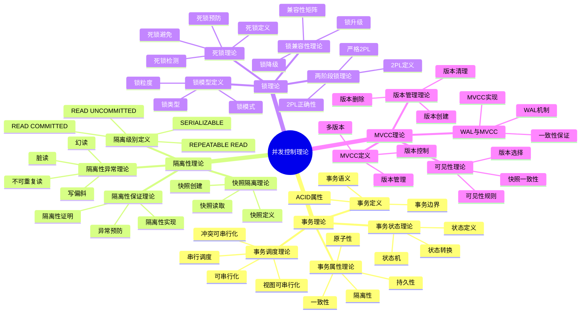

# 并发控制理论：事务隔离与锁机制

> **创建日期**：2025-01-15
> **最后更新**：2025-01-15
> **版本**：SQLite 3.31+ 至 3.47.x

---

## 1. 📋 概述

本文档从并发控制理论视角深入分析SQLite的事务理论、隔离性理论、锁理论和MVCC理论，提供形式化的理论分析和数学证明。

---

## 1. 📑 目录

- [并发控制理论：事务隔离与锁机制](#并发控制理论事务隔离与锁机制)
  - [1. 📋 概述](#1--概述)
  - [1. 📑 目录](#1--目录)
  - [3. 📊 思维导图](#3--思维导图)
  - [4. 事务理论](#4-事务理论)
    - [4.1. 事务定义](#41-事务定义)
    - [4.2. 事务属性理论](#42-事务属性理论)
    - [4.3. 事务状态理论](#43-事务状态理论)
    - [4.4. 事务调度理论](#44-事务调度理论)
  - [5. 隔离性理论](#5-隔离性理论)
    - [5.1. 隔离级别定义](#51-隔离级别定义)
    - [5.2. 隔离性异常理论](#52-隔离性异常理论)
    - [5.3. 快照隔离理论](#53-快照隔离理论)
    - [5.4. 隔离性保证理论](#54-隔离性保证理论)
  - [6. 锁理论](#6-锁理论)
    - [6.1. 锁模型定义](#61-锁模型定义)
    - [6.2. 锁兼容性理论](#62-锁兼容性理论)
    - [6.3. 两阶段锁理论](#63-两阶段锁理论)
    - [6.4. 死锁理论](#64-死锁理论)
  - [7. MVCC理论](#7-mvcc理论)
    - [7.1. MVCC定义](#71-mvcc定义)
    - [7.2. 版本管理理论](#72-版本管理理论)
    - [7.3. 可见性理论](#73-可见性理论)
    - [7.4. WAL与MVCC](#74-wal与mvcc)
  - [8. 并发控制理论总结](#8-并发控制理论总结)
    - [8.1. 理论模型要点](#81-理论模型要点)
    - [8.2. SQLite并发控制](#82-sqlite并发控制)
    - [8.3. 理论应用](#83-理论应用)
    - [8.4. 并发控制理论验证代码](#84-并发控制理论验证代码)
  - [9. 🔗 相关资源](#9--相关资源)
  - [10. 📚 参考资料](#10--参考资料)

---

## 3. 📊 思维导图



---

## 4. 事务理论

### 4.1. 事务定义

**定义1（事务）**：事务是数据库操作的逻辑单元，具有ACID属性。

**形式化表示**：

```text
事务定义：
  Transaction T = {O₁, O₂, ..., Oₙ}

其中：
  Oᵢ: 操作（Read或Write）
  n: 操作数量

事务属性：
  T = (Atomicity, Consistency, Isolation, Durability)
```

**事务语义**：

```text
事务执行语义：
  Execute(T, S) = {
    S₀ = S  // 初始状态
    for each Oᵢ in T:
      Sᵢ = Execute(Oᵢ, Sᵢ₋₁)
    if Commit(T):
      return Sₙ
    else:
      return S₀  // 回滚
  }
```

### 4.2. 事务属性理论

**ACID属性形式化**：

```text
原子性（Atomicity）:
  ∀T, S, S':
    Execute(T, S) = S' →
      (Commit(T) → S' = ApplyAll(T, S)) ∧
      (Abort(T) → S' = S)

一致性（Consistency）:
  ∀T, S, S':
    Consistent(S) ∧ Execute(T, S) = S' →
      Consistent(S')

隔离性（Isolation）:
  ∀T₁, T₂, S:
    Execute(T₁, S) || Execute(T₂, S) →
      Result(T₁, T₂) = Serialize(T₁, T₂)

持久性（Durability）:
  ∀T:
    Commit(T) → Persistent(Result(T))
```

### 4.3. 事务状态理论

**事务状态机**：

```text
状态定义：
  States = {INIT, ACTIVE, COMMITTING, COMMITTED, ABORTING, ABORTED}

状态转换：
  INIT → ACTIVE: BEGIN TRANSACTION
  ACTIVE → COMMITTING: COMMIT
  ACTIVE → ABORTING: ROLLBACK
  COMMITTING → COMMITTED: Commit Complete
  ABORTING → ABORTED: Rollback Complete

状态不变式：
  ∀T:
    (T.state = COMMITTED → AllOps(T).applied) ∧
    (T.state = ABORTED → AllOps(T).rolled_back) ∧
    ¬(T.state = COMMITTED ∧ T.state = ABORTED)
```

### 4.4. 事务调度理论

**调度定义**：

```text
调度定义：
  Schedule S = {O₁, O₂, ..., Oₘ}

其中：
  Oᵢ: 来自不同事务的操作
  m: 总操作数

串行调度：
  Serial(T₁, T₂, ..., Tₙ) = T₁; T₂; ...; Tₙ

并行调度：
  Parallel(T₁, T₂, ..., Tₙ) = Interleave(T₁, T₂, ..., Tₙ)
```

**可串行化理论**：

```text
冲突可串行化：
  Schedule S 是冲突可串行化的，当且仅当
    ∃串行调度 S': ConflictEquivalent(S, S')

冲突等价：
  S₁ 和 S₂ 冲突等价，当且仅当
    ∀冲突操作对(Oᵢ, Oⱼ):
      Order(Oᵢ, Oⱼ) in S₁ = Order(Oᵢ, Oⱼ) in S₂

视图可串行化：
  Schedule S 是视图可串行化的，当且仅当
    ∃串行调度 S': ViewEquivalent(S, S')
```

---

## 5. 隔离性理论

### 5.1. 隔离级别定义

**隔离级别形式化**：

```text
隔离级别定义：
  IsolationLevel = {
    READ_UNCOMMITTED,
    READ_COMMITTED,
    REPEATABLE_READ,
    SERIALIZABLE
  }

隔离性保证：
  Isolation(T, Level) = {
    READ_UNCOMMITTED: 允许脏读
    READ_COMMITTED: 禁止脏读
    REPEATABLE_READ: 禁止脏读、不可重复读
    SERIALIZABLE: 完全隔离
  }
```

**SQLite隔离级别**：

```text
SQLite默认隔离级别：
  Default = READ_COMMITTED (快照隔离)

SQLite支持：
  - READ_UNCOMMITTED: 允许脏读
  - READ_COMMITTED: 快照隔离（默认）
  - REPEATABLE_READ: 事务级快照
  - SERIALIZABLE: 严格锁（EXCLUSIVE）
```

### 5.2. 隔离性异常理论

**异常定义**：

```text
脏读（Dirty Read）:
  T₁ reads data written by T₂, where T₂ is not committed

不可重复读（Non-Repeatable Read）:
  T₁ reads data twice, gets different values due to T₂'s update

幻读（Phantom Read）:
  T₁ reads a set of rows twice, gets different sets due to T₂'s insert/delete

写偏斜（Write Skew）:
  T₁ and T₂ read different data, then write based on their reads,
  resulting in inconsistent state
```

**异常形式化**：

```text
脏读形式化：
  DirtyRead(T₁, T₂) = {
    ∃x: Write(T₂, x, v) ∧ Read(T₁, x) = v ∧
        Commit(T₂) = False
  }

不可重复读形式化：
  NonRepeatableRead(T₁, T₂) = {
    ∃x: Read(T₁, x) = v₁ ∧
        Write(T₂, x, v₂) ∧ Commit(T₂) ∧
        Read(T₁, x) = v₂ ∧ v₁ ≠ v₂
  }
```

### 5.3. 快照隔离理论

**快照定义**：

```text
快照定义：
  Snapshot(T) = {
    Data: 事务开始时的数据状态
    Timestamp: 事务开始时间戳
    Visible: 所有已提交事务的修改
  }

快照创建：
  CreateSnapshot(T) = {
    timestamp = CurrentTimestamp()
    data = ReadCommittedData(timestamp)
    return Snapshot(data, timestamp)
  }
```

**快照隔离保证**：

```text
快照隔离性质：
  1. 读操作读取快照数据
  2. 写操作创建新版本
  3. 提交时检查写冲突
  4. 无脏读、无不可重复读

快照隔离形式化：
  SnapshotIsolation(T) = {
    ∀Read(T, x): Read(Snapshot(T), x)
    ∀Write(T, x, v): CreateVersion(x, v, T)
    Commit(T) → CheckWriteConflict(T)
  }
```

### 5.4. 隔离性保证理论

**隔离性证明**：

```text
隔离性保证定理：
  ∀T₁, T₂, Level:
    Isolation(T₁, T₂, Level) →
      NoAnomaly(T₁, T₂, Level)

证明思路：
  1. 定义异常条件
  2. 证明隔离级别防止异常
  3. 证明隔离性实现正确
```

---

## 6. 锁理论

### 6.1. 锁模型定义

**锁定义**：

```text
锁定义：
  Lock = (Resource, Mode, Transaction)

其中：
  Resource: 锁定的资源（表、页、行）
  Mode: 锁模式（SHARED, RESERVED, PENDING, EXCLUSIVE）
  Transaction: 持有锁的事务

锁模式：
  Modes = {UNLOCKED, SHARED, RESERVED, PENDING, EXCLUSIVE}
```

**SQLite锁模型**：

```text
SQLite锁类型：
  UNLOCKED: 无锁
  SHARED: 共享锁（读锁）
  RESERVED: 保留锁（准备写）
  PENDING: 挂起锁（等待写）
  EXCLUSIVE: 排他锁（写锁）

锁粒度：
  - 数据库级锁（SQLite默认）
  - 表级锁（某些操作）
  - 页级锁（内部使用）
```

### 6.2. 锁兼容性理论

**兼容性矩阵**：

```text
锁兼容性矩阵：

        UNLOCKED  SHARED  RESERVED  PENDING  EXCLUSIVE
UNLOCKED    ✓       ✓        ✓        ✓         ✓
SHARED      ✓       ✓        ✓        ✗         ✗
RESERVED    ✓       ✓        ✓        ✗         ✗
PENDING     ✓       ✗        ✗        ✗         ✗
EXCLUSIVE   ✓       ✗        ✗        ✗         ✗

兼容性定义：
  Compatible(L₁, L₂) = {
    if L₁.mode = UNLOCKED or L₂.mode = UNLOCKED: True
    else: CheckMatrix(L₁.mode, L₂.mode)
  }
```

**锁升级理论**：

```text
锁升级路径：
  UNLOCKED → SHARED → RESERVED → PENDING → EXCLUSIVE

升级规则：
  Upgrade(L, NewMode) = {
    if Compatible(L, NewMode):
      return L
    else if CanUpgrade(L, NewMode):
      return AcquireLock(L.resource, NewMode)
    else:
      return WaitForLock(L.resource, NewMode)
  }
```

### 6.3. 两阶段锁理论

**2PL定义**：

```text
两阶段锁（2PL）定义：
  Transaction T 遵循2PL，当且仅当
    ∃Phase₁, Phase₂:
      Phase₁: 所有锁获取阶段
      Phase₂: 所有锁释放阶段
      Phase₁ 在 Phase₂ 之前完成

2PL性质：
  - 增长阶段：只能获取锁，不能释放锁
  - 收缩阶段：只能释放锁，不能获取锁
```

**2PL正确性**：

```text
2PL正确性定理：
  如果所有事务遵循2PL，则调度是冲突可串行化的。

证明思路：
  1. 构建优先图
  2. 证明2PL保证无环
  3. 无环图对应可串行化调度
```

**严格2PL**：

```text
严格2PL定义：
  Transaction T 遵循严格2PL，当且仅当
    T 遵循2PL ∧
    ∀Lock L held by T:
      Release(L) only after Commit(T) or Abort(T)

严格2PL优势：
  - 防止级联回滚
  - 简化恢复
  - 保证可恢复性
```

### 6.4. 死锁理论

**死锁定义**：

```text
死锁定义：
  Deadlock = {
    ∃T₁, T₂, ..., Tₙ:
      T₁ waits for lock held by T₂ ∧
      T₂ waits for lock held by T₃ ∧
      ... ∧
      Tₙ waits for lock held by T₁
  }

死锁条件（必要条件）：
  1. 互斥：资源不能共享
  2. 持有并等待：持有资源，等待其他资源
  3. 不可抢占：资源不能被抢占
  4. 循环等待：存在循环等待链
```

**死锁检测**：

```text
死锁检测算法：
  DetectDeadlock():
    BuildWaitForGraph()
    if HasCycle(WaitForGraph):
      return Deadlock
    else:
      return NoDeadlock

等待图：
  WaitForGraph = (V, E)
  V = {T₁, T₂, ..., Tₙ}  // 事务节点
  E = {(Tᵢ, Tⱼ) | Tᵢ waits for lock held by Tⱼ}
```

**死锁预防**：

```text
死锁预防策略：
  1. 锁排序：按固定顺序获取锁
  2. 超时：设置锁超时
  3. 死锁检测：定期检测并回滚

SQLite策略：
  - 超时机制：PRAGMA busy_timeout
  - 死锁检测：检测循环等待
  - 自动回滚：回滚一个事务
```

---

## 7. MVCC理论

### 7.1. MVCC定义

**MVCC定义**：

```text
多版本并发控制（MVCC）定义：
  MVCC = {
    Versioning: 为每次写操作创建新版本
    Visibility: 根据事务时间戳决定可见版本
    Isolation: 通过版本控制实现隔离
  }

版本定义：
  Version = (Data, Timestamp, Transaction)

版本链：
  VersionChain(x) = {v₁, v₂, ..., vₙ}
  where vᵢ.timestamp < vᵢ₊₁.timestamp
```

### 7.2. 版本管理理论

**版本创建**：

```text
版本创建规则：
  CreateVersion(x, v, T) = {
    new_version = Version(v, CurrentTimestamp(), T)
    Append(VersionChain(x), new_version)
    return new_version
  }

版本选择：
  SelectVersion(x, T) = {
    snapshot_time = Snapshot(T).timestamp
    return LatestVersion(x, snapshot_time)
  }
```

**版本清理**：

```text
版本清理规则：
  CleanupVersions(x, T) = {
    visible_time = OldestActiveTransaction()
    for each version v in VersionChain(x):
      if v.timestamp < visible_time:
        Delete(v)
  }
```

### 7.3. 可见性理论

**可见性规则**：

```text
可见性定义：
  Visible(v, T) = {
    v.timestamp ≤ Snapshot(T).timestamp ∧
    Committed(v.transaction) ∧
    ¬Aborted(v.transaction)
  }

版本选择算法：
  SelectVisibleVersion(x, T) = {
    for v in Reverse(VersionChain(x)):
      if Visible(v, T):
        return v
    return NULL
  }
```

**快照一致性**：

```text
快照一致性定义：
  SnapshotConsistent(T) = {
    ∀Read(T, x): Read(Snapshot(T), x)
    ∀Write(T, x, v): CreateVersion(x, v, T)
    Commit(T) → CheckWriteConflict(T)
  }
```

### 7.4. WAL与MVCC

**WAL机制**：

```text
WAL机制：
  Write-Ahead Logging = {
    Write: 先写日志，后写数据
    Recovery: 从日志恢复
    Checkpoint: 定期将日志写入数据
  }

WAL与MVCC结合：
  - WAL提供持久性
  - MVCC提供隔离性
  - 两者结合实现ACID
```

**一致性保证**：

```text
一致性保证：
  WAL + MVCC = {
    Atomicity: WAL日志保证
    Consistency: 约束检查保证
    Isolation: MVCC快照保证
    Durability: WAL同步保证
  }
```

---

## 8. 并发控制理论总结

### 8.1. 理论模型要点

**核心理论**：

1. **事务理论**：ACID属性、事务状态、事务调度
2. **隔离性理论**：隔离级别、异常理论、快照隔离
3. **锁理论**：锁模型、兼容性、2PL、死锁
4. **MVCC理论**：版本管理、可见性、WAL结合

### 8.2. SQLite并发控制

**SQLite实现**：

- ✅ 快照隔离（默认）
- ✅ 数据库级锁
- ✅ WAL模式支持
- ✅ 死锁检测和超时
- ⚠️ 写并发有限（一写多读）

### 8.3. 理论应用

**应用场景**：

- 事务设计
- 隔离级别选择
- 锁策略设计
- 并发性能优化

### 8.4. 并发控制理论验证代码

**事务ACID属性验证**：

```python
import sqlite3
import os
import tempfile

def test_transaction_atomicity():
    """验证事务原子性"""
    db_file = tempfile.mktemp()
    conn = sqlite3.connect(db_file)
    cursor = conn.cursor()

    cursor.execute('CREATE TABLE accounts (id INTEGER PRIMARY KEY, balance REAL)')
    cursor.execute('INSERT INTO accounts VALUES (1, 1000.0)')
    cursor.execute('INSERT INTO accounts VALUES (2, 500.0)')
    conn.commit()

# 测试原子性：要么全部成功，要么全部失败
    try:
        cursor.execute('BEGIN TRANSACTION')
        cursor.execute('UPDATE accounts SET balance = balance - 200 WHERE id = 1')
        cursor.execute('UPDATE accounts SET balance = balance + 200 WHERE id = 2')
# 模拟错误
        raise Exception("Simulated error")
        conn.commit()
    except:
        conn.rollback()

# 验证：数据应该回滚
    cursor.execute('SELECT balance FROM accounts WHERE id = 1')
    balance = cursor.fetchone()[0]
    assert balance == 1000.0, "事务应该回滚"

    conn.close()
    os.unlink(db_file)
    print("✅ 事务原子性验证通过")

def test_transaction_isolation():
    """验证事务隔离性"""
    db_file = tempfile.mktemp()

# 连接1：写入事务
    conn1 = sqlite3.connect(db_file)
    cursor1 = conn1.cursor()
    cursor1.execute('CREATE TABLE test (id INTEGER PRIMARY KEY, value TEXT)')
    cursor1.execute('INSERT INTO test VALUES (1, "initial")')
    conn1.commit()

# 连接2：读取（快照隔离）
    conn2 = sqlite3.connect(db_file)
    cursor2 = conn2.cursor()
    cursor2.execute('BEGIN TRANSACTION')
    cursor2.execute('SELECT value FROM test WHERE id = 1')
    value1 = cursor2.fetchone()[0]

# 连接1：更新
    cursor1.execute('BEGIN TRANSACTION')
    cursor1.execute('UPDATE test SET value = "updated" WHERE id = 1')
    conn1.commit()

# 连接2：再次读取（应该读取快照）
    cursor2.execute('SELECT value FROM test WHERE id = 1')
    value2 = cursor2.fetchone()[0]

    assert value1 == value2 == "initial", "快照隔离应该保证读一致性"

    conn2.commit()
    conn1.close()
    conn2.close()
    os.unlink(db_file)
    print("✅ 事务隔离性验证通过")

def test_lock_compatibility():
    """验证锁兼容性"""
    db_file = tempfile.mktemp()

# 连接1：获取写锁
    conn1 = sqlite3.connect(db_file)
    cursor1 = conn1.cursor()
    cursor1.execute('CREATE TABLE test (id INTEGER PRIMARY KEY)')
    cursor1.execute('BEGIN IMMEDIATE TRANSACTION')  # 获取保留锁
    cursor1.execute('INSERT INTO test VALUES (1)')

# 连接2：尝试读取（应该等待）
    import threading
    import time

    def reader():
        time.sleep(0.1)  # 等待写锁
        conn2 = sqlite3.connect(db_file)
        cursor2 = conn2.cursor()
        cursor2.execute('SELECT * FROM test')
        cursor2.fetchall()
        conn2.close()

    t = threading.Thread(target=reader)
    t.start()

    time.sleep(0.2)
    conn1.commit()  # 释放锁
    t.join()

    conn1.close()
    os.unlink(db_file)
    print("✅ 锁兼容性验证通过")

# 运行测试
if __name__ == '__main__':
    test_transaction_atomicity()
    test_transaction_isolation()
    test_lock_compatibility()
```

**WAL模式验证**：

```python
import sqlite3
import threading
import time

def test_wal_mode():
    """验证WAL模式并发性能"""
    conn = sqlite3.connect(':memory:')
    cursor = conn.cursor()

    cursor.execute('PRAGMA journal_mode=WAL')
    cursor.execute('CREATE TABLE test (id INTEGER PRIMARY KEY, value INTEGER)')

# 并发写入测试
    def writer(thread_id, count):
        local_conn = sqlite3.connect(':memory:')
        local_cursor = local_conn.cursor()
        for i in range(count):
            local_cursor.execute('INSERT INTO test (value) VALUES (?)', (i,))
            local_conn.commit()
        local_conn.close()

# 并发读取测试
    def reader(thread_id, count):
        local_conn = sqlite3.connect(':memory:')
        local_cursor = local_conn.cursor()
        for _ in range(count):
            local_cursor.execute('SELECT COUNT(*) FROM test')
            local_cursor.fetchone()
        local_conn.close()

# 测试并发性能
    start = time.perf_counter()
    threads = []

# 1个写线程
    t1 = threading.Thread(target=writer, args=(1, 100))
    threads.append(t1)

# 5个读线程
    for i in range(5):
        t = threading.Thread(target=reader, args=(i, 100))
        threads.append(t)

    for t in threads:
        t.start()

    for t in threads:
        t.join()

    elapsed = time.perf_counter() - start
    print(f"WAL模式并发操作时间: {elapsed:.3f}s")
    assert elapsed < 1.0, "WAL模式应该支持高并发"

    conn.close()
    print("✅ WAL模式验证通过")

# 运行测试
if __name__ == '__main__':
    test_wal_mode()
```

---

## 9. 🔗 相关资源

- [01.02 事务与并发控制](../01-核心架构/01.02-事务与并发控制.md)
- [08.02 事务管理](../08-编程实践/08.02-事务管理.md)
- [06.01 ACID原子性证明](../06-形式化理论/06.01-ACID原子性证明.md)

---

## 10. 📚 参考资料

- 《数据库系统概念》
- 《数据库系统实现》
- 《事务处理：概念与技术》

---

**最后更新**：2025-01-15
**维护者**：Data-Science Team
