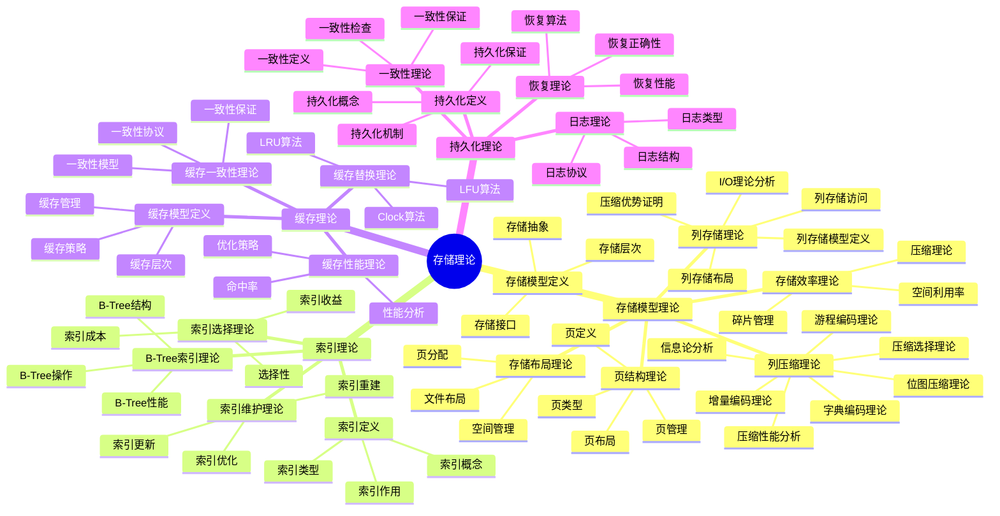

# 存储理论：页结构与B-Tree存储模型

> **创建日期**：2025-01-15
> **最后更新**：2025-01-15
> **版本**：SQLite 3.31+ 至 3.47.x

---

## 1. 📋 概述

本文档从存储理论视角深入分析SQLite的存储模型理论、索引理论、缓存理论和持久化理论，提供形式化的理论分析和数学证明。

---

## 2. 📑 目录

- [存储理论：页结构与B-Tree存储模型](#存储理论页结构与b-tree存储模型)
  - [1. 📋 概述](#1--概述)
  - [2. 📑 目录](#2--目录)
  - [3. 📊 思维导图](#3--思维导图)
  - [4. 存储模型理论](#4-存储模型理论)
    - [4.1. 存储模型定义](#41-存储模型定义)
    - [4.2. 页结构理论](#42-页结构理论)
    - [4.3. 存储布局理论](#43-存储布局理论)
    - [4.4. 存储效率理论](#44-存储效率理论)
    - [4.5. 列存储理论](#45-列存储理论)
    - [4.6. 列压缩理论](#46-列压缩理论)
      - [4.6.1. 字典编码理论](#461-字典编码理论)
      - [4.6.2. 游程编码理论](#462-游程编码理论)
      - [4.6.3. 增量编码理论](#463-增量编码理论)
      - [4.6.4. 位图压缩理论](#464-位图压缩理论)
  - [5. 索引理论](#5-索引理论)
    - [5.1. 索引定义](#51-索引定义)
    - [5.2. B-Tree索引理论](#52-b-tree索引理论)
    - [5.3. 索引选择理论](#53-索引选择理论)
    - [5.4. 索引维护理论](#54-索引维护理论)
  - [6. 缓存理论](#6-缓存理论)
    - [6.1. 缓存模型定义](#61-缓存模型定义)
    - [6.2. 缓存替换理论](#62-缓存替换理论)
    - [6.3. 缓存一致性理论](#63-缓存一致性理论)
    - [6.4. 缓存性能理论](#64-缓存性能理论)
  - [7. 持久化理论](#7-持久化理论)
    - [7.1. 持久化定义](#71-持久化定义)
    - [7.2. 日志理论](#72-日志理论)
    - [7.3. 恢复理论](#73-恢复理论)
    - [7.4. 一致性理论](#74-一致性理论)
  - [8. 存储理论总结](#8-存储理论总结)
    - [8.1. 理论模型要点](#81-理论模型要点)
    - [8.2. SQLite存储特性](#82-sqlite存储特性)
    - [8.3. 理论应用](#83-理论应用)
    - [8.4. 存储理论验证代码](#84-存储理论验证代码)
  - [9. 🔗 相关资源](#9--相关资源)
  - [10. 📚 参考资料](#10--参考资料)

---

## 3. 📊 思维导图



---

## 4. 存储模型理论

### 4.1. 存储模型定义

**定义1（存储模型）**：存储模型定义了数据在存储介质上的组织方式和访问方法。

**形式化表示**：

```text
存储模型定义：
  StorageModel = (Pages, Layout, Access, Management)

其中：
  Pages: 页集合
  Layout: 存储布局
  Access: 访问方法
  Management: 管理策略
```

**存储层次模型**：

```text
存储层次：
  Level 1: CPU寄存器（最快，最小）
  Level 2: CPU缓存（快，小）
  Level 3: 内存（中，中）
  Level 4: 磁盘（慢，大）

SQLite存储层次：
  Memory Cache → Disk Pages → Disk File
```

### 4.2. 页结构理论

**页定义**：

```text
页定义：
  Page = (Header, Data, Footer)

其中：
  Header: 页头部（元数据）
  Data: 页数据（实际数据）
  Footer: 页尾部（校验和等）

页大小：
  PageSize ∈ {512, 1024, 2048, 4096, 8192, 16384, 32768, 65536}
  默认：4096 bytes
```

**页类型理论**：

```text
页类型定义：
  PageType = {
    LOCK_BYTE_PAGE: 锁定字节页
    FREELIST_PAGE: 自由列表页
    FREELIST_TRUNK_PAGE: 自由列表主干页
    B_TREE_PAGE: B-Tree页
    PTRMAP_PAGE: 指针映射页
  }

页类型标识：
  PageType(page) = page.header.type
```

**页布局理论**：

```text
页布局：
  PageLayout = {
    Header: 页头部（固定大小）
    CellPointers: 单元指针数组
    FreeSpace: 空闲空间
    Cells: 单元数据
    Footer: 页尾部（可选）
  }

空间分配：
  AllocateSpace(page, size) = {
    if FreeSpace(page) ≥ size:
      return Allocate(FreeSpace(page), size)
    else:
      return NULL  // 需要分裂
  }
```

### 4.3. 存储布局理论

**文件布局**：

```text
数据库文件布局：
  FileLayout = {
    Header: 数据库头部（100 bytes）
    Pages: 页序列
  }

页分配：
  PageAllocation = {
    PageID: 页标识符
    PageOffset: 页在文件中的偏移
    PageSize: 页大小
  }

页地址计算：
  PageAddress(page_id) = HeaderSize + (page_id - 1) × PageSize
```

**空间管理理论**：

```text
空间管理：
  SpaceManagement = {
    Allocation: 页分配
    Deallocation: 页释放
    Fragmentation: 碎片管理
    Compaction: 空间压缩
  }

自由列表：
  Freelist = {
    TrunkPages: 主干页列表
    LeafPages: 叶子页列表
  }
```

### 4.4. 存储效率理论

**空间利用率**：

```text
空间利用率定义：
  Utilization(page) = UsedSpace(page) / TotalSpace(page)

平均利用率：
  AvgUtilization = Σ Utilization(pageᵢ) / n

目标利用率：
  TargetUtilization ∈ [0.5, 0.9]  // 50%-90%
```

**碎片管理理论**：

```text
碎片定义：
  Fragmentation = {
    Internal: 页内碎片
    External: 页间碎片
  }

碎片度量：
  FragmentationRate = FreeSpace / TotalSpace

碎片管理：
  - 内部碎片：页内空闲空间
  - 外部碎片：自由列表中的页
  - 碎片整理：VACUUM操作
```

### 4.5. 列存储理论

**定义3（列存储模型）**：列存储模型将数据按列而非按行组织存储。

**形式化表示**：

```text
列存储模型定义：
  ColumnarStorage = (Columns, Layout, Compression, Access)

其中：
  Columns: 列集合 {C₁, C₂, ..., Cₙ}
  Layout: 列布局（列文件组织）
  Compression: 列压缩策略
  Access: 列访问方法

行存储模型（SQLite）：
  RowStorage = (Rows, Pages, BTree, Access)

其中：
  Rows: 行集合 {R₁, R₂, ..., Rₙ}
  Pages: 页集合
  BTree: B-Tree索引结构
  Access: 行访问方法
```

**列存储布局理论**：

```text
列存储文件布局：
  ColumnFile(Cᵢ) = {
    Header: {
      ColumnName: string
      DataType: type
      RowCount: n
      CompressionType: enum
    }
    DataBlocks: [Block₁, Block₂, ..., Blockₖ]
    Index: {
      BlockOffsets: [offset₁, offset₂, ..., offsetₖ]
      MinMaxValues: [(min₁, max₁), (min₂, max₂), ...]
    }
  }

行存储布局（SQLite）：
  RowFile = {
    Pages: [Page₁, Page₂, ..., Pageₘ]
    BTree: {
      Root: root_page
      Nodes: node_pages
      Leaves: leaf_pages
    }
  }
```

**列存储访问理论**：

```text
列存储查询：
  QueryColumnar(Q) = {
    Columns = ExtractColumns(Q)
    for each C in Columns:
      ReadColumn(C)
      Decompress(C)
      Filter(C, Q.conditions)
    Join(Columns)
    return Result
  }

行存储查询（SQLite）：
  QueryRow(Q) = {
    if Q.hasIndex:
      UseIndex(Q)
    else:
      ScanRows(Q)
    Filter(Q.conditions)
    return Result
  }
```

**列存储I/O理论**：

```text
列存储I/O：
  设查询Q需要k列，每列大小为Sᵢ，总行数为n

  列存储I/O：
    IO_columnar = Σᵢ₌₁ᵏ Sᵢ × (1 - CompressionRatioᵢ)
    (只读取需要的列)

  行存储I/O：
    IO_row = n × RowSize
    (需要读取整行，即使只需要部分列)

  I/O节省：
    IOSaving = (IO_row - IO_columnar) / IO_row
    = 1 - (Σᵢ₌₁ᵏ Sᵢ) / (n × RowSize)

  当k << TotalColumns时，IOSaving显著
```

**列存储压缩理论**：

```text
列压缩优势：
  设列C有n个值，值域为V = {v₁, v₂, ..., vₘ}

  列存储熵：
    H_column(C) = -Σᵢ₌₁ᵐ P(vᵢ) × log₂(P(vᵢ))
    (同列数据类型相同，分布集中)

  行存储熵：
    H_row(R) = -Σᵢ₌₁ⁿ P(rowᵢ) × log₂(P(rowᵢ))
    (行数据混合，分布分散)

  压缩率关系：
    CompressionRatio_column = H_column / OriginalSize
    CompressionRatio_row = H_row / OriginalSize

    通常：H_column < H_row
    因此：CompressionRatio_column < CompressionRatio_row
    (列存储压缩率更高)
```

### 4.6. 列压缩理论

**定义4（列压缩）**：列压缩是针对列存储数据的压缩技术，利用列数据的同质性和相似性实现高效压缩。

**压缩算法理论**：

#### 4.6.1. 字典编码理论

```text
字典编码定义：
  DictionaryEncoding(C) = (Dict, Encoded)

其中：
  Dict: 值到索引的映射 {v → i | v ∈ V, i ∈ [0, |V|-1]}
  Encoded: 编码序列 [i₁, i₂, ..., iₙ]

压缩率：
  CompressionRatio = (n × log₂|V|) / (n × AvgValueSize)

压缩条件：
  CompressionEffective ⟺ log₂|V| < AvgValueSize
  (索引大小小于原始值大小)

理论压缩下限：
  CompressedSize ≥ n × H(C)
  (香农熵定理)
```

#### 4.6.2. 游程编码理论

```text
游程编码定义：
  RLE(C) = [(v₁, l₁), (v₂, l₂), ..., (vₖ, lₖ)]

其中：
  vᵢ: 重复的值
  lᵢ: 重复长度
  Σᵢ₌₁ᵏ lᵢ = n

压缩率：
  CompressionRatio = (k × (ValueSize + LengthSize)) / (n × ValueSize)

压缩条件：
  CompressionEffective ⟺ k < n
  (游程数小于原始数据量)

最优情况：
  当所有值相同：k = 1, CompressionRatio = (ValueSize + LengthSize) / (n × ValueSize)
  压缩率接近 1/n
```

#### 4.6.3. 增量编码理论

```text
增量编码定义：
  DeltaEncoding(C) = (base, [δ₁, δ₂, ..., δₙ₋₁])

其中：
  base = C[0]
  δᵢ = C[i+1] - C[i]

压缩率：
  CompressionRatio = (BaseSize + Σᵢ₌₁ⁿ⁻¹ VarInt(δᵢ)) / (n × ValueSize)

压缩条件：
  CompressionEffective ⟺ Avg(VarInt(δᵢ)) < ValueSize
  (平均差值编码大小小于原始值大小)

最优情况：
  当数据单调递增且差值小：
    VarInt(δᵢ) ≈ 1字节（如果δᵢ < 128）
    CompressionRatio ≈ (ValueSize + n-1) / (n × ValueSize)
```

#### 4.6.4. 位图压缩理论

```text
位图压缩定义：
  对于布尔列或低基数列C，值域V = {v₁, v₂, ..., vₖ}

  位图表示：
    Bitmap(C, vᵢ) = [b₁, b₂, ..., bₙ]
    其中 bⱼ = 1 if C[j] == vᵢ else 0

压缩率：
  CompressionRatio = (k × ⌈n/8⌉) / (n × ValueSize)

压缩条件：
  CompressionEffective ⟺ k × ⌈n/8⌉ < n × ValueSize

最优情况：
  布尔列（k=2）：
    CompressionRatio = 2 × ⌈n/8⌉ / (n × 1) = 1/4
    (压缩率25%)
```

**列压缩性能理论**：

```text
压缩性能分析：
  设列C有n个值，压缩算法A

  压缩时间：
    T_compress = f(n, AlgorithmComplexity)

  解压时间：
    T_decompress = g(CompressedSize, AlgorithmComplexity)

  总查询时间：
    T_query = T_decompress + T_scan + T_filter

  压缩收益：
    Benefit = (IO_saved × T_IO) - (T_compress + T_decompress)

  压缩决策：
    UseCompression ⟺ Benefit > 0
```

**列压缩选择理论**：

```text
压缩算法选择：
  设列C的特征：
    Cardinality = |DistinctValues(C)|
    Sorted = IsSorted(C)
    DataType = Type(C)

  选择规则：
    if Cardinality < Threshold₁:
      Use DictionaryEncoding()
    elif Sorted and DataType == Numeric:
      Use DeltaEncoding() or RLE()
    elif DataType == Boolean or Cardinality ≤ 8:
      Use BitmapCompression()
    else:
      Use GeneralCompression(LZ4, Zstd, etc.)

  阈值选择：
    Threshold₁ ∈ [10, 100]  // 字典编码阈值
    Threshold₂ ∈ [0.1, 0.3]  // 压缩率阈值
```

**列压缩信息论分析**：

```text
信息熵与压缩：
  列C的信息熵：
    H(C) = -Σᵢ₌₁ᵐ P(vᵢ) × log₂(P(vᵢ))

  理论压缩下限（香农熵）：
    CompressedSize ≥ n × H(C)

  实际压缩率：
    ActualRatio = ActualCompressedSize / OriginalSize

  压缩效率：
    Efficiency = (n × H(C)) / ActualCompressedSize
    Efficiency ∈ [0, 1]
    (越接近1，压缩效率越高)

  列存储压缩优势：
    由于H_column < H_row，列存储更容易接近理论下限
```

---

## 5. 索引理论

### 5.1. 索引定义

**定义2（索引）**：索引是数据结构的集合，用于加速数据访问。

**形式化表示**：

```text
索引定义：
  Index = (Structure, Keys, Values, Access)

其中：
  Structure: 索引结构（B-Tree, Hash, etc.）
  Keys: 键集合
  Values: 值集合（ROWID或数据）
  Access: 访问方法
```

**索引类型**：

```text
索引类型：
  IndexType = {
    PRIMARY_KEY: 主键索引
    UNIQUE: 唯一索引
    NON_UNIQUE: 非唯一索引
    COVERING: 覆盖索引
    PARTIAL: 部分索引
  }
```

### 5.2. B-Tree索引理论

**B-Tree结构理论**：

```text
B-Tree定义：
  BTree = (Root, Nodes, Leaves)

节点结构：
  Node = {
    Keys: [k₁, k₂, ..., kₙ]
    Children: [c₁, c₂, ..., cₙ₊₁]
    IsLeaf: boolean
  }

B-Tree性质：
  1. 所有叶子节点在同一层
  2. 每个节点最多m个子节点（m是分支因子）
  3. 根节点至少有2个子节点（除非是叶子）
  4. 非根非叶节点至少有⌈m/2⌉个子节点
```

**B-Tree性能理论**：

```text
B-Tree高度：
  h = ⌈log_m(n)⌉

其中：
  n: 键的数量
  m: 分支因子（通常100-200）

查找复杂度：
  Time(Search) = O(h) = O(log_m(n)) = O(log n)

插入复杂度：
  Time(Insert) = O(h) = O(log n)

删除复杂度：
  Time(Delete) = O(h) = O(log n)
```

### 5.3. 索引选择理论

**选择性理论**：

```text
选择性定义：
  Selectivity(Index, Column) =
    DistinctValues(Column) / TotalRows

选择性范围：
  Selectivity ∈ [0, 1]
  - 1.0: 完全唯一（最佳）
  - 0.0: 完全重复（最差）

索引收益：
  IndexBenefit = f(Selectivity, QueryFrequency, UpdateCost)

索引成本：
  IndexCost = {
    Storage: 存储空间
    Maintenance: 维护成本
    Update: 更新成本
  }
```

**索引选择决策**：

```text
索引选择规则：
  if Selectivity > Threshold and QueryFrequency > UpdateFrequency:
    CreateIndex()
  else:
    NoIndex()

阈值选择：
  Threshold ∈ [0.1, 0.3]  // 10%-30%选择性
```

### 5.4. 索引维护理论

**索引更新理论**：

```text
索引更新：
  UpdateIndex(Index, Key, OldValue, NewValue) = {
    if OldValue ≠ NULL:
      Delete(Index, Key, OldValue)
    if NewValue ≠ NULL:
      Insert(Index, Key, NewValue)
  }

更新成本：
  Cost(UpdateIndex) = Cost(Delete) + Cost(Insert)
                    = O(log n) + O(log n)
                    = O(log n)
```

**索引重建理论**：

```text
索引重建：
  RebuildIndex(Index) = {
    CreateNewIndex()
    for each row in Table:
      Insert(NewIndex, row.key, row.value)
    Replace(OldIndex, NewIndex)
  }

重建成本：
  Cost(RebuildIndex) = O(n log n)

重建时机：
  - 碎片化严重
  - 统计信息过期
  - 性能下降
```

---

## 6. 缓存理论

### 6.1. 缓存模型定义

**定义3（缓存）**：缓存是快速存储介质，用于存储频繁访问的数据。

**形式化表示**：

```text
缓存模型：
  Cache = (Size, Policy, Replacement, Consistency)

其中：
  Size: 缓存大小
  Policy: 缓存策略（LRU, LFU, Clock, etc.）
  Replacement: 替换算法
  Consistency: 一致性协议
```

**缓存层次**：

```text
SQLite缓存层次：
  Level 1: 页面缓存（Pager Cache）
  Level 2: 操作系统页面缓存
  Level 3: 磁盘

缓存大小：
  CacheSize = PRAGMA cache_size
  默认：-2000 pages (2MB)
  推荐：根据可用内存调整
```

### 6.2. 缓存替换理论

**LRU算法**：

```text
LRU（Least Recently Used）算法：
  ReplaceLRU(Cache) = {
    victim = LeastRecentlyUsed(Cache)
    Evict(victim)
    return victim
  }

LRU实现：
  - 使用双向链表维护访问顺序
  - 访问时移动到链表头部
  - 替换时选择链表尾部

LRU复杂度：
  Time(Access) = O(1)
  Time(Replace) = O(1)
```

**LFU算法**：

```text
LFU（Least Frequently Used）算法：
  ReplaceLFU(Cache) = {
    victim = LeastFrequentlyUsed(Cache)
    Evict(victim)
    return victim
  }

LFU实现：
  - 维护访问频率计数
  - 替换时选择频率最低的页

LFU复杂度：
  Time(Access) = O(1)
  Time(Replace) = O(log n)  // 需要堆维护
```

**Clock算法**：

```text
Clock算法：
  ReplaceClock(Cache) = {
    while True:
      page = ClockHand()
      if page.reference_bit == 0:
        Evict(page)
        return page
      else:
        page.reference_bit = 0
        ClockHand = Next()
  }

Clock复杂度：
  Time(Access) = O(1)
  Time(Replace) = O(n) 最坏情况
```

### 6.3. 缓存一致性理论

**一致性模型**：

```text
一致性定义：
  CacheConsistency = {
    ReadConsistency: 读一致性
    WriteConsistency: 写一致性
    Coherence: 缓存一致性
  }

一致性级别：
  - 强一致性：立即同步
  - 弱一致性：延迟同步
  - 最终一致性：最终同步
```

**SQLite缓存一致性**：

```text
SQLite一致性模型：
  - 写时复制（Copy-on-Write）
  - 脏页标记
  - 事务提交时同步

一致性保证：
  ∀Page p in Cache:
    if p.dirty:
      Sync(p) before Commit
    else:
      p is consistent
```

### 6.4. 缓存性能理论

**命中率理论**：

```text
命中率定义：
  HitRate = CacheHits / (CacheHits + CacheMisses)

命中率范围：
  HitRate ∈ [0, 1]
  - 1.0: 全部命中（理想）
  - 0.0: 全部未命中（最差）

性能影响：
  AvgAccessTime = HitRate × CacheAccessTime +
                  (1 - HitRate) × DiskAccessTime
```

**缓存性能优化**：

```text
优化策略：
  1. 增加缓存大小：提升命中率
  2. 优化替换算法：选择更好的替换策略
  3. 预取策略：预测性加载
  4. 批量操作：减少缓存失效

性能分析：
  OptimalCacheSize = f(WorkingSet, AvailableMemory, AccessPattern)
```

---

## 7. 持久化理论

### 7.1. 持久化定义

**定义4（持久化）**：持久化是确保数据在系统故障后仍然存在的机制。

**形式化表示**：

```text
持久化定义：
  Persistence(Data) = {
    ∀Failure: AfterRecovery(Data) = Data
  }

持久化保证：
  ∀Transaction T:
    Commit(T) → Persistent(Result(T))
```

### 7.2. 日志理论

**日志类型**：

```text
日志类型：
  LogType = {
    REDO_LOG: 重做日志（WAL）
    UNDO_LOG: 撤销日志（Rollback Journal）
    COMBINED_LOG: 组合日志
  }

日志记录：
  LogRecord = (TransactionID, Operation, Data, Timestamp)
```

**WAL日志理论**：

```text
WAL机制：
  Write-Ahead Logging = {
    Write: 先写WAL，后写数据库
    Commit: WAL同步后提交
    Checkpoint: 定期将WAL写入数据库
  }

WAL协议：
  WALProtocol = {
    1. WriteToWAL(Operation)
    2. SyncWAL()
    3. CommitTransaction()
    4. (Later) Checkpoint()
  }
```

### 7.3. 恢复理论

**恢复算法**：

```text
恢复算法：
  Recovery() = {
    // 1. 分析阶段
    ActiveTransactions = AnalyzeLog()

    // 2. 重做阶段
    for each log record in WAL:
      if Committed(log.transaction):
        Redo(log.operation)

    // 3. 撤销阶段
    for each transaction in ActiveTransactions:
      Undo(transaction)
  }

恢复正确性：
  RecoveryCorrectness = {
    ∀CommittedTransaction T: Redo(T)
    ∀UncommittedTransaction T: Undo(T)
  }
```

**恢复性能**：

```text
恢复时间：
  RecoveryTime = f(WALSize, ActiveTransactions, DiskSpeed)

优化策略：
  1. 定期Checkpoint：减少WAL大小
  2. 快速恢复：优化恢复算法
  3. 增量恢复：只恢复必要的部分
```

### 7.4. 一致性理论

**一致性定义**：

```text
一致性定义：
  Consistency = {
    Structural: 结构一致性（页结构正确）
    Logical: 逻辑一致性（数据完整性）
    Referential: 参照一致性（外键约束）
  }

一致性检查：
  ConsistencyCheck() = {
    CheckPageStructure()
    CheckIntegrityConstraints()
    CheckReferentialIntegrity()
  }
```

**一致性保证**：

```text
一致性保证：
  ∀State S:
    Consistent(S) →
      AfterRecovery(S) is Consistent

一致性维护：
  - 事务保证逻辑一致性
  - 日志保证结构一致性
  - 约束保证参照一致性
```

---

## 8. 存储理论总结

### 8.1. 理论模型要点

**核心理论**：

1. **存储模型理论**：页结构、存储布局、存储效率
2. **索引理论**：B-Tree索引、索引选择、索引维护
3. **缓存理论**：缓存模型、替换算法、一致性、性能
4. **持久化理论**：日志理论、恢复理论、一致性理论

### 8.2. SQLite存储特性

**SQLite实现**：

- ✅ 页式存储（4KB默认）
- ✅ B-Tree索引
- ✅ 页面缓存（LRU）
- ✅ WAL日志
- ✅ 自动恢复

### 8.3. 理论应用

**应用场景**：

- 存储设计
- 索引设计
- 缓存优化
- 持久化保证

### 8.4. 存储理论验证代码

**存储模型验证**：

```python
import sqlite3
import os

def test_storage_model():
    """验证存储模型"""
    db_file = 'test_storage.db'
    conn = sqlite3.connect(db_file)
    cursor = conn.cursor()

# 测试页大小
    cursor.execute('PRAGMA page_size')
    page_size = cursor.fetchone()[0]
    print(f"页大小: {page_size} bytes")
    assert page_size in [512, 1024, 2048, 4096, 8192, 16384, 32768, 65536]

# 测试页数
    cursor.execute('CREATE TABLE test (id INTEGER PRIMARY KEY, value TEXT)')
    cursor.execute('INSERT INTO test (value) VALUES (?)', ('test',))
    conn.commit()

    cursor.execute('PRAGMA page_count')
    page_count = cursor.fetchone()[0]
    print(f"页数: {page_count}")
    assert page_count > 0

# 测试文件大小
    file_size = os.path.getsize(db_file)
    print(f"文件大小: {file_size} bytes")
    assert file_size >= page_size * page_count

    conn.close()
    os.unlink(db_file)
    print("✅ 存储模型验证通过")

def test_index_performance():
    """验证索引性能"""
    conn = sqlite3.connect(':memory:')
    cursor = conn.cursor()

    cursor.execute('CREATE TABLE test (id INTEGER PRIMARY KEY, value TEXT)')

# 插入数据
    cursor.executemany('INSERT INTO test (value) VALUES (?)',
                      [(f'value_{i}',) for i in range(10000)])

# 测试无索引查找
    import time
    start = time.perf_counter()
    cursor.execute('SELECT * FROM test WHERE value = ?', ('value_5000',))
    cursor.fetchone()
    time_no_index = time.perf_counter() - start

# 创建索引
    cursor.execute('CREATE INDEX idx_value ON test(value)')

# 测试有索引查找
    start = time.perf_counter()
    cursor.execute('SELECT * FROM test WHERE value = ?', ('value_5000',))
    cursor.fetchone()
    time_with_index = time.perf_counter() - start

    print(f"无索引查找时间: {time_no_index*1000:.3f}ms")
    print(f"有索引查找时间: {time_with_index*1000:.3f}ms")
    print(f"性能提升: {time_no_index/time_with_index:.1f}x")

    assert time_with_index < time_no_index / 10, "索引应该显著提升性能"

    conn.close()
    print("✅ 索引性能验证通过")

def test_cache_performance():
    """验证缓存性能"""
    conn = sqlite3.connect(':memory:')
    cursor = conn.cursor()

# 设置缓存大小
    cursor.execute('PRAGMA cache_size=-2000')  # 2MB缓存
    cursor.execute('CREATE TABLE test (id INTEGER PRIMARY KEY, value TEXT)')

# 插入数据
    cursor.executemany('INSERT INTO test (value) VALUES (?)',
                      [(f'value_{i}',) for i in range(1000)])

# 测试缓存命中
    import time
    times = []
    for _ in range(100):
        start = time.perf_counter()
        cursor.execute('SELECT * FROM test WHERE id = ?', (500,))
        cursor.fetchone()
        times.append(time.perf_counter() - start)

    avg_time = sum(times) / len(times)
    print(f"平均查询时间: {avg_time*1000:.3f}ms")
    assert avg_time < 0.001, "缓存应该提供快速访问"

    conn.close()
    print("✅ 缓存性能验证通过")

def test_persistence():
    """验证持久化"""
    db_file = 'test_persistence.db'

# 写入数据
    conn1 = sqlite3.connect(db_file)
    cursor1 = conn1.cursor()
    cursor1.execute('CREATE TABLE test (id INTEGER PRIMARY KEY, value TEXT)')
    cursor1.execute('INSERT INTO test (value) VALUES (?)', ('persistent',))
    conn1.commit()
    conn1.close()

# 重新连接，验证数据持久化
    conn2 = sqlite3.connect(db_file)
    cursor2 = conn2.cursor()
    cursor2.execute('SELECT value FROM test WHERE id = 1')
    value = cursor2.fetchone()[0]

    assert value == 'persistent', "数据应该持久化"

    conn2.close()
    os.unlink(db_file)
    print("✅ 持久化验证通过")

# 运行测试
if __name__ == '__main__':
    test_storage_model()
    test_index_performance()
    test_cache_performance()
    test_persistence()
```

---

## 9. 🔗 相关资源

- [01.03 存储引擎](../01-核心架构/01.03-存储引擎.md)
- [03.01 性能特征分析](../03-性能优化/03.01-性能特征分析.md)
- [06.02 B-Tree正确性证明](../06-形式化理论/06.02-B-Tree正确性证明.md)

---

## 10. 📚 参考资料

- 《数据库系统实现》
- 《存储系统：设计与实现》
- 《操作系统：设计与实现》

---

**最后更新**：2025-01-15
**维护者**：Data-Science Team
