# 存储理论：页结构与B-Tree存储模型

> **创建日期**：2025-01-15
> **最后更新**：2025-01-15
> **版本**：SQLite 3.31+ 至 3.47.x

---

## 1. 📋 概述

本文档从存储理论视角深入分析SQLite的存储模型理论、索引理论、缓存理论和持久化理论，提供形式化的理论分析和数学证明。

---

## 1. 📑 目录

- [存储理论：页结构与B-Tree存储模型](#存储理论页结构与b-tree存储模型)
  - [1. 📋 概述](#1--概述)
  - [1. 📑 目录](#1--目录)
  - [3. 📊 思维导图](#3--思维导图)
  - [4. 存储模型理论](#4-存储模型理论)
    - [4.1. 存储模型定义](#41-存储模型定义)
    - [4.2. 页结构理论](#42-页结构理论)
    - [4.3. 存储布局理论](#43-存储布局理论)
    - [4.4. 存储效率理论](#44-存储效率理论)
  - [5. 索引理论](#5-索引理论)
    - [5.1. 索引定义](#51-索引定义)
    - [5.2. B-Tree索引理论](#52-b-tree索引理论)
    - [5.3. 索引选择理论](#53-索引选择理论)
    - [5.4. 索引维护理论](#54-索引维护理论)
  - [6. 缓存理论](#6-缓存理论)
    - [6.1. 缓存模型定义](#61-缓存模型定义)
    - [6.2. 缓存替换理论](#62-缓存替换理论)
    - [6.3. 缓存一致性理论](#63-缓存一致性理论)
    - [6.4. 缓存性能理论](#64-缓存性能理论)
  - [7. 持久化理论](#7-持久化理论)
    - [7.1. 持久化定义](#71-持久化定义)
    - [7.2. 日志理论](#72-日志理论)
    - [7.3. 恢复理论](#73-恢复理论)
    - [7.4. 一致性理论](#74-一致性理论)
  - [8. 存储理论总结](#8-存储理论总结)
    - [8.1. 理论模型要点](#81-理论模型要点)
    - [8.2. SQLite存储特性](#82-sqlite存储特性)
    - [8.3. 理论应用](#83-理论应用)
    - [8.4. 存储理论验证代码](#84-存储理论验证代码)
  - [9. 🔗 相关资源](#9--相关资源)
  - [10. 📚 参考资料](#10--参考资料)

---

## 3. 📊 思维导图

```mermaid
mindmap
  root((存储理论))
    存储模型理论
      存储模型定义
        存储层次
        存储抽象
        存储接口
      页结构理论
        页定义
        页类型
        页布局
        页管理
      存储布局理论
        文件布局
        页分配
        空间管理
      存储效率理论
        空间利用率
        碎片管理
        压缩理论
    索引理论
      索引定义
        索引概念
        索引作用
        索引类型
      B-Tree索引理论
        B-Tree结构
        B-Tree操作
        B-Tree性能
      索引选择理论
        选择性
        索引收益
        索引成本
      索引维护理论
        索引更新
        索引重建
        索引优化
    缓存理论
      缓存模型定义
        缓存层次
        缓存策略
        缓存管理
      缓存替换理论
        LRU算法
        LFU算法
        Clock算法
      缓存一致性理论
        一致性模型
        一致性协议
        一致性保证
      缓存性能理论
        命中率
        性能分析
        优化策略
    持久化理论
      持久化定义
        持久化概念
        持久化保证
        持久化机制
      日志理论
        日志类型
        日志结构
        日志协议
      恢复理论
        恢复算法
        恢复正确性
        恢复性能
      一致性理论
        一致性定义
        一致性保证
        一致性检查
```



---

## 4. 存储模型理论

### 4.1. 存储模型定义

**定义1（存储模型）**：存储模型定义了数据在存储介质上的组织方式和访问方法。

**形式化表示**：

```text
存储模型定义：
  StorageModel = (Pages, Layout, Access, Management)

其中：
  Pages: 页集合
  Layout: 存储布局
  Access: 访问方法
  Management: 管理策略
```

**存储层次模型**：

```text
存储层次：
  Level 1: CPU寄存器（最快，最小）
  Level 2: CPU缓存（快，小）
  Level 3: 内存（中，中）
  Level 4: 磁盘（慢，大）

SQLite存储层次：
  Memory Cache → Disk Pages → Disk File
```

### 4.2. 页结构理论

**页定义**：

```text
页定义：
  Page = (Header, Data, Footer)

其中：
  Header: 页头部（元数据）
  Data: 页数据（实际数据）
  Footer: 页尾部（校验和等）

页大小：
  PageSize ∈ {512, 1024, 2048, 4096, 8192, 16384, 32768, 65536}
  默认：4096 bytes
```

**页类型理论**：

```text
页类型定义：
  PageType = {
    LOCK_BYTE_PAGE: 锁定字节页
    FREELIST_PAGE: 自由列表页
    FREELIST_TRUNK_PAGE: 自由列表主干页
    B_TREE_PAGE: B-Tree页
    PTRMAP_PAGE: 指针映射页
  }

页类型标识：
  PageType(page) = page.header.type
```

**页布局理论**：

```text
页布局：
  PageLayout = {
    Header: 页头部（固定大小）
    CellPointers: 单元指针数组
    FreeSpace: 空闲空间
    Cells: 单元数据
    Footer: 页尾部（可选）
  }

空间分配：
  AllocateSpace(page, size) = {
    if FreeSpace(page) ≥ size:
      return Allocate(FreeSpace(page), size)
    else:
      return NULL  // 需要分裂
  }
```

### 4.3. 存储布局理论

**文件布局**：

```text
数据库文件布局：
  FileLayout = {
    Header: 数据库头部（100 bytes）
    Pages: 页序列
  }

页分配：
  PageAllocation = {
    PageID: 页标识符
    PageOffset: 页在文件中的偏移
    PageSize: 页大小
  }

页地址计算：
  PageAddress(page_id) = HeaderSize + (page_id - 1) × PageSize
```

**空间管理理论**：

```text
空间管理：
  SpaceManagement = {
    Allocation: 页分配
    Deallocation: 页释放
    Fragmentation: 碎片管理
    Compaction: 空间压缩
  }

自由列表：
  Freelist = {
    TrunkPages: 主干页列表
    LeafPages: 叶子页列表
  }
```

### 4.4. 存储效率理论

**空间利用率**：

```text
空间利用率定义：
  Utilization(page) = UsedSpace(page) / TotalSpace(page)

平均利用率：
  AvgUtilization = Σ Utilization(pageᵢ) / n

目标利用率：
  TargetUtilization ∈ [0.5, 0.9]  // 50%-90%
```

**碎片管理理论**：

```text
碎片定义：
  Fragmentation = {
    Internal: 页内碎片
    External: 页间碎片
  }

碎片度量：
  FragmentationRate = FreeSpace / TotalSpace

碎片管理：
  - 内部碎片：页内空闲空间
  - 外部碎片：自由列表中的页
  - 碎片整理：VACUUM操作
```

---

## 5. 索引理论

### 5.1. 索引定义

**定义2（索引）**：索引是数据结构的集合，用于加速数据访问。

**形式化表示**：

```text
索引定义：
  Index = (Structure, Keys, Values, Access)

其中：
  Structure: 索引结构（B-Tree, Hash, etc.）
  Keys: 键集合
  Values: 值集合（ROWID或数据）
  Access: 访问方法
```

**索引类型**：

```text
索引类型：
  IndexType = {
    PRIMARY_KEY: 主键索引
    UNIQUE: 唯一索引
    NON_UNIQUE: 非唯一索引
    COVERING: 覆盖索引
    PARTIAL: 部分索引
  }
```

### 5.2. B-Tree索引理论

**B-Tree结构理论**：

```text
B-Tree定义：
  BTree = (Root, Nodes, Leaves)

节点结构：
  Node = {
    Keys: [k₁, k₂, ..., kₙ]
    Children: [c₁, c₂, ..., cₙ₊₁]
    IsLeaf: boolean
  }

B-Tree性质：
  1. 所有叶子节点在同一层
  2. 每个节点最多m个子节点（m是分支因子）
  3. 根节点至少有2个子节点（除非是叶子）
  4. 非根非叶节点至少有⌈m/2⌉个子节点
```

**B-Tree性能理论**：

```text
B-Tree高度：
  h = ⌈log_m(n)⌉

其中：
  n: 键的数量
  m: 分支因子（通常100-200）

查找复杂度：
  Time(Search) = O(h) = O(log_m(n)) = O(log n)

插入复杂度：
  Time(Insert) = O(h) = O(log n)

删除复杂度：
  Time(Delete) = O(h) = O(log n)
```

### 5.3. 索引选择理论

**选择性理论**：

```text
选择性定义：
  Selectivity(Index, Column) =
    DistinctValues(Column) / TotalRows

选择性范围：
  Selectivity ∈ [0, 1]
  - 1.0: 完全唯一（最佳）
  - 0.0: 完全重复（最差）

索引收益：
  IndexBenefit = f(Selectivity, QueryFrequency, UpdateCost)

索引成本：
  IndexCost = {
    Storage: 存储空间
    Maintenance: 维护成本
    Update: 更新成本
  }
```

**索引选择决策**：

```text
索引选择规则：
  if Selectivity > Threshold and QueryFrequency > UpdateFrequency:
    CreateIndex()
  else:
    NoIndex()

阈值选择：
  Threshold ∈ [0.1, 0.3]  // 10%-30%选择性
```

### 5.4. 索引维护理论

**索引更新理论**：

```text
索引更新：
  UpdateIndex(Index, Key, OldValue, NewValue) = {
    if OldValue ≠ NULL:
      Delete(Index, Key, OldValue)
    if NewValue ≠ NULL:
      Insert(Index, Key, NewValue)
  }

更新成本：
  Cost(UpdateIndex) = Cost(Delete) + Cost(Insert)
                    = O(log n) + O(log n)
                    = O(log n)
```

**索引重建理论**：

```text
索引重建：
  RebuildIndex(Index) = {
    CreateNewIndex()
    for each row in Table:
      Insert(NewIndex, row.key, row.value)
    Replace(OldIndex, NewIndex)
  }

重建成本：
  Cost(RebuildIndex) = O(n log n)

重建时机：
  - 碎片化严重
  - 统计信息过期
  - 性能下降
```

---

## 6. 缓存理论

### 6.1. 缓存模型定义

**定义3（缓存）**：缓存是快速存储介质，用于存储频繁访问的数据。

**形式化表示**：

```text
缓存模型：
  Cache = (Size, Policy, Replacement, Consistency)

其中：
  Size: 缓存大小
  Policy: 缓存策略（LRU, LFU, Clock, etc.）
  Replacement: 替换算法
  Consistency: 一致性协议
```

**缓存层次**：

```text
SQLite缓存层次：
  Level 1: 页面缓存（Pager Cache）
  Level 2: 操作系统页面缓存
  Level 3: 磁盘

缓存大小：
  CacheSize = PRAGMA cache_size
  默认：-2000 pages (2MB)
  推荐：根据可用内存调整
```

### 6.2. 缓存替换理论

**LRU算法**：

```text
LRU（Least Recently Used）算法：
  ReplaceLRU(Cache) = {
    victim = LeastRecentlyUsed(Cache)
    Evict(victim)
    return victim
  }

LRU实现：
  - 使用双向链表维护访问顺序
  - 访问时移动到链表头部
  - 替换时选择链表尾部

LRU复杂度：
  Time(Access) = O(1)
  Time(Replace) = O(1)
```

**LFU算法**：

```text
LFU（Least Frequently Used）算法：
  ReplaceLFU(Cache) = {
    victim = LeastFrequentlyUsed(Cache)
    Evict(victim)
    return victim
  }

LFU实现：
  - 维护访问频率计数
  - 替换时选择频率最低的页

LFU复杂度：
  Time(Access) = O(1)
  Time(Replace) = O(log n)  // 需要堆维护
```

**Clock算法**：

```text
Clock算法：
  ReplaceClock(Cache) = {
    while True:
      page = ClockHand()
      if page.reference_bit == 0:
        Evict(page)
        return page
      else:
        page.reference_bit = 0
        ClockHand = Next()
  }

Clock复杂度：
  Time(Access) = O(1)
  Time(Replace) = O(n) 最坏情况
```

### 6.3. 缓存一致性理论

**一致性模型**：

```text
一致性定义：
  CacheConsistency = {
    ReadConsistency: 读一致性
    WriteConsistency: 写一致性
    Coherence: 缓存一致性
  }

一致性级别：
  - 强一致性：立即同步
  - 弱一致性：延迟同步
  - 最终一致性：最终同步
```

**SQLite缓存一致性**：

```text
SQLite一致性模型：
  - 写时复制（Copy-on-Write）
  - 脏页标记
  - 事务提交时同步

一致性保证：
  ∀Page p in Cache:
    if p.dirty:
      Sync(p) before Commit
    else:
      p is consistent
```

### 6.4. 缓存性能理论

**命中率理论**：

```text
命中率定义：
  HitRate = CacheHits / (CacheHits + CacheMisses)

命中率范围：
  HitRate ∈ [0, 1]
  - 1.0: 全部命中（理想）
  - 0.0: 全部未命中（最差）

性能影响：
  AvgAccessTime = HitRate × CacheAccessTime +
                  (1 - HitRate) × DiskAccessTime
```

**缓存性能优化**：

```text
优化策略：
  1. 增加缓存大小：提升命中率
  2. 优化替换算法：选择更好的替换策略
  3. 预取策略：预测性加载
  4. 批量操作：减少缓存失效

性能分析：
  OptimalCacheSize = f(WorkingSet, AvailableMemory, AccessPattern)
```

---

## 7. 持久化理论

### 7.1. 持久化定义

**定义4（持久化）**：持久化是确保数据在系统故障后仍然存在的机制。

**形式化表示**：

```text
持久化定义：
  Persistence(Data) = {
    ∀Failure: AfterRecovery(Data) = Data
  }

持久化保证：
  ∀Transaction T:
    Commit(T) → Persistent(Result(T))
```

### 7.2. 日志理论

**日志类型**：

```text
日志类型：
  LogType = {
    REDO_LOG: 重做日志（WAL）
    UNDO_LOG: 撤销日志（Rollback Journal）
    COMBINED_LOG: 组合日志
  }

日志记录：
  LogRecord = (TransactionID, Operation, Data, Timestamp)
```

**WAL日志理论**：

```text
WAL机制：
  Write-Ahead Logging = {
    Write: 先写WAL，后写数据库
    Commit: WAL同步后提交
    Checkpoint: 定期将WAL写入数据库
  }

WAL协议：
  WALProtocol = {
    1. WriteToWAL(Operation)
    2. SyncWAL()
    3. CommitTransaction()
    4. (Later) Checkpoint()
  }
```

### 7.3. 恢复理论

**恢复算法**：

```text
恢复算法：
  Recovery() = {
    // 1. 分析阶段
    ActiveTransactions = AnalyzeLog()

    // 2. 重做阶段
    for each log record in WAL:
      if Committed(log.transaction):
        Redo(log.operation)

    // 3. 撤销阶段
    for each transaction in ActiveTransactions:
      Undo(transaction)
  }

恢复正确性：
  RecoveryCorrectness = {
    ∀CommittedTransaction T: Redo(T)
    ∀UncommittedTransaction T: Undo(T)
  }
```

**恢复性能**：

```text
恢复时间：
  RecoveryTime = f(WALSize, ActiveTransactions, DiskSpeed)

优化策略：
  1. 定期Checkpoint：减少WAL大小
  2. 快速恢复：优化恢复算法
  3. 增量恢复：只恢复必要的部分
```

### 7.4. 一致性理论

**一致性定义**：

```text
一致性定义：
  Consistency = {
    Structural: 结构一致性（页结构正确）
    Logical: 逻辑一致性（数据完整性）
    Referential: 参照一致性（外键约束）
  }

一致性检查：
  ConsistencyCheck() = {
    CheckPageStructure()
    CheckIntegrityConstraints()
    CheckReferentialIntegrity()
  }
```

**一致性保证**：

```text
一致性保证：
  ∀State S:
    Consistent(S) →
      AfterRecovery(S) is Consistent

一致性维护：
  - 事务保证逻辑一致性
  - 日志保证结构一致性
  - 约束保证参照一致性
```

---

## 8. 存储理论总结

### 8.1. 理论模型要点

**核心理论**：

1. **存储模型理论**：页结构、存储布局、存储效率
2. **索引理论**：B-Tree索引、索引选择、索引维护
3. **缓存理论**：缓存模型、替换算法、一致性、性能
4. **持久化理论**：日志理论、恢复理论、一致性理论

### 8.2. SQLite存储特性

**SQLite实现**：

- ✅ 页式存储（4KB默认）
- ✅ B-Tree索引
- ✅ 页面缓存（LRU）
- ✅ WAL日志
- ✅ 自动恢复

### 8.3. 理论应用

**应用场景**：

- 存储设计
- 索引设计
- 缓存优化
- 持久化保证

### 8.4. 存储理论验证代码

**存储模型验证**：

```python
import sqlite3
import os

def test_storage_model():
    """验证存储模型"""
    db_file = 'test_storage.db'
    conn = sqlite3.connect(db_file)
    cursor = conn.cursor()

# 测试页大小
    cursor.execute('PRAGMA page_size')
    page_size = cursor.fetchone()[0]
    print(f"页大小: {page_size} bytes")
    assert page_size in [512, 1024, 2048, 4096, 8192, 16384, 32768, 65536]

# 测试页数
    cursor.execute('CREATE TABLE test (id INTEGER PRIMARY KEY, value TEXT)')
    cursor.execute('INSERT INTO test (value) VALUES (?)', ('test',))
    conn.commit()

    cursor.execute('PRAGMA page_count')
    page_count = cursor.fetchone()[0]
    print(f"页数: {page_count}")
    assert page_count > 0

# 测试文件大小
    file_size = os.path.getsize(db_file)
    print(f"文件大小: {file_size} bytes")
    assert file_size >= page_size * page_count

    conn.close()
    os.unlink(db_file)
    print("✅ 存储模型验证通过")

def test_index_performance():
    """验证索引性能"""
    conn = sqlite3.connect(':memory:')
    cursor = conn.cursor()

    cursor.execute('CREATE TABLE test (id INTEGER PRIMARY KEY, value TEXT)')

# 插入数据
    cursor.executemany('INSERT INTO test (value) VALUES (?)',
                      [(f'value_{i}',) for i in range(10000)])

# 测试无索引查找
    import time
    start = time.perf_counter()
    cursor.execute('SELECT * FROM test WHERE value = ?', ('value_5000',))
    cursor.fetchone()
    time_no_index = time.perf_counter() - start

# 创建索引
    cursor.execute('CREATE INDEX idx_value ON test(value)')

# 测试有索引查找
    start = time.perf_counter()
    cursor.execute('SELECT * FROM test WHERE value = ?', ('value_5000',))
    cursor.fetchone()
    time_with_index = time.perf_counter() - start

    print(f"无索引查找时间: {time_no_index*1000:.3f}ms")
    print(f"有索引查找时间: {time_with_index*1000:.3f}ms")
    print(f"性能提升: {time_no_index/time_with_index:.1f}x")

    assert time_with_index < time_no_index / 10, "索引应该显著提升性能"

    conn.close()
    print("✅ 索引性能验证通过")

def test_cache_performance():
    """验证缓存性能"""
    conn = sqlite3.connect(':memory:')
    cursor = conn.cursor()

# 设置缓存大小
    cursor.execute('PRAGMA cache_size=-2000')  # 2MB缓存
    cursor.execute('CREATE TABLE test (id INTEGER PRIMARY KEY, value TEXT)')

# 插入数据
    cursor.executemany('INSERT INTO test (value) VALUES (?)',
                      [(f'value_{i}',) for i in range(1000)])

# 测试缓存命中
    import time
    times = []
    for _ in range(100):
        start = time.perf_counter()
        cursor.execute('SELECT * FROM test WHERE id = ?', (500,))
        cursor.fetchone()
        times.append(time.perf_counter() - start)

    avg_time = sum(times) / len(times)
    print(f"平均查询时间: {avg_time*1000:.3f}ms")
    assert avg_time < 0.001, "缓存应该提供快速访问"

    conn.close()
    print("✅ 缓存性能验证通过")

def test_persistence():
    """验证持久化"""
    db_file = 'test_persistence.db'

# 写入数据
    conn1 = sqlite3.connect(db_file)
    cursor1 = conn1.cursor()
    cursor1.execute('CREATE TABLE test (id INTEGER PRIMARY KEY, value TEXT)')
    cursor1.execute('INSERT INTO test (value) VALUES (?)', ('persistent',))
    conn1.commit()
    conn1.close()

# 重新连接，验证数据持久化
    conn2 = sqlite3.connect(db_file)
    cursor2 = conn2.cursor()
    cursor2.execute('SELECT value FROM test WHERE id = 1')
    value = cursor2.fetchone()[0]

    assert value == 'persistent', "数据应该持久化"

    conn2.close()
    os.unlink(db_file)
    print("✅ 持久化验证通过")

# 运行测试
if __name__ == '__main__':
    test_storage_model()
    test_index_performance()
    test_cache_performance()
    test_persistence()
```

---

## 9. 🔗 相关资源

- [01.03 存储引擎](../01-核心架构/01.03-存储引擎.md)
- [03.01 性能特征分析](../03-性能优化/03.01-性能特征分析.md)
- [06.02 B-Tree正确性证明](../06-形式化理论/06.02-B-Tree正确性证明.md)

---

## 10. 📚 参考资料

- 《数据库系统实现》
- 《存储系统：设计与实现》
- 《操作系统：设计与实现》

---

**最后更新**：2025-01-15
**维护者**：Data-Science Team
