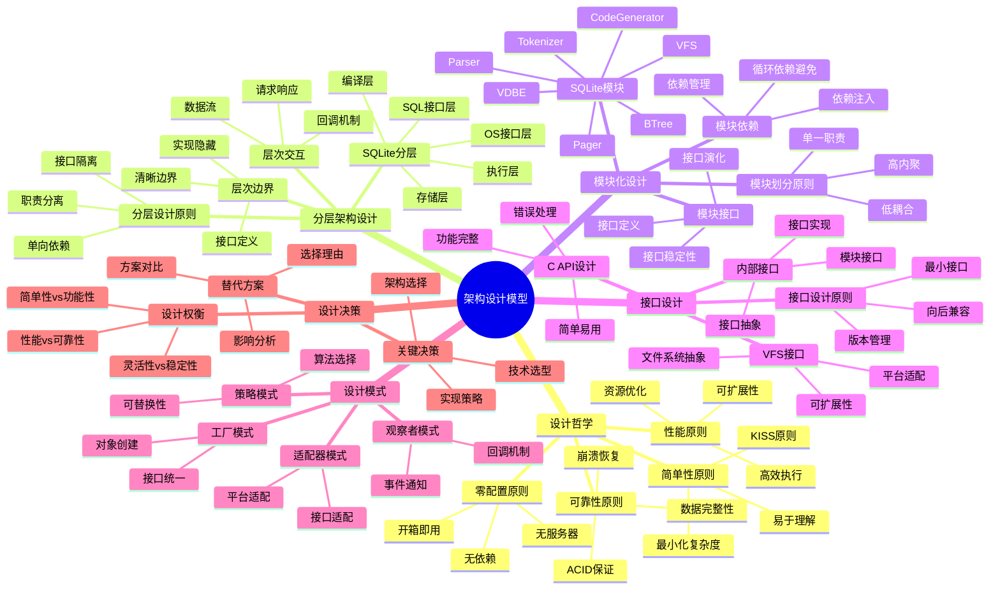

# 架构设计模型：SQLite的设计哲学

> **创建日期**：2025-01-15
> **最后更新**：2025-01-15
> **版本**：SQLite 3.31+ 至 3.47.x

---

## 📋 概述

本文档从架构设计视角深入分析SQLite的设计哲学、设计原则、设计模式和设计决策，帮助理解SQLite的设计思路和实现策略。

---

## 📑 目录

- [架构设计模型：SQLite的设计哲学](#架构设计模型sqlite的设计哲学)
  - [📋 概述](#-概述)
  - [📑 目录](#-目录)
  - [📊 思维导图](#-思维导图)
  - [4. 设计哲学](#4-设计哲学)
    - [4.1. 简单性原则](#41-简单性原则)
    - [4.2. 零配置原则](#42-零配置原则)
    - [4.3. 可靠性原则](#43-可靠性原则)
    - [4.4. 性能原则](#44-性能原则)
  - [5. 分层架构设计](#5-分层架构设计)
    - [5.1. 分层设计原则](#51-分层设计原则)
    - [5.2. SQLite分层设计](#52-sqlite分层设计)
    - [5.3. 层次边界设计](#53-层次边界设计)
    - [5.4. 层次交互设计](#54-层次交互设计)
  - [6. 模块化设计](#6-模块化设计)
    - [6.1. 模块划分原则](#61-模块划分原则)
    - [6.2. SQLite模块设计](#62-sqlite模块设计)
    - [6.3. 模块接口设计](#63-模块接口设计)
    - [6.4. 模块依赖设计](#64-模块依赖设计)
  - [7. 接口设计](#7-接口设计)
    - [7.1. 接口设计原则](#71-接口设计原则)
    - [7.2. C API设计](#72-c-api设计)
    - [7.3. 内部接口设计](#73-内部接口设计)
    - [7.4. VFS接口设计](#74-vfs接口设计)
  - [8. 设计模式应用](#8-设计模式应用)
    - [8.1. 工厂模式](#81-工厂模式)
    - [8.2. 策略模式](#82-策略模式)
    - [8.3. 适配器模式](#83-适配器模式)
    - [8.4. 观察者模式](#84-观察者模式)
  - [8.5. 架构设计决策树](#85-架构设计决策树)
  - [9. 设计决策分析](#9-设计决策分析)
    - [9.1. 关键设计决策](#91-关键设计决策)
    - [9.2. 设计权衡](#92-设计权衡)
    - [9.3. 替代方案评估](#93-替代方案评估)
  - [10. 🔗 相关资源](#10--相关资源)
  - [12. 架构设计概念层次关系图](#12-架构设计概念层次关系图)
    - [12.1. 架构设计概念层次图](#121-架构设计概念层次图)
    - [12.2. 设计模式选择概念关系图](#122-设计模式选择概念关系图)
  - [11. 🔗 交叉引用](#11--交叉引用)
    - [11.1. 核心架构文档](#111-核心架构文档)
    - [11.2. 设计模型文档](#112-设计模型文档)
    - [11.3. 理论模型文档 🆕](#113-理论模型文档-)
    - [11.4. 知识图谱与导航 🆕](#114-知识图谱与导航-)
    - [11.5. 相关概念链接 🆕](#115-相关概念链接-)
      - [11.5.1. 架构设计概念](#1151-架构设计概念)
      - [11.5.2. 架构设计路径](#1152-架构设计路径)
  - [11. 📚 参考资料](#11--参考资料)

---

## 📊 思维导图



---

## 4. 设计哲学

### 4.1. 简单性原则

**KISS原则（Keep It Simple, Stupid）**：

SQLite的设计遵循"简单即美"的原则，追求最小化复杂度。

**简单性体现**：

1. **单一文件数据库**：
   - 无需安装服务器
   - 无需配置管理
   - 文件即数据库

2. **简单的API**：

   ```c
   // 打开数据库
   sqlite3_open("database.db", &db);

   // 执行SQL
   sqlite3_exec(db, "CREATE TABLE ...", NULL, NULL, NULL);

   // 关闭数据库
   sqlite3_close(db);
   ```

3. **零依赖**：
   - 无外部依赖
   - 自包含系统
   - 易于部署

**设计权衡**：

| 简单性 | 功能性 | 选择 |
|--------|--------|------|
| ⭐⭐⭐⭐⭐ | ⭐⭐⭐ | 优先简单性 |

### 4.2. 零配置原则

**零配置设计**：

SQLite设计为"零配置"数据库，开箱即用，无需任何配置。

**零配置体现**：

1. **无服务器架构**：
   - 无需启动服务
   - 无需管理进程
   - 直接使用

2. **默认配置优化**：
   - 合理的默认值
   - 自动优化
   - 智能选择

3. **自动管理**：
   - 自动创建文件
   - 自动管理锁
   - 自动恢复

**设计决策**：

```text
决策：零配置 vs 可配置
选择：零配置优先，提供可选配置
理由：降低使用门槛，提高易用性
```

### 4.3. 可靠性原则

**可靠性设计**：

SQLite将可靠性作为核心设计目标，确保数据安全和系统稳定。

**可靠性保证**：

1. **ACID特性**：
   - 原子性：事务全有全无
   - 一致性：数据完整性
   - 隔离性：事务隔离
   - 持久性：数据持久化

2. **崩溃恢复**：
   - WAL日志
   - 自动恢复
   - 数据完整性检查

3. **错误处理**：
   - 详细的错误码
   - 错误信息
   - 错误恢复机制

**设计权衡**：

| 可靠性 | 性能 | 选择 |
|--------|------|------|
| ⭐⭐⭐⭐⭐ | ⭐⭐⭐⭐ | 可靠性优先 |

### 4.4. 性能原则

**性能设计**：

SQLite在保证可靠性的前提下，追求高性能。

**性能优化**：

1. **编译优化**：
   - 查询优化
   - 索引优化
   - 执行计划优化

2. **存储优化**：
   - B-Tree索引
   - 页面缓存
   - 批量操作

3. **并发优化**：
   - WAL模式
   - 读写分离
   - 锁优化

**设计权衡**：

| 性能 | 简单性 | 选择 |
|------|--------|------|
| ⭐⭐⭐⭐ | ⭐⭐⭐⭐⭐ | 平衡性能和简单性 |

---

## 5. 分层架构设计

### 5.1. 分层设计原则

**分层设计原则**：

1. **职责分离**：每一层有明确的职责
2. **单向依赖**：上层依赖下层，不能反向
3. **接口隔离**：层间通过接口交互
4. **实现隐藏**：下层实现细节对上层隐藏

### 5.2. SQLite分层设计

**五层架构设计**：

```text
┌─────────────────────────────────────┐
│  Layer 5: SQL Interface             │
│  职责：SQL语句处理和API调用           │
│  接口：sqlite3_* API                 │
└─────────────────────────────────────┘
              ↓ 调用
┌─────────────────────────────────────┐
│  Layer 4: Compiler                  │
│  职责：SQL编译和优化                 │
│  接口：编译接口                      │
└─────────────────────────────────────┘
              ↓ 字节码
┌─────────────────────────────────────┐
│  Layer 3: Virtual Machine           │
│  职责：字节码执行                    │
│  接口：VDBE接口                      │
└─────────────────────────────────────┘
              ↓ 存储操作
┌─────────────────────────────────────┐
│  Layer 2: Storage                   │
│  职责：数据存储和索引                 │
│  接口：B-Tree接口                    │
└─────────────────────────────────────┘
              ↓ 文件I/O
┌─────────────────────────────────────┐
│  Layer 1: OS Interface              │
│  职责：操作系统抽象                   │
│  接口：VFS接口                       │
└─────────────────────────────────────┘
```

**分层设计优势**：

- ✅ **清晰职责**：每层职责明确
- ✅ **易于维护**：修改一层不影响其他层
- ✅ **易于测试**：可以分层测试
- ✅ **易于扩展**：可以替换某一层实现

### 5.3. 层次边界设计

**边界设计原则**：

1. **清晰边界**：层次边界明确
2. **接口定义**：边界处定义接口
3. **实现隐藏**：实现细节不跨边界

**SQLite层次边界**：

```c
// Layer 5 → Layer 4 边界
int sqlite3_prepare_v2(
    sqlite3 *db,           // Layer 5
    const char *zSql,      // Layer 5
    int nByte,             // Layer 5
    sqlite3_stmt **ppStmt, // Layer 4
    const char **pzTail    // Layer 5
);

// Layer 4 → Layer 3 边界
Vdbe *sqlite3VdbeCreate(sqlite3 *db);  // Layer 4 → Layer 3

// Layer 3 → Layer 2 边界
int sqlite3BtreeInsert(...);  // Layer 3 → Layer 2

// Layer 2 → Layer 1 边界
int sqlite3OsWrite(...);  // Layer 2 → Layer 1
```

### 5.4. 层次交互设计

**交互模式设计**：

1. **请求-响应模式**：

   ```c
   // 上层请求，下层响应
   result = lower_layer_function(request);
   ```

2. **回调模式**：

   ```c
   // 下层通过回调通知上层
   upper_layer_callback(event);
   ```

3. **数据流模式**：

   ```c
   // 数据从上到下流动
   data → process → result
   ```

---

## 6. 模块化设计

### 6.1. 模块划分原则

**模块划分原则**：

1. **单一职责**：每个模块只负责一个功能
2. **高内聚**：模块内部元素紧密相关
3. **低耦合**：模块间依赖最小化
4. **接口稳定**：模块接口保持稳定

### 6.2. SQLite模块设计

**核心模块划分**：

```text
SQLite = {
  Tokenizer:      // 词法分析模块
    - 职责：SQL字符串 → Token流
    - 接口：tokenize(sql) → tokens
    - 依赖：无

  Parser:         // 语法分析模块
    - 职责：Token流 → AST
    - 接口：parse(tokens) → ast
    - 依赖：Tokenizer

  CodeGenerator:  // 代码生成模块
    - 职责：AST → 字节码
    - 接口：generate(ast) → bytecode
    - 依赖：Parser, VDBE

  VDBE:           // 虚拟机模块
    - 职责：字节码执行
    - 接口：execute(bytecode) → result
    - 依赖：BTree, Pager

  BTree:          // B-Tree模块
    - 职责：B-Tree操作
    - 接口：insert/delete/search(key, value)
    - 依赖：Pager

  Pager:          // 页面管理模块
    - 职责：页面缓存和I/O
    - 接口：read/write(page_id, data)
    - 依赖：VFS

  VFS:            // 虚拟文件系统模块
    - 职责：文件系统抽象
    - 接口：open/read/write/close(file)
    - 依赖：OS
}
```

### 6.3. 模块接口设计

**接口设计原则**：

1. **最小接口**：只暴露必要功能
2. **稳定接口**：接口保持稳定
3. **清晰接口**：接口语义清晰

**模块接口示例**：

```c
// Tokenizer模块接口
typedef struct Tokenizer Tokenizer;
Tokenizer *sqlite3TokenizerCreate(const char *zSql);
int sqlite3TokenizerNext(Tokenizer *p, Token *pToken);
void sqlite3TokenizerDestroy(Tokenizer *p);

// Parser模块接口
typedef struct Parse Parse;
int sqlite3Parse(Parse *pParse, const char *zSql);
void sqlite3ParseFree(Parse *pParse);

// VDBE模块接口
typedef struct Vdbe Vdbe;
Vdbe *sqlite3VdbeCreate(sqlite3 *db);
int sqlite3VdbeExec(Vdbe *p);
void sqlite3VdbeDelete(Vdbe *p);
```

### 6.4. 模块依赖设计

**依赖管理原则**：

1. **避免循环依赖**：模块间不能形成循环
2. **依赖注入**：通过参数传递依赖
3. **接口依赖**：依赖接口而非实现

**SQLite依赖图**：

```text
Tokenizer (无依赖)
    ↓
Parser (依赖 Tokenizer)
    ↓
CodeGenerator (依赖 Parser, VDBE)
    ↓
VDBE (依赖 BTree, Pager)
    ↓
BTree (依赖 Pager)
    ↓
Pager (依赖 VFS)
    ↓
VFS (依赖 OS)
```

**依赖分析**：

- ✅ **无循环依赖**：依赖图是DAG
- ✅ **依赖层次清晰**：依赖方向明确
- ✅ **接口依赖**：通过接口而非实现

---

## 7. 接口设计

### 7.1. 接口设计原则

**接口设计原则**：

1. **最小接口原则**：只暴露必要功能
2. **向后兼容**：保持接口稳定
3. **版本管理**：接口版本化
4. **错误处理**：明确的错误处理

### 7.2. C API设计

**C API设计特点**：

1. **简单易用**：

   ```c
   // 简单的API设计
   sqlite3_open("db.db", &db);
   sqlite3_exec(db, "SQL", callback, arg, &err);
   sqlite3_close(db);
   ```

2. **功能完整**：
   - 基本操作：open, close, exec
   - 高级操作：prepare, step, finalize
   - 工具函数：backup, vacuum, analyze

3. **错误处理**：

   ```c
   int rc = sqlite3_exec(db, sql, NULL, NULL, &errmsg);
   if (rc != SQLITE_OK) {
       fprintf(stderr, "Error: %s\n", errmsg);
       sqlite3_free(errmsg);
   }
   ```

### 7.3. 内部接口设计

**内部接口设计**：

1. **模块接口**：模块间通过接口交互
2. **接口抽象**：隐藏实现细节
3. **接口版本**：接口版本化管理

**内部接口示例**：

```c
// B-Tree模块接口
int sqlite3BtreeOpen(
    const char *zFilename,
    sqlite3 *db,
    Btree **ppBtree,
    int flags
);

int sqlite3BtreeInsert(
    Btree *p,
    BtCursor *pCur,
    const void *pKey,
    int nKey,
    const void *pData,
    int nData
);
```

### 7.4. VFS接口设计

**VFS接口设计**：

1. **文件系统抽象**：统一文件系统接口
2. **可扩展性**：支持自定义VFS
3. **平台适配**：适配不同操作系统

**VFS接口示例**：

```c
typedef struct sqlite3_vfs sqlite3_vfs;
typedef struct sqlite3_file sqlite3_file;

struct sqlite3_vfs {
    int (*xOpen)(sqlite3_vfs*, const char *zName, sqlite3_file*, int, int *);
    int (*xDelete)(sqlite3_vfs*, const char *zName, int);
    int (*xAccess)(sqlite3_vfs*, const char *zName, int, int *);
    // ... 更多接口
};
```

---

## 8. 设计模式应用

### 8.1. 工厂模式

**工厂模式应用**：

SQLite使用工厂模式创建各种对象。

**应用示例**：

```c
// VFS工厂：创建VFS实例
sqlite3_vfs *sqlite3_vfs_find(const char *zVfsName);

// 数据库工厂：创建数据库连接
int sqlite3_open_v2(
    const char *filename,
    sqlite3 **ppDb,
    int flags,
    const char *zVfs  // VFS工厂
);
```

### 8.2. 策略模式

**策略模式应用**：

SQLite使用策略模式选择不同的算法或实现。

**应用示例**：

```c
// 同步策略：FULL, NORMAL, OFF
PRAGMA synchronous = FULL | NORMAL | OFF;

// 日志模式策略：DELETE, WAL, MEMORY, etc.
PRAGMA journal_mode = DELETE | WAL | MEMORY | ...
```

### 8.3. 适配器模式

**适配器模式应用**：

SQLite使用适配器模式适配不同的文件系统。

**应用示例**：

```c
// VFS适配器：适配不同文件系统
sqlite3_vfs_register(sqlite3_vfs*, int makeDflt);

// 自定义VFS适配器
int sqlite3_vfs_register_custom_vfs(custom_vfs_impl);
```

### 8.4. 观察者模式

**观察者模式应用**：

SQLite使用观察者模式处理事件和回调。

**应用示例**：

```c
// 进度回调
void sqlite3_progress_handler(
    sqlite3 *db,
    int nOps,
    int (*xProgress)(void*),
    void *pArg
);

// 提交钩子
void *sqlite3_commit_hook(
    sqlite3 *db,
    int (*xCallback)(void*),
    void *pArg
);
```

---

## 8.5. 架构设计决策树

```text
SQLite架构设计决策树
══════════════════════════════════════════════════════════════════════════════

问题：如何选择SQLite架构设计方案？
    │
    ├─ 应用场景类型？
    │   ├─ 嵌入式应用 → 使用SQLite标准架构
    │   ├─ 移动应用 → 使用SQLite标准架构 + 优化配置
    │   ├─ 桌面应用 → 使用SQLite标准架构
    │   └─ Web应用 → 使用SQLite标准架构 + 连接池
    │
    ├─ 性能要求？
    │   ├─ 高性能要求 → 进入性能优化路径
    │   ├─ 一般性能要求 → 使用标准配置
    │   └─ 低性能要求 → 使用默认配置
    │
    ├─ 性能优化路径
    │   ├─ 读性能要求高？
    │   │   ├─ 是 → 使用覆盖索引 + WAL模式
    │   │   └─ 否 → 使用标准索引
    │   │
    │   ├─ 写性能要求高？
    │   │   ├─ 是 → 使用WAL模式 + 批量事务
    │   │   └─ 否 → 使用DELETE模式
    │   │
    │   └─ 并发性能要求高？
    │       ├─ 是 → 使用WAL模式 + 连接池
    │       └─ 否 → 使用单连接
    │
    ├─ 可靠性要求？
    │   ├─ 高可靠性要求 → 使用FULL同步模式
    │   ├─ 一般可靠性要求 → 使用NORMAL同步模式（推荐）
    │   └─ 低可靠性要求 → 使用OFF同步模式（不推荐）
    │
    ├─ 架构模式选择？
    │   ├─ 需要分层架构？ → 使用SQLite标准分层
    │   ├─ 需要模块化？ → 使用SQLite模块化设计
    │   └─ 需要接口抽象？ → 使用VFS接口
    │
    └─ 设计模式选择？
        ├─ 需要工厂模式？ → 使用VFS工厂
        ├─ 需要策略模式？ → 使用查询优化策略
        ├─ 需要适配器模式？ → 使用VFS适配器
        └─ 需要观察者模式？ → 使用钩子函数

推荐架构组合:
1. 嵌入式应用: 标准架构 + WAL模式 + NORMAL同步
2. 移动应用: 标准架构 + WAL模式 + 连接池 + 缓存优化
3. 桌面应用: 标准架构 + WAL模式 + 批量操作
4. Web应用: 标准架构 + 连接池 + 读写分离 + 监控诊断
```

---

## 9. 设计决策分析

### 9.1. 关键设计决策

**决策1：单文件数据库**:

- **决策**：使用单个文件存储数据库
- **理由**：简单、易用、易备份
- **权衡**：文件大小限制、并发限制
- **影响**：简化部署和管理

**决策2：WAL模式**:

- **决策**：引入WAL模式提升并发性能
- **理由**：读不阻塞写，提升并发
- **权衡**：增加复杂度，需要checkpoint
- **影响**：显著提升并发性能

**决策3：B-Tree存储**:

- **决策**：使用B-Tree作为存储结构
- **理由**：平衡的读写性能
- **权衡**：写入可能较慢
- **影响**：良好的查询性能

### 9.2. 设计权衡

**权衡1：简单性 vs 功能性**:

| 维度 | 简单性 | 功能性 |
|------|--------|--------|
| **选择** | ⭐⭐⭐⭐⭐ | ⭐⭐⭐ |
| **理由** | 降低使用门槛 | 满足基本需求 |
| **影响** | 易于使用和维护 | 功能相对有限 |

**权衡2：性能 vs 可靠性**:

| 维度 | 性能 | 可靠性 |
|------|------|--------|
| **选择** | ⭐⭐⭐⭐ | ⭐⭐⭐⭐⭐ |
| **理由** | 保证基本性能 | 数据安全优先 |
| **影响** | 性能良好 | 可靠性极高 |

**权衡3：灵活性 vs 稳定性**:

| 维度 | 灵活性 | 稳定性 |
|------|--------|--------|
| **选择** | ⭐⭐⭐ | ⭐⭐⭐⭐⭐ |
| **理由** | 保持接口稳定 | 向后兼容 |
| **影响** | 扩展性有限 | 接口稳定 |

### 9.3. 替代方案评估

**方案1：多文件数据库**:

- **方案**：使用多个文件存储数据库
- **评估**：
  - ✅ 优点：支持更大数据库
  - ❌ 缺点：复杂度增加，管理困难
- **选择**：单文件（简单性优先）

**方案2：客户端-服务器架构**:

- **方案**：采用客户端-服务器架构
- **评估**：
  - ✅ 优点：更好的并发和扩展性
  - ❌ 缺点：需要服务器，配置复杂
- **选择**：嵌入式（零配置优先）

**方案3：LSM-Tree存储**:

- **方案**：使用LSM-Tree替代B-Tree
- **评估**：
  - ✅ 优点：写入性能更好
  - ❌ 缺点：读取性能较差，复杂度高
- **选择**：B-Tree（平衡性能）

---

## 10. 🔗 相关资源

- [11.01 系统理论模型](../11-理论模型/11.01-系统理论模型.md)
- [01.01 编译执行模型](../01-核心架构/01.01-编译执行模型.md)

---

## 12. 架构设计概念层次关系图

### 12.1. 架构设计概念层次图

```mermaid
graph TB
    subgraph "架构设计核心概念"
        A[架构设计] --> B[设计哲学]
        A --> C[分层架构设计]
        A --> D[模块化设计]
        A --> E[接口设计]
        A --> F[设计模式]

        B --> B1[简单性原则]
        B --> B2[零配置原则]
        B --> B3[可靠性原则]
        B --> B4[性能原则]

        B1 --> B11[KISS原则]
        B1 --> B12[最小化复杂度]
        B1 --> B13[易于理解]

        C --> C1[SQL接口层]
        C --> C2[编译层]
        C --> C3[执行层]
        C --> C4[存储层]
        C --> C5[OS接口层]

        C1 --> C11[SQL解析]
        C1 --> C12[接口抽象]

        C2 --> C21[语法分析]
        C2 --> C22[查询优化]

        C3 --> C31[VDBE执行]
        C3 --> C32[事务管理]

        C4 --> C41[B-Tree]
        C4 --> C42[Pager]

        C5 --> C51[VFS]
        C5 --> C52[文件I/O]

        D --> D1[Tokenizer模块]
        D --> D2[Parser模块]
        D --> D3[CodeGenerator模块]
        D --> D4[VDBE模块]
        D --> D5[BTree模块]
        D --> D6[Pager模块]

        D1 --> D11[词法分析]
        D1 --> D12[单一职责]

        D2 --> D21[语法分析]
        D2 --> D22[依赖Tokenizer]

        E --> E1[C API设计]
        E --> E2[内部接口设计]
        E --> E3[VFS接口设计]

        E1 --> E11[简单易用]
        E1 --> E12[稳定可靠]

        F --> F1[工厂模式]
        F --> F2[策略模式]
        F --> F3[适配器模式]
        F --> F4[观察者模式]

        F1 --> F11[VFS工厂]
        F1 --> F12[创建VFS实例]

        F2 --> F21[查询优化策略]
        F2 --> F22[索引选择策略]
    end

    subgraph "设计决策"
        G[设计决策] --> G1[关键设计决策]
        G --> G2[设计权衡]
        G --> G3[替代方案评估]

        G1 --> G11[单文件数据库]
        G1 --> G12[WAL模式]
        G1 --> G13[B-Tree存储]

        G2 --> G21[简单性 vs 功能性]
        G2 --> G22[性能 vs 可靠性]
        G2 --> G23[灵活性 vs 稳定性]
    end

    A --> G
    C --> D
    D --> E
    E --> F
```



### 12.2. 设计模式选择概念关系图

```text
设计模式选择概念关系图
══════════════════════════════════════════════════════════════════════════════

设计模式层次:
┌─────────────────────────────────────────────────────────────┐
│  创建型模式                                                  │
│  ├─ 工厂模式（Factory Pattern）                             │
│  │   ├─ 应用场景: VFS创建                                    │
│  │   ├─ 实现方式: sqlite3_vfs_find()                        │
│  │   ├─ 优势: 解耦VFS创建和使用                              │
│  │   └─ 效果: 支持多种VFS实现                                │
│  │                                                           │
│  └─ 单例模式（Singleton Pattern）                           │
│      ├─ 应用场景: 全局配置                                   │
│      ├─ 实现方式: 静态变量                                   │
│      └─ 效果: 保证全局唯一                                   │
└─────────────────────────────────────────────────────────────┘
         ↓
┌─────────────────────────────────────────────────────────────┐
│  行为型模式                                                  │
│  ├─ 策略模式（Strategy Pattern）                             │
│  │   ├─ 应用场景: 查询优化策略                                │
│  │   ├─ 实现方式: 查询优化器选择策略                          │
│  │   ├─ 优势: 灵活切换优化策略                                │
│  │   └─ 效果: 支持多种优化算法                                │
│  │                                                           │
│  ├─ 观察者模式（Observer Pattern）                           │
│  │   ├─ 应用场景: 钩子函数                                   │
│  │   ├─ 实现方式: sqlite3_update_hook()                      │
│  │   ├─ 优势: 解耦事件和响应                                 │
│  │   └─ 效果: 支持自定义事件处理                              │
│  │                                                           │
│  └─ 模板方法模式（Template Method Pattern）                 │
│      ├─ 应用场景: 查询执行流程                                │
│      ├─ 实现方式: 固定执行流程，可变步骤                      │
│      └─ 效果: 保证执行流程一致性                              │
└─────────────────────────────────────────────────────────────┘
         ↓
┌─────────────────────────────────────────────────────────────┐
│  结构型模式                                                  │
│  ├─ 适配器模式（Adapter Pattern）                            │
│  │   ├─ 应用场景: VFS适配不同文件系统                         │
│  │   ├─ 实现方式: VFS接口适配                                 │
│  │   ├─ 优势: 统一接口，支持多种文件系统                      │
│  │   └─ 效果: 支持内存、磁盘、网络文件系统                     │
│  │                                                           │
│  ├─ 装饰器模式（Decorator Pattern）                          │
│  │   ├─ 应用场景: 查询结果包装                                │
│  │   ├─ 实现方式: 结果集装饰                                  │
│  │   └─ 效果: 增强结果集功能                                  │
│  │                                                           │
│  └─ 外观模式（Facade Pattern）                               │
│      ├─ 应用场景: C API封装                                   │
│      ├─ 实现方式: 简化接口                                    │
│      └─ 效果: 隐藏内部复杂性                                   │
└─────────────────────────────────────────────────────────────┘

设计模式选择原则:
1. 创建型模式: 用于对象创建（工厂模式、单例模式）
2. 行为型模式: 用于对象行为（策略模式、观察者模式）
3. 结构型模式: 用于对象结构（适配器模式、装饰器模式）

设计模式应用场景:
1. VFS创建 → 工厂模式
2. 查询优化 → 策略模式
3. 事件处理 → 观察者模式
4. 文件系统适配 → 适配器模式
5. API封装 → 外观模式
```

---

## 11. 🔗 交叉引用

### 11.1. 核心架构文档

- ⭐⭐⭐ [编译执行模型](../01-核心架构/01.01-编译执行模型.md) - 执行模型基础（含交叉引用）
- ⭐⭐⭐ [事务与并发控制](../01-核心架构/01.02-事务与并发控制.md) - 并发控制基础（含论证脉络）
- ⭐⭐⭐ [存储引擎](../01-核心架构/01.03-存储引擎.md) - 存储引擎基础（含论证脉络）
- ⭐⭐⭐ [核心机制全景图](../01-核心架构/01.05-SQLite核心机制全景图-多维度整合分析.md) - 核心机制整合分析

### 11.2. 设计模型文档

- ⭐⭐ [设计原则](./12.02-设计原则.md) - 设计原则
- ⭐⭐ [设计模式](./12.03-设计模式.md) - 设计模式
- ⭐⭐ [设计决策](./12.04-设计决策.md) - 设计决策

### 11.3. 理论模型文档 🆕

- ⭐⭐⭐ [系统理论模型](../11-理论模型/11.01-系统理论模型.md) - 系统组合理论、分层架构理论
- ⭐⭐ [算法复杂度理论](../11-理论模型/11.03-算法复杂度理论.md) - 架构复杂度分析

### 11.4. 知识图谱与导航 🆕

- ⭐⭐⭐ [知识图谱与概念关系网络](../09-最新特性/09.03-SQLite知识图谱与概念关系网络.md) - 架构设计概念关系
- ⭐⭐ [文档依赖关系图](../00-项目导航/06-文档依赖关系图.md) - 架构设计文档依赖
- ⭐⭐ [术语标准化词典](../00-项目导航/03-术语词典/SQLite术语标准化词典.md) - 架构设计术语索引

### 11.5. 相关概念链接 🆕

#### 11.5.1. 架构设计概念

- **分层架构** → [知识图谱：架构设计概念](../09-最新特性/09.03-SQLite知识图谱与概念关系网络.md#核心本体编译执行)
- **模块化设计** → [知识图谱：模块化设计概念](../09-最新特性/09.03-SQLite知识图谱与概念关系网络.md#核心本体编译执行)
- **接口抽象** → [知识图谱：接口抽象概念](../09-最新特性/09.03-SQLite知识图谱与概念关系网络.md#核心本体编译执行)

#### 11.5.2. 架构设计路径

- **架构设计知识路径** → [知识图谱：架构设计路径](../09-最新特性/09.03-SQLite知识图谱与概念关系网络.md#路径1基础入门路径)

---

- [12.02 设计原则](../12-设计模型/12.02-设计原则.md)

---

## 11. 📚 参考资料

- 《设计模式：可复用面向对象软件的基础》
- 《软件架构：面向复杂系统的结构化设计》
- 《系统分析与设计方法》

---

**最后更新**：2025-01-15
**维护者**：Data-Science Team
