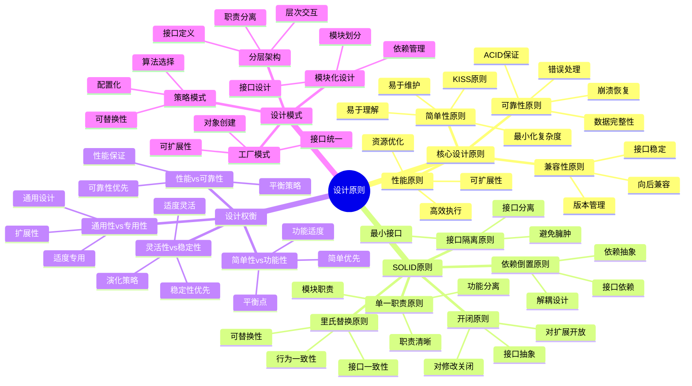

# 设计原则：SQLite的设计哲学与实践

> **创建日期**：2025-01-15
> **最后更新**：2025-01-15
> **版本**：SQLite 3.31+ 至 3.47.x

---

## 1. 📋 概述

本文档从设计原则视角深入分析SQLite的设计哲学、SOLID原则应用、设计权衡和最佳实践，帮助理解SQLite的设计思路。

---

## 1. 📑 目录

- [设计原则：SQLite的设计哲学与实践](#设计原则sqlite的设计哲学与实践)
  - [1. 📋 概述](#1--概述)
  - [1. 📑 目录](#1--目录)
  - [3. 📊 思维导图](#3--思维导图)
  - [4. 核心设计原则](#4-核心设计原则)
    - [4.1. 简单性原则](#41-简单性原则)
    - [4.2. 可靠性原则](#42-可靠性原则)
    - [4.3. 性能原则](#43-性能原则)
    - [4.4. 兼容性原则](#44-兼容性原则)
  - [5. SOLID原则应用](#5-solid原则应用)
    - [5.1. 单一职责原则](#51-单一职责原则)
    - [5.2. 开闭原则](#52-开闭原则)
    - [5.3. 里氏替换原则](#53-里氏替换原则)
    - [5.4. 接口隔离原则](#54-接口隔离原则)
    - [5.5. 依赖倒置原则](#55-依赖倒置原则)
  - [6. 设计权衡](#6-设计权衡)
    - [6.1. 简单性 vs 功能性](#61-简单性-vs-功能性)
    - [6.2. 性能 vs 可靠性](#62-性能-vs-可靠性)
    - [6.3. 灵活性 vs 稳定性](#63-灵活性-vs-稳定性)
    - [6.4. 通用性 vs 专用性](#64-通用性-vs-专用性)
  - [7. 设计模式应用](#7-设计模式应用)
    - [7.1. 分层架构模式](#71-分层架构模式)
    - [7.2. 模块化设计模式](#72-模块化设计模式)
    - [7.3. 策略模式](#73-策略模式)
    - [7.4. 工厂模式](#74-工厂模式)
  - [8. 设计原则总结](#8-设计原则总结)
    - [8.1. 核心原则](#81-核心原则)
    - [8.2. SOLID原则应用](#82-solid原则应用)
    - [8.3. 设计权衡](#83-设计权衡)
    - [8.4. 设计模式](#84-设计模式)
  - [9. 🔗 相关资源](#9--相关资源)
  - [10. 📚 参考资料](#10--参考资料)

---

## 3. 📊 思维导图



---

## 4. 核心设计原则

### 4.1. 简单性原则

**KISS原则（Keep It Simple, Stupid）**：

SQLite将简单性作为核心设计原则，追求最小化复杂度。

**简单性体现**：

1. **单一文件数据库**：
   - 无需服务器
   - 无需配置
   - 文件即数据库

2. **简单的API**：

   ```c
   // 三个核心函数
   sqlite3_open()   // 打开数据库
   sqlite3_exec()   // 执行SQL
   sqlite3_close()  // 关闭数据库
   ```

3. **零依赖**：
   - 无外部依赖
   - 自包含系统
   - 易于部署

**简单性度量**：

```text
复杂度度量：
  Complexity = f(API数量, 配置项, 依赖数, 代码行数)

SQLite复杂度：
  - API数量：~200个（相对较少）
  - 配置项：~50个PRAGMA（可选）
  - 依赖数：0（零依赖）
  - 代码行数：~15万行（相对精简）

复杂度评估：低复杂度 ✅
```

### 4.2. 可靠性原则

**可靠性设计**：

SQLite将可靠性作为最高优先级，确保数据安全和系统稳定。

**可靠性保证**：

1. **ACID特性**：
   - 原子性：事务全有全无
   - 一致性：数据完整性
   - 隔离性：事务隔离
   - 持久性：数据持久化

2. **崩溃恢复**：
   - WAL日志
   - 自动恢复
   - 完整性检查

3. **错误处理**：
   - 详细错误码
   - 错误信息
   - 错误恢复

**可靠性度量**：

```text
可靠性指标：
  Reliability = f(MTBF, MTTR, ErrorRate, DataLossRate)

SQLite可靠性：
  - MTBF（平均故障间隔时间）：极高
  - MTTR（平均修复时间）：极短（自动恢复）
  - ErrorRate：极低
  - DataLossRate：0（理论上）

可靠性评估：极高可靠性 ✅
```

### 4.3. 性能原则

**性能设计**：

SQLite在保证可靠性的前提下，追求高性能。

**性能优化**：

1. **编译优化**：
   - 查询优化
   - 索引优化
   - 执行计划优化

2. **存储优化**：
   - B-Tree索引
   - 页面缓存
   - 批量操作

3. **并发优化**：
   - WAL模式
   - 读写分离
   - 锁优化

**性能指标**：

```text
性能指标：
  Performance = f(Throughput, Latency, ResourceUsage)

SQLite性能：
  - 读取吞吐量：> 100,000 ops/s
  - 写入吞吐量：> 50,000 ops/s
  - 查询延迟：< 1ms（索引查询）
  - 资源占用：低

性能评估：高性能 ✅
```

### 4.4. 兼容性原则

**兼容性设计**：

SQLite重视向后兼容，保持接口稳定。

**兼容性保证**：

1. **向后兼容**：
   - API向后兼容
   - 文件格式兼容
   - SQL语法兼容

2. **接口稳定**：
   - 稳定的C API
   - 稳定的文件格式
   - 稳定的行为

3. **版本管理**：
   - 语义化版本
   - 兼容性说明
   - 迁移指南

**兼容性策略**：

```text
兼容性策略：
  - 新功能通过新API添加
  - 旧API保持可用
  - 废弃前提供警告
  - 版本化接口

兼容性评估：高兼容性 ✅
```

---

## 5. SOLID原则应用

### 5.1. 单一职责原则

**单一职责原则（SRP）**：

每个模块应该只有一个引起它变化的原因。

**SQLite应用**：

```text
模块职责划分：
  Tokenizer: 只负责词法分析
  Parser: 只负责语法分析
  CodeGenerator: 只负责代码生成
  VDBE: 只负责字节码执行
  BTree: 只负责B-Tree操作
  Pager: 只负责页面管理
  VFS: 只负责文件系统抽象

职责清晰度：高 ✅
```

### 5.2. 开闭原则

**开闭原则（OCP）**：

对扩展开放，对修改关闭。

**SQLite应用**：

```text
扩展点设计：
  1. VFS接口：可扩展文件系统
  2. 自定义函数：可扩展SQL函数
  3. 虚拟表：可扩展表类型
  4. 扩展模块：可扩展功能

扩展示例：
  // 自定义VFS
  sqlite3_vfs_register(custom_vfs, 1);

  // 自定义函数
  sqlite3_create_function(db, "my_func", ...);

扩展性评估：高扩展性 ✅
```

### 5.3. 里氏替换原则

**里氏替换原则（LSP）**：

子类型必须能够替换它们的基类型。

**SQLite应用**：

```text
接口一致性：
  - VFS接口：不同VFS实现可替换
  - 存储接口：不同存储后端可替换
  - 函数接口：自定义函数可替换

替换示例：
  // 替换VFS实现
  sqlite3_vfs_register(memory_vfs, 1);
  sqlite3_vfs_register(disk_vfs, 0);

可替换性：高 ✅
```

### 5.4. 接口隔离原则

**接口隔离原则（ISP）**：

客户端不应该依赖它不需要的接口。

**SQLite应用**：

```text
接口设计：
  - 最小接口：只暴露必要功能
  - 接口分离：不同功能分离
  - 可选功能：通过可选接口提供

接口示例：
  // 基本接口
  sqlite3_open()
  sqlite3_exec()
  sqlite3_close()

  // 高级接口（可选）
  sqlite3_prepare_v2()
  sqlite3_step()
  sqlite3_finalize()

接口隔离度：高 ✅
```

### 5.5. 依赖倒置原则

**依赖倒置原则（DIP）**：

高层模块不应该依赖低层模块，两者都应该依赖抽象。

**SQLite应用**：

```text
依赖抽象：
  - VFS抽象：高层模块依赖VFS接口
  - 存储抽象：高层模块依赖存储接口
  - 函数抽象：高层模块依赖函数接口

依赖关系：
  HighLevel → Interface ← LowLevel

依赖倒置度：高 ✅
```

---

## 6. 设计权衡

### 6.1. 简单性 vs 功能性

**权衡分析**：

| 维度 | 简单性 | 功能性 |
|------|--------|--------|
| **优先级** | ⭐⭐⭐⭐⭐ | ⭐⭐⭐ |
| **选择** | 优先简单性 | 满足基本需求 |
| **理由** | 降低使用门槛 | 功能相对有限 |
| **影响** | 易于使用和维护 | 功能扩展有限 |

**权衡决策**：

```text
决策模型：
  if 简单性收益 > 功能性损失:
    选择简单性
  else:
    选择功能性

SQLite选择：简单性优先 ✅
```

### 6.2. 性能 vs 可靠性

**权衡分析**：

| 维度 | 性能 | 可靠性 |
|------|------|--------|
| **优先级** | ⭐⭐⭐⭐ | ⭐⭐⭐⭐⭐ |
| **选择** | 保证基本性能 | 可靠性优先 |
| **理由** | 性能良好 | 数据安全优先 |
| **影响** | 性能良好 | 可靠性极高 |

**权衡决策**：

```text
决策模型：
  if 可靠性要求高:
    可靠性优先
  else:
    性能优先

SQLite选择：可靠性优先 ✅
```

### 6.3. 灵活性 vs 稳定性

**权衡分析**：

| 维度 | 灵活性 | 稳定性 |
|------|--------|--------|
| **优先级** | ⭐⭐⭐ | ⭐⭐⭐⭐⭐ |
| **选择** | 适度灵活 | 稳定性优先 |
| **理由** | 保持接口稳定 | 向后兼容 |
| **影响** | 扩展性有限 | 接口稳定 |

**权衡决策**：

```text
决策模型：
  if 稳定性要求高:
    稳定性优先
  else:
    灵活性优先

SQLite选择：稳定性优先 ✅
```

### 6.4. 通用性 vs 专用性

**权衡分析**：

| 维度 | 通用性 | 专用性 |
|------|--------|--------|
| **优先级** | ⭐⭐⭐⭐ | ⭐⭐⭐ |
| **选择** | 通用设计 | 适度专用 |
| **理由** | 广泛适用 | 特定优化 |
| **影响** | 适用场景广 | 特定场景优化 |

**权衡决策**：

```text
决策模型：
  if 适用场景多样:
    通用性优先
  else:
    专用性优先

SQLite选择：通用性优先 ✅
```

---

## 7. 设计模式应用

### 7.1. 分层架构模式

**分层架构**：

SQLite采用五层架构模式，实现职责分离。

**架构层次**：

```text
Layer 5: SQL Interface
  ↓
Layer 4: Compiler
  ↓
Layer 3: Virtual Machine
  ↓
Layer 2: Storage
  ↓
Layer 1: OS Interface
```

**模式优势**：

- ✅ 职责清晰
- ✅ 易于维护
- ✅ 易于测试
- ✅ 易于扩展

### 7.2. 模块化设计模式

**模块化设计**：

SQLite采用模块化设计，实现高内聚低耦合。

**模块划分**：

```text
Modules = {
  Tokenizer,
  Parser,
  CodeGenerator,
  VDBE,
  BTree,
  Pager,
  VFS
}
```

**模式优势**：

- ✅ 高内聚
- ✅ 低耦合
- ✅ 易于维护
- ✅ 易于扩展

### 7.3. 策略模式

**策略模式**：

SQLite使用策略模式选择不同的算法或实现。

**应用示例**：

```c
// 同步策略
PRAGMA synchronous = FULL | NORMAL | OFF;

// 日志模式策略
PRAGMA journal_mode = DELETE | WAL | MEMORY | ...

// 缓存策略
PRAGMA cache_size = -size;
```

**模式优势**：

- ✅ 算法可替换
- ✅ 配置灵活
- ✅ 易于扩展

### 7.4. 工厂模式

**工厂模式**：

SQLite使用工厂模式创建各种对象。

**应用示例**：

```c
// VFS工厂
sqlite3_vfs *sqlite3_vfs_find(const char *zVfsName);

// 数据库工厂
int sqlite3_open_v2(
    const char *filename,
    sqlite3 **ppDb,
    int flags,
    const char *zVfs  // VFS工厂
);
```

**模式优势**：

- ✅ 对象创建统一
- ✅ 接口抽象
- ✅ 易于扩展

---

## 8. 设计原则总结

### 8.1. 核心原则

**设计原则总结**：

1. **简单性优先**：KISS原则，最小化复杂度
2. **可靠性优先**：ACID保证，数据安全
3. **性能保证**：高效执行，资源优化
4. **兼容性保证**：向后兼容，接口稳定

### 8.2. SOLID原则应用

**SOLID原则总结**：

- ✅ **单一职责**：模块职责清晰
- ✅ **开闭原则**：可扩展设计
- ✅ **里氏替换**：接口一致性
- ✅ **接口隔离**：最小接口
- ✅ **依赖倒置**：依赖抽象

### 8.3. 设计权衡

**权衡总结**：

- 简单性 > 功能性
- 可靠性 > 性能
- 稳定性 > 灵活性
- 通用性 > 专用性

### 8.4. 设计模式

**模式应用**：

- ✅ 分层架构模式
- ✅ 模块化设计模式
- ✅ 策略模式
- ✅ 工厂模式

---

## 9. 🔗 相关资源

- [12.01 架构设计模型](./12.01-架构设计模型.md)
- [11.01 系统理论模型](../11-理论模型/11.01-系统理论模型.md)
- [01.01 编译执行模型](../01-核心架构/01.01-编译执行模型.md)

---

## 10. 📚 参考资料

- 《设计模式：可复用面向对象软件的基础》
- 《代码整洁之道》
- 《重构：改善既有代码的设计》

---

**最后更新**：2025-01-15
**维护者**：Data-Science Team
