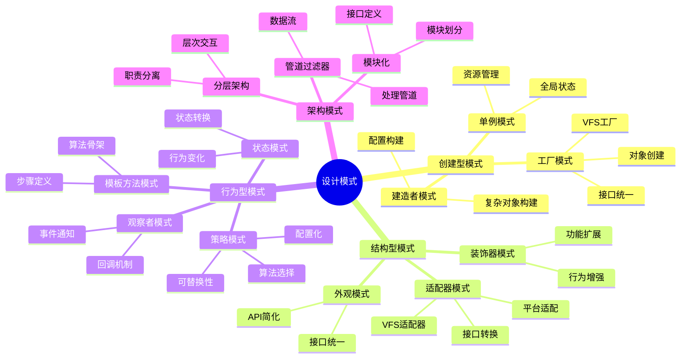

# 设计模式：SQLite中的模式应用

> **创建日期**：2025-01-15
> **最后更新**：2025-01-15
> **版本**：SQLite 3.31+ 至 3.47.x

---

## 1. 📋 概述

本文档深入分析SQLite中应用的各种设计模式，包括创建型模式、结构型模式和行为型模式，帮助理解SQLite的设计实现。

---

## 2. 📑 目录

- [设计模式：SQLite中的模式应用](#设计模式sqlite中的模式应用)
  - [1. 📋 概述](#1--概述)
  - [2. 📑 目录](#2--目录)
  - [3. 📊 思维导图](#3--思维导图)
  - [4. 创建型模式](#4-创建型模式)
    - [4.1. 工厂模式](#41-工厂模式)
    - [4.2. 单例模式](#42-单例模式)
    - [4.3. 建造者模式](#43-建造者模式)
  - [5. 结构型模式](#5-结构型模式)
    - [5.1. 适配器模式](#51-适配器模式)
    - [5.2. 装饰器模式](#52-装饰器模式)
    - [5.3. 外观模式](#53-外观模式)
  - [6. 行为型模式](#6-行为型模式)
    - [6.1. 策略模式](#61-策略模式)
    - [6.2. 观察者模式](#62-观察者模式)
    - [6.3. 模板方法模式](#63-模板方法模式)
    - [6.4. 状态模式](#64-状态模式)
  - [7. 架构模式](#7-架构模式)
    - [7.1. 分层架构模式](#71-分层架构模式)
    - [7.2. 管道-过滤器模式](#72-管道-过滤器模式)
    - [7.3. 模块化模式](#73-模块化模式)
  - [8. 设计模式总结](#8-设计模式总结)
    - [8.1. 模式应用总结](#81-模式应用总结)
    - [8.2. 模式应用优势](#82-模式应用优势)
    - [8.3. 模式应用场景](#83-模式应用场景)
    - [8.4. 设计模式应用代码示例](#84-设计模式应用代码示例)
  - [9. 🔗 相关资源](#9--相关资源)
  - [10. 📚 参考资料](#10--参考资料)

---

## 3. 📊 思维导图



---

## 4. 创建型模式

### 4.1. 工厂模式

**工厂模式应用**：

SQLite使用工厂模式创建VFS、数据库连接等对象。

**VFS工厂**：

```c
// VFS工厂接口
sqlite3_vfs *sqlite3_vfs_find(const char *zVfsName);
int sqlite3_vfs_register(sqlite3_vfs *pVfs, int makeDflt);

// 使用示例
sqlite3_vfs *vfs = sqlite3_vfs_find("unix");  // 查找VFS
sqlite3_vfs_register(custom_vfs, 1);          // 注册VFS
```

**数据库工厂**：

```c
// 数据库创建工厂
int sqlite3_open_v2(
    const char *filename,
    sqlite3 **ppDb,
    int flags,
    const char *zVfs  // VFS工厂参数
);

// 使用示例
sqlite3 *db;
sqlite3_open_v2("test.db", &db, SQLITE_OPEN_READWRITE, "unix");
```

**模式优势**：

- ✅ 对象创建统一
- ✅ 接口抽象
- ✅ 易于扩展
- ✅ 解耦创建逻辑

### 4.2. 单例模式

**单例模式应用**：

SQLite使用单例模式管理全局状态和资源。

**全局状态单例**：

```c
// 全局错误处理
static sqlite3GlobalConfig gConfig = {
    // 全局配置
};

// 获取全局配置（单例）
sqlite3_config(SQLITE_CONFIG_MULTITHREAD, ...);
```

**模式优势**：

- ✅ 全局状态管理
- ✅ 资源统一管理
- ✅ 避免重复初始化

### 4.3. 建造者模式

**建造者模式应用**：

SQLite使用建造者模式构建复杂的SQL语句和查询计划。

**查询计划构建**：

```c
// 查询计划构建器
typedef struct Select Select;
Select *sqlite3SelectNew(
    Parse *pParse,        // 解析器
    ExprList *pEList,     // 选择列表
    SrcList *pSrc,        // 数据源
    Expr *pWhere,         // WHERE条件
    ExprList *pGroupBy,   // GROUP BY
    Expr *pHaving,        // HAVING
    ExprList *pOrderBy,   // ORDER BY
    Expr *pLimit,         // LIMIT
    Expr *pOffset         // OFFSET
);
```

**模式优势**：

- ✅ 复杂对象构建
- ✅ 构建过程清晰
- ✅ 参数可选

---

## 5. 结构型模式

### 5.1. 适配器模式

**适配器模式应用**：

SQLite使用适配器模式适配不同的文件系统和平台。

**VFS适配器**：

```c
// VFS适配器接口
typedef struct sqlite3_vfs sqlite3_vfs;
struct sqlite3_vfs {
    int iVersion;
    int szOsFile;
    int mxPathname;
    sqlite3_vfs *pNext;
    const char *zName;
    void *pAppData;
    int (*xOpen)(sqlite3_vfs*, const char *zName, sqlite3_file*, int, int *);
    int (*xDelete)(sqlite3_vfs*, const char *zName, int);
    // ... 更多适配方法
};

// Unix VFS适配器
static sqlite3_vfs unixVfs = {
    .xOpen = unixOpen,
    .xDelete = unixDelete,
    // ... 适配Unix系统调用
};

// Windows VFS适配器
static sqlite3_vfs winVfs = {
    .xOpen = winOpen,
    .xDelete = winDelete,
    // ... 适配Windows API
};
```

**模式优势**：

- ✅ 平台适配
- ✅ 接口统一
- ✅ 易于扩展

### 5.2. 装饰器模式

**装饰器模式应用**：

SQLite使用装饰器模式扩展功能。

**功能装饰器**：

```c
// 加密装饰器
int sqlite3_key(sqlite3 *db, const void *pKey, int nKey);

// 压缩装饰器
int sqlite3_compress_extension(...);

// 审计装饰器
void sqlite3_audit_hook(
    sqlite3 *db,
    int (*xAudit)(void*,int,const char*,const char*,const char*),
    void *pArg
);
```

**模式优势**：

- ✅ 功能扩展
- ✅ 动态添加功能
- ✅ 不修改原有代码

### 5.3. 外观模式

**外观模式应用**：

SQLite的C API作为外观，简化复杂的内部操作。

**API外观**：

```c
// 简单的外观接口
int sqlite3_exec(
    sqlite3 *db,                    // 数据库
    const char *sql,                // SQL语句
    int (*callback)(void*,int,char**,char**),  // 回调
    void *arg,                      // 用户数据
    char **errmsg                   // 错误消息
);

// 内部实现（复杂）
// sqlite3_exec 内部调用：
//   1. sqlite3_prepare_v2()
//   2. sqlite3_step()
//   3. sqlite3_finalize()
//   4. 错误处理
//   5. 资源管理
```

**模式优势**：

- ✅ 简化接口
- ✅ 隐藏复杂性
- ✅ 易于使用

---

## 6. 行为型模式

### 6.1. 策略模式

**策略模式应用**：

SQLite使用策略模式选择不同的算法和实现。

**同步策略**：

```c
// 同步策略选择
PRAGMA synchronous = FULL | NORMAL | OFF;

// 内部实现
switch(syncMode) {
    case FULL:
        // 完全同步策略
        sqlite3OsSync(pFile, SQLITE_SYNC_FULL);
        break;
    case NORMAL:
        // 正常同步策略
        sqlite3OsSync(pFile, SQLITE_SYNC_NORMAL);
        break;
    case OFF:
        // 关闭同步策略
        // 不执行同步
        break;
}
```

**日志模式策略**：

```c
// 日志模式策略
PRAGMA journal_mode = DELETE | WAL | MEMORY | TRUNCATE | PERSIST | OFF;

// 策略实现
typedef struct {
    const char *zMode;
    int eMode;
    int (*xOpen)(sqlite3_vfs*, const char*, sqlite3_file*, int, int*);
} JournalMode;

static JournalMode journalModes[] = {
    {"delete", SQLITE_JOURNALMODE_DELETE, deleteOpen},
    {"wal", SQLITE_JOURNALMODE_WAL, walOpen},
    {"memory", SQLITE_JOURNALMODE_MEMORY, memOpen},
    // ...
};
```

**模式优势**：

- ✅ 算法可替换
- ✅ 配置灵活
- ✅ 易于扩展

### 6.2. 观察者模式

**观察者模式应用**：

SQLite使用观察者模式处理事件和回调。

**进度观察者**：

```c
// 进度回调（观察者）
void sqlite3_progress_handler(
    sqlite3 *db,
    int nOps,
    int (*xProgress)(void*),
    void *pArg
);

// 使用示例
sqlite3_progress_handler(db, 1000, progress_callback, NULL);

int progress_callback(void *arg) {
    // 观察者处理逻辑
    return 0;  // 返回非0取消操作
}
```

**提交钩子（观察者）**：

```c
// 提交钩子（观察者）
void *sqlite3_commit_hook(
    sqlite3 *db,
    int (*xCallback)(void*),
    void *pArg
);

// 使用示例
sqlite3_commit_hook(db, commit_callback, NULL);

int commit_callback(void *arg) {
    // 观察者处理逻辑
    return 0;  // 返回非0回滚事务
}
```

**模式优势**：

- ✅ 事件通知
- ✅ 解耦观察者和被观察者
- ✅ 支持多个观察者

### 6.3. 模板方法模式

**模板方法模式应用**：

SQLite使用模板方法模式定义算法骨架。

**查询执行模板**：

```c
// 查询执行模板方法
int sqlite3_exec_template(sqlite3 *db, const char *sql) {
    // 1. 准备阶段（模板方法）
    sqlite3_prepare_v2(db, sql, -1, &stmt, NULL);

    // 2. 执行阶段（模板方法）
    while (sqlite3_step(stmt) == SQLITE_ROW) {
        // 处理行（可定制）
        process_row(stmt);
    }

    // 3. 清理阶段（模板方法）
    sqlite3_finalize(stmt);
}
```

**模式优势**：

- ✅ 算法骨架定义
- ✅ 步骤可定制
- ✅ 代码复用

### 6.4. 状态模式

**状态模式应用**：

SQLite使用状态模式管理事务状态和锁状态。

**事务状态**：

```c
// 事务状态
typedef enum {
    TRANS_NONE,      // 无事务
    TRANS_READ,      // 读事务
    TRANS_WRITE,     // 写事务
    TRANS_EXCLUSIVE  // 排他事务
} TransactionState;

// 状态转换
int begin_transaction(sqlite3 *db, TransactionState state) {
    switch(state) {
        case TRANS_READ:
            return begin_read_transaction(db);
        case TRANS_WRITE:
            return begin_write_transaction(db);
        case TRANS_EXCLUSIVE:
            return begin_exclusive_transaction(db);
        default:
            return SQLITE_ERROR;
    }
}
```

**模式优势**：

- ✅ 状态管理清晰
- ✅ 状态转换明确
- ✅ 行为随状态变化

---

## 7. 架构模式

### 7.1. 分层架构模式

**分层架构**：

SQLite采用五层架构模式。

**架构层次**：

```text
┌─────────────────────────────────────┐
│  Layer 5: SQL Interface              │
│  模式：外观模式                      │
└─────────────────────────────────────┘
              ↓
┌─────────────────────────────────────┐
│  Layer 4: Compiler                   │
│  模式：管道-过滤器模式               │
└─────────────────────────────────────┘
              ↓
┌─────────────────────────────────────┐
│  Layer 3: Virtual Machine            │
│  模式：解释器模式                    │
└─────────────────────────────────────┘
              ↓
┌─────────────────────────────────────┐
│  Layer 2: Storage                    │
│  模式：策略模式                      │
└─────────────────────────────────────┘
              ↓
┌─────────────────────────────────────┐
│  Layer 1: OS Interface               │
│  模式：适配器模式                    │
└─────────────────────────────────────┘
```

**模式优势**：

- ✅ 职责分离
- ✅ 层次清晰
- ✅ 易于维护

### 7.2. 管道-过滤器模式

**管道-过滤器模式**：

SQLite的编译过程采用管道-过滤器模式。

**编译管道**：

```text
SQL字符串
    ↓
[Tokenizer]  → Token流
    ↓
[Parser]     → AST
    ↓
[CodeGenerator] → 字节码
    ↓
[Optimizer]  → 优化字节码
    ↓
VDBE字节码
```

**模式优势**：

- ✅ 处理步骤清晰
- ✅ 易于扩展
- ✅ 易于测试

### 7.3. 模块化模式

**模块化模式**：

SQLite采用模块化设计。

**模块划分**：

```text
Modules = {
  Tokenizer:      // 词法分析模块
  Parser:         // 语法分析模块
  CodeGenerator:  // 代码生成模块
  VDBE:           // 虚拟机模块
  BTree:          // B-Tree模块
  Pager:          // 页面管理模块
  VFS:            // 文件系统模块
}
```

**模式优势**：

- ✅ 高内聚
- ✅ 低耦合
- ✅ 易于维护

---

## 8. 设计模式总结

### 8.1. 模式应用总结

**创建型模式**：

- ✅ 工厂模式：VFS创建、数据库创建
- ✅ 单例模式：全局状态管理
- ✅ 建造者模式：查询计划构建

**结构型模式**：

- ✅ 适配器模式：VFS适配、平台适配
- ✅ 装饰器模式：功能扩展
- ✅ 外观模式：API简化

**行为型模式**：

- ✅ 策略模式：算法选择
- ✅ 观察者模式：事件通知
- ✅ 模板方法模式：算法骨架
- ✅ 状态模式：状态管理

**架构模式**：

- ✅ 分层架构模式
- ✅ 管道-过滤器模式
- ✅ 模块化模式

### 8.2. 模式应用优势

**设计优势**：

- ✅ 代码复用
- ✅ 易于维护
- ✅ 易于扩展
- ✅ 解耦设计

### 8.3. 模式应用场景

**应用场景**：

- 系统架构设计
- 模块设计
- 接口设计
- 功能扩展

### 8.4. 设计模式应用代码示例

**工厂模式应用**：

```python
import sqlite3

class DatabaseFactory:
    """数据库工厂模式"""

    @staticmethod
    def create_database(db_type='file', **kwargs):
        """创建数据库连接"""
        if db_type == 'file':
            return sqlite3.connect(kwargs.get('filename', ':memory:'))
        elif db_type == 'memory':
            return sqlite3.connect(':memory:')
        elif db_type == 'temporary':
            return sqlite3.connect('')
        else:
            raise ValueError(f"Unknown database type: {db_type}")

# 使用工厂模式
db1 = DatabaseFactory.create_database('file', filename='test.db')
db2 = DatabaseFactory.create_database('memory')
db3 = DatabaseFactory.create_database('temporary')

print("✅ 工厂模式应用示例")
```

**策略模式应用**：

```python
import sqlite3

class SyncStrategy:
    """同步策略接口"""
    def apply(self, conn):
        raise NotImplementedError

class FullSyncStrategy(SyncStrategy):
    """完全同步策略"""
    def apply(self, conn):
        conn.execute('PRAGMA synchronous=FULL')
        print("应用完全同步策略")

class NormalSyncStrategy(SyncStrategy):
    """正常同步策略"""
    def apply(self, conn):
        conn.execute('PRAGMA synchronous=NORMAL')
        print("应用正常同步策略")

class OffSyncStrategy(SyncStrategy):
    """关闭同步策略"""
    def apply(self, conn):
        conn.execute('PRAGMA synchronous=OFF')
        print("应用关闭同步策略")

class DatabaseConfig:
    """数据库配置（使用策略模式）"""
    def __init__(self, sync_strategy: SyncStrategy):
        self.sync_strategy = sync_strategy

    def configure(self, conn):
        self.sync_strategy.apply(conn)

# 使用策略模式
conn = sqlite3.connect(':memory:')
config = DatabaseConfig(FullSyncStrategy())
config.configure(conn)

print("✅ 策略模式应用示例")
```

**观察者模式应用**：

```python
import sqlite3

class DatabaseObserver:
    """数据库观察者接口"""
    def on_commit(self, transaction_id):
        raise NotImplementedError

    def on_rollback(self, transaction_id):
        raise NotImplementedError

class LoggingObserver(DatabaseObserver):
    """日志观察者"""
    def on_commit(self, transaction_id):
        print(f"Transaction {transaction_id} committed")

    def on_rollback(self, transaction_id):
        print(f"Transaction {transaction_id} rolled back")

class AuditObserver(DatabaseObserver):
    """审计观察者"""
    def on_commit(self, transaction_id):
        print(f"Audit: Transaction {transaction_id} committed")

    def on_rollback(self, transaction_id):
        print(f"Audit: Transaction {transaction_id} rolled back")

class ObservableDatabase:
    """可观察的数据库（观察者模式）"""
    def __init__(self, conn):
        self.conn = conn
        self.observers = []
        self.transaction_id = 0

    def add_observer(self, observer: DatabaseObserver):
        self.observers.append(observer)

    def commit(self):
        self.transaction_id += 1
        self.conn.commit()
        for observer in self.observers:
            observer.on_commit(self.transaction_id)

    def rollback(self):
        self.transaction_id += 1
        self.conn.rollback()
        for observer in self.observers:
            observer.on_rollback(self.transaction_id)

# 使用观察者模式
conn = sqlite3.connect(':memory:')
db = ObservableDatabase(conn)
db.add_observer(LoggingObserver())
db.add_observer(AuditObserver())

db.conn.execute('CREATE TABLE test (id INTEGER)')
db.commit()

print("✅ 观察者模式应用示例")
```

**适配器模式应用**：

```python
import sqlite3

class VFSAdapter:
    """VFS适配器接口"""
    def open(self, filename, flags):
        raise NotImplementedError

    def read(self, file, size, offset):
        raise NotImplementedError

    def write(self, file, data, offset):
        raise NotImplementedError

class UnixVFSAdapter(VFSAdapter):
    """Unix VFS适配器"""
    def open(self, filename, flags):
        print(f"Unix: Opening {filename} with flags {flags}")
        return open(filename, 'rb+')

    def read(self, file, size, offset):
        file.seek(offset)
        return file.read(size)

    def write(self, file, data, offset):
        file.seek(offset)
        file.write(data)

class WindowsVFSAdapter(VFSAdapter):
    """Windows VFS适配器"""
    def open(self, filename, flags):
        print(f"Windows: Opening {filename} with flags {flags}")
        return open(filename, 'rb+')

    def read(self, file, size, offset):
        file.seek(offset)
        return file.read(size)

    def write(self, file, data, offset):
        file.seek(offset)
        file.write(data)

# 使用适配器模式
import platform
if platform.system() == 'Windows':
    vfs = WindowsVFSAdapter()
else:
    vfs = UnixVFSAdapter()

print("✅ 适配器模式应用示例")
```

---

## 9. 🔗 相关资源

- [12.01 架构设计模型](./12.01-架构设计模型.md)
- [12.02 设计原则](./12.02-设计原则.md)
- [01.01 编译执行模型](../01-核心架构/01.01-编译执行模型.md)

---

## 10. 📚 参考资料

- 《设计模式：可复用面向对象软件的基础》
- 《Head First设计模式》
- 《设计模式解析》

---

**最后更新**：2025-01-15
**维护者**：Data-Science Team
