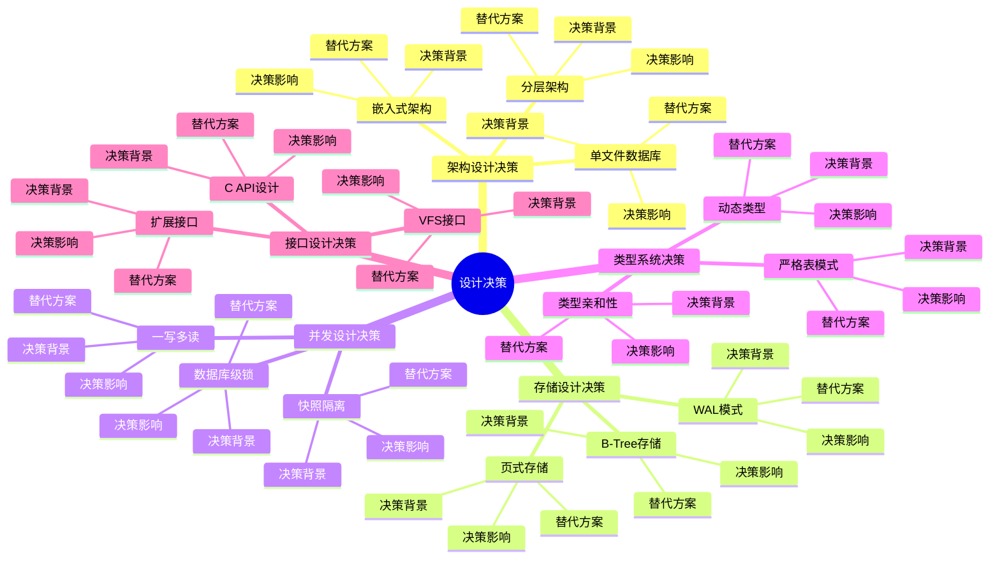

# 设计决策：SQLite关键设计选择分析

> **创建日期**：2025-01-15
> **最后更新**：2025-01-15
> **版本**：SQLite 3.31+ 至 3.47.x

---

## 1. 📋 概述

本文档深入分析SQLite的关键设计决策，包括决策背景、替代方案评估、决策影响和决策权衡，帮助理解SQLite的设计思路。

---

## 1. 📑 目录

- [设计决策：SQLite关键设计选择分析](#设计决策sqlite关键设计选择分析)
  - [1. 📋 概述](#1--概述)
  - [1. 📑 目录](#1--目录)
  - [3. 📊 思维导图](#3--思维导图)
  - [4. 架构设计决策](#4-架构设计决策)
    - [4.1. 单文件数据库决策](#41-单文件数据库决策)
    - [4.2. 嵌入式架构决策](#42-嵌入式架构决策)
    - [4.3. 分层架构决策](#43-分层架构决策)
  - [5. 存储设计决策](#5-存储设计决策)
    - [5.1. B-Tree存储决策](#51-b-tree存储决策)
    - [5.2. 页式存储决策](#52-页式存储决策)
    - [5.3. WAL模式决策](#53-wal模式决策)
  - [6. 并发设计决策](#6-并发设计决策)
    - [6.1. 数据库级锁决策](#61-数据库级锁决策)
    - [6.2. 快照隔离决策](#62-快照隔离决策)
    - [6.3. 一写多读决策](#63-一写多读决策)
  - [7. 类型系统决策](#7-类型系统决策)
    - [7.1. 动态类型决策](#71-动态类型决策)
    - [7.2. 类型亲和性决策](#72-类型亲和性决策)
    - [7.3. 严格表模式决策](#73-严格表模式决策)
  - [8. 接口设计决策](#8-接口设计决策)
    - [8.1. C API设计决策](#81-c-api设计决策)
    - [8.2. VFS接口决策](#82-vfs接口决策)
    - [8.3. 扩展接口决策](#83-扩展接口决策)
  - [9. 设计决策总结](#9-设计决策总结)
    - [9.1. 决策原则](#91-决策原则)
    - [9.2. 决策模式](#92-决策模式)
    - [9.3. 决策影响](#93-决策影响)
    - [9.4. 决策评估](#94-决策评估)
  - [10. 🔗 相关资源](#10--相关资源)
  - [11. 📚 参考资料](#11--参考资料)

---

## 3. 📊 思维导图



---

## 4. 架构设计决策

### 4.1. 单文件数据库决策

**决策背景**：

SQLite选择单文件数据库架构，而非多文件或分布式架构。

**决策理由**：

1. **简单性**：单文件易于管理、备份和迁移
2. **零配置**：无需配置文件，开箱即用
3. **可移植性**：文件可在不同系统间移动
4. **易用性**：降低使用门槛

**替代方案评估**：

| 方案 | 优点 | 缺点 | 评估 |
|------|------|------|------|
| **单文件** | 简单、易用、易备份 | 文件大小限制、并发限制 | ✅ 选择 |
| **多文件** | 支持更大数据库 | 复杂度高、管理困难 | ❌ 未选择 |
| **分布式** | 高并发、可扩展 | 复杂度极高、需要网络 | ❌ 未选择 |

**决策影响**：

- ✅ **正面影响**：
  - 简单易用
  - 易于部署
  - 易于备份
  - 零配置

- ⚠️ **限制**：
  - 文件大小限制（~140TB）
  - 并发写入限制（一写多读）
  - 不适合高并发写场景

**决策权衡**：

```text
权衡分析：
  简单性收益 > 功能限制损失
  易用性收益 > 性能限制损失

决策：单文件架构 ✅
```

### 4.2. 嵌入式架构决策

**决策背景**：

SQLite选择嵌入式架构，而非客户端-服务器架构。

**决策理由**：

1. **零配置**：无需服务器进程
2. **低延迟**：无网络开销
3. **简单部署**：单文件部署
4. **资源占用**：资源占用小

**替代方案评估**：

| 方案 | 优点 | 缺点 | 评估 |
|------|------|------|------|
| **嵌入式** | 零配置、低延迟、简单 | 并发有限、扩展性有限 | ✅ 选择 |
| **客户端-服务器** | 高并发、可扩展 | 需要服务器、配置复杂 | ❌ 未选择 |

**决策影响**：

- ✅ **正面影响**：
  - 零配置
  - 低延迟
  - 简单部署
  - 资源占用小

- ⚠️ **限制**：
  - 并发写入有限
  - 扩展性有限
  - 不适合高并发场景

**决策权衡**：

```text
权衡分析：
  简单性收益 > 并发限制损失
  易用性收益 > 扩展性限制损失

决策：嵌入式架构 ✅
```

### 4.3. 分层架构决策

**决策背景**：

SQLite选择五层分层架构，实现职责分离。

**决策理由**：

1. **职责分离**：每层职责明确
2. **易于维护**：修改一层不影响其他层
3. **易于测试**：可以分层测试
4. **易于扩展**：可以替换某一层

**替代方案评估**：

| 方案 | 优点 | 缺点 | 评估 |
|------|------|------|------|
| **分层架构** | 职责清晰、易于维护 | 层次调用开销 | ✅ 选择 |
| **扁平架构** | 性能好 | 耦合度高、难以维护 | ❌ 未选择 |
| **微内核架构** | 高度模块化 | 复杂度高 | ❌ 未选择 |

**决策影响**：

- ✅ **正面影响**：
  - 职责清晰
  - 易于维护
  - 易于测试
  - 易于扩展

- ⚠️ **开销**：
  - 层次调用开销（< 5%）

**决策权衡**：

```text
权衡分析：
  可维护性收益 > 性能开销损失

决策：分层架构 ✅
```

---

## 5. 存储设计决策

### 5.1. B-Tree存储决策

**决策背景**：

SQLite选择B-Tree作为主要存储结构。

**决策理由**：

1. **平衡性能**：读写性能平衡
2. **范围查询**：支持高效范围查询
3. **成熟稳定**：B-Tree技术成熟
4. **空间效率**：空间利用率高

**替代方案评估**：

| 方案 | 优点 | 缺点 | 评估 |
|------|------|------|------|
| **B-Tree** | 平衡性能、范围查询 | 写入可能较慢 | ✅ 选择 |
| **LSM-Tree** | 写入性能好 | 读取性能差、复杂度高 | ❌ 未选择 |
| **Hash索引** | 点查询快 | 不支持范围查询 | ❌ 未选择 |

**决策影响**：

- ✅ **正面影响**：
  - 平衡的读写性能
  - 高效的范围查询
  - 成熟稳定

- ⚠️ **限制**：
  - 写入性能可能较慢
  - 需要维护B-Tree结构

**决策权衡**：

```text
权衡分析：
  通用性收益 > 写入性能损失

决策：B-Tree存储 ✅
```

### 5.2. 页式存储决策

**决策背景**：

SQLite选择页式存储，而非记录式存储。

**决策理由**：

1. **I/O效率**：页是I/O单位，效率高
2. **缓存友好**：页面缓存效果好
3. **空间管理**：页面级空间管理简单
4. **成熟技术**：页式存储技术成熟

**替代方案评估**：

| 方案 | 优点 | 缺点 | 评估 |
|------|------|------|------|
| **页式存储** | I/O效率高、缓存友好 | 内部碎片 | ✅ 选择 |
| **记录式存储** | 无内部碎片 | I/O效率低 | ❌ 未选择 |

**决策影响**：

- ✅ **正面影响**：
  - I/O效率高
  - 缓存友好
  - 空间管理简单

- ⚠️ **开销**：
  - 内部碎片（可接受）

**决策权衡**：

```text
权衡分析：
  I/O效率收益 > 碎片损失

决策：页式存储 ✅
```

### 5.3. WAL模式决策

**决策背景**：

SQLite引入WAL模式以提升并发性能。

**决策理由**：

1. **并发性能**：读不阻塞写
2. **写入性能**：顺序写入性能好
3. **崩溃恢复**：恢复速度快
4. **向后兼容**：保留DELETE模式

**替代方案评估**：

| 方案 | 优点 | 缺点 | 评估 |
|------|------|------|------|
| **WAL模式** | 并发性能好、写入快 | 需要checkpoint | ✅ 选择 |
| **DELETE模式** | 简单、兼容性好 | 并发性能差 | ⚠️ 保留 |
| **MEMORY模式** | 性能最好 | 不持久化 | ❌ 不适合 |

**决策影响**：

- ✅ **正面影响**：
  - 并发性能显著提升
  - 写入性能提升
  - 恢复速度快

- ⚠️ **开销**：
  - 需要checkpoint
  - WAL文件管理

**决策权衡**：

```text
权衡分析：
  性能收益 > 管理复杂度损失

决策：引入WAL模式 ✅
```

---

## 6. 并发设计决策

### 6.1. 数据库级锁决策

**决策背景**：

SQLite选择数据库级锁，而非行级锁或表级锁。

**决策理由**：

1. **简单性**：锁管理简单
2. **性能**：锁开销小
3. **可靠性**：死锁风险低
4. **适合场景**：适合嵌入式场景

**替代方案评估**：

| 方案 | 优点 | 缺点 | 评估 |
|------|------|------|------|
| **数据库级锁** | 简单、可靠 | 并发有限 | ✅ 选择 |
| **行级锁** | 并发高 | 复杂度高、开销大 | ❌ 未选择 |
| **表级锁** | 简单 | 并发极低 | ❌ 未选择 |

**决策影响**：

- ✅ **正面影响**：
  - 锁管理简单
  - 死锁风险低
  - 性能开销小

- ⚠️ **限制**：
  - 并发写入有限
  - 不适合高并发写场景

**决策权衡**：

```text
权衡分析：
  简单性收益 > 并发限制损失

决策：数据库级锁 ✅
```

### 6.2. 快照隔离决策

**决策背景**：

SQLite选择快照隔离作为默认隔离级别。

**决策理由**：

1. **读性能**：读不阻塞写
2. **一致性**：保证读一致性
3. **实现简单**：实现相对简单
4. **适合场景**：适合读多写少场景

**替代方案评估**：

| 方案 | 优点 | 缺点 | 评估 |
|------|------|------|------|
| **快照隔离** | 读性能好、一致性好 | 写冲突检测 | ✅ 选择 |
| **可串行化** | 最强隔离 | 性能差 | ❌ 未选择 |
| **读未提交** | 性能最好 | 一致性差 | ❌ 未选择 |

**决策影响**：

- ✅ **正面影响**：
  - 读性能好
  - 读一致性保证
  - 适合读多写少场景

- ⚠️ **限制**：
  - 写冲突需要检测
  - 可能产生写偏斜

**决策权衡**：

```text
权衡分析：
  读性能收益 > 写冲突损失

决策：快照隔离 ✅
```

### 6.3. 一写多读决策

**决策背景**：

SQLite选择一写多读并发模型。

**决策理由**：

1. **简单性**：实现简单
2. **可靠性**：冲突少、死锁少
3. **适合场景**：适合读多写少场景
4. **WAL支持**：WAL模式支持一写多读

**替代方案评估**：

| 方案 | 优点 | 缺点 | 评估 |
|------|------|------|------|
| **一写多读** | 简单、可靠 | 写并发有限 | ✅ 选择 |
| **多写多读** | 并发高 | 复杂度高、冲突多 | ❌ 未选择 |

**决策影响**：

- ✅ **正面影响**：
  - 实现简单
  - 冲突少
  - 死锁少

- ⚠️ **限制**：
  - 写并发有限
  - 不适合高并发写场景

**决策权衡**：

```text
权衡分析：
  简单性收益 > 写并发限制损失

决策：一写多读 ✅
```

---

## 7. 类型系统决策

### 7.1. 动态类型决策

**决策背景**：

SQLite选择动态类型系统作为默认类型系统。

**决策理由**：

1. **灵活性**：类型转换灵活
2. **易用性**：使用简单
3. **兼容性**：兼容SQL标准
4. **向后兼容**：保持向后兼容

**替代方案评估**：

| 方案 | 优点 | 缺点 | 评估 |
|------|------|------|------|
| **动态类型** | 灵活、易用 | 类型安全弱 | ✅ 默认 |
| **静态类型** | 类型安全强 | 灵活性差 | ⚠️ 可选（严格模式） |

**决策影响**：

- ✅ **正面影响**：
  - 使用灵活
  - 易于使用
  - 兼容性好

- ⚠️ **风险**：
  - 类型安全弱
  - 可能产生类型错误

**决策权衡**：

```text
权衡分析：
  易用性收益 > 类型安全损失

决策：动态类型（默认）✅
补充：严格表模式（可选）✅
```

### 7.2. 类型亲和性决策

**决策背景**：

SQLite引入类型亲和性机制，在灵活性和类型安全间平衡。

**决策理由**：

1. **平衡**：平衡灵活性和类型安全
2. **优化**：优化存储和性能
3. **兼容性**：兼容SQL标准
4. **向后兼容**：保持向后兼容

**决策影响**：

- ✅ **正面影响**：
  - 平衡灵活性和类型安全
  - 优化存储
  - 优化性能

- ⚠️ **复杂性**：
  - 类型转换规则复杂
  - 可能产生意外转换

**决策权衡**：

```text
权衡分析：
  平衡收益 > 复杂性损失

决策：类型亲和性 ✅
```

### 7.3. 严格表模式决策

**决策背景**：

SQLite 3.37.0引入严格表模式，提供更强的类型安全。

**决策理由**：

1. **类型安全**：提供更强的类型安全
2. **向后兼容**：不影响现有代码
3. **可选性**：用户可选择使用
4. **标准对齐**：对齐SQL标准

**决策影响**：

- ✅ **正面影响**：
  - 类型安全强
  - 标准对齐
  - 可选使用

- ⚠️ **限制**：
  - 灵活性降低
  - 需要显式类型转换

**决策权衡**：

```text
权衡分析：
  类型安全收益 > 灵活性损失

决策：引入严格表模式（可选）✅
```

---

## 8. 接口设计决策

### 8.1. C API设计决策

**决策背景**：

SQLite选择C API作为主要接口。

**决策理由**：

1. **性能**：C API性能好
2. **通用性**：C API通用性强
3. **绑定**：易于绑定到其他语言
4. **标准**：C是系统编程标准

**替代方案评估**：

| 方案 | 优点 | 缺点 | 评估 |
|------|------|------|------|
| **C API** | 性能好、通用性强 | 使用复杂 | ✅ 选择 |
| **C++ API** | 面向对象、易用 | 绑定困难 | ❌ 未选择 |
| **Python API** | 易用 | 性能差、语言特定 | ❌ 未选择 |

**决策影响**：

- ✅ **正面影响**：
  - 性能好
  - 通用性强
  - 易于绑定

- ⚠️ **复杂性**：
  - 使用相对复杂
  - 需要手动内存管理

**决策权衡**：

```text
权衡分析：
  通用性收益 > 易用性损失

决策：C API ✅
补充：提供高级API简化使用 ✅
```

### 8.2. VFS接口决策

**决策背景**：

SQLite设计VFS接口，抽象文件系统操作。

**决策理由**：

1. **可移植性**：支持不同平台
2. **可扩展性**：支持自定义VFS
3. **测试性**：易于测试
4. **灵活性**：支持内存数据库等

**决策影响**：

- ✅ **正面影响**：
  - 高度可移植
  - 易于扩展
  - 易于测试
  - 支持特殊场景

**决策权衡**：

```text
权衡分析：
  可移植性收益 > 接口复杂度损失

决策：VFS接口 ✅
```

### 8.3. 扩展接口决策

**决策背景**：

SQLite提供扩展接口，支持自定义功能。

**决策理由**：

1. **可扩展性**：支持功能扩展
2. **灵活性**：用户可定制
3. **生态**：支持扩展生态
4. **向后兼容**：不影响核心功能

**扩展接口类型**：

```text
扩展接口：
  1. 自定义函数：sqlite3_create_function()
  2. 自定义聚合：sqlite3_create_window_function()
  3. 虚拟表：sqlite3_module
  4. VFS：sqlite3_vfs
  5. 扩展加载：sqlite3_load_extension()
```

**决策影响**：

- ✅ **正面影响**：
  - 高度可扩展
  - 用户可定制
  - 生态丰富

**决策权衡**：

```text
权衡分析：
  可扩展性收益 > 维护复杂度损失

决策：扩展接口 ✅
```

---

## 9. 设计决策总结

### 9.1. 决策原则

**核心决策原则**：

1. **简单性优先**：优先选择简单的方案
2. **可靠性优先**：优先保证可靠性
3. **向后兼容**：保持向后兼容
4. **可选性**：提供可选的高级功能

### 9.2. 决策模式

**决策模式**：

- 简单性 > 功能性
- 可靠性 > 性能
- 通用性 > 专用性
- 稳定性 > 灵活性

### 9.3. 决策影响

**总体影响**：

- ✅ **优势**：
  - 简单易用
  - 高度可靠
  - 广泛适用
  - 易于部署

- ⚠️ **限制**：
  - 并发写入有限
  - 扩展性有限
  - 不适合高并发场景

### 9.4. 决策评估

**决策评估**：

- ✅ **成功决策**：单文件、嵌入式、B-Tree、WAL
- ✅ **平衡决策**：动态类型、数据库级锁、快照隔离
- ✅ **补充决策**：严格表模式、扩展接口

---

## 10. 🔗 相关资源

- [12.01 架构设计模型](./12.01-架构设计模型.md)
- [12.02 设计原则](./12.02-设计原则.md)
- [01.01 编译执行模型](../01-核心架构/01.01-编译执行模型.md)

---

## 11. 📚 参考资料

- 《软件架构：面向复杂系统的结构化设计》
- 《系统分析与设计方法》
- SQLite设计文档

---

**最后更新**：2025-01-15
**维护者**：Data-Science Team
