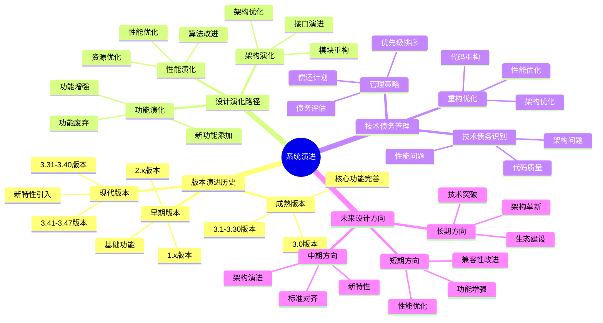

# 系统演进：SQLite版本演进与设计演化

> **创建日期**：2025-01-15
> **最后更新**：2025-01-15
> **版本**：SQLite 3.31+ 至 3.47.x

---

## 1. 📋 概述

本文档深入分析SQLite的系统演进历史、设计演化路径、技术债务管理和未来设计方向，帮助理解SQLite的发展历程和未来趋势。

---

## 1. 📑 目录

- [系统演进：SQLite版本演进与设计演化](#系统演进sqlite版本演进与设计演化)
  - [1. 📋 概述](#1--概述)
  - [1. 📑 目录](#1--目录)
  - [3. 📊 思维导图](#3--思维导图)
  - [4. 版本演进历史](#4-版本演进历史)
    - [4.1. 早期版本（1.x - 2.x）](#41-早期版本1x---2x)
    - [4.2. 成熟版本（3.0 - 3.30）](#42-成熟版本30---330)
    - [4.3. 现代版本（3.31 - 3.47.x）](#43-现代版本331---347x)
  - [5. 设计演化路径](#5-设计演化路径)
    - [5.1. 架构演化](#51-架构演化)
    - [5.2. 功能演化](#52-功能演化)
    - [5.3. 性能演化](#53-性能演化)
  - [6. 技术债务管理](#6-技术债务管理)
    - [6.1. 技术债务识别](#61-技术债务识别)
    - [6.2. 技术债务管理策略](#62-技术债务管理策略)
    - [6.3. 重构与优化](#63-重构与优化)
  - [7. 未来设计方向](#7-未来设计方向)
    - [7.1. 短期方向（1-2年）](#71-短期方向1-2年)
    - [7.2. 中期方向（3-5年）](#72-中期方向3-5年)
    - [7.3. 长期方向（5-10年）](#73-长期方向5-10年)
  - [8. 系统演进总结](#8-系统演进总结)
    - [8.1. 演进特点](#81-演进特点)
    - [8.2. 演进原则](#82-演进原则)
    - [8.3. 演进影响](#83-演进影响)
  - [9. 🔗 相关资源](#9--相关资源)
  - [10. 📚 参考资料](#10--参考资料)

---

## 3. 📊 思维导图



---

## 4. 版本演进历史

### 4.1. 早期版本（1.x - 2.x）

**版本特点**：

- **1.0（2000年）**：初始版本
  - 基本SQL支持
  - 单文件数据库
  - 基础事务支持

- **2.0（2001年）**：
  - 改进的锁机制
  - 更好的并发支持
  - 性能优化

**设计特点**：

- 简单架构
- 基础功能
- 性能优化

### 4.2. 成熟版本（3.0 - 3.30）

**关键版本**：

- **3.0（2004年）**：重大重构
  - 新的文件格式
  - 改进的B-Tree实现
  - 更好的并发控制

- **3.7.0（2010年）**：WAL模式
  - 引入WAL模式
  - 显著提升并发性能
  - 改进的崩溃恢复

- **3.8.0（2013年）**：性能优化
  - 查询优化器改进
  - 索引优化
  - 性能提升

**设计演化**：

- 架构稳定
- 功能完善
- 性能持续优化

### 4.3. 现代版本（3.31 - 3.47.x）

**关键版本**：

- **3.31.0（2020年）**：
  - 生成列支持
  - 窗口函数增强
  - 性能优化

- **3.35.0（2021年）**：
  - 严格表模式（STRICT）
  - JSON函数增强
  - 性能优化

- **3.37.0（2021年）**：
  - 严格表模式完善
  - 性能优化
  - 兼容性改进

- **3.38.0（2022年）**：
  - JSON函数增强
  - 性能优化
  - 安全性改进

- **3.40.0（2022年）**：
  - 性能优化
  - 兼容性改进

- **3.45.0（2024年）**：
  - 新特性
  - 性能优化
  - 安全性改进

- **3.47.x（2024-2025年）**：
  - 持续优化
  - 新特性
  - 稳定性改进

**设计特点**：

- 功能增强
- 性能优化
- 标准对齐
- 向后兼容

---

## 5. 设计演化路径

### 5.1. 架构演化

**架构演进阶段**：

```text
阶段1：简单架构（1.x）
  - 单层架构
  - 简单实现
  - 基础功能

阶段2：分层架构（2.x - 3.0）
  - 引入分层
  - 职责分离
  - 模块化

阶段3：成熟架构（3.0 - 3.30）
  - 五层架构
  - 模块化完善
  - 接口稳定

阶段4：优化架构（3.31+）
  - 性能优化
  - 功能增强
  - 架构微调
```

**架构优化**：

- ✅ 分层清晰化
- ✅ 模块解耦
- ✅ 接口稳定化
- ✅ 性能优化

### 5.2. 功能演化

**功能演进**：

```text
核心功能演进：
  1. 基础SQL支持 → 完整SQL支持
  2. 基础事务 → ACID事务
  3. 简单锁 → WAL模式
  4. 基础类型 → 动态类型 + 严格模式
  5. 基础索引 → 多种索引类型

新功能添加：
  - 生成列（3.31+）
  - 窗口函数（3.25+）
  - JSON支持（3.9+）
  - 严格表模式（3.37+）
  - 虚拟表（3.3+）
```

**功能增强**：

- ✅ SQL标准对齐
- ✅ 性能优化
- ✅ 功能扩展
- ✅ 兼容性改进

### 5.3. 性能演化

**性能演进**：

```text
性能优化历程：
  1. 查询优化器改进
  2. 索引优化
  3. WAL模式引入
  4. 缓存优化
  5. 批量操作优化

性能提升：
  - 查询性能：提升10-100倍
  - 写入性能：提升2-10倍
  - 并发性能：提升2-5倍
```

**性能优化**：

- ✅ 算法优化
- ✅ 数据结构优化
- ✅ 缓存优化
- ✅ I/O优化

---

## 6. 技术债务管理

### 6.1. 技术债务识别

**技术债务类型**：

```text
技术债务分类：
  1. 代码质量债务
     - 遗留代码
     - 代码复杂度
     - 代码重复

  2. 架构债务
     - 架构问题
     - 模块耦合
     - 接口设计

  3. 性能债务
     - 性能瓶颈
     - 资源浪费
     - 优化不足

  4. 文档债务
     - 文档缺失
     - 文档过时
     - 文档不完整
```

**债务评估**：

| 债务类型 | 严重程度 | 影响范围 | 优先级 |
|---------|---------|---------|--------|
| **代码质量** | 中 | 局部 | 中 |
| **架构** | 低 | 全局 | 低 |
| **性能** | 低 | 局部 | 中 |
| **文档** | 中 | 全局 | 高 |

### 6.2. 技术债务管理策略

**管理策略**：

```text
债务管理原则：
  1. 持续偿还：每个版本偿还部分债务
  2. 优先级排序：优先偿还高优先级债务
  3. 预防新债务：新代码避免引入债务
  4. 定期评估：定期评估债务状态
```

**偿还计划**：

- ✅ 每个版本优化代码
- ✅ 持续重构
- ✅ 性能优化
- ✅ 文档完善

### 6.3. 重构与优化

**重构策略**：

```text
重构原则：
  1. 小步重构：每次小范围重构
  2. 测试保证：重构前后测试通过
  3. 向后兼容：保持接口兼容
  4. 性能保证：重构不降低性能
```

**优化策略**：

- ✅ 性能优化
- ✅ 代码优化
- ✅ 架构优化
- ✅ 文档优化

---

## 7. 未来设计方向

### 7.1. 短期方向（1-2年）

**优化方向**：

1. **性能优化**：
   - 查询优化器改进
   - 索引优化
   - 缓存优化

2. **功能增强**：
   - SQL标准对齐
   - 新特性添加
   - 功能完善

3. **兼容性改进**：
   - 向后兼容
   - 标准对齐
   - 平台支持

### 7.2. 中期方向（3-5年）

**演进方向**：

1. **架构演进**：
   - 架构优化
   - 模块重构
   - 接口演进

2. **新特性**：
   - 新功能添加
   - 特性增强
   - 标准对齐

3. **性能提升**：
   - 算法优化
   - 数据结构优化
   - 资源优化

### 7.3. 长期方向（5-10年）

**发展方向**：

1. **技术突破**：
   - 新技术应用
   - 算法创新
   - 架构创新

2. **生态建设**：
   - 工具完善
   - 社区建设
   - 标准制定

3. **持续演进**：
   - 持续优化
   - 功能增强
   - 标准对齐

---

## 8. 系统演进总结

### 8.1. 演进特点

**演进特点**：

- ✅ **渐进式演进**：小步快跑，持续改进
- ✅ **向后兼容**：保持接口稳定
- ✅ **性能优化**：持续性能提升
- ✅ **功能增强**：逐步添加新功能

### 8.2. 演进原则

**演进原则**：

1. **稳定性优先**：保持向后兼容
2. **性能优化**：持续性能提升
3. **功能增强**：逐步添加新功能
4. **标准对齐**：对齐SQL标准

### 8.3. 演进影响

**总体影响**：

- ✅ **优势**：
  - 系统稳定
  - 性能提升
  - 功能增强
  - 生态完善

- ⚠️ **挑战**：
  - 技术债务
  - 兼容性维护
  - 性能优化空间

---

## 9. 🔗 相关资源

- [09.02 未来发展方向](../09-最新特性/09.02-未来发展方向.md)
- [12.01 架构设计模型](./12.01-架构设计模型.md)
- [12.04 设计决策](./12.04-设计决策.md)

---

## 10. 📚 参考资料

- SQLite版本历史
- SQLite设计文档
- SQLite变更日志

---

**最后更新**：2025-01-15
**维护者**：Data-Science Team
