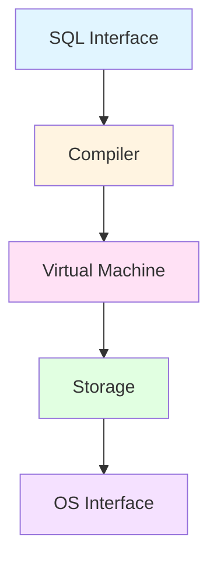

# 范畴论设计分析：SQLite架构的范畴论视角

> **创建日期**：2025-01-15
> **最后更新**：2025-01-16
> **版本**：SQLite 3.31+ 至 3.47.x
> **状态**：✅ 已完成

---

## 1. 📋 概述

本文档从范畴论视角分析SQLite的架构设计，提供统一的数学框架来理解SQLite的系统结构、设计模式和设计决策。

---

## 2. 📑 目录

- [范畴论设计分析：SQLite架构的范畴论视角](#范畴论设计分析sqlite架构的范畴论视角)
  - [1. 📋 概述](#1--概述)
  - [2. 📑 目录](#2--目录)
  - [3. SQLite架构作为范畴](#3-sqlite架构作为范畴)
    - [3.1. 五层架构作为范畴](#31-五层架构作为范畴)
    - [3.2. 层间交互作为态射](#32-层间交互作为态射)
  - [4. VFS接口的范畴论分析](#4-vfs接口的范畴论分析)
    - [4.1. VFS作为范畴](#41-vfs作为范畴)
    - [4.2. VFS适配器作为函子](#42-vfs适配器作为函子)
  - [5. 设计模式的范畴论视角](#5-设计模式的范畴论视角)
    - [5.1. 设计模式作为自然变换](#51-设计模式作为自然变换)
    - [5.2. 适配器模式](#52-适配器模式)
  - [6. 查询处理的范畴论模型](#6-查询处理的范畴论模型)
    - [6.1. 查询编译作为函子](#61-查询编译作为函子)
    - [6.2. 查询执行作为自然变换](#62-查询执行作为自然变换)
  - [7. 参考资料](#7-参考资料)

---

## 3. SQLite架构作为范畴

### 3.1. 五层架构作为范畴

**SQLite架构范畴**：

```haskell
-- SQLite架构范畴
data SQLiteArchitecture = SQLiteArch {
    layers :: [Layer],
    morphisms :: [LayerMorphism]
}

-- 层作为对象
data Layer =
    SQLInterface
  | Compiler
  | VirtualMachine
  | Storage
  | OSInterface

-- 层间调用作为态射
data LayerMorphism = LayerMorphism {
    from :: Layer,
    to :: Layer,
    operation :: Operation
}
```

**架构图**：



### 3.2. 层间交互作为态射

**态射定义**：

```haskell
-- SQL Interface → Compiler
sqlToCompiler :: SQLStatement -> ParseTree

-- Compiler → Virtual Machine
compilerToVM :: ParseTree -> Bytecode

-- Virtual Machine → Storage
vmToStorage :: Bytecode -> StorageOperation

-- Storage → OS Interface
storageToOS :: StorageOperation -> FileOperation
```

---

## 4. VFS接口的范畴论分析

### 4.1. VFS作为范畴

**VFS范畴**：

```haskell
-- VFS范畴
data VFSCategory = VFS {
    objects :: [FileSystem],
    morphisms :: [FileOperation]
}

-- 文件系统作为对象
data FileSystem =
    UnixFileSystem
  | WindowsFileSystem
  | InMemoryFileSystem
  | CustomFileSystem FileSystemImpl

-- 文件操作作为态射
data FileOperation = FileOperation {
    operation :: OperationType,
    source :: FileSystem,
    target :: FileSystem,
    result :: OperationResult
}
```

### 4.2. VFS适配器作为函子

**VFS适配器函子**：

```haskell
-- VFS适配器作为函子
vfsAdapter :: VFSCategory -> DatabaseCategory
vfsAdapter = Functor {
    fmap = \fs -> DatabaseFileSystem fs,
    preserve = \op -> True
}

-- 函子性质
vfsAdapter (op1 ∘ op2) = vfsAdapter op1 ∘ vfsAdapter op2
vfsAdapter id = id
```

---

## 5. 设计模式的范畴论视角

### 5.1. 设计模式作为自然变换

**设计模式作为自然变换**：

```haskell
-- 设计模式作为自然变换
data DesignPattern = Pattern {
    source :: Design,
    target :: Design,
    transformation :: NaturalTransformation
}

-- 工厂模式
factoryPattern :: DesignPattern
factoryPattern = Pattern {
    source = DirectCreation,
    target = FactoryCreation,
    transformation = factoryTransformation
}

-- 策略模式
strategyPattern :: DesignPattern
strategyPattern = Pattern {
    source = HardcodedStrategy,
    target = ConfigurableStrategy,
    transformation = strategyTransformation
}
```

### 5.2. 适配器模式

**适配器模式**：

```haskell
-- 适配器模式作为自然变换
adapterPattern :: NaturalTransformation
adapterPattern = NaturalTransformation {
    source = OldInterface,
    target = NewInterface,
    components = \obj -> adapt obj
}

-- 自然性条件
adapterPattern ∘ oldOperation = newOperation ∘ adapterPattern
```

---

## 6. 查询处理的范畴论模型

### 6.1. 查询编译作为函子

**查询编译函子**：

```haskell
-- 查询编译作为函子
queryCompiler :: QueryCategory -> BytecodeCategory
queryCompiler = Functor {
    fmap = \query -> compile query,
    preserve = \op -> True
}

-- SQL查询 → 字节码
compile :: SQLQuery -> Bytecode
compile (SELECT ...) = SELECT_BYTECODE ...
compile (INSERT ...) = INSERT_BYTECODE ...
compile (UPDATE ...) = UPDATE_BYTECODE ...
```

### 6.2. 查询执行作为自然变换

**查询执行自然变换**：

```haskell
-- 查询执行作为自然变换
queryExecution :: NaturalTransformation
queryExecution = NaturalTransformation {
    source = BytecodeCategory,
    target = ResultCategory,
    components = \bytecode -> execute bytecode
}

-- 自然性条件
queryExecution ∘ compile = execute ∘ queryExecution
```

---

## 7. 参考资料

- [数据库设计理论扩展计划](../../Design/00-数据库设计理论扩展计划.md)
- [范畴论基础](../../Design/01-理论模型/01.01-范畴论基础.md)
- [SQLite架构设计模型](./12.01-架构设计模型.md)
- [SQLite设计原则](./12.02-设计原则.md)
- [SQLite设计模式](./12.03-设计模式.md)

---

**最后更新**：2025-01-16
**维护者**：Data-Science Team
**状态**：✅ 已完成
